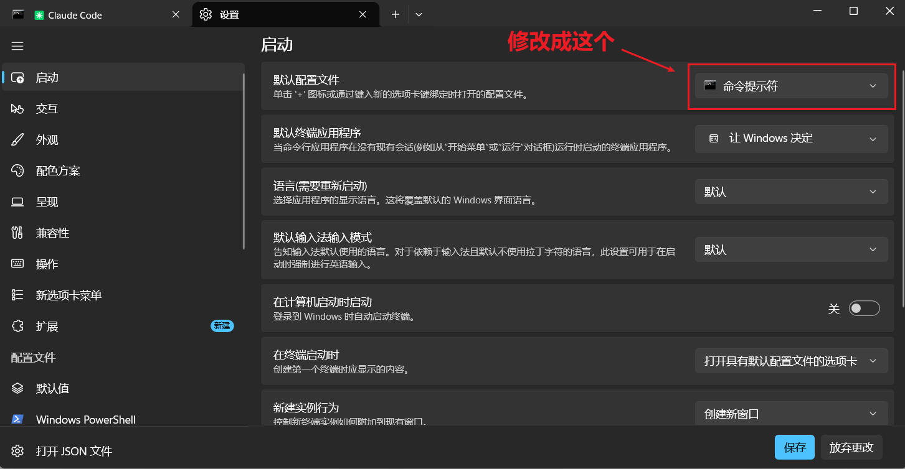
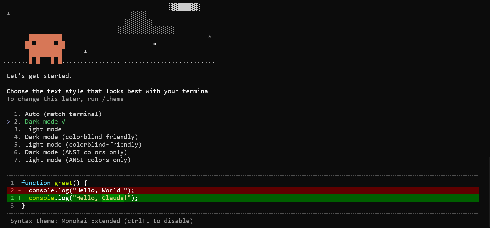
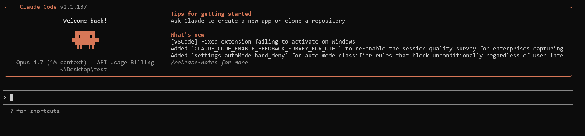
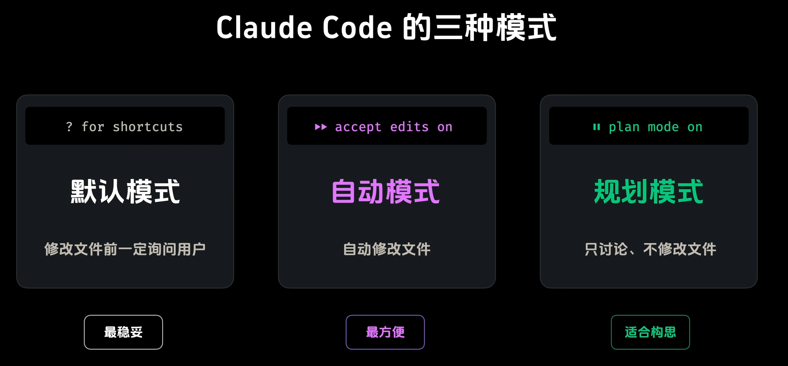
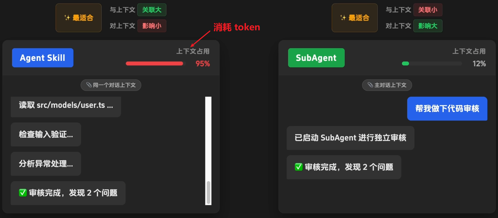

<h1 style="text-align: center;">Claude Code 介绍与使用</h1>
 
- - -

## 视频教程

> #### https://www.bilibili.com/video/BV14rzQB9EJj/

## 安装配置

#### 教程资料

> #### https://blog.csdn.net/weixin_41793160/article/details/149313024

#### （1）环境检查

> #### 电脑中需要安装 node 环境，安装前检查 npm 全局安装包的路径，采用 npm 全局安装 Claude Code

```bash
node -v
npm -v
```

#### （2）运行如下命令进行安装（cmd）

```bash
npm uninstall -g @anthropic-ai/claude-code # 卸载已安装的 Claude Code（未安装请跳过）

npm install -g @anthropic-ai/claude-code # 安装官方原版包
```

#### （3）安装验证

```bash
claude -v
```

#### （4）配置环境变量

> #### 变量名：ANTHROPIC_BASE_URL，变量值：https://api.aicodemirror.com/api/claudecode
>
> #### 变量名：ANTHROPIC_AUTH_TOKEN，变量值：你的密钥

```bash
# 设置环境变量
setx ANTHROPIC_BASE_URL "url" # 如果采用中转站，请使用其提供的 url
setx ANTHROPIC_AUTH_TOKEN "你的token"

# 验证是否成功
echo %ANTHROPIC_BASE_URL%
echo %ANTHROPIC_AUTH_TOKEN%
```

#### （5）启动使用

> #### 启动时是否需要科学上网取决于环境变量中配置的 url

```bash
cd /somepath # 进入项目目录

claude # 启动 claude code
```

#### （6）修改 cmd 设置中的默认配置文件

<br/>


## 首次使用

#### （1）选择一个颜色主题后，回车

<br/>


#### （2）进入对话框

> #### 配置好环境变量后即可直接进入对话界面，同时可以使用 /login 命令手动触发登录（账号 / 密钥）



#### （3）退出 claude code

> #### 执行两次 ctrl + c 退出

## CC-Switch

> #### Github 官网：https://github.com/farion1231/cc-switch
>
> #### 一个用于统一管理 Claude Code、Codex、Gemini CLI、OpenCode、OpenClaw 等 AI 编程 CLI 的跨平台桌面工具

## 常用命令

#### （1）切换模式：shift + tab

<br/>


#### （2）多行输入（打开记事本 / vscode 编辑）：ctrl + g

```bash
# 查看 vscode 的路径（前提是配置了环境变量）
where code

# 配置打开的编辑器（vscode）
setx EDITOR "code --wait"
setx VISUAL "code --wait"

# 自定义
setx EDITOR "\"文件路径\" --wait"
setx VISUAL "\"文件路径\" --wait"

# 验证配置
echo %EDITOR%
echo %VISUAL%
```

#### （3）任务管理

```bash
ctrl + b # 将任务置于后台

/tasks # 查看所有任务
```

#### （4）回滚：双击 esc

#### （5）执行 bash 命令：输入 ！，后续输入命令

#### （6）查看历史会话：/resume

> #### 启动 claudecode 并恢复上一次对话：claude -c

#### （7）压缩上下文，减少 token 消耗：/compact

#### （8）清空上下文：/clear

#### （9）创建 claude.md 文件：/init

> #### 可以通过 /menmory 命令编辑项目和用户的 claude.md（类似 rules 文件）

#### （10）钩子操作：/hooks

> #### 代码格式化：jq -r '.tool_input.file_path' | xargs prettier --write

#### （11）skill 相关操作：/skills

#### （12）agent 相关操作：/agents

<br/>


#### （13）安装插件：/plungin

> #### plungin 更像是一个工具集合：skill + subagent + mcp 等

#### （14）查看 mcp 工具：/mcp

> #### 首先需要执行相关的命令安装 mcp 工具

#### （15）当前会话采用全自动模式，有一定风险，不询问是否执行指令

```bash
claude --dangerously-skip-permissions
```

## 使用千问模型

> #### 在环境变量中配置以下三个内容

```bash
ANTHROPIC_BASE_URL=https://dashscope.aliyuncs.com/apps/anthropic
ANTHROPIC_AUTH_TOKEN=YOUR_DASHSCOPE_API_KEY  # 用百炼 API KEY 替换 YOUR_DASHSCOPE_API_KEY
ANTHROPIC_MODEL=qwen3-coder-plus # 可按需替换为其他支持的模型
```

## skill 整理

> #### agent-brower：模拟浏览器行为进行网页自动化操作，适用于爬虫、表单提交或前端交互测试。
>
> #### superpowers：提供通用 AI 能力增强，如任务规划、工具调用，适用于复杂多步骤任务的智能代理。
>
> #### pdf processing：提取、解析或生成 PDF 文件内容，适用于文档审核、数据抽取或报告生成。
>
> #### tavily：集成实时网络搜索 API，获取最新信息或验证事实，适用于需外部知识支持的问答系统。
>
> #### fronted design：生成或优化前端界面代码（HTML/CSS/JS），适用于快速原型设计或 UI 组件开发。
>
> #### context7：管理和注入长对话或文档的上下文片段，适用于大模型记忆增强或复杂知识库检索。
>
> #### systematic debugging：按步骤分析错误日志并定位代码问题，适用于软件调试、故障排查。
>
> #### marketing skills：策划内容、优化 SEO 或生成营销文案，适用于广告投放、社交媒体运营。
>
> #### tmux：管理终端会话和窗口，适用于远程开发、多任务并行操作或保持长期运行的服务。
>
> #### skill creator：定义并生成新 skill 的元数据与逻辑，适用于扩展 AI Agent 的能力库。
>
> #### webapp testing：执行 Web 应用功能、性能或兼容性测试，适用于自动化测试流程或回归测试。
>
> #### DOCX：读取、编辑或生成 Microsoft Word 文档，适用于报告撰写、合同处理或格式转换。
>
> #### changelog maintenance：自动生成或更新版本变更日志，适用于软件项目发布管理或协作记录。
>
> #### gpt researcher：搜索并整合网络信息形成研究报告，适用于竞品分析、学术综述或市场调研。
>
> #### code refactoring：优化代码结构而不改变外部行为，适用于提升可读性、降低复杂度或技术债务清理。
