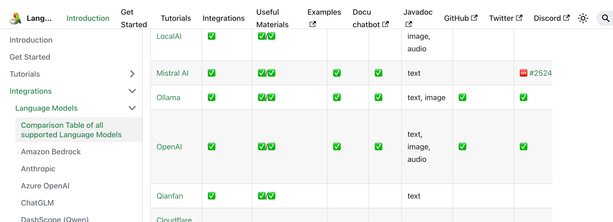
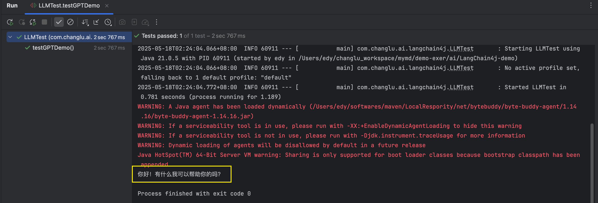
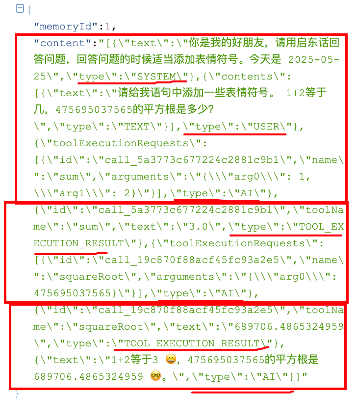
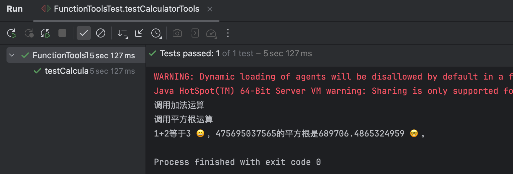
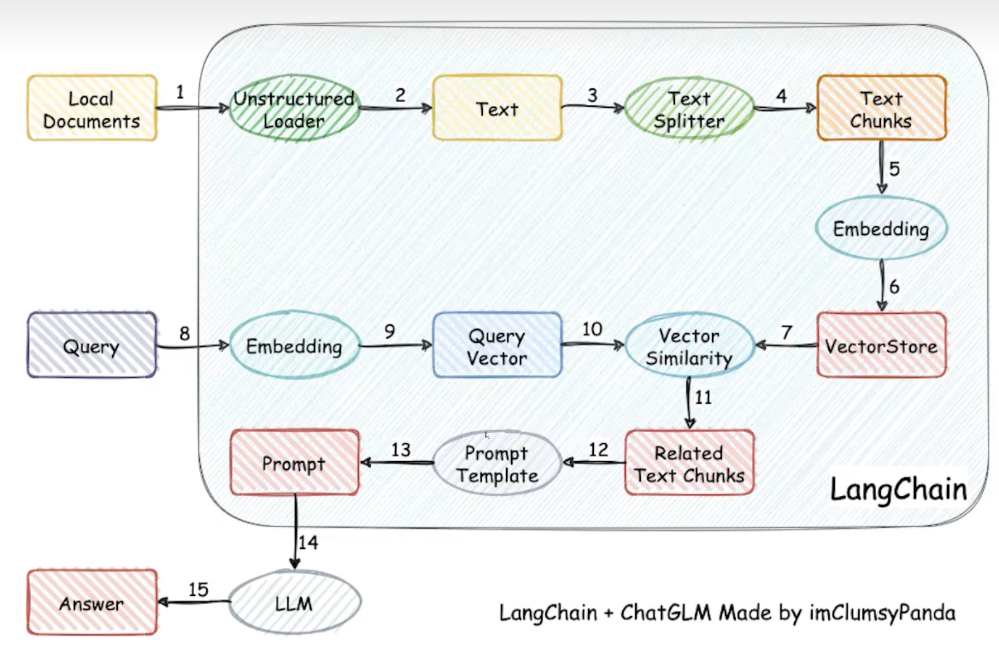
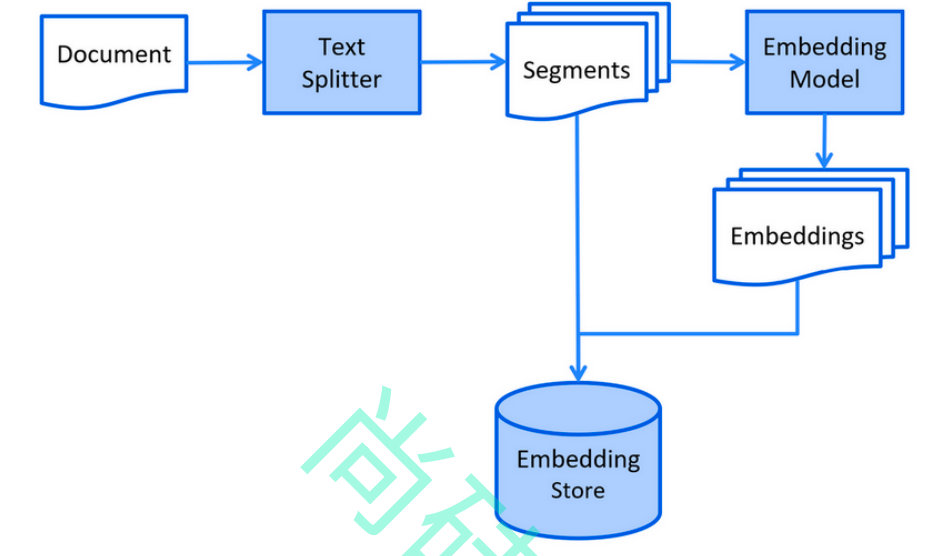
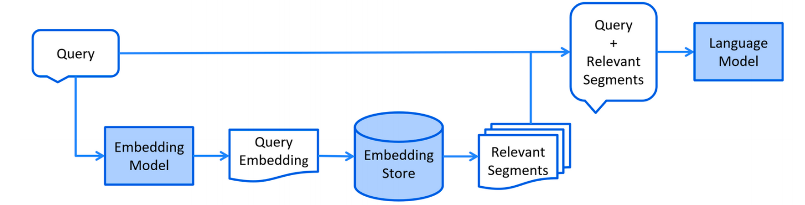
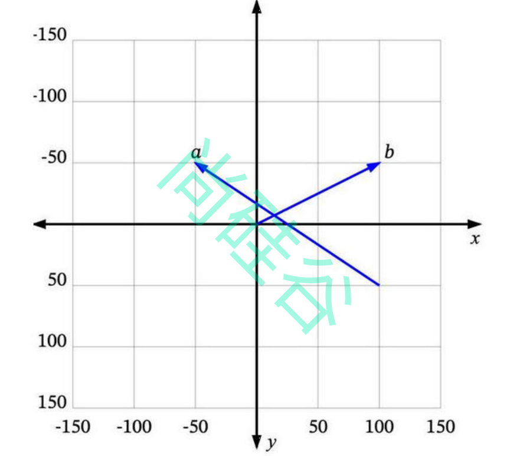

# LangChain4j 快速入门

---

## 概述

LangChain4j 是一个**简化大语言模型（LLM）集成到 Java 应用**的开源框架。通过统一的 API 屏蔽不同 LLM 提供商的差异，同时提供 AiService、ChatMemory、RAG 等高层抽象。

### 版本说明

| 版本 | 说明 |
|------|------|
| 0.35.0 | 最后一个兼容 JDK 8 的版本 |
| 1.0-Beta3 | 当前最新版，要求 JDK 17+ |

### 模块架构

```
langchain4j-core       → 核心抽象（ChatModel、EmbeddingStore 等）
langchain4j             → 高层功能（AiService、ChatMemory、RAG）
langchain4j-{integration} → 各 LLM 提供商集成（OpenAI、Ollama、DashScope 等）
```

### 支持的模型



---

## 环境搭建

### 版本选型

| 组件 | 版本 |
|------|------|
| SpringBoot | 3.2.x |
| LangChain4j | 1.0.0-beta3 |
| JDK | 17+ |

### 依赖

```xml
<properties>
    <spring-boot.version>3.2.6</spring-boot.version>
    <langchain4j.version>1.0.0-beta3</langchain4j.version>
</properties>

<dependencyManagement>
    <dependencies>
        <!-- SpringBoot BOM -->
        <dependency>
            <groupId>org.springframework.boot</groupId>
            <artifactId>spring-boot-dependencies</artifactId>
            <version>${spring-boot.version}</version>
            <type>pom</type>
            <scope>import</scope>
        </dependency>
        <!-- LangChain4j BOM -->
        <dependency>
            <groupId>dev.langchain4j</groupId>
            <artifactId>langchain4j-bom</artifactId>
            <version>${langchain4j.version}</version>
            <type>pom</type>
            <scope>import</scope>
        </dependency>
    </dependencies>
</dependencyManagement>
```

---

## 接入大模型

LangChain4j 通过统一 API 屏蔽不同提供商的差异，切换模型只需更换依赖和配置。

### 方式一：手动构建（适合单测）

```java
@Test
public void testGPTDemo() {
    OpenAiChatModel model = OpenAiChatModel.builder()
            .baseUrl("http://langchain4j.dev/demo/openai/v1")
            .apiKey("demo")
            .modelName("gpt-4o-mini")
            .build();
    String answer = model.chat("你好");
    System.out.println(answer);
}
```



### 方式二：SpringBoot Starter（推荐）

**依赖**：

```xml
<dependency>
    <groupId>dev.langchain4j</groupId>
    <artifactId>langchain4j-open-ai-spring-boot-starter</artifactId>
</dependency>
```

**配置**：

```properties
langchain4j.open-ai.chat-model.base-url=http://langchain4j.dev/demo/openai/v1
langchain4j.open-ai.chat-model.api-key=demo
langchain4j.open-ai.chat-model.model-name=gpt-4o-mini
```

**注入使用**：

```java
@SpringBootTest
public class LLMSpringBootTest {
    @Autowired
    private OpenAiChatModel openAiChatModel;

    @Test
    public void testSpringBoot() {
        String answer = openAiChatModel.chat("你好，请问你是什么大模型");
        System.out.println(answer);
    }
}
```

### 接入其他模型

LangChain4j 支持所有**兼容 OpenAI 协议**的模型（如 DeepSeek），以及通过专用 Starter 接入 Ollama、阿里百炼等。

| 模型 | 依赖 | 配置示例 |
|------|------|----------|
| DeepSeek | `langchain4j-open-ai-spring-boot-starter` | `base-url=https://api.deepseek.com` |
| Ollama | `langchain4j-ollama-spring-boot-starter` | `base-url=http://localhost:11434` |
| 阿里百炼 | `langchain4j-community-dashscope-spring-boot-starter` | `model-name=qwen-plus-latest` |

```properties
# DeepSeek 示例
langchain4j.open-ai.chat-model.base-url=https://api.deepseek.com
langchain4j.open-ai.chat-model.api-key=${DEEP_SEEK_API_KEY}
langchain4j.open-ai.chat-model.model-name=deepseek-chat

# Ollama 示例
langchain4j.ollama.chat-model.base-url=http://localhost:11434
langchain4j.ollama.chat-model.model-name=deepseek-r1:1.5b

# 阿里百炼 示例
langchain4j.community.dashscope.chat-model.api-key=${DASH_SCOPE_API_KEY}
langchain4j.community.dashscope.chat-model.model-name=qwen-plus-latest
```

---

## AiService

AiService 是 LangChain4j 的核心特性，基于**接口 + 动态代理**，自动处理输入输出转换，像调用本地方法一样调用 LLM。

### 两种创建方式

**方式一：代码构建**

```java
Assistant assistant = AiServices.create(Assistant.class, qwenChatModel);
String answer = assistant.chat("你好呀，你是谁？");
```

**方式二：注解声明（推荐）**

```java
@AiService(wiringMode = AiServiceWiringMode.EXPLICIT, chatModel = "qwenChatModel")
public interface Assistant {
    String chat(String userMessage);
}
```

```java
@Autowired
private Assistant assistant;

@Test
public void testChatByAssistant() {
    String answer = assistant.chat("你好呀，请介绍下自己？");
    System.out.println(answer);
}
```

### 内部机制



代理对象将 String 转为 UserMessage → 发给 LLM → 将 AiMessage 转回 String 返回。

---

## 聊天记忆

### 默认无记忆

LLM 是无状态的，每次请求不会记住之前对话。需要手动将历史消息一起发送。

### MessageWindowChatMemory

LangChain4j 内置基于内存的聊天记忆，可限制最大消息数：

```java
// 方式一：代码创建
MessageWindowChatMemory chatMemory = MessageWindowChatMemory.withMaxMessages(10);
Assistant assistant = AiServices.builder(Assistant.class)
        .chatLanguageModel(qwenChatModel)
        .chatMemory(chatMemory)
        .build();

// 方式二：注解声明
@AiService(
    wiringMode = AiServiceWiringMode.EXPLICIT,
    chatModel = "qwenChatModel",
    chatMemory = "chatMemory"
)
public interface MemoryChatAssistant {
    String chat(String message);
}
```

```java
@Configuration
public class MemoryChatAssistantConfig {
    @Bean
    public ChatMemory chatMemory() {
        return MessageWindowChatMemory.withMaxMessages(10);
    }
}
```

### 用户隔离（@MemoryId）

不同用户/会话维护独立的记忆：

```java
@AiService(
    chatModel = "qwenChatModel",
    chatMemory = "chatMemory",
    chatMemoryProvider = "chatMemoryProvider"
)
public interface SeparateChatAssistant {
    String chat(@MemoryId int memoryId, @UserMessage String userMessage);
}
```

```java
@Bean
public ChatMemoryProvider chatMemoryProvider() {
    return memoryId -> MessageWindowChatMemory.builder()
            .id(memoryId)
            .maxMessages(10)
            .build();
}
```

```java
// memoryId=1 和 memoryId=2 互不影响
separateChatAssistant.chat(1, "我是小明");
separateChatAssistant.chat(2, "我想知道你是谁？");
separateChatAssistant.chat(1, "我是谁？");  // 能回答"小明"
```

### 持久化聊天记忆（MongoDB）

实现 `ChatMemoryStore` 接口，将聊天记录存入 MongoDB：

```java
@Component
public class MongoChatMemoryStore implements ChatMemoryStore {
    @Autowired
    private MongoTemplate mongoTemplate;

    @Override
    public List<ChatMessage> getMessages(Object memoryId) {
        Criteria criteria = Criteria.where("memoryId").is(memoryId);
        ChatMessages chatMessages = mongoTemplate.findOne(
            new Query(criteria), ChatMessages.class);
        if (chatMessages == null) return new LinkedList<>();
        return ChatMessageDeserializer.messagesFromJson(chatMessages.getContent());
    }

    @Override
    public void updateMessages(Object memoryId, List<ChatMessage> messages) {
        Criteria criteria = Criteria.where("memoryId").is(memoryId);
        Update update = new Update();
        update.set("content", ChatMessageSerializer.messagesToJson(messages));
        mongoTemplate.upsert(new Query(criteria), update, ChatMessages.class);
    }

    @Override
    public void deleteMessages(Object memoryId) {
        mongoTemplate.remove(new Query(Criteria.where("memoryId").is(memoryId)),
            ChatMessages.class);
    }
}
```

注入到 ChatMemoryProvider：

```java
@Bean
public ChatMemoryProvider chatMemoryProvider() {
    return memoryId -> MessageWindowChatMemory.builder()
            .chatMemoryStore(mongoChatMemoryStore)
            .id(memoryId)
            .maxMessages(10)
            .build();
}
```

---

## 提示词

### @SystemMessage

设定 AI 角色，只发送一次：

```java
// 直接写死
@SystemMessage("你是我的好朋友，请用东北话回答问题。")
String chat(@MemoryId int memoryId, @UserMessage String userMessage);

// 从文件加载模板
@SystemMessage(fromResource = "my-prompt-template.txt")
String chat(@MemoryId int memoryId, @UserMessage String userMessage);
```

模板文件 `my-prompt-template.txt`：

```
你是我的好朋友，请用启东话回答问题，适当添加表情符号。
今天是 {{current_date}}
```

### @UserMessage

定义用户消息模板，每次对话都携带：

```java
// {{it}} 代表方法参数
@UserMessage("请用上海话回答，并添加表情符号。{{it}}")
String chat(String message);

// @V 命名多个参数
@UserMessage("请以{{role}}身份回答：{{userMessage}}")
String chat(@V("role") String role, @V("userMessage") String message);
```

---

## Function Calling（工具调用）

让 LLM 能够调用 Java 方法获取实时数据或执行计算。

### 定义工具

```java
@Component
public class CalculatorTools {
    @Tool(name = "加法", value = "返回两个参数相加之和")
    double sum(@ToolMemoryId int memoryId,
               @P(value = "加数1", required = true) double a,
               @P(value = "加数2", required = true) double b) {
        System.out.println("调用加法运算 " + memoryId);
        return a + b;
    }

    @Tool(name = "平方根", value = "返回给定参数的平方根")
    double squareRoot(@ToolMemoryId int memoryId, double x) {
        System.out.println("调用平方根运算 " + memoryId);
        return Math.sqrt(x);
    }
}
```

### 配置到 AiService

```java
@AiService(
    chatModel = "qwenChatModel",
    chatMemory = "chatMemory",
    chatMemoryProvider = "chatMemoryProvider",
    tools = "calculatorTools"        // 注入工具
)
public interface SeparateChatAssistant {
    String chat(@MemoryId int memoryId, @UserMessage String userMessage);
}
```

### 执行流程



```
用户提问 → LLM 判断需要工具 → 返回工具调用指令
    → 本地执行 → 结果回传 LLM → 生成最终回答
```

| 注解 | 作用 |
|------|------|
| `@Tool` | 声明可被 LLM 调用的方法 |
| `@P` | 描述参数含义 |
| `@ToolMemoryId` | 在工具方法中获取 memoryId |

---

## RAG（检索增强生成）

让 LLM 回答**专业领域知识**的核心方案。先检索相关文档，再喂给 LLM 生成回答。



### 索引阶段



```
加载文档 → 分割文本 → 向量化 → 存入向量数据库
```

### 检索阶段



```
用户提问 → 向量化查询 → 相似度匹配 → 检索结果 + 问题 → LLM 生成回答
```

### 向量搜索概念



| 概念 | 说明 |
|------|------|
| 向量 | 文本通过嵌入模型转换为数字数组 |
| 维度 | 描述精度，text-embedding-v3 为 1024 维 |
| 相似度 | 余弦相似度、欧几里得距离等 |
| minScore | 最低匹配分数阈值，控制召回率和准确率 |

### 文档加载器

LangChain4j 内置多种加载器：

| 加载器 | 说明 |
|--------|------|
| FileSystemDocumentLoader | 加载本地文件（txt、md、pdf） |
| UrlDocumentLoader | 加载网络 URL 内容 |
| AmazonS3 | 加载 S3 存储桶文件 |
| GitHub | 加载 GitHub 仓库文件 |

```java
Document document = FileSystemDocumentLoader.loadDocument(
    "/path/to/人工智能.md");
```

### 文档解析器

| 解析器 | 支持格式 |
|--------|----------|
| TextDocumentParser | .txt |
| ApachePdfBoxDocumentParser | .pdf |
| ApachePoiDocumentParser | .docx, .xlsx |
| ApacheTikaDocumentParser | 通用（PDF、Office、HTML 等） |

```java
Document document = FileSystemDocumentLoader.loadDocument(
    "/path/to/文档.pdf",
    new ApachePdfBoxDocumentParser()
);
```

### 文档分割器

| 分割器 | 说明 |
|--------|------|
| DocumentByParagraphSplitter | 按段落分割 |
| DocumentBySentenceSplitter | 按句子分割 |
| DocumentByWordSplitter | 按词分割 |
| 递归分割 | 层级递归分割 |

关键参数：**最大 token 数**（适配模型上下文窗口）和**重叠 token 数**（保证上下文连贯）。

### 文档入库

```java
Document document = FileSystemDocumentLoader.loadDocument("/path/人工智能.md");

InMemoryEmbeddingStore<TextSegment> embeddingStore =
    new InMemoryEmbeddingStore<>();

// 一键完成：分割 → 向量化 → 存入
EmbeddingStoreIngestor.ingest(document, embeddingStore);
```

### 自定义分割器

```java
DocumentByParagraphSplitter splitter = new DocumentByParagraphSplitter(
    300,   // 最大 token 数
    30,    // 重叠 token 数
    new HuggingFaceTokenizer()
);

EmbeddingStoreIngestor.ingestor()
    .documentSplitter(splitter)
    .embeddingStore(embeddingStore)
    .embeddingModel(embeddingModel)
    .build()
    .ingest(document);
```

---

## 向量模型与向量存储

### EmbeddingModel

```java
@Autowired
private EmbeddingModel embeddingModel;

@Test
public void testEmbeddingModel() {
    Response<Embedding> embed = embeddingModel.embed("你好");
    System.out.println("向量维度：" + embed.content().vector().length);  // 1024
}
```

### 向量存储对比

| 存储方案 | 适用场景 |
|----------|----------|
| InMemoryEmbeddingStore | 测试、开发环境 |
| Pinecone | 生产级，2GB 免费额度 |
| Chroma | 开源，本地部署 |
| Milvus | 高性能，分布式 |
| Weaviate | 开源，功能丰富 |

---

## 面试要点

**Q: LangChain4j 是什么？**

一个用于 Java 应用的 LLM 集成框架，提供统一 API 接入不同大模型，整合了 AiService（动态代理）、ChatMemory（记忆管理）、Tools（函数调用）、RAG（检索增强生成）等能力。

**Q: AiService 的原理？**

基于 JDK 动态代理，运行时为接口生成代理对象。代理对象负责：将方法参数转为 UserMessage → 拼接 SystemMessage + ChatMemory → 发送 LLM → 将 AiMessage 转为返回值。

**Q: ChatMemory 怎么实现用户隔离？**

使用 `@MemoryId` 注解标注用户/会话 ID 参数，配合 `ChatMemoryProvider` 为不同 ID 创建独立的 `MessageWindowChatMemory` 实例。

**Q: Function Calling 的执行流程？**

LLM 判断用户问题需要调用工具 → 返回工具名和参数 → 本地执行 @Tool 方法 → 结果传回 LLM → LLM 结合结果生成最终回答。

**Q: RAG 的两个阶段？**

- **索引阶段**：加载文档 → 分割 → 向量化 → 存入向量数据库
- **检索阶段**：查询向量化 → 相似度匹配 → 检索结果 + 问题 → LLM 生成

**Q: AI 编程中 Token 是什么？为什么重要？**

Token 是 LLM 处理文本的最小单位。LangChain4j 中文档分割器通过限制 token 数确保片段不超过模型上下文窗口，同时通过重叠 token 保证语义连贯。
