<h1 style="text-align: center;">ROS（AIC算法应用赛备赛笔记）</h1>

---

## 相关资料

> #### 官方 ROS 培训课程（莫问大讲堂）：https://space.bilibili.com/3493143676717925?spm_id_from=333.788.upinfo.head.click
>
> #### ROS 资料文档：http://www.autolabor.com.cn/book/ROSTutorials

## Ubuntu 安装及配置

> #### 安装文档：https://blog.csdn.net/LYLv_/article/details/143107112?spm=1001.2014.3001.5506
>
> #### 环境配置：https://www.bilibili.com/video/BV1yCWTzzEhd?spm_id_from=333.788.videopod.sections&vd_source=822e86b53dab98632ef279a46d2536db

## ⚠️ 无法复制粘贴问题

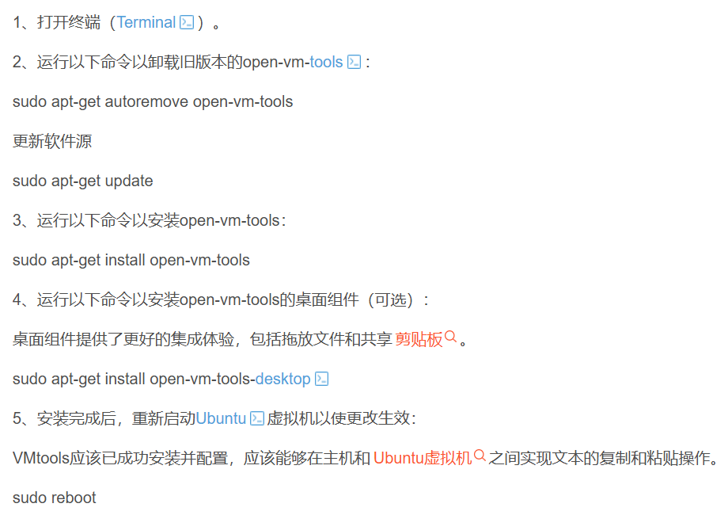

## Ubuntu 常用命令

#### （1）ls ：列出当前目录下的所有文件和目录（<span style="color:red">默认在主目录的路径下</span>）

#### （2）pwd ：查看当前目录的绝对路径

#### （3）cd ：进入指定目录

#### （4）cd .. ：返回上一级目录

#### （5）mkdir ：创建目录

> #### 可以使用 mkdir 1 / 2 创建多级目录，<span style="color:red">前提是 1 目录已存在</span>

#### （6）touch ：创建文件，需要指定文件后缀名（可以在指定目录创建文件）

#### （7）gedit ：创建文件的同时打开文件

#### （8）rm ：删除文件

#### （8）rm -rf ：删除目录

#### （9）rm -r ：删除目录及目录下的所有文件

#### （10）sudo chmod 777 文件名：赋予文件可执行权限

> #### 检验是否修改成功：执行命令后，使用 ls 命令查看文件，看赋予权限后的文件名是否是绿色的

#### （11）./ 文件名：执行文件

<br/>
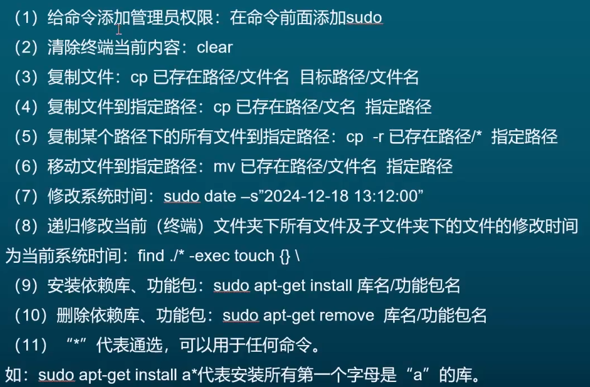

## python 案例

#### （1）准备工作

> #### 默认处于主目录下

```bash
mkdir code  # 创建目录

cd code  # 进入目录

gedit hello.py  # 创建文件并打开文件

chmod 777 hello.py  # 赋予文件可执行权限
```

#### （2）编写代码

> #### 首先需要在文件头添加 python 解释器，之后再编写命令

```python
#！/usr/bin/python3
print("hello world")
```

#### （3）运行代码

```bash
./hello.py # 方式一

python3 hello.py # 方式二
```

## ROS 文件系统架构

### 基本介绍

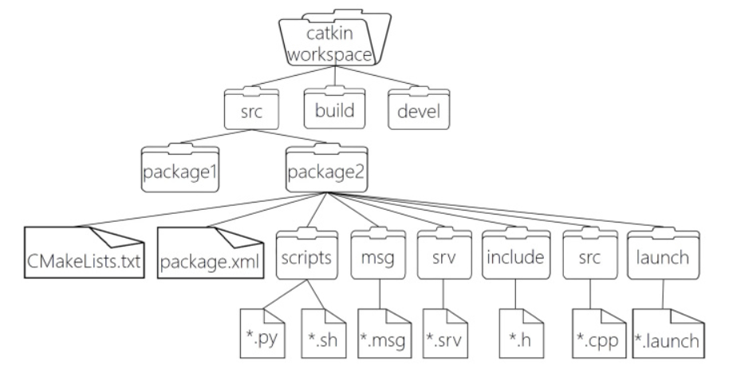

```
WorkSpace --- 自定义的工作空间

    |--- build:编译空间，用于存放CMake和catkin的缓存信息、配置信息和其他中间文件。

    |--- devel:开发空间，用于存放编译后生成的目标文件，包括头文件、动态&静态链接库、可执行文件等。

    |--- src: 源码

        |-- package：功能包(ROS基本单元)包含多个节点、库与配置文件，包名所有字母小写，只能由字母、数字与下划线组成

            |-- CMakeLists.txt 配置编译规则，比如源文件、依赖项、目标文件

            |-- package.xml 包信息，比如:包名、版本、作者、依赖项...(以前版本是 manifest.xml)

            |-- scripts 存储python文件

            |-- src 存储C++源文件

            |-- include 头文件

            |-- msg 消息通信格式文件

            |-- srv 服务通信格式文件

            |-- action 动作格式文件

            |-- launch 可一次性运行多个节点

            |-- config 配置信息

        |-- CMakeLists.txt: 编译的基本配置
```

### 构建文件架构

```bash
# 默认再主目录下

mkdir catkin_ws # 创建工作空间

cd catkin_ws # 进入工作空间

mkdir src # 创建源码目录

cd src # 进入源码目录

catkin_create_pkg package rospy roscpp std_msgs # 创建功能包，package为包名，可以替换成其他的

mkdir scripts # 创建scripts目录，用于存放 python 文件

```

### python 案例

```bash
cd scripts # 进入 scripts 目录

gedit hello.py # 创建并打开 hello.py 文件
```

#### 编写如下代码并保存

```python
#! /usr/bin/env python3
import rospy

if __name__ == "__main__":
    rospy.init_node("Hello") # 初始化节点
    rospy.loginfo("Hello World!!!!") # 输出信息
```

#### 赋予文件权限

```bash
chmod 777 hello.py # 赋予文件可执行权限
```

#### 运行文件

#### （1）编译文件，打开 CMakeLists.txt 文件，找到 162 - 165 行，打开注释，添加需要编译的文件

<br/>


#### 进入第二层（src）进行编译，执行如下命令

```bash
cd ~ # 返回主目录

cd catkin_ws # 进入第二层

catkin_make # 编译
```

#### （2）运行文件

#### 修改终端配置文件，回到主目录，点击 ctrl + h 打开隐藏文件，打开 <span style="color:red">.bashrc</span> 文件

<br/>
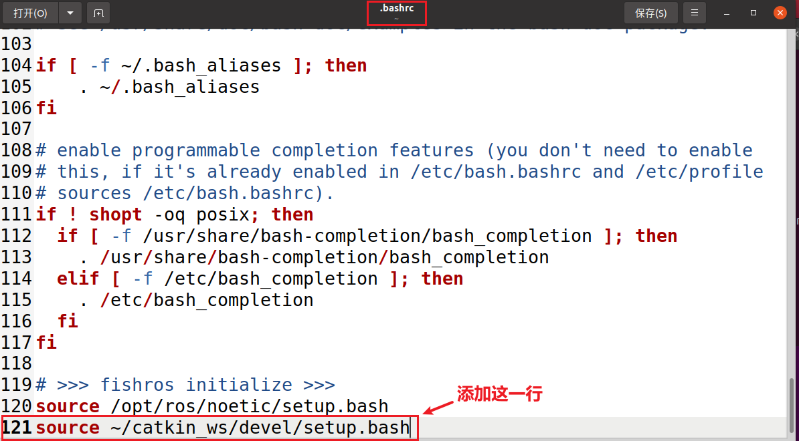

#### 配置完成后关闭所有终端，新开启终端才会是配置生效，执行如下命令运行 python 文件

```bash
roscore # 单开一个终端运行，表示开启主节点

rosrun package hello.py # 新开一个终端，package 为功能包名，hello.py 为文件名，二者均可替换成其他
```

<br/>
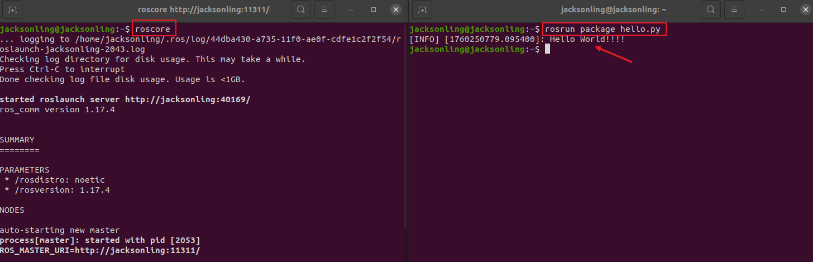

## roscore 与节点


## 小乌龟移动案例

```bash
roscore # 开启主节点

rosrun turtlesim turtlesim_node # 开启小乌龟节点

rosrun turtlesim turtle_teleop_key # 键盘控制小乌龟移动
```

## 节点常用命令

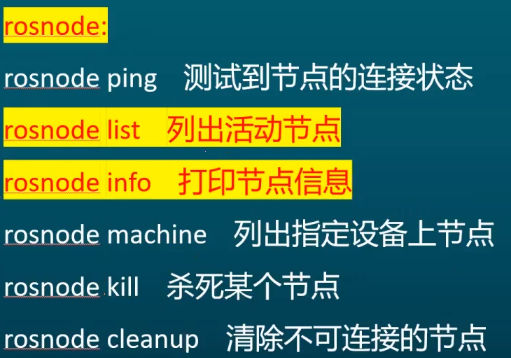

## 可视化节点关系图

```bash
rqt_graph
```

<br/>
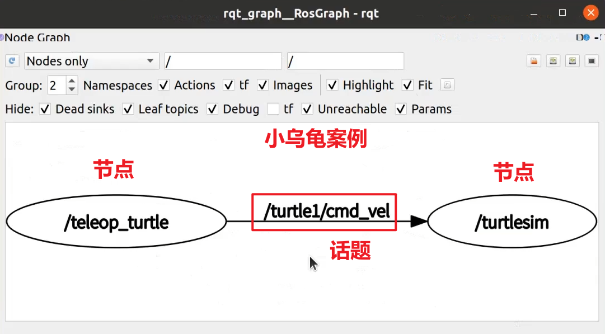

## 区别两个执行命令

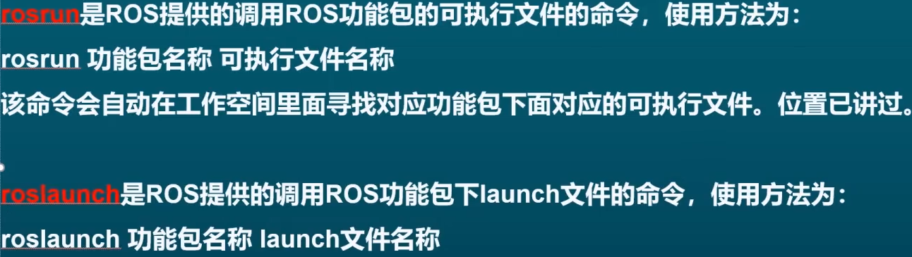

## 话题通信

### 基本介绍

<br/>
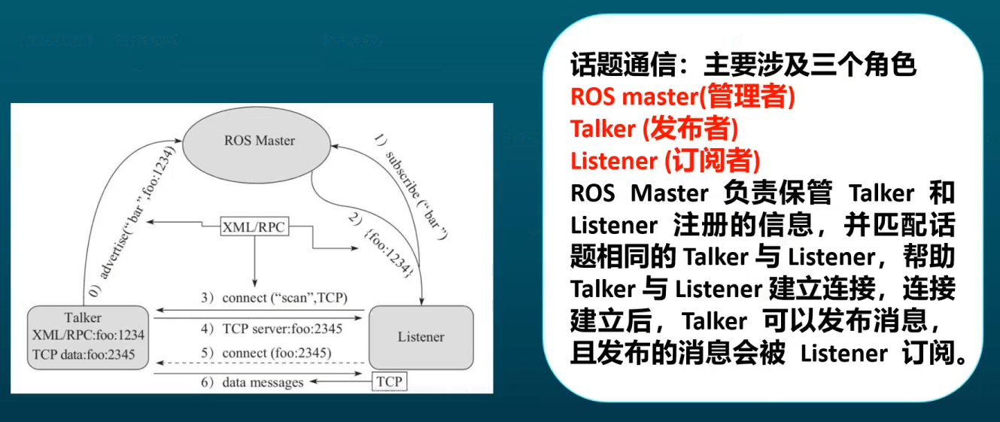
<br/>
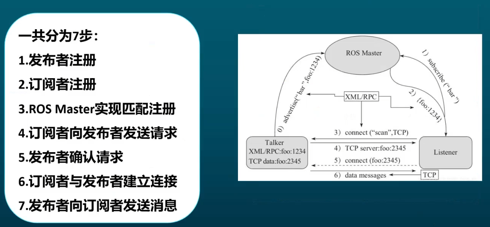
<br/>
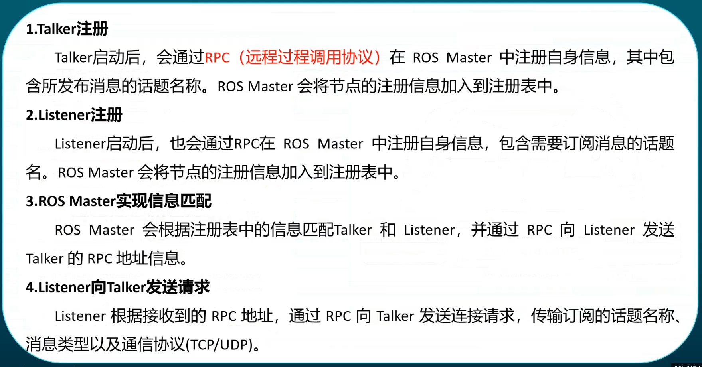
<br/>
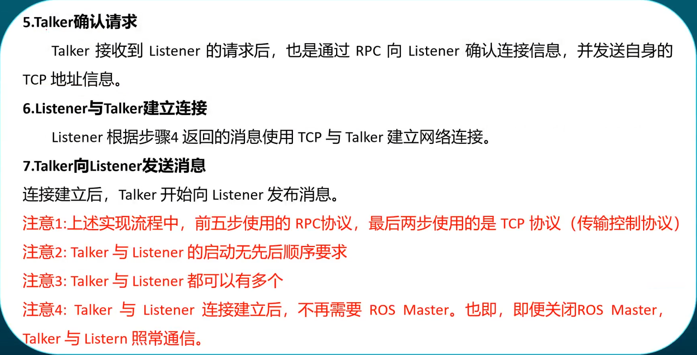

### 常用命令

<br/>
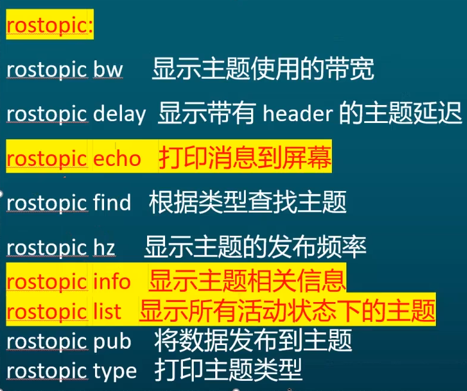

### 应用案例

> #### 参考文档：http://www.autolabor.com.cn/book/ROSTutorials/di-2-zhang-ros-jia-gou-she-ji/22hua-ti-tong-xin/213-hua-ti-tong-xin-zhi-python-shi-xian.html

#### （1）进入 scripts 目录，创建两个文件

```bash
touch pub.py # 发布者

touch sub.py # 订阅者
```

#### （2）pub.py

```py
#! /usr/bin/env python3

#1.导包
import rospy
from std_msgs.msg import String

if __name__ == "__main__":
    #2.初始化 ROS 节点:命名(唯一)
    rospy.init_node("talker_p")
    #3.实例化 发布者 对象
    pub = rospy.Publisher("chatter",String,queue_size=10)
    #4.组织被发布的数据，并编写逻辑发布数据
    msg = String()  #创建 msg 对象
    msg_front = "hello 你好"
    count = 0  #计数器
    # 设置循环频率
    rate = rospy.Rate(1)
    while not rospy.is_shutdown():

        #拼接字符串
        msg.data = msg_front + str(count)

        pub.publish(msg)
        rate.sleep()
        rospy.loginfo("写出的数据:%s",msg.data)
        count += 1
```

#### （3）sub.py

```py
#! /usr/bin/env python3

#1.导包
import rospy
from std_msgs.msg import String

def doMsg(msg):
    rospy.loginfo("I heard:%s",msg.data)

if __name__ == "__main__":
    #2.初始化 ROS 节点:命名(唯一)
    rospy.init_node("listener_p")
    #3.实例化 订阅者 对象
    sub = rospy.Subscriber("chatter",String,doMsg,queue_size=10)
    #4.处理订阅的消息(回调函数)
    #5.设置循环调用回调函数
    rospy.spin()
```

#### （4）赋予文件可执行权限

```bash
chmod 777 pub.py

chmod 777 sub.py
```

#### （5）配置 CMakeLists.txt 文件

<br/>
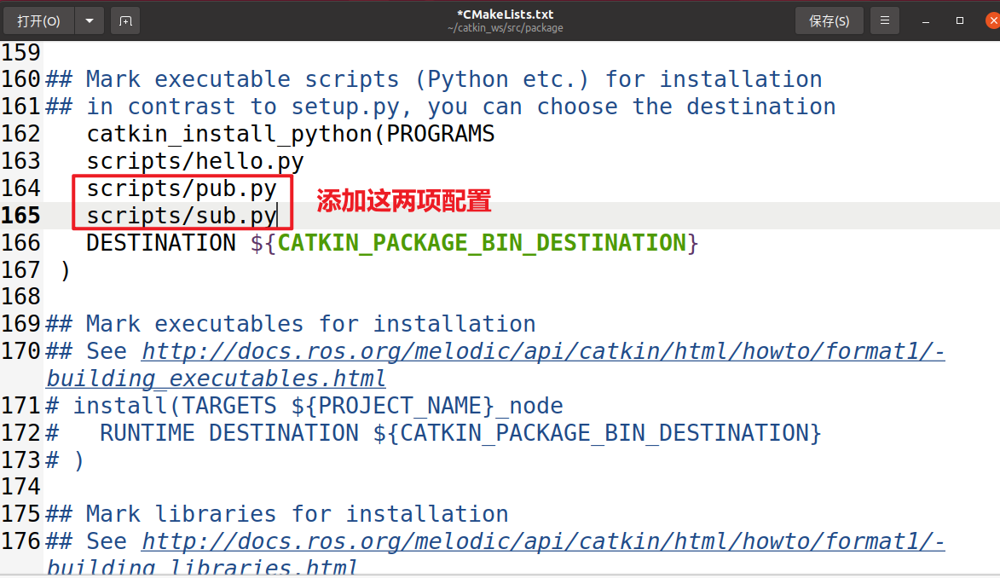

#### （6）进入第二层，执行编译命令

```bash
cd ~ # 退回主目录

cd catkin_ws # 进入第二层

catkin_make # 编译
```

#### （7）运行文件

```bash
roscore # 开启主节点

# package 为功能包名，可替换成其他

rosrun package pub.py

rosrun package sub.py
```

#### （8）运行结果如下

<br/>
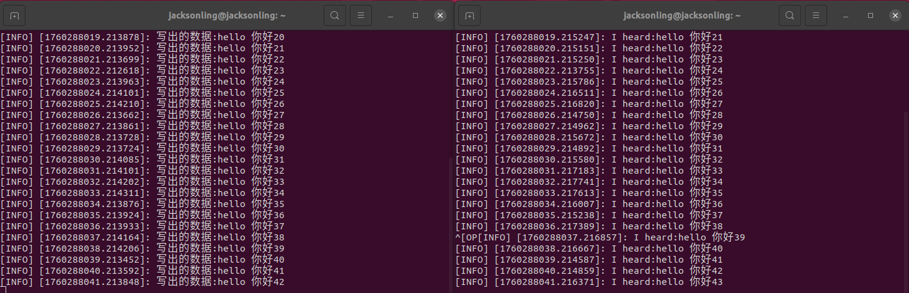

### 自定义 msg

> #### （1）基本配置：http://www.autolabor.com.cn/book/ROSTutorials/di-2-zhang-ros-jia-gou-she-ji/22hua-ti-tong-xin/214-hua-ti-tong-xin-zhi-zi-ding-yi-xiao-xi.html
>
> #### （2）python 案例：http://www.autolabor.com.cn/book/ROSTutorials/di-2-zhang-ros-jia-gou-she-ji/22hua-ti-tong-xin/216-hua-ti-tong-xin-zhi-python-diao-yong-zi-ding-yi-xiao-xi.html
>
> #### （3）注意：新建 msg 文件命名为 <span style="color:red">Work.msg</span>

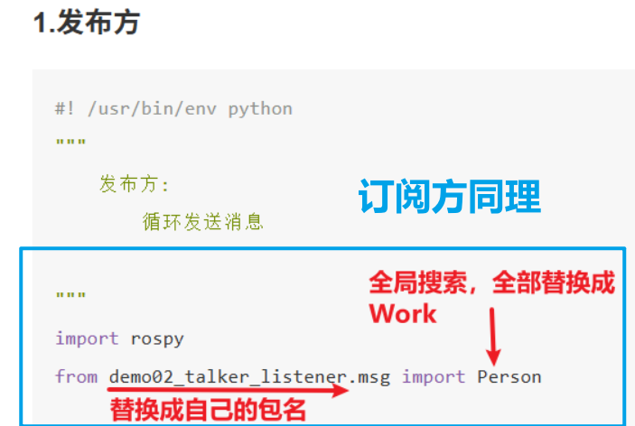

#### 执行命令

```bash
catekin_make # 进入第二层执行编译命令

roscore # 开启主节点

rosrun package pub2.py # package 为功能包名，替换为自己的

rosrun package sub2.py
```

## 服务通信

### 基本介绍

<br/>
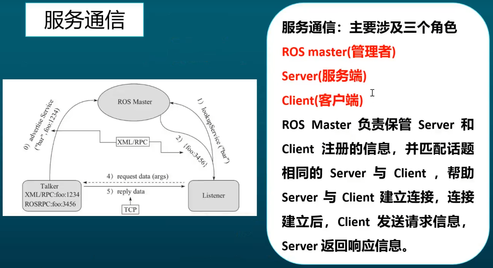
<br/>
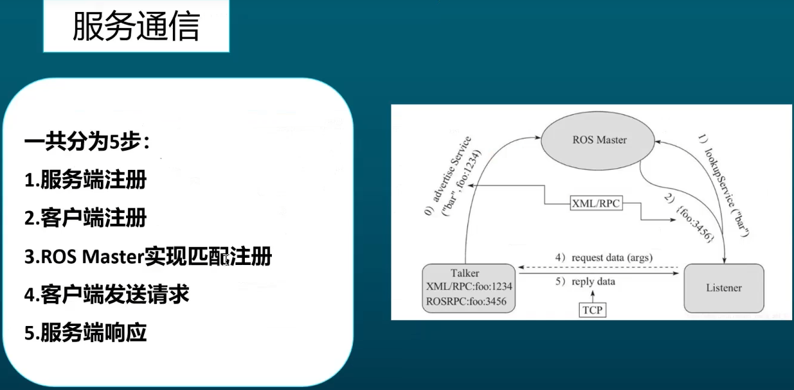

### 常用命令

<br/>
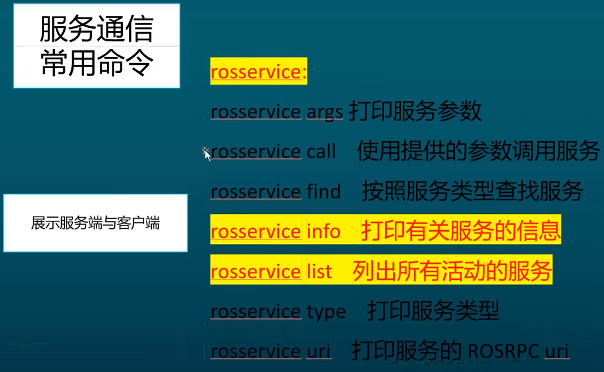

### 应用案例

```bash
roscore # 开启主节点

rosrun turtlesim turtlesim_node # 启动小乌龟

rosnode list # 查看小乌龟节点

rosnode info /turtlesim # 查看小乌龟节点信息
```

<br/>
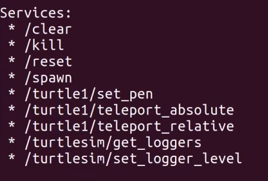

#### 调用服务，以生成小乌龟的服务 spawn 为例

```bash
rosservice call /spawn # 输入命令后按两下 tab 键，输入小乌龟生成位置的参数
```

<br/>
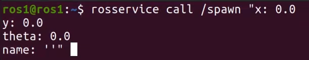
<br/>
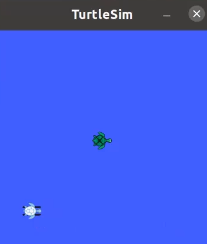

### 自定义 srv

> #### （1）基本配置：http://www.autolabor.com.cn/book/ROSTutorials/di-2-zhang-ros-jia-gou-she-ji/23-fu-wu-tong-xin/222-fu-wu-tong-xin-zi-ding-yi-srv.html
>
> #### （2）python 案例：http://www.autolabor.com.cn/book/ROSTutorials/di-2-zhang-ros-jia-gou-she-ji/23-fu-wu-tong-xin/224-fu-wu-tong-xin-zi-ding-yi-srv-diao-yong-b-python.html
>
> #### （3）新建 <span style="color:red">Test.srv</span> 文件

<br/>
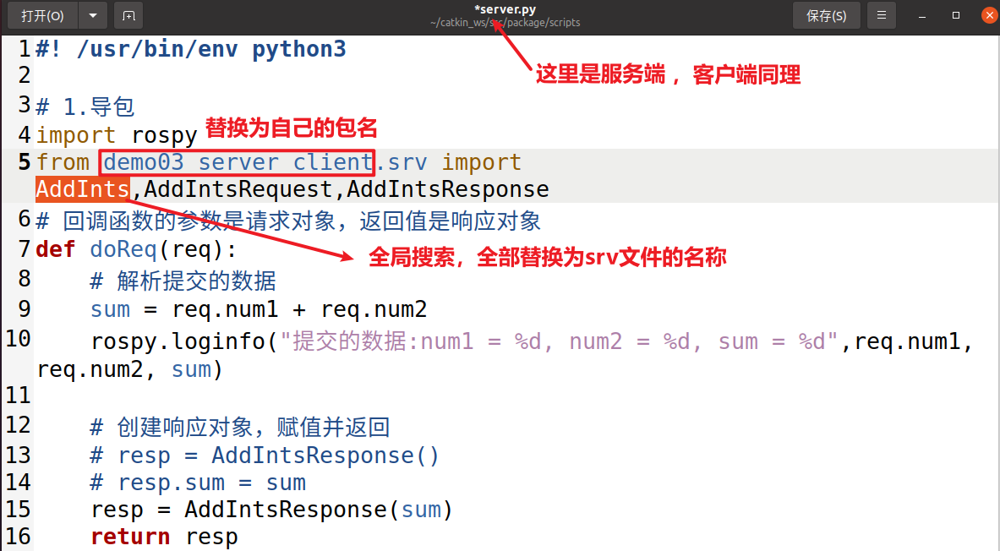

#### 执行命令

```bash
roscore # 开启主节点

rosrun package server.py # package 为功能包名，替换为自己的

rosservice list # 查看服务列表

rosservice call /Test # 调用服务，在命令后传入两个参数，返回的是两参数之和
```

<br/>
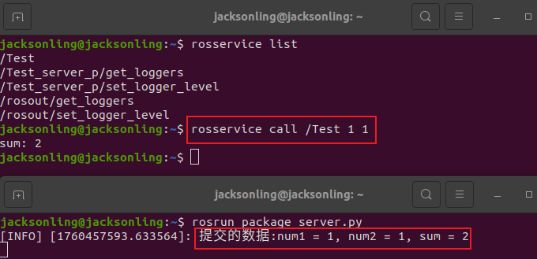

#### 客户端测试

```bash
rosrun package client.py  # package 为功能包名，替换为自己的，命令后跟两个参数，返回的是两参数之和
```

<br/>
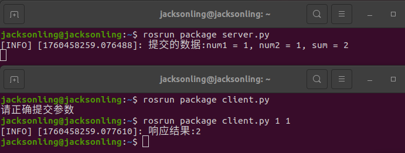

## 参数通信

### 基本介绍

<br/>
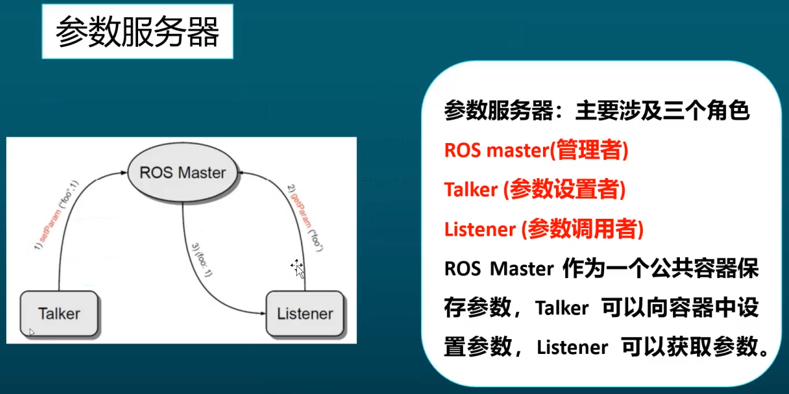
<br/>
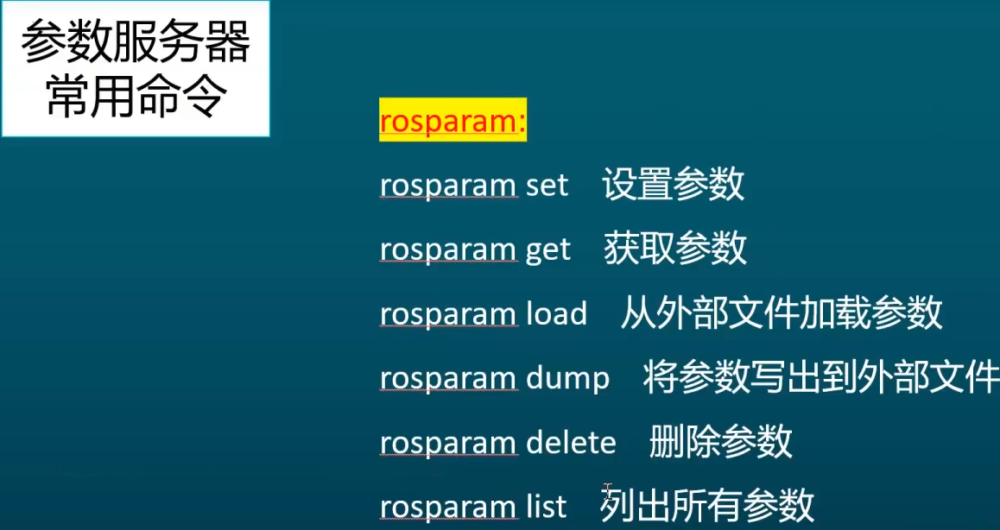

### 应用案例

```bash
roscore # 开启主节点

rosrun turtlesim turtlesim_node # 启动小乌龟

rosparam list # 查看参数列表

rosparam get /turtlesim/background_r # 获取背景红色值

rosparam set /turtlesim/background_r 255 # 设置背景红色值为 255

# 重启小乌龟，即可看到背景颜色改变
rosrun turtlesim turtlesim_node
```

<br/>
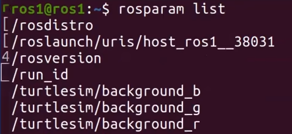
<br/>
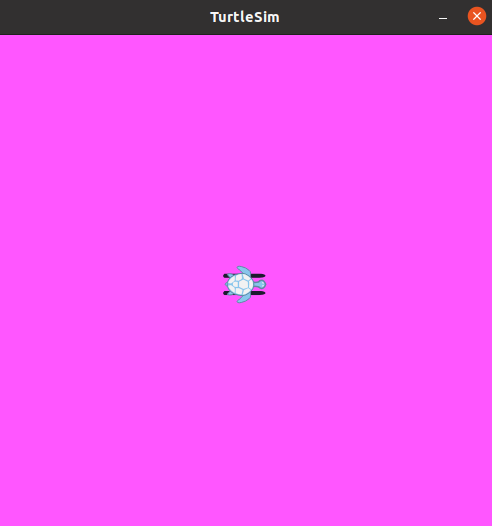

## ROS 常用工具

<br/>
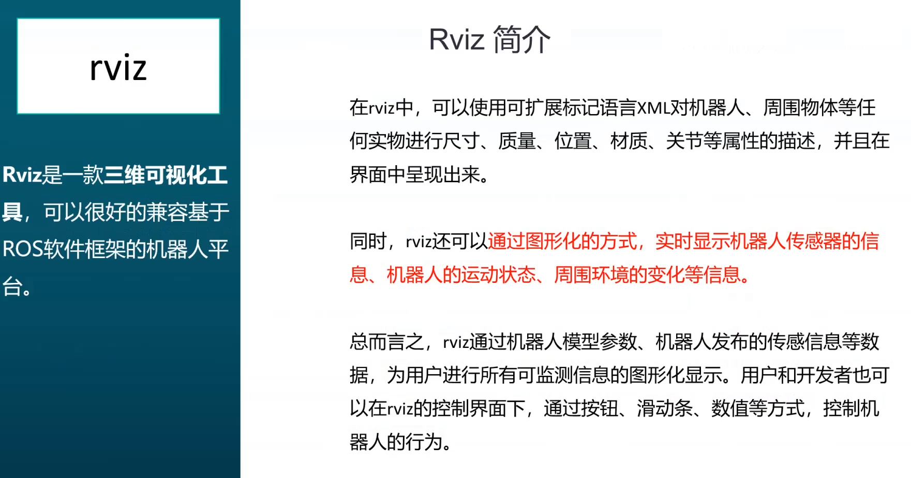
<br/>
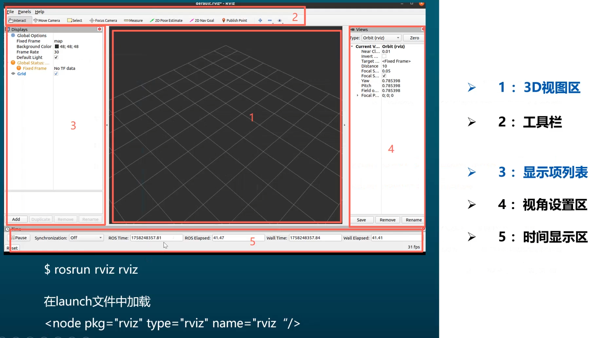
<br/>
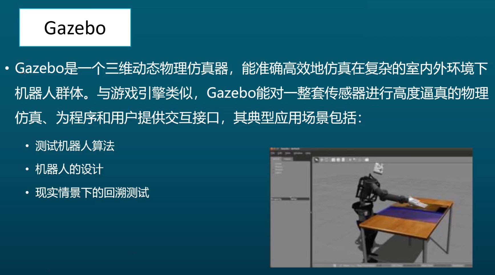
<br/>
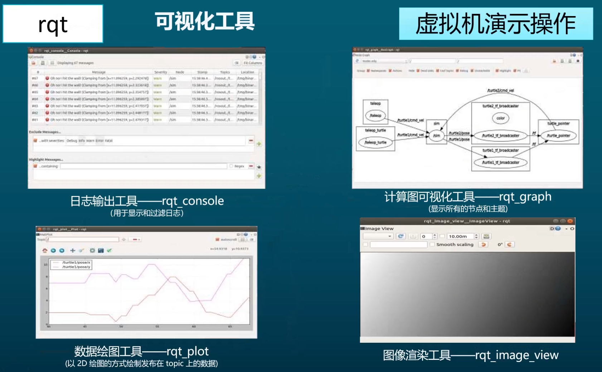
<br/>
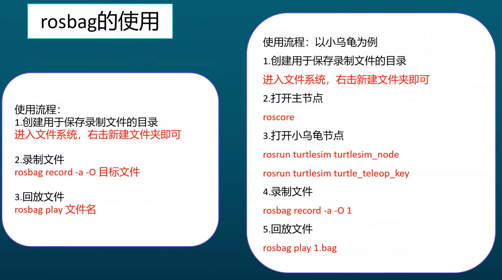
<br/>
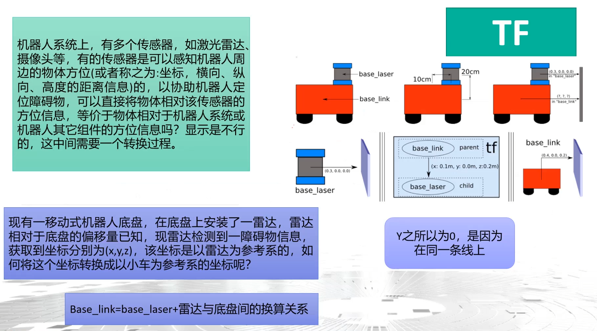
<br/>
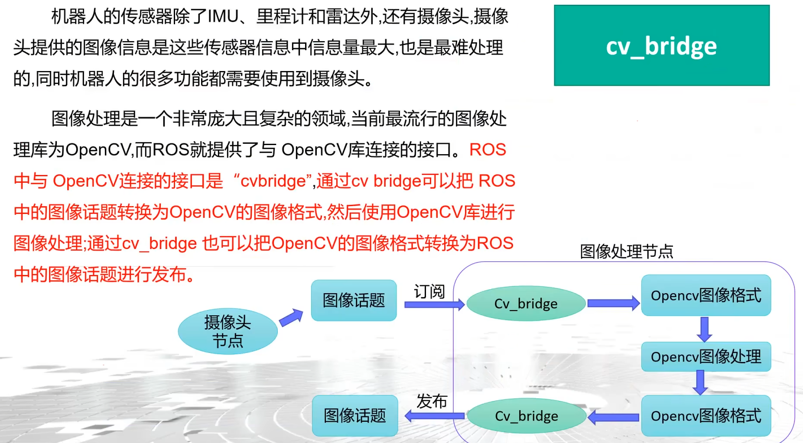

## 机器人仿真建模

#### 操作文档

> #### http://www.autolabor.com.cn/book/ROSTutorials/di-6-zhang-ji-qi-ren-xi-tong-fang-zhen/62-fang-zhen-urdf-ji-cheng-rviz.html

```bash
cd catkin_ws/src

catkin_create_pkg ceshi3 std_msgs roscpp rospy urdf xacro

cd ceshi3

makdir urdf

cd urdf

touch box.urdf
```

#### 文件中粘贴如下代码

```xml
<robot name="mycar">
    <link name="base_link">
        <visual>
            <geometry>
                <box size="0.5 0.2 0.1" />
            </geometry>
        </visual>
    </link>
</robot>
```

#### 继续执行如下命令

```bash
cd ..

mkdir launch

cd launch

touch box.launch
```

#### launch 文件中粘贴如下代码

> #### 把包名，urdf 文件的路径替换成自己的

```xml
<launch>

    <!-- 设置参数 -->
    <param name="robot_description" textfile="$(find 包名)/urdf/urdf/urdf01_HelloWorld.urdf" />

    <!-- 启动 rviz -->
    <node pkg="rviz" type="rviz" name="rviz" />

</launch>
```

#### 继续执行如下命令

> #### roslaunch 底层会自动启动 roscore

```bash
roslaunch ceshi3 box.launch
```
