<h1 style="text-align: center;">SpringAI</h1>
 
- - -

## 官方网址

> #### https://spring.io/projects/spring-ai

## OpenAI 初体验

### 导入项目

> #### 项目地址：https://gitee.com/zhijun.zhang/openai-java-demo.git
>
> #### 环境要求
>
> #### （1）jdk 的版本要求是 17
>
> #### （2）Kotlin 版本要 2.1.0 以上，建议将 idea 升级到 2024 版本以上
>
> #### 基础配置
>
> #### （1）项目导入后，设置 -> 语言和框架 -> Kotlin -> 启用 K2 模式 -> 重启 IDEA
>
> #### （2）申请 OpenAI 的 ApiKey，并配置到环境变量中

### 申请 ApiKey

> #### 免费申请 OpenAI 密钥：https://github.com/chatanywhere/GPT_API_free

### 普通聊天

```java
import com.openai.client.OpenAIClient;
import com.openai.client.okhttp.OpenAIOkHttpClient;
import com.openai.models.ChatModel;
import com.openai.models.chat.completions.ChatCompletionCreateParams;

public class CompletionsDemo {

    public static void main(String[] args) {
        // 创建客户端，指定 API Key 与 baseUrl，其中API KEY从系统环境变量中获取
        OpenAIClient client = OpenAIOkHttpClient.builder()
                .baseUrl("https://api.chatanywhere.tech/v1")
                .apiKey(System.getenv("OPENAI_API_KEY"))
                .build();

        // 构造聊天参数
        ChatCompletionCreateParams createParams = ChatCompletionCreateParams.builder()
                .model(ChatModel.GPT_3_5_TURBO) // 指定模型
                .addSystemMessage("你是一位Java程序员助理，具备扎实的Java编程基础和良好的代码理解能力。") // 添加系统消息
                .addUserMessage("你是谁？") // 添加用户消息
                .build();

        // 调用接口，获取结果并打印
        client.chat().completions()
                .create(createParams)
                .choices()
                .stream()
                .flatMap(choice -> choice.message().content().stream())
                .forEach(System.out::println);
    }
}
```

### 流式聊天

```java
import com.openai.client.okhttp.OpenAIOkHttpClient;
import com.openai.models.ChatModel;
import com.openai.models.chat.completions.ChatCompletionCreateParams;

public class CompletionsStreamingDemo {

    public static void main(String[] args) {
        // 创建异步通信客户端，指定 API Key 与 baseUrl，其中API KEY从系统环境变量中获取
        var client = OpenAIOkHttpClient.builder()
                .baseUrl("https://api.chatanywhere.tech/v1")
                .apiKey(System.getenv("OPENAI_API_KEY"))
                .build();

        // 构造聊天参数
        var createParams = ChatCompletionCreateParams.builder()
                .model(ChatModel.GPT_3_5_TURBO) // 指定模型
                .addSystemMessage("你是一位Java程序员助理，具备扎实的Java编程基础和良好的代码理解能力。") // 添加系统消息
                .addUserMessage("帮我写一个java的入门案例，有详细的描述") // 添加用户消息
                .build();

        // 调用聊天接口，获取流式响应
        try (var response = client.chat().completions().createStreaming(createParams)) {
            // 获取流式响应的数据流
            response.stream()
                    // 将每个 ChatCompletionChunk 的 choices() 转换为流进行处理
                    .flatMap(chatCompletionChunk -> chatCompletionChunk.choices().stream())
                    // 提取每个选择对象中的增量内容流（delta.content）
                    .flatMap(choice -> choice.delta().content().stream())
                    // 实时打印流式返回的文本内容
                    .forEach(System.out::println);
        }
    }
}
```

### 多轮对话（记忆）

```java
import com.openai.client.OpenAIClient;
import com.openai.client.okhttp.OpenAIOkHttpClient;
import com.openai.models.chat.completions.ChatCompletionAssistantMessageParam;
import com.openai.models.chat.completions.ChatCompletionCreateParams;
import com.openai.models.chat.completions.ChatCompletionMessageParam;
import com.openai.models.chat.completions.ChatCompletionUserMessageParam;

import java.util.ArrayList;
import java.util.List;
import java.util.Optional;

/**
 * 多轮对话示例代码
 */
public class CompletionsMultipleRoundsDemo {

    private static OpenAIClient client;

    public static void main(String[] args) {
        // 创建客户端，指定 API Key 与 baseUrl，其中API KEY从系统环境变量中获取
        client = OpenAIOkHttpClient.builder()
                .baseUrl("https://dashscope.aliyuncs.com/compatible-mode/v1")
                .apiKey(System.getenv("ALIYUN_API_KEY"))
                .build();

        // 创建消息集合，用于存储对话历史记录
        var messageParamList = new ArrayList<ChatCompletionMessageParam>();
        // 第一次对话
        chat("我叫花和尚，请记住我", messageParamList);
        System.out.println("------------------------");
        // 第二次对话
        chat("我是谁？", messageParamList);
    }

    public static void chat(String userMessage, List<ChatCompletionMessageParam> messageParamList) {
        // 手动构建 user 消息对象，并且放到消息集合中
        messageParamList.add(ChatCompletionMessageParam.ofUser(ChatCompletionUserMessageParam.builder()
                .content(userMessage)
                .build()));

        // 构造聊天参数
        var createParams = ChatCompletionCreateParams.builder()
                .model("qwen-plus") // 指定模型
                .messages(messageParamList) // 指定消息集合
                .build();

        // 调用接口，获取结果并打印
        client.chat().completions()
                .create(createParams)
                .choices()
                .stream()
                .flatMap(choice -> {
                    // 获取 assistant 消息
                    Optional<String> contentOptional = choice.message().content();
                    // 如果有 assistant 消息，则手动构建 assistant 消息对象，并且放到消息集合中
                    if (contentOptional.isPresent()) {
                        // 手动构建 assistant 消息对象，并且放到消息集合中
                        ChatCompletionAssistantMessageParam assistantMessageParam = ChatCompletionAssistantMessageParam.builder()
                                .content(contentOptional.get())
                                .build();
                        messageParamList.add(ChatCompletionMessageParam.ofAssistant(assistantMessageParam));
                    }
                    // 返回 assistant 消息流
                    return contentOptional.stream();
                })
                // 打印结果
                .forEach(System.out::println);
    }
}
```

<br/>

# SpringAI

## OpenAI

### 导入项目

> #### https://gitee.com/zhijun.zhang/my-spring-ai.git

### 引入依赖

```xml
<?xml version="1.0" encoding="UTF-8"?>
<project xmlns="http://maven.apache.org/POM/4.0.0"
         xmlns:xsi="http://www.w3.org/2001/XMLSchema-instance"
         xsi:schemaLocation="http://maven.apache.org/POM/4.0.0 http://maven.apache.org/xsd/maven-4.0.0.xsd">
    <modelVersion>4.0.0</modelVersion>

    <!-- 继承 Spring Boot 父工程 -->
    <parent>
        <groupId>org.springframework.boot</groupId>
        <artifactId>spring-boot-starter-parent</artifactId>
        <version>3.3.5</version>
    </parent>

    <groupId>cn.itcast</groupId>
    <artifactId>my-spring-ai</artifactId>
    <version>1.0-SNAPSHOT</version>

    <properties>
        <maven.compiler.source>17</maven.compiler.source>
        <maven.compiler.target>17</maven.compiler.target>
        <project.build.sourceEncoding>UTF-8</project.build.sourceEncoding>

        <spring-ai.version>1.0.0-M6</spring-ai.version>
        <org.projectlombok.version>1.18.36</org.projectlombok.version>
    </properties>

    <dependencyManagement>
        <dependencies>
            <!-- Spring AI BOM -->
            <dependency>
                <groupId>org.springframework.ai</groupId>
                <artifactId>spring-ai-bom</artifactId>
                <version>${spring-ai.version}</version>
                <type>pom</type>
                <scope>import</scope>
            </dependency>
        </dependencies>
    </dependencyManagement>

    <dependencies>
        <!-- Spring AI OpenAI 依赖 -->
        <dependency>
            <groupId>org.springframework.ai</groupId>
            <artifactId>spring-ai-openai-spring-boot-starter</artifactId>
        </dependency>

        <!-- lombok 管理 -->
        <dependency>
            <groupId>org.projectlombok</groupId>
            <artifactId>lombok</artifactId>
            <version>${org.projectlombok.version}</version>
        </dependency>

        <!--web-->
        <dependency>
            <groupId>org.springframework.boot</groupId>
            <artifactId>spring-boot-starter-web</artifactId>
        </dependency>
        <!--单元测试-->
        <dependency>
            <groupId>org.springframework.boot</groupId>
            <artifactId>spring-boot-starter-test</artifactId>
            <scope>test</scope>
        </dependency>

    </dependencies>

    <build>
        <pluginManagement>
            <plugins>
                <plugin>
                    <groupId>org.apache.maven.plugins</groupId>
                    <artifactId>maven-compiler-plugin</artifactId>
                    <version>3.13.0</version>
                    <configuration>
                        <source>17</source> <!-- depending on your project -->
                        <target>17</target> <!-- depending on your project -->
                    </configuration>
                </plugin>
            </plugins>
        </pluginManagement>
    </build>
</project>
```

### 配置文件

```yaml
server:
  port: 8099 # 端口
  tomcat:
    uri-encoding: UTF-8 # 服务编码
spring:
  application:
    name: my-spring-ai
  ai:
    openai: # openai配置
      base-url: https://api.chatanywhere.tech # api 地址
      api-key: ${OPENAI_API_KEY} # 读取环境变量中的 api key
      chat:
        options:
          model: gpt-3.5-turbo # 模型名称
```

### 构造 ChatClient

```java
import org.springframework.ai.chat.client.ChatClient;
import org.springframework.context.annotation.Bean;
import org.springframework.context.annotation.Configuration;

@Configuration
public class SpringAIConfig {
    /**
     * 创建并返回一个ChatClient的Spring Bean实例。
     *
     * @param builder 用于构建ChatClient实例的构建者对象
     * @return 构建好的ChatClient实例
     */
    @Bean
    public ChatClient chatClient(ChatClient.Builder builder) {
        return builder.build();
    }
}
```

### 普通聊天与流式聊天

#### （1）ChatController

```java
package cn.itcast.controller;

import cn.itcast.service.ChatService;
import lombok.RequiredArgsConstructor;
import org.springframework.http.MediaType;
import org.springframework.web.bind.annotation.PostMapping;
import org.springframework.web.bind.annotation.RequestBody;
import org.springframework.web.bind.annotation.RequestMapping;
import org.springframework.web.bind.annotation.RestController;
import reactor.core.publisher.Flux;

@RestController
@RequiredArgsConstructor
@RequestMapping("/chat")
public class ChatController {

    private final ChatService chatService;

    /**
     * 普通聊天
     *
     * @param question
     * @return
     */
    @PostMapping
    public String chat(@RequestBody String question) {
        return chatService.chat(question);
    }

    /**
     * 处理流式聊天请求，返回服务器发送事件（SSE）格式的响应流
     *
     * @param question 用户输入的聊天问题
     * @return 包含逐条聊天响应的响应式数据流，通过Server-Sent Events协议传输
     */
    @PostMapping(value = "stream", produces = MediaType.TEXT_EVENT_STREAM_VALUE)
    public Flux<String> chatStream(@RequestBody String question) {
        return chatService.chatStream(question);
    }
}
```

#### （2）ChatService

```java
package cn.itcast.service;

import reactor.core.publisher.Flux;

public interface ChatService {
    /**
     * 普通聊天
     * @param question 用户的提问
     * @return 大模型的回答
     */
    String chat(String question);

    /**
     * 流式聊天
     *
     * @param question 用户提问
     * @return 大模型的回答
     */
    Flux<String> chatStream(String question);
}
```

#### （3）ChatServiceImpl

```java
package cn.itcast.service.impl;

import cn.itcast.service.ChatService;
import lombok.RequiredArgsConstructor;
import lombok.extern.slf4j.Slf4j;
import org.springframework.ai.chat.client.ChatClient;
import org.springframework.stereotype.Service;
import reactor.core.publisher.Flux;

@Slf4j
@Service
@RequiredArgsConstructor
public class ChatServiceImpl implements ChatService {

    private final ChatClient chatClient;

    /**
     * 与聊天客户端进行交互，发送用户问题并获取响应内容。
     *
     * @param question 用户输入的问题内容
     * @return 聊天客户端返回的响应内容
     */
    @Override
    public String chat(String question) {
        String content = this.chatClient.prompt()
                .user(question)
                .call()
                .content();
        log.info("question: {}, content: {}", question, content);
        return content;
    }

    /**
     * 处理用户问题并返回流式响应内容
     *
     * @param question 用户输入的问题内容
     * @return 包含逐条响应内容和结束标记的响应流，每个元素为字符串格式
     */
    @Override
    public Flux<String> chatStream(String question) {
        // 调用聊天客户端生成流式响应内容
        return this.chatClient.prompt()
                .user(question)
                .stream()
                .content()
                // 记录每次接收到的响应内容
                .doOnNext(content -> log.info("question: {}, content: {}", question, content))
                // 在流结束时添加结束标记
                .concatWith(Flux.just("[END]"));
    }
}
```

### 响应式编程

<br/>
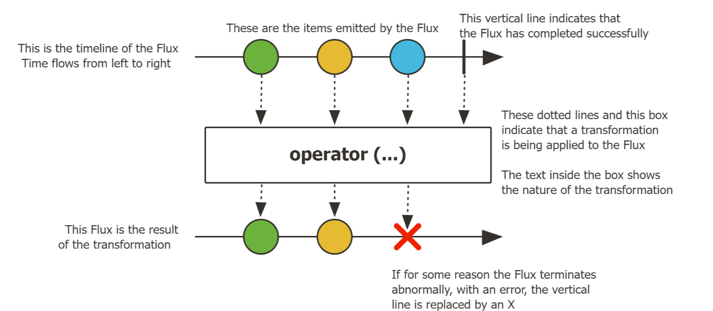

<br/>
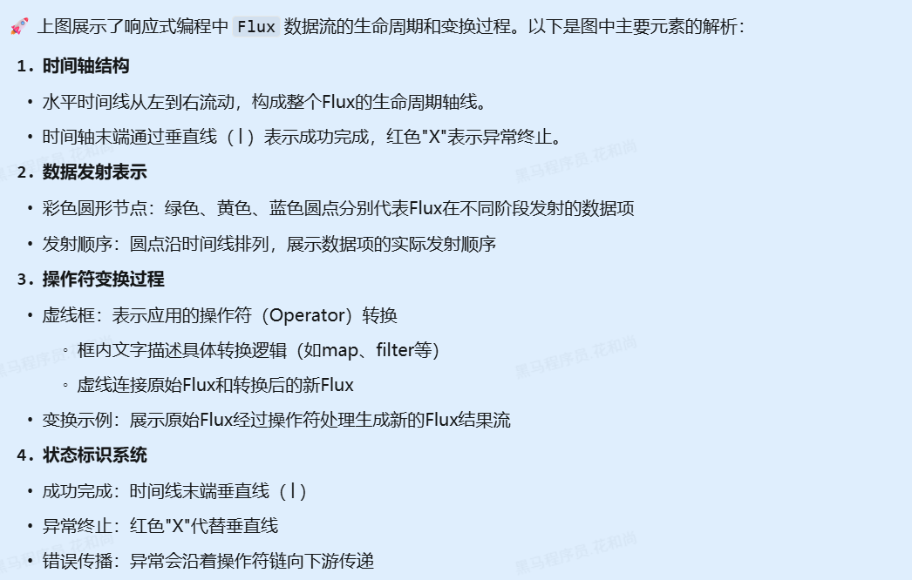
<br/>

```java
package cn.itcast.service;

import org.junit.jupiter.api.Test;
import reactor.core.publisher.Flux;

public class ReactorTest {
    @Test
    public void test() {
        // 创建 Flux
        Flux<String> flux = Flux.just("苹果", "香蕉", "葡萄", "面条") // 创建一个包含四个元素的 Flux
                .filter(s -> !s.equals("面条")) // 过滤掉面条元素
                .doFirst(() -> System.out.println("开始处理......")) // 在处理开始时打印信息
                .doOnNext(s -> System.out.println("当前元素: " + s)) // 在每个元素被处理后打印信息
                .map(s -> { // 每个元素进行数据处理
                    return switch (s) {
                        case "苹果" -> "苹果是红色的";
                        case "香蕉" -> "香蕉是黄色的";
                        case "葡萄" -> "葡萄是紫色的";
                        default -> "未知水果";
                    };
                })
                .doOnComplete(() -> System.out.println("处理完成......")) // 在完成时打印信息
                .concatWith(Flux.just("[END]")) // 在最后添加一个元素
                ;
        // 订阅消费
        flux.subscribe(s -> System.out.println("消费者: " + s));
    }
}
```

## SpringAI-Alibaba

### 引入依赖

```xml
<dependency>
  <groupId>com.alibaba.cloud.ai</groupId>
  <artifactId>spring-ai-alibaba-starter</artifactId>
  <version>1.0.0-M6.1</version> <!-- 注意这个版本要与 SpringAI 版本匹配 -->
</dependency>
```

### 配置文件

```yaml
server:
  port: 8099 #端口
  tomcat:
    uri-encoding: UTF-8 #服务编码
spring:
  application:
    name: my-spring-ai
  ai:
    dashscope:
      api-key: ${ALIYUN_API_KEY}
      chat:
        options:
          model: qwen-plus
    openai: # openai 配置
      base-url: https://dashscope.aliyuncs.com/compatible-mode # 阿里百炼 api 地址
      #      base-url: https://api.chatanywhere.tech # api地址
      api-key: ${ALIYUN_API_KEY} # 读取环境变量中的阿里百炼 api key
      #      api-key: ${OPENAI_API_KEY} # 读取环境变量中的api key
      chat:
        options:
          model: qwen-plus #阿里百炼 模型名称
        enabled: false # 关闭 OpenAI 配置
#          model: gpt-3.5-turbo # 模型名称
```

## System 设定

### prompt 示例

> #### 从 Java 15 开始，Java 引入了 Text Blocks（文本块） 功能，允许使用 """ 来定义多行字符串，从而简化复杂字符串的编写。

```java
package cn.itcast.constants;

public interface Constant {

    String SYSTEM_ROLE = """
            #角色
            你是Java开发助手，名字叫小智。

            #技能
            ##技能1：
            帮我分析运行bug，并且给我提出解决方案。

            ##技能2：
            给代码生成注释，无需逐行都注释，在关键代码添加注释
            """;
}
```

### 局部设定

```java
/**
 * 与聊天客户端进行交互，发送用户问题并获取响应内容。
 *
 * @param question 用户输入的问题内容
 * @return 聊天客户端返回的响应内容
 */
@Override
public String chat(String question) {
    // 调用聊天客户端处理用户问题并获取响应内容
    var content = this.chatClient.prompt()
            .system(Constant.SYSTEM_ROLE) // 设置系统角色
            .user(question)
            .call()
            .content();
    log.info("question: {}, content: {}", question, content);
    return content;
}
```

### 默认设定

```java
package cn.itcast.config;

import cn.itcast.constants.Constant;
import org.springframework.ai.chat.client.ChatClient;
import org.springframework.context.annotation.Bean;
import org.springframework.context.annotation.Configuration;

@Configuration
public class SpringAIConfig {

    /**
     * 创建并返回一个ChatClient的Spring Bean实例。
     *
     * @param builder 用于构建ChatClient实例的构建者对象
     * @return 构建好的ChatClient实例
     */
    @Bean
    public ChatClient chatClient(ChatClient.Builder builder) {
        return builder
        .defaultSystem(Constant.SYSTEM_ROLE) // 设置默认的系统角色
        .build();
    }
}
```

### 动态参数

#### （1）提示词中设定动态传递参数

```java
package cn.itcast.constants;

public interface Constant {

    String SYSTEM_ROLE = """
            #角色
            你是Java开发助手，名字叫小智。

            #技能
            ##技能1：
            帮我分析运行bug，并且给我提出解决方案。

            ##技能2：
            给代码生成注释，无需逐行都注释，在关键代码添加注释

            当前的时间是 {now}
            """;
}
```

#### （2）动态传递参数

```java
@Override
public String chat(String question) {
    // 调用聊天客户端处理用户问题并获取响应内容
    var content = this.chatClient.prompt()
            // .system(Constant.SYSTEM_ROLE) // 设置系统角色
            .system(prompt -> prompt.param("now", DateUtil.now())) // 设置系统角色参数
            .user(question)
            .call()
            .content();
    log.info("question: {}, content: {}", question, content);
    return content;
}
```

## Advisor

### 运行原理

<br/>
<div style="display: flex; align-items: center; gap: 20px;">
  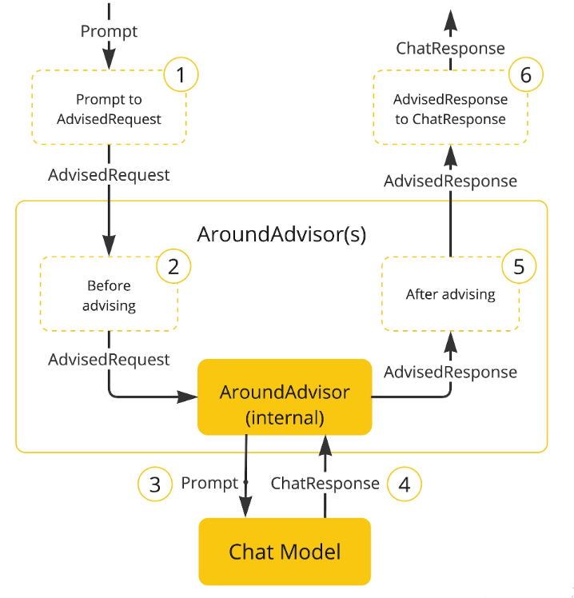
  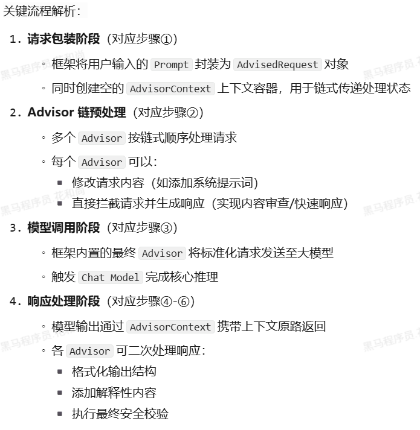
</div>

### 日志 Advisor

#### （1）配置 bean

```java
package cn.itcast.config;

import cn.itcast.constants.Constant;
import org.springframework.ai.chat.client.ChatClient;
import org.springframework.ai.chat.client.advisor.SimpleLoggerAdvisor;
import org.springframework.ai.chat.client.advisor.api.Advisor;
import org.springframework.context.annotation.Bean;
import org.springframework.context.annotation.Configuration;

@Configuration
public class SpringAIConfig {

    /**
     * 创建并返回一个 ChatClient 的Spring Bean 实例
     *
     * @param builder 用于构建 ChatClient 实例的构建者对象
     * @return 构建好的 ChatClient 实例
     */
    @Bean
    public ChatClient chatClient(ChatClient.Builder builder,
                                 Advisor simpleLoggerAdvisor) {
        return builder
                .defaultSystem(Constant.SYSTEM_ROLE) // 设置默认的系统角色
                .defaultAdvisors(simpleLoggerAdvisor) // 设置默认的 Advisor
                .build();
    }

    /**
     * 创建并返回一个 SimpleLoggerAdvisor 的 Spring Bean 实例
     */
    @Bean
    public Advisor simpleLoggerAdvisor() {
        return new SimpleLoggerAdvisor();
    }
}
```

#### （2）application.yaml 日志配置

```yaml
logging:
  level:
    org.springframework.ai.chat.client.advisor: DEBUG
```

### 聊天记忆

#### （1）基本介绍

<br/>
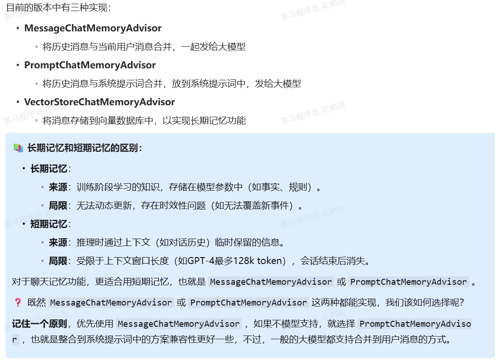

::: tip <span style="font-size: 18px;font-weight:bold">⚠️ 注意</span>

#### 由于是基于内存存储，服务重启后，聊天记录将丢失，所以这种方式不适合用在真实项目中，可选择使用数据库、Redis等方式进行存储

:::

#### （2）MessageChatMemoryAdvisor

```java
/**
 * 步骤一：创建并返回聊天记忆管理器的 Spring Bean（基于内存实现）
 *
 * @return InMemoryChatMemory 实例，用于存储聊天上下文信息
 */
@Bean
public ChatMemory chatMemory() {
    return new InMemoryChatMemory();
}

/**
 * 步骤二：创建并返回聊天记忆管理 advisor 的 Spring Bean
 *
 * @param chatMemory 聊天记忆管理器实例
 * @return MessageChatMemoryAdvisor 实例，用于在聊天过程中维护上下文
 */
@Bean
public Advisor messageChatMemoryAdvisor(ChatMemory chatMemory) {
    return new MessageChatMemoryAdvisor(chatMemory);
}

/**
 * 步骤三：创建并返回一个 ChatClient 的 Spring Bean 实例
 *
 * @param builder 用于构建 ChatClient 实例的构建者对象
 * @return 构建好的 ChatClient 实例
 */
@Bean
public ChatClient chatClient(ChatClient.Builder builder,
                                Advisor simpleLoggerAdvisor,
                                Advisor messageChatMemoryAdvisor
) {
    return builder
            .defaultSystem(Constant.SYSTEM_ROLE) // 设置默认的系统角色
            .defaultAdvisors(simpleLoggerAdvisor, messageChatMemoryAdvisor) // 设置默认的Advisor
            .build();
}
```

#### （3）PromptChatMemoryAdvisor

```java
/**
 * 步骤一：创建并返回聊天记忆管理 advisor 的 Spring Bean
 *
 * @param chatMemory 聊天记忆管理器实例
 * @return PromptChatMemoryAdvisor 实例，用于在聊天过程中维护上下文
 */
@Bean
public Advisor promptChatMemoryAdvisor(ChatMemory chatMemory) {
    return new PromptChatMemoryAdvisor(chatMemory);
}

/**
 * 步骤二：创建并返回一个 ChatClient 的 Spring Bean 实例
 *
 * @param builder 用于构建 ChatClient 实例的构建者对象
 * @return 构建好的 ChatClient 实例
 */
@Bean
public ChatClient chatClient(ChatClient.Builder builder,
                                Advisor simpleLoggerAdvisor,
                                Advisor messageChatMemoryAdvisor,
                                Advisor promptChatMemoryAdvisor
) {
    return builder
            .defaultSystem(Constant.SYSTEM_ROLE) // 设置默认的系统角色
            .defaultAdvisors(simpleLoggerAdvisor, promptChatMemoryAdvisor) // 设置默认的Advisor
            .build();
}
```

### 会话 id

> #### 在 Spring AI 中也是可以指定会话 id 的，而这个 id 虽然不能固定，但是也不能每次都变化，所以需要另外一套业务逻辑来维护这个会话，现在我们暂时不讨论这个会话管理，我们先改造成传入参数的方式来实现

#### （1）定义 DTO

```java
import lombok.AllArgsConstructor;
import lombok.Builder;
import lombok.Data;
import lombok.NoArgsConstructor;

@Data
@Builder
@NoArgsConstructor
@AllArgsConstructor
public class ChatDTO {

    /**
     * 用户的问题
     */
    private String question;
    /**
     * 会话id
     */
    private String sessionId;
}
```

#### （2）编写 Controller

```java
import cn.itcast.dto.ChatDTO;
import cn.itcast.service.ChatService;
import lombok.RequiredArgsConstructor;
import org.springframework.http.MediaType;
import org.springframework.web.bind.annotation.PostMapping;
import org.springframework.web.bind.annotation.RequestBody;
import org.springframework.web.bind.annotation.RequestMapping;
import org.springframework.web.bind.annotation.RestController;
import reactor.core.publisher.Flux;

@RestController
@RequiredArgsConstructor
@RequestMapping("/chat")
public class ChatController {

    private final ChatService chatService;

    @PostMapping
    public String chat(@RequestBody ChatDTO chatDTO) {
        return chatService.chat(chatDTO.getQuestion(), chatDTO.getSessionId());
    }

    /**
     * 处理流式聊天请求，返回服务器发送事件（SSE）格式的响应流
     *
     * @param chatDTO 用户输入的聊天问题
     * @return 包含逐条聊天响应的响应式数据流，通过 Server-Sent Events 协议传输
     */
    @PostMapping(value = "stream", produces = MediaType.TEXT_EVENT_STREAM_VALUE)
    public Flux<String> chatStream(@RequestBody ChatDTO chatDTO) {
        return chatService.chatStream(chatDTO.getQuestion(), chatDTO.getSessionId());
    }
}
```

#### （3）Service 接口

```java
import reactor.core.publisher.Flux;

public interface ChatService {
    /**
     * 普通聊天
     *
     * @param question  用户提问
     * @param sessionId 会话id
     * @return 大模型的回答
     */
    String chat(String question, String sessionId);

    /**
     * 流式聊天
     *
     * @param question 用户提问
     * @param sessionId 会话id
     * @return 大模型的回答
     */
    Flux<String> chatStream(String question, String sessionId);
}
```

#### （4）ServiceImpl 实现类

```java
package cn.itcast.service.impl;

import cn.hutool.core.date.DateUtil;
import cn.itcast.service.ChatService;
import groovy.util.logging.Slf4j;
import lombok.RequiredArgsConstructor;
import org.springframework.ai.chat.client.ChatClient;
import org.springframework.ai.chat.client.advisor.AbstractChatMemoryAdvisor;
import org.springframework.stereotype.Service;
import reactor.core.publisher.Flux;

@lombok.extern.slf4j.Slf4j
@Slf4j
@Service
@RequiredArgsConstructor
public class ChatServiceImpl implements ChatService {

    private final ChatClient chatClient;

    /**
     * 与聊天客户端进行交互，发送用户问题并获取响应内容。
     *
     * @param question 用户输入的问题内容
     * @return 聊天客户端返回的响应内容
     */
    @Override
    public String chat(String question, String sessionId) {
        // 调用聊天客户端处理用户问题并获取响应内容
        var content = this.chatClient.prompt()
                // .system(Constant.SYSTEM_ROLE) // 设置系统角色
                .system(prompt -> prompt.param("now", DateUtil.now())) // 设置系统角色参数
                // 设置会话记忆参数
                .advisors(advisor -> advisor.param(AbstractChatMemoryAdvisor.CHAT_MEMORY_CONVERSATION_ID_KEY, sessionId)) // [!code hl]
                .user(question)
                .call()
                .content();
        log.info("question: {}, content: {}", question, content);
        return content;
    }

    /**
     * 处理用户问题并返回流式响应内容
     *
     * @param question 用户输入的问题内容
     * @return 包含逐条响应内容和结束标记的响应流，每个元素为字符串格式
     */
    @Override
    public Flux<String> chatStream(String question,  String sessionId) {
        // 调用聊天客户端生成流式响应内容
        return this.chatClient.prompt()
                // .system(Constant.SYSTEM_ROLE) // 设置系统角色
                .system(prompt -> prompt.param("now", DateUtil.now())) // 设置系统角色参数
                // 设置会话记忆参数
                .advisors(advisor -> advisor.param(AbstractChatMemoryAdvisor.CHAT_MEMORY_CONVERSATION_ID_KEY, sessionId)) // [!code hl]
                .user(question)
                .stream()
                .content()
                // 记录每次接收到的响应内容
                .doOnNext(content -> log.info("question: {}, content: {}", question, content))
                // 在流结束时添加结束标记
                .concatWith(Flux.just("[END]"));
    }
}

```

## 敏感词校验

### 基本介绍

> #### 在 Spring AI 中提供了安全组件 SafeGuardAdvisor，当用户输入的内容包含敏感词时，立即拦截请求，避免调用大型模型处理，节省计算资源并降低安全风险

### 代码实现

#### （1）定义 SafeGuardAdvisor

```java
@Bean
public Advisor safeGuardAdvisor() {
    // 敏感词列表（示例数据，建议实际使用时从配置文件或数据库读取）
    List<String> sensitiveWords = List.of("敏感词1", "敏感词2");
    // 创建安全防护 Advisor，参数依次为：敏感词库、违规提示语、advisor 处理优先级，数字越小越优先
    return new SafeGuardAdvisor(
            sensitiveWords,
            "敏感词提示：请勿输入敏感词！",
            Advisor.DEFAULT_CHAT_MEMORY_PRECEDENCE_ORDER
    );
}
```

#### （2）添加 Advisor

```java
/**
 * 创建并返回一个 ChatClient 的 Spring Bean 实例
 *
 * @param builder 用于构建 ChatClient 实例的构建者对象
 * @return 构建好的 ChatClient 实例
 */
@Bean
public ChatClient chatClient(ChatClient.Builder builder,
                                Advisor simpleLoggerAdvisor,
                                Advisor messageChatMemoryAdvisor,
                                Advisor promptChatMemoryAdvisor,
                                Advisor safeGuardAdvisor
) {
    return builder
            .defaultSystem(Constant.SYSTEM_ROLE) // 设置默认的系统角色
            .defaultAdvisors(simpleLoggerAdvisor, promptChatMemoryAdvisor, safeGuardAdvisor) // 设置默认的 Advisor
            .build();
}
```

## Tool Calling

### 运行原理

<br/>
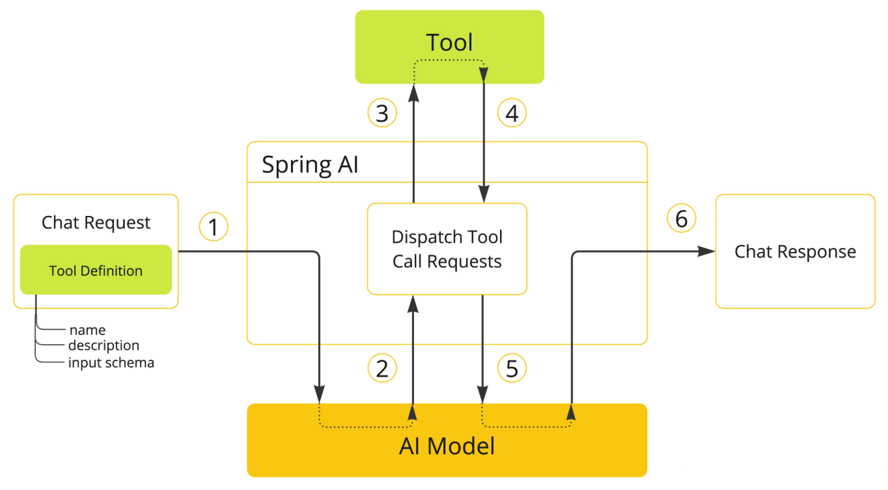
<br/>
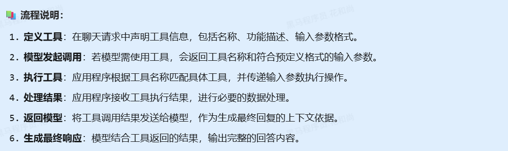

### 天气查询案例

> #### 接口地址（北京为例）：http://t.weather.itboy.net/api/weather/city/101010100
>
> #### 接口返回数据示例：https://www.sojson.com/api/weather.html

#### （1）定义 DTO

```java
import com.fasterxml.jackson.annotation.JsonPropertyDescription;
import lombok.AllArgsConstructor;
import lombok.Builder;
import lombok.Data;
import lombok.NoArgsConstructor;

@Data
@Builder
@NoArgsConstructor
@AllArgsConstructor
public class WeatherDTO {

    @JsonPropertyDescription("城市ID")
    private String cityId;

    @JsonPropertyDescription("城市名称")
    private String city;

    @JsonPropertyDescription("当前温度（单位：℃）")
    private String temperature;

    @JsonPropertyDescription("低温（单位：℃）")
    private String lowTemperature;

    @JsonPropertyDescription("高温（单位：℃）")
    private String highTemperature;

    @JsonPropertyDescription("数据日期（格式：YYYYMMDD）")
    private String date;

    @JsonPropertyDescription("空气质量指数")
    private String quality;

    @JsonPropertyDescription("PM2.5 浓度（单位：微克/立方米）")
    private double pm25;
}
```

#### （2）设置城市 id 提示词

```java
public interface Constant {
    String SYSTEM_ROLE = """
            #角色
            你是Java开发助手，名字叫小智。

            #技能
            ##技能1：
            帮我分析运行bug，并且给我提出解决方案。

            ##技能2：
            给代码生成注释，无需逐行都注释，在关键代码添加注释
            当前的时间是{now}

            北京:101010100
            天津:101030100
            上海:101020100
            重庆:101040100
            广州:101280101
            深圳:101280601
            石家庄:101090101
            郑州:101180101
            武汉:101200101
            长沙:101250101
            南京:101190101
            杭州:101210101
            成都:101270101
            西安:101110101
            沈阳:101070101
            长春:101060101
            哈尔滨:101050101
            太原:101100101
            """;
}
```

#### （2）定义 Tool

```java
import cn.itcast.dto.WeatherDTO;
import org.springframework.ai.tool.annotation.Tool;
import org.springframework.ai.tool.annotation.ToolParam;
import org.springframework.stereotype.Component;

@Component // 注册为一个组件
public class WeatherTools {
    @Tool(description = "根据城市id查询天气信息")
    public WeatherDTO getWeather(@ToolParam(description = "城市id") String cityId) {
        // 通过 http 请求获取天气信息，并且通过 json 数据解析为 WeatherDTO 对象
        String url = "http://t.weather.itboy.net/api/weather/city/" + cityId;
        String data = HttpUtil.get(url);
        JSONObject jsonObject = JSONUtil.parseObj(data);

        return WeatherDTO.builder()
                .cityId(jsonObject.getByPath("cityInfo.citykey", String.class)) // 城市 ID
                .city(jsonObject.getByPath("cityInfo.city", String.class)) // 城市名称
                .date(jsonObject.getByPath("date", String.class))// 数据日期
                .temperature(jsonObject.getByPath("data.wendu", String.class))   // 当前温度
                .lowTemperature(jsonObject.getByPath("data.forecast[0].low", String.class))// 低温
                .highTemperature(jsonObject.getByPath("data.forecast[0].high", String.class))// 高温
                .quality(jsonObject.getByPath("data.quality", String.class))// 空气质量
                .pm25(jsonObject.getByPath("data.pm25", Double.class))// PM2.5 数值
                .build();
    }
}
```

::: tip <span style="font-size: 18px;font-weight:bold">⚠️ 注意</span>

#### @Tool：指定方法是一个工具，通过 description 属性进行描述这个方法（这很重要）

#### @ToolParam：指定方法的入参，也可以是无参的，description 属性描述参数的含义（不是必须，但建议添加）

:::

#### （3）注册 Tool

```java
/**
 * 创建并返回一个 ChatClient 的 Spring Bean 实例
 *
 * @param builder 用于构建 ChatClient 实例的构建者对象
 * @return 构建好的 ChatClient 实例
 */
@Bean
public ChatClient chatClient(ChatClient.Builder builder,
                                Advisor simpleLoggerAdvisor,
                                Advisor messageChatMemoryAdvisor,
                                Advisor promptChatMemoryAdvisor,
                                Advisor safeGuardAdvisor,
                                WeatherTools weatherTools
) {
    return builder
            .defaultSystem(Constant.SYSTEM_ROLE) // 设置默认的系统角色
            .defaultAdvisors(simpleLoggerAdvisor, promptChatMemoryAdvisor, safeGuardAdvisor) // 设置默认的 Advisor
            .defaultTools(weatherTools) // 设置默认的 Tool
            .build();
}
```

## RAG

### 基本原理

<br/>
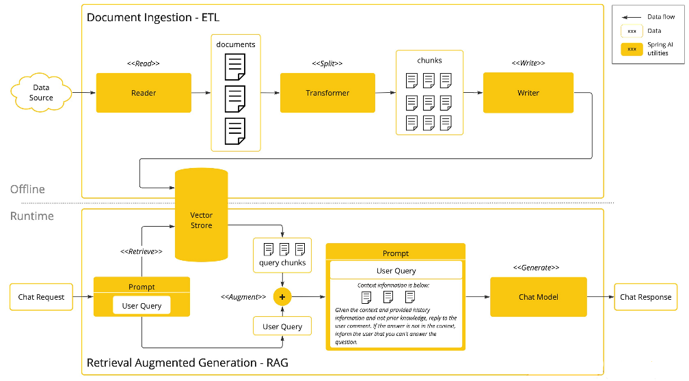
<br/>
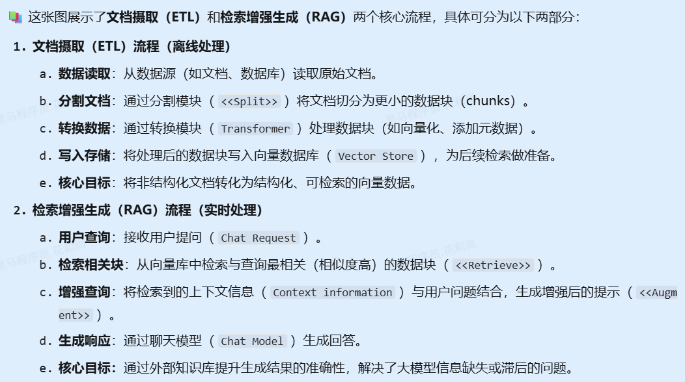

### 相似度计算

> #### 在上述的原理中，我们知道，在向大模型发起请求前，需要到向量库（知识库）查询，而且是相似性的查询，那究竟什么是相似性查询？也就是说，如何判断两个文字相似呢？比如：北京 和 北京市，这两个词相似度高，北京 和 天津市，这两个词相似度就低。怎么做到呢？

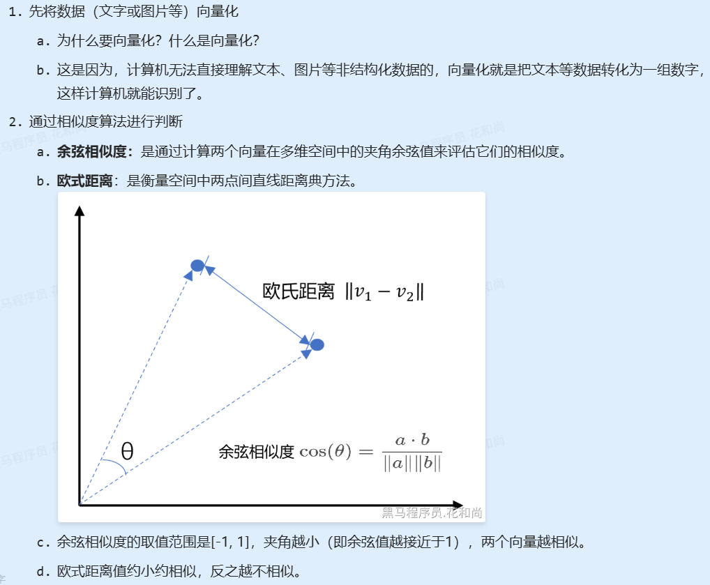

### 向量数据库

<br/>
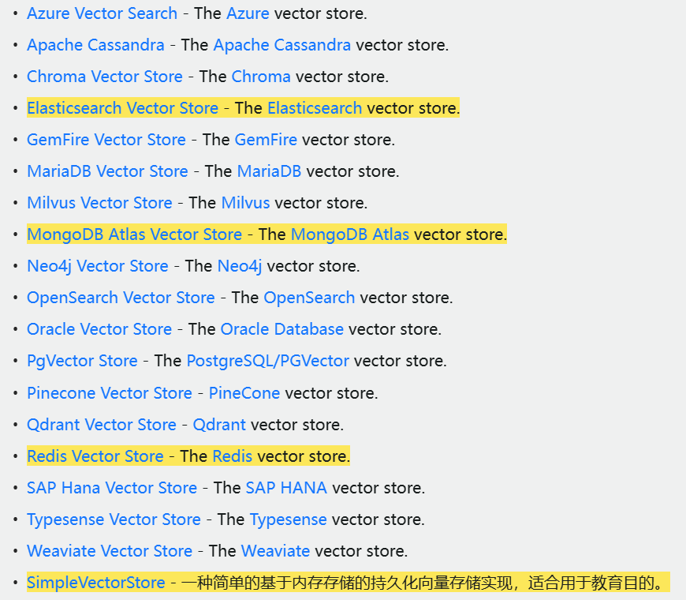

### 代码实现

#### （1）yaml 配置

```yaml
server:
  port: 8099 # 端口
  tomcat:
    uri-encoding: UTF-8 # 服务编码
spring:
  application:
    name: my-spring-ai
  ai:
    dashscope:
      api-key: ${ALIYUN_API_KEY}
      chat:
        options:
          model: qwen-plus
      embedding:
        options:
          model: text-embedding-v3 # 向量模型
          dimensions: 1024 # 向量维度维度
    openai: #openai配置
      base-url: https://dashscope.aliyuncs.com/compatible-mode # 阿里百炼 api 地址
      #      base-url: https://api.chatanywhere.tech # api 地址
      api-key: ${ALIYUN_API_KEY} # 读取环境变量中的阿里百炼 api key
      #      api-key: ${OPENAI_API_KEY} # 读取环境变量中的 api key
      chat:
        options:
          model: qwen-plus # 阿里百炼的模型名称
        enabled: false # 关闭 OpenAI 配置
      #          model: gpt-3.5-turbo # 模型名称
      embedding:
        enabled: false # 关闭 openai 的 embedding，否则会启动报错，容器中会存在 2 个 EmbeddingModel
```

#### （2）创建 Bean 示例

```java
/**
 * 创建并返回一个 VectorStore 的 Spring Bean 实例
 *
 * @param embeddingModel 向量模型
 */
@Bean
public VectorStore vectorStore(EmbeddingModel embeddingModel) {
    return SimpleVectorStore
            .builder(embeddingModel)
            .build();
}

```

#### （3）准备数据

> #### 命名文件为 citys.txt，放在 resources 目录下

<details>
<summary
  style="font-size:18px;font-weight:bold;background-color:#D3D3D3;padding-left:20px;padding-top:10px;padding-bottom:10px;"
>
  点我查看代码
</summary>

```
北京:101010100
朝阳:101010300
顺义:101010400
怀柔:101010500
通州:101010600
昌平:101010700
延庆:101010800
丰台:101010900
石景山:101011000
大兴:101011100
房山:101011200
密云:101011300
门头沟:101011400
平谷:101011500
八达岭:101011600
佛爷顶:101011700
汤河口:101011800
密云上甸子:101011900
斋堂:101012000
霞云岭:101012100
海淀:101010200
天津:101030100
宝坻:101030300
东丽:101030400
西青:101030500
北辰:101030600
蓟县:101031400
汉沽:101030800
静海:101030900
津南:101031000
塘沽:101031100
大港:101031200
武清:101030200
宁河:101030700
上海:101020100
宝山:101020300
嘉定:101020500
南汇:101020600
浦东:101021300
青浦:101020800
松江:101020900
奉贤:101021000
崇明:101021100
徐家汇:101021200
闵行:101020200
金山:101020700
石家庄:101090101
张家口:101090301
承德:101090402
唐山:101090501
秦皇岛:101091101
沧州:101090701
衡水:101090801
邢台:101090901
邯郸:101091001
保定:101090201
廊坊:101090601
郑州:101180101
新乡:101180301
许昌:101180401
平顶山:101180501
信阳:101180601
南阳:101180701
开封:101180801
洛阳:101180901
商丘:101181001
焦作:101181101
鹤壁:101181201
濮阳:101181301
周口:101181401
漯河:101181501
驻马店:101181601
三门峡:101181701
济源:101181801
安阳:101180201
合肥:101220101
芜湖:101220301
淮南:101220401
马鞍山:101220501
安庆:101220601
宿州:101220701
阜阳:101220801
亳州:101220901
黄山:101221001
滁州:101221101
淮北:101221201
铜陵:101221301
宣城:101221401
六安:101221501
巢湖:101221601
池州:101221701
蚌埠:101220201
杭州:101210101
舟山:101211101
湖州:101210201
嘉兴:101210301
金华:101210901
绍兴:101210501
台州:101210601
温州:101210701
丽水:101210801
衢州:101211001
宁波:101210401
重庆:101040100
合川:101040300
南川:101040400
江津:101040500
万盛:101040600
渝北:101040700
北碚:101040800
巴南:101040900
长寿:101041000
黔江:101041100
万州天城:101041200
万州龙宝:101041300
涪陵:101041400
开县:101041500
城口:101041600
云阳:101041700
巫溪:101041800
奉节:101041900
巫山:101042000
潼南:101042100
垫江:101042200
梁平:101042300
忠县:101042400
石柱:101042500
大足:101042600
荣昌:101042700
铜梁:101042800
璧山:101042900
丰都:101043000
武隆:101043100
彭水:101043200
綦江:101043300
酉阳:101043400
秀山:101043600
沙坪坝:101043700
永川:101040200
福州:101230101
泉州:101230501
漳州:101230601
龙岩:101230701
晋江:101230509
南平:101230901
厦门:101230201
宁德:101230301
莆田:101230401
三明:101230801
兰州:101160101
平凉:101160301
庆阳:101160401
武威:101160501
金昌:101160601
嘉峪关:101161401
酒泉:101160801
天水:101160901
武都:101161001
临夏:101161101
合作:101161201
白银:101161301
定西:101160201
张掖:101160701
广州:101280101
惠州:101280301
梅州:101280401
汕头:101280501
深圳:101280601
珠海:101280701
佛山:101280800
肇庆:101280901
湛江:101281001
江门:101281101
河源:101281201
清远:101281301
云浮:101281401
潮州:101281501
东莞:101281601
中山:101281701
阳江:101281801
揭阳:101281901
茂名:101282001
汕尾:101282101
韶关:101280201
南宁:101300101
柳州:101300301
来宾:101300401
桂林:101300501
梧州:101300601
防城港:101301401
贵港:101300801
玉林:101300901
百色:101301001
钦州:101301101
河池:101301201
北海:101301301
崇左:101300201
贺州:101300701
贵阳:101260101
安顺:101260301
都匀:101260401
兴义:101260906
铜仁:101260601
毕节:101260701
六盘水:101260801
遵义:101260201
凯里:101260501
昆明:101290101
红河:101290301
文山:101290601
玉溪:101290701
楚雄:101290801
普洱:101290901
昭通:101291001
临沧:101291101
怒江:101291201
香格里拉:101291301
丽江:101291401
德宏:101291501
景洪:101291601
大理:101290201
曲靖:101290401
保山:101290501
呼和浩特:101080101
乌海:101080301
集宁:101080401
通辽:101080501
阿拉善左旗:101081201
鄂尔多斯:101080701
临河:101080801
锡林浩特:101080901
呼伦贝尔:101081000
乌兰浩特:101081101
包头:101080201
赤峰:101080601
南昌:101240101
上饶:101240301
抚州:101240401
宜春:101240501
鹰潭:101241101
赣州:101240701
景德镇:101240801
萍乡:101240901
新余:101241001
九江:101240201
吉安:101240601
武汉:101200101
黄冈:101200501
荆州:101200801
宜昌:101200901
恩施:101201001
十堰:101201101
神农架:101201201
随州:101201301
荆门:101201401
天门:101201501
仙桃:101201601
潜江:101201701
襄樊:101200201
鄂州:101200301
孝感:101200401
黄石:101200601
咸宁:101200701
成都:101270101
自贡:101270301
绵阳:101270401
南充:101270501
达州:101270601
遂宁:101270701
广安:101270801
巴中:101270901
泸州:101271001
宜宾:101271101
内江:101271201
资阳:101271301
乐山:101271401
眉山:101271501
凉山:101271601
雅安:101271701
甘孜:101271801
阿坝:101271901
德阳:101272001
广元:101272101
攀枝花:101270201
银川:101170101
中卫:101170501
固原:101170401
石嘴山:101170201
吴忠:101170301
西宁:101150101
黄南:101150301
海北:101150801
果洛:101150501
玉树:101150601
海西:101150701
海东:101150201
海南:101150401
济南:101120101
潍坊:101120601
临沂:101120901
菏泽:101121001
滨州:101121101
东营:101121201
威海:101121301
枣庄:101121401
日照:101121501
莱芜:101121601
聊城:101121701
青岛:101120201
淄博:101120301
德州:101120401
烟台:101120501
济宁:101120701
泰安:101120801
西安:101110101
延安:101110300
榆林:101110401
铜川:101111001
商洛:101110601
安康:101110701
汉中:101110801
宝鸡:101110901
咸阳:101110200
渭南:101110501
太原:101100101
临汾:101100701
运城:101100801
朔州:101100901
忻州:101101001
长治:101100501
大同:101100201
阳泉:101100301
晋中:101100401
晋城:101100601
吕梁:101101100
乌鲁木齐:101130101
石河子:101130301
昌吉:101130401
吐鲁番:101130501
库尔勒:101130601
阿拉尔:101130701
阿克苏:101130801
喀什:101130901
伊宁:101131001
塔城:101131101
哈密:101131201
和田:101131301
阿勒泰:101131401
阿图什:101131501
博乐:101131601
克拉玛依:101130201
拉萨:101140101
山南:101140301
阿里:101140701
昌都:101140501
那曲:101140601
日喀则:101140201
林芝:101140401
台北县:101340101
高雄:101340201
台中:101340401
海口:101310101
三亚:101310201
东方:101310202
临高:101310203
澄迈:101310204
儋州:101310205
昌江:101310206
白沙:101310207
琼中:101310208
定安:101310209
屯昌:101310210
琼海:101310211
文昌:101310212
保亭:101310214
万宁:101310215
陵水:101310216
西沙:101310217
南沙岛:101310220
乐东:101310221
五指山:101310222
琼山:101310102
长沙:101250101
株洲:101250301
衡阳:101250401
郴州:101250501
常德:101250601
益阳:101250700
娄底:101250801
邵阳:101250901
岳阳:101251001
张家界:101251101
怀化:101251201
黔阳:101251301
永州:101251401
吉首:101251501
湘潭:101250201
南京:101190101
镇江:101190301
苏州:101190401
南通:101190501
扬州:101190601
宿迁:101191301
徐州:101190801
淮安:101190901
连云港:101191001
```

</details>

#### （4）存储数据

```java
import cn.hutool.core.util.StrUtil;
import jakarta.annotation.PostConstruct;
import lombok.RequiredArgsConstructor;
import lombok.extern.slf4j.Slf4j;
import org.springframework.ai.document.Document;
import org.springframework.ai.reader.TextReader;
import org.springframework.ai.transformer.splitter.TextSplitter;
import org.springframework.ai.transformer.splitter.TokenTextSplitter;
import org.springframework.ai.vectorstore.SearchRequest;
import org.springframework.ai.vectorstore.VectorStore;
import org.springframework.beans.factory.annotation.Value;
import org.springframework.core.io.Resource;
import org.springframework.stereotype.Component;

import java.util.List;

/**
 * 城市信息向量化处理组件
 * 在应用启动时将城市数据文件转换为向量并存储到向量数据库
 */
@Slf4j
@Component
@RequiredArgsConstructor
public class CityEmbedding {

    /**
     * 向量存储服务，用于持久化文档向量
     */
    private final VectorStore vectorStore;

    /**
     * 城市数据文件资源路径（classpath:citys.txt）
     */
    @Value("classpath:citys.txt")
    private Resource resource;

    /**
     * 应用启动时初始化方法
     * 1. 读取城市数据文件
     * 2. 拆分文本为小块文档
     * 3. 将拆分后的文档向量化并存储
     */
    @PostConstruct
    public void init() throws Exception {
        // 1. 创建文本读取器并加载文件内容
        TextReader textReader = new TextReader(this.resource);
        textReader.getCustomMetadata().put("filename", "citys.txt"); // 添加文件来源元数据

        // 2. 将文件内容拆分为小块文档
        List<Document> documentList = textReader.get();
        //参数分别是：默认分块大小、最小分块字符数、最小向量化长度（太小的忽略）、最大分块数量、不保留分隔符（\n啥的）
        TextSplitter textSplitter = new TokenTextSplitter(200, 100, 5, 10000, false);
        List<Document> splitDocuments = textSplitter.apply(documentList);

        // 3. 将处理后的文档向量化并存入向量存储
        this.vectorStore.add(splitDocuments);
        log.info("数据写入向量库成功，数据条数：{}", splitDocuments.size());
    }
}
```

#### （5）添加 advisor

```java
private final VectorStore vectorStore;

/**
 * 与聊天客户端进行交互，发送用户问题并获取响应内容。
 *
 * @param question 用户输入的问题内容
 * @return 聊天客户端返回的响应内容
 */
@Override
public String chat(String question, String sessionId) {
    // 创建搜索请求，用于搜索相关文档
    var searchRequest = SearchRequest.builder() // [!code hl]
            .query(question) // 设置查询条件 // [!code hl]
            .topK(3) // 设置最多返回的文档数量 // [!code hl]
            .build(); // [!code hl]

    // 调用聊天客户端处理用户问题并获取响应内容
    var content = this.chatClient.prompt()
            // .system(Constant.SYSTEM_ROLE) // 设置系统角色
            .system(prompt -> prompt.param("now", DateUtil.now())) // 设置系统角色参数
            // 设置会话记忆参数
            .advisors(advisor -> advisor
                    .advisors(new QuestionAnswerAdvisor(vectorStore, searchRequest)) // 设置RAG的Advisor // [!code hl]
                    .param(AbstractChatMemoryAdvisor.CHAT_MEMORY_CONVERSATION_ID_KEY, sessionId))
            .user(question)
            .call()
            .content();
    log.info("question: {}, content: {}", question, content);
    return content;
}
```

### 实战案例

> #### 项目地址：https://www.yuque.com/r/goto?url=https%3A%2F%2Fgitee.com%2Fzhijun.zhang%2Fchina-mobile-ai.git
>
> #### 项目需求：我们需要开发一个中国移动 AI 套餐智能助手，帮助用户根据自己的需求来选择合适的手机套餐

<br/>
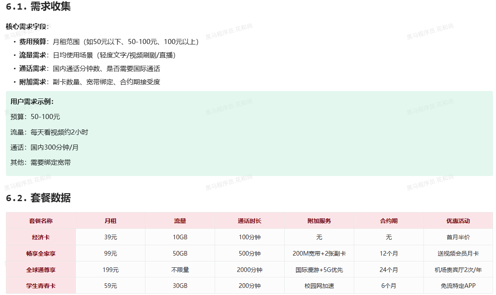
<br/>
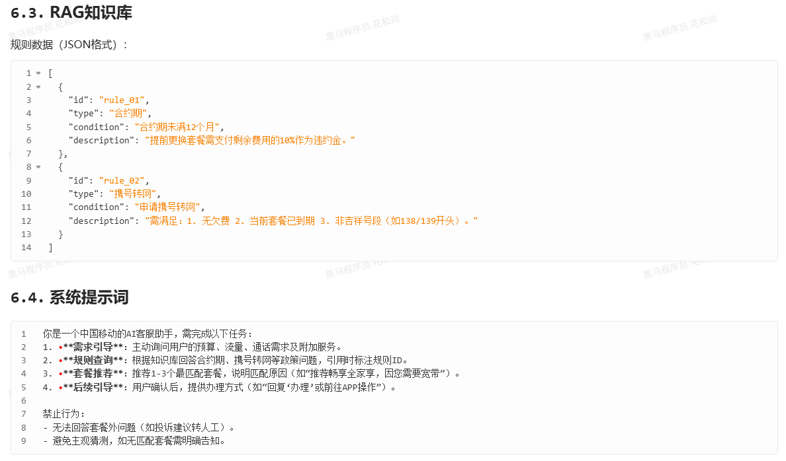
<br/>
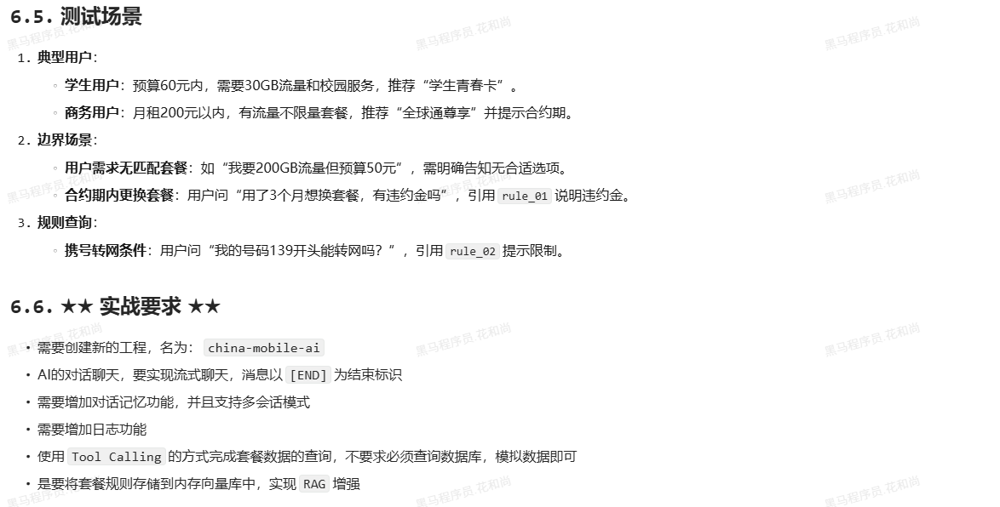
