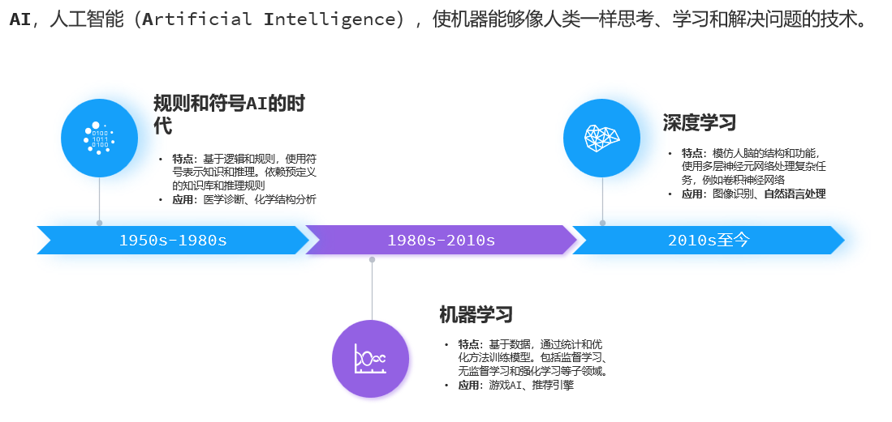
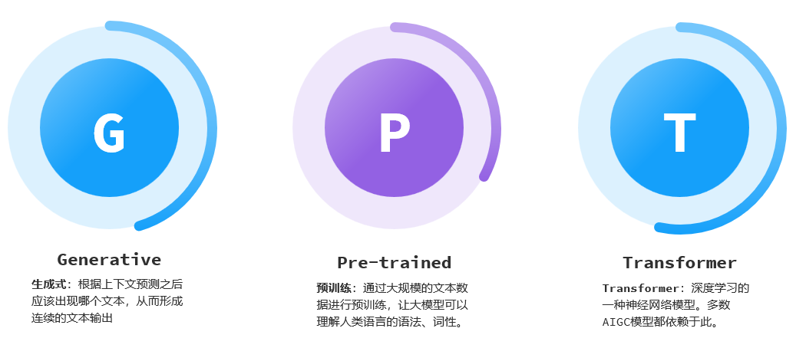
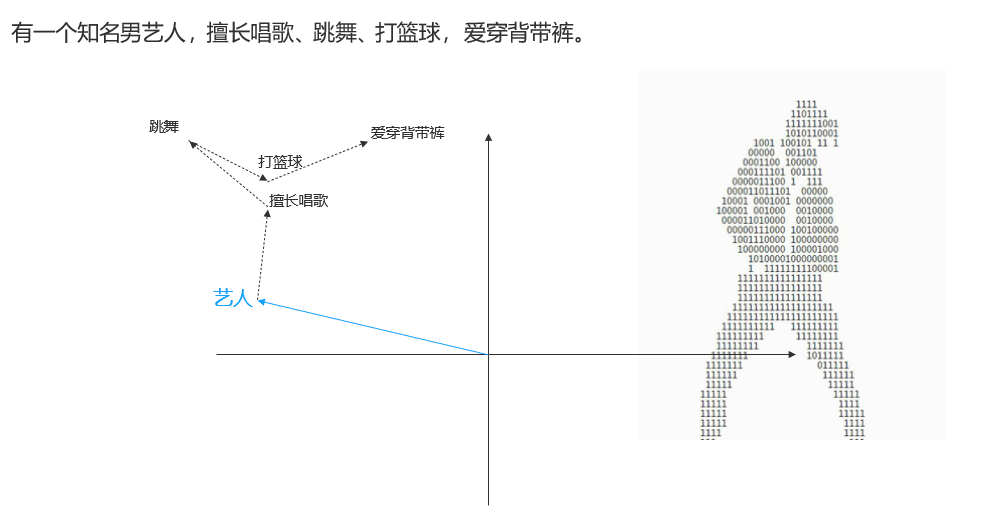
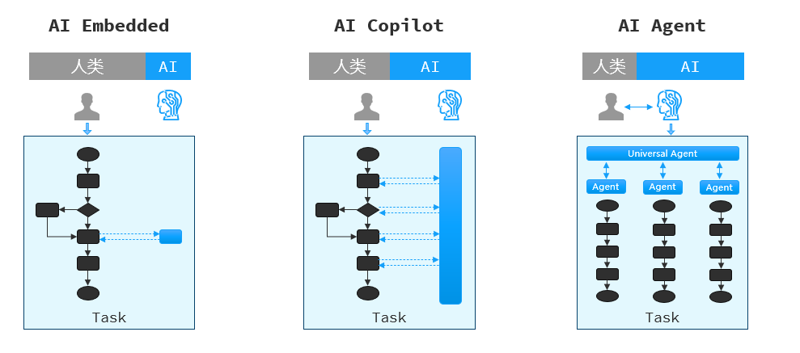
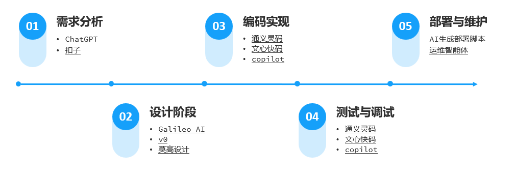
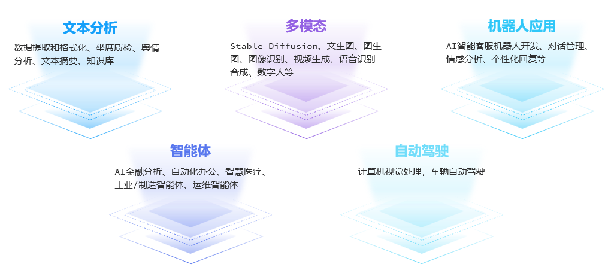
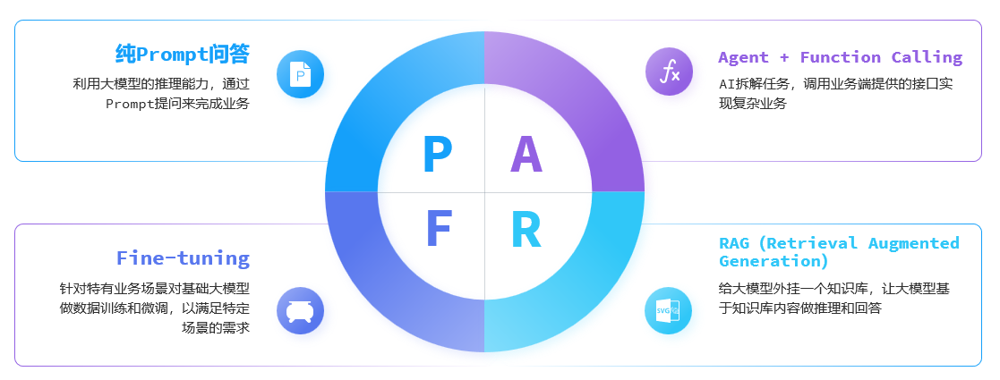
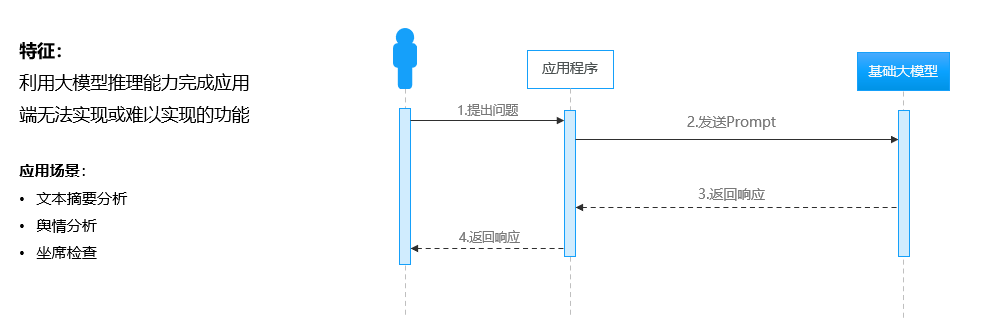
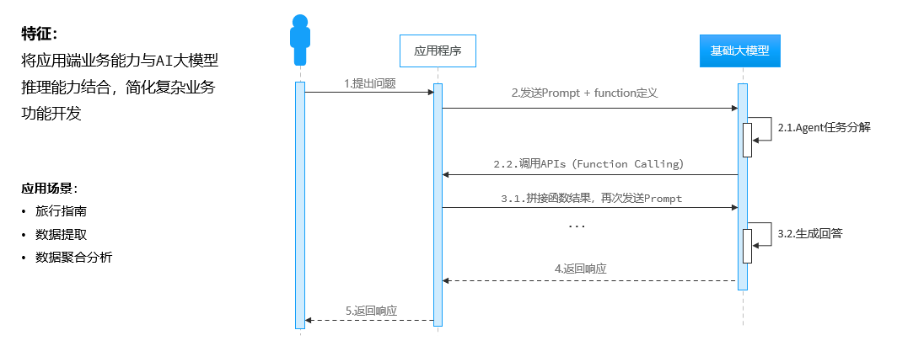
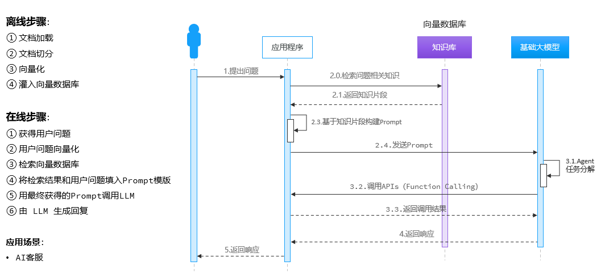

<h1 style="text-align: center;">认识 AI</h1>

---

## 核心概念扫盲

> #### 马克（视频教程）：https://www.bilibili.com/video/BV1E7wtzaEdq/
>
> #### 鱼皮（文字教程）：https://juejin.cn/post/7613234803012321314

## 什么是 AI

### 发展历程

 

### 大语言模型

 

 

## GPT 原理分析

### 基本介绍

 

> #### Transformer：（1）翻译转换（2）声音转文本（3）推理预测...

### 文本向量化

#### （1）将文本转成一组浮点数，放入一个数组，作为多维空间坐标

#### （2）通过训练调整向量坐标，使其在不同方向具备含义（GPT3 采用 12288 维空间）

 

### 注意力机制

 

> #### 通过更多的关键词，使得向量坐标更精确，可以使得回答的内容更准备
>
> #### 在上下文处理中，大模型对文本的的处理有限制，较长的文本可能会导致处理预期效果降低，同时等待回答的时间也越长，底层执行的计算量也是很大的

### GPT 的应用

 

## AI 编程开发

### 基本介绍

 

### prompt 提示词

> #### 优质提示词：https://github.com/ai-boost/awesome-prompts

 

### AI 编程助手推荐

 

### AI 应用开发

 

## AI 技术架构

### 基本介绍

 

### Prompt

### Function Calling

### RAG

