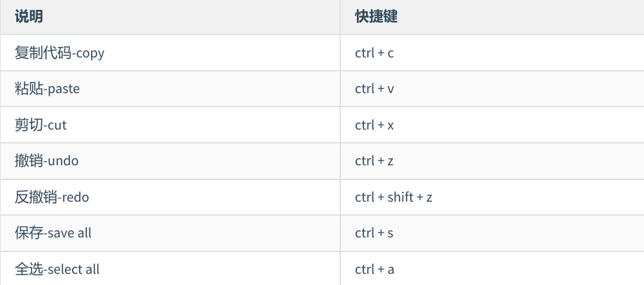
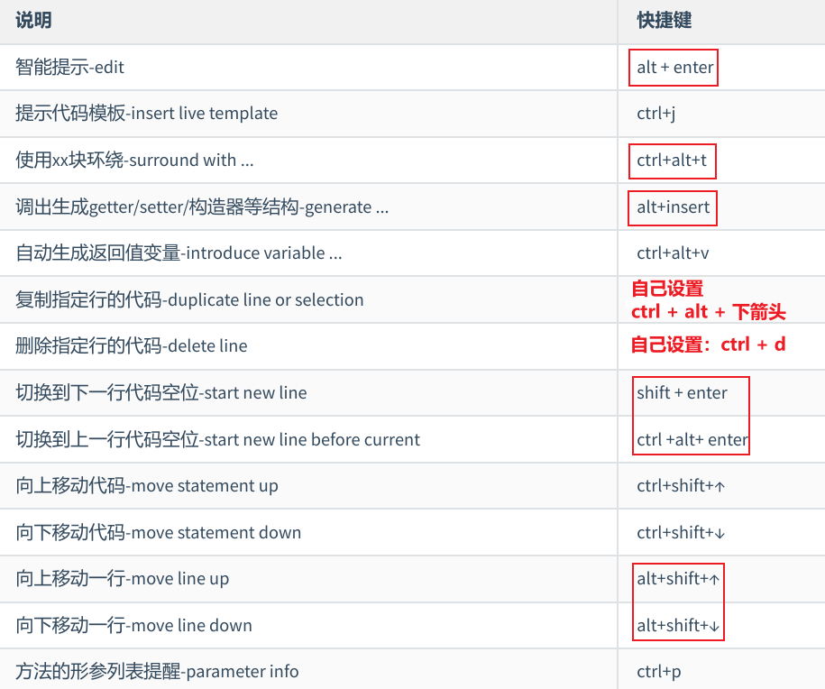
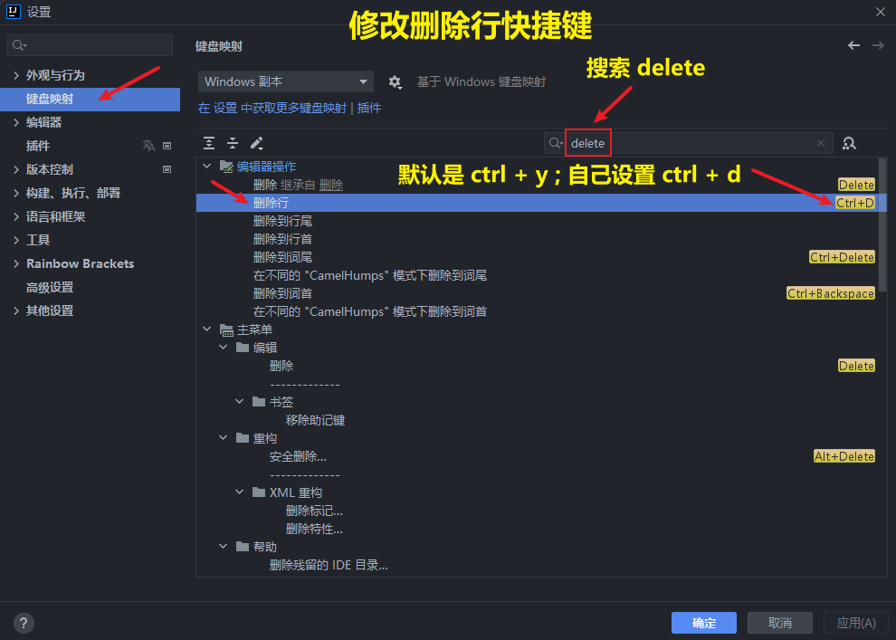
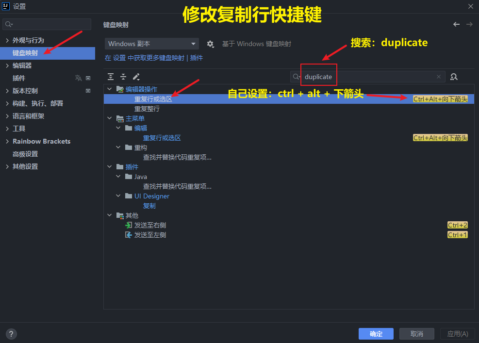
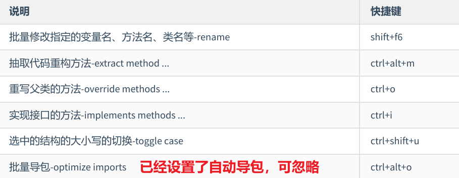
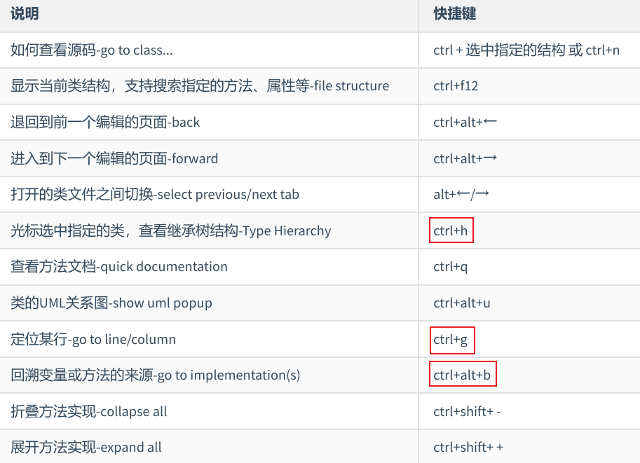
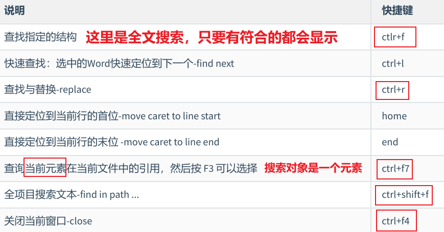
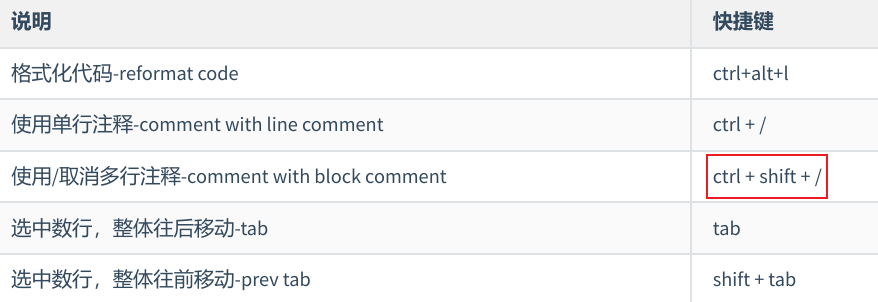
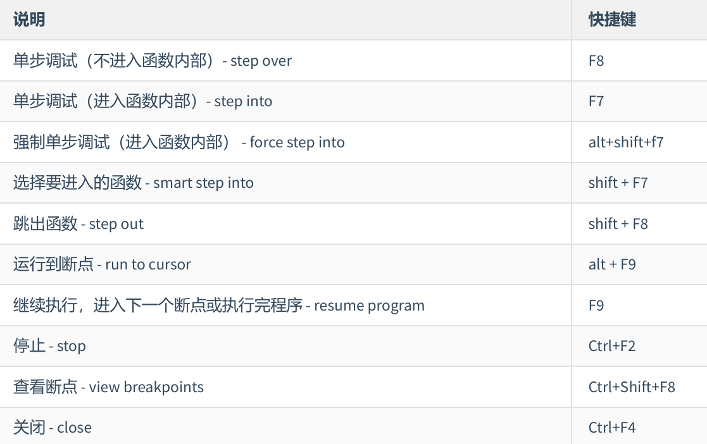
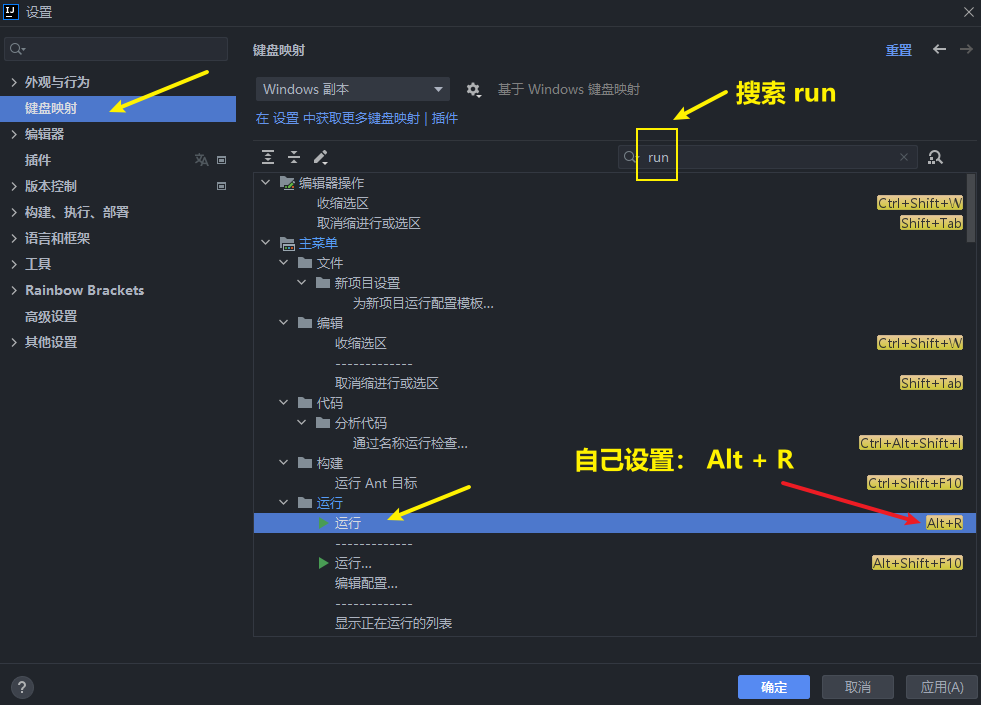

<h1 style="text-align: center; font-weight: bold;">IDEA 快捷键</h1>

---

## 1. 通用型

  

## 2. 提高编写速度（上）

  

  

 

  

## 3. 提高编写速度（下）

  

## 4. 类结构、查找和查看源码

  

## 5. 查找、替换与关闭

  

## 6. 调整格式

  

## 7. Debug 快捷键

  

## 8. 运行快捷键

  

## 9. 其他

#### （1） Del 删除键：保持光标固定的情况下删除其后面的内容

#### （2）ctrl + alt + insert：创建文件

#### （3）alt + shift + insert：切换为列选择模式，按住 shift 配合鼠标点击可以选中多列的同一位

#### （4）ctrl + shift + v：查看剪切板历史

#### （5）alt + 左右箭头：切换标签页

#### （6）ctrl + alt + [ ，] ：切换 IDEA 窗口

#### （7）ctrl + tab：切换器，快捷键呼出，按住 ctrl 选择需要的内容，释放 ctrl 执行选择

#### （8）ctrl + e：查看最近的文件

#### （9）ctrl + +，-：对当前方法进行展开与折叠

#### （10）ctrl + shift + +，-：对全局代码进行展开与折叠

#### （11）alt + 上下箭头：跳转到不同的方法处

#### （12）ctrl + alt + 左右箭头：跳转到光标上一次停留的位置，追寻源码时可以使用

#### （13）ctrl + shift + e：查看最近更改的文件

#### （14）ctrl + 左右箭头；以单词为单位跳转光标

#### （15）ctrl + [ ，]：快速跳转到大括号的首尾

#### （16）ctrl + F12：查看文件结构

#### （17）alt + 1：打开或者关闭左侧的项目窗口

#### （18）alt + F7：查看当前元素在所有文件中的引用

#### （19）ctrl + alt + v：快速生成变量类型和变量名

#### （20）alt + 8：打开服务窗口
