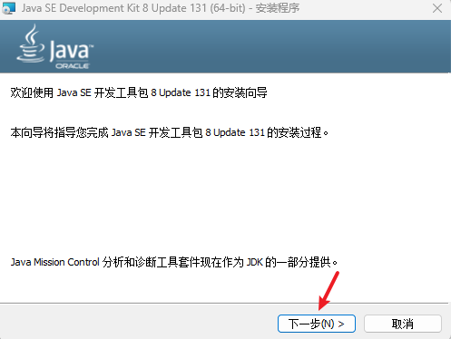
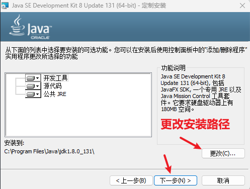
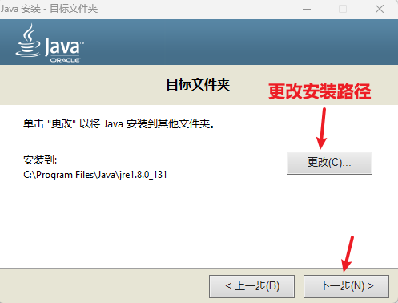
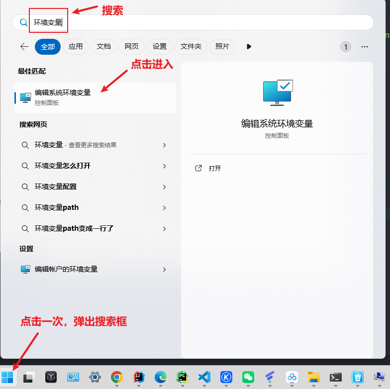
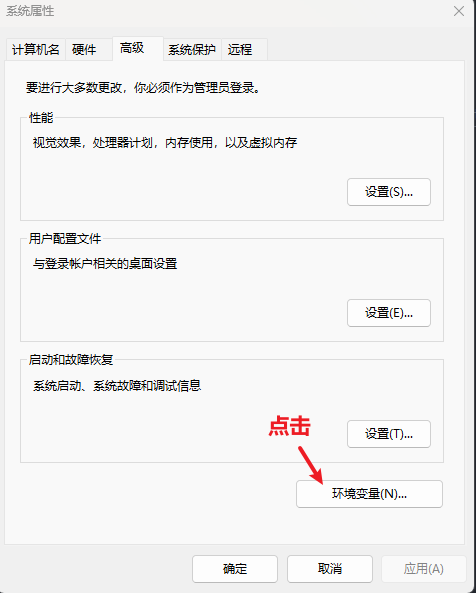
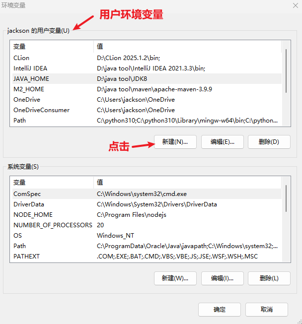
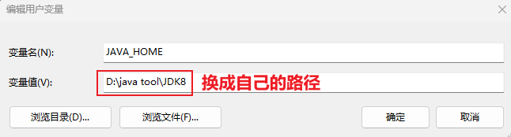
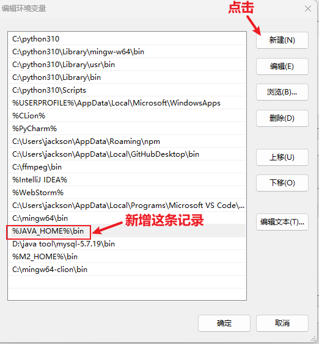
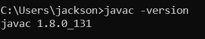

<h1 style="text-align: center;">
  JDK 8 安装配置
</h1>

---

## 1. 安装



> #### （1）安装 JDK



> #### （2）安装 JRE



## 2. JDK 配置环境变量

<h4>Win11 操作系统，可以点击开始菜单，在搜索框中搜索环境变量即可</h4>





<h2>第一步：增加 JAVA_HOME 环境变量，指向 jdk 的安装目录</h2>

```bash
JAVA_HOME
```





<h2>第二步：编辑path环境变量</h2>

```bash
%JAVA_HOME%\bin
```



## 3. 测试

<h4>win + r 打开命令行提示符窗口，输入如下指令</h4>

```bash
javac -version
```



<h2>🎉配置成功，完结散花🎉</h2>

<hr/>
