# <center>Maven 的使用</center>

---

> <h3>Maven 官网：<a href="https://maven.apache.org/" style="text-decoration:none">https://maven.apache.org/</a></h3>

## Maven 安装

### Maven 3.9.4 安装包

> #### 安装包： https://pan.baidu.com/s/1hNC1vSXbkvOGnHNJS0SqaQ?pwd=3tn6 提取码: 3tn6
>
> #### <span style="color:red">安装路径不要带有中文或者空格</span>

### 解压安装包

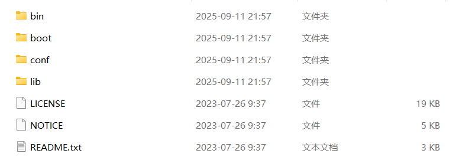

> #### （1）bin 目录 ： 存放的是<span style="color:red">可执行命令</span>。（mvn 命令重点关注）
>
> #### （2）conf 目录 ：存放 Maven 的<span style="color:red">配置文件</span>。（settings.xml 配置文件后期需要修改）
>
> #### （3）lib 目录 ：存放 Maven 依赖的 <span style="color:red">jar 包</span>。（Maven 也是使用 java 开发的，所以它也依赖其他的 jar 包）

### 配置本地仓库

#### （1）新一个目录命名为 mvn_repo_local（本地仓库，用来存储 jar 包）

#### （2）进入到 conf 目录下修改 settings.xml 配置文件

> #### 使用超级记事本软件，打开 settings.xml 文件，定位到 53 行
>
> #### 复制&lt;localRepository&gt;标签，粘贴到注释的外面（55 行）
>
> #### 复制之前新建的用来存储 jar 包的路径，替换掉&lt;localRepository&gt;标签体内容

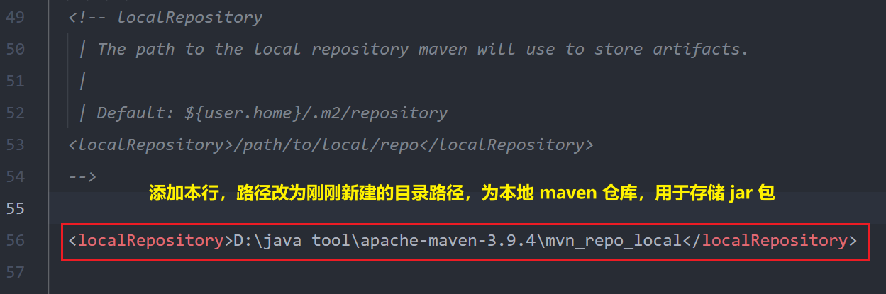

### 配置阿里云私服

> #### 由于中央仓库在国外，所以下载 jar 包速度可能比较慢，而阿里公司提供了一个远程仓库，里面基本也都有开源项目的 jar 包

#### 进入到 conf 目录下修改 settings.xml 配置文件

> #### （1）使用超级记事本软件，打开 settings.xml 文件，定位到 160 行左右
>
> #### （2）在&lt;mirrors&gt;标签下为其添加子标签&lt;mirror&gt;，内容如下

```xml
<mirror>
    <id>alimaven</id>
    <name>aliyun maven</name>
    <url>http://maven.aliyun.com/nexus/content/groups/public/</url>
    <mirrorOf>central</mirrorOf>
</mirror>
```

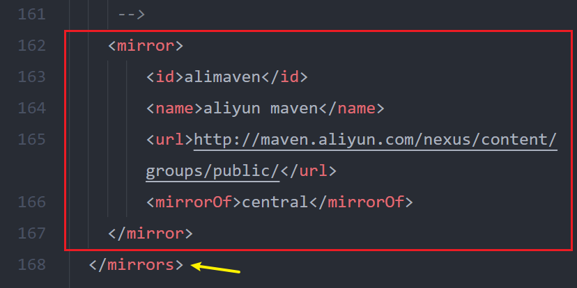

### 配置环境变量

#### （1）在系统变量处新建一个变量 MAVEN_HOME。 MAVEN_HOME 环境变量的值，设置为 maven 的解压安装目录 ​

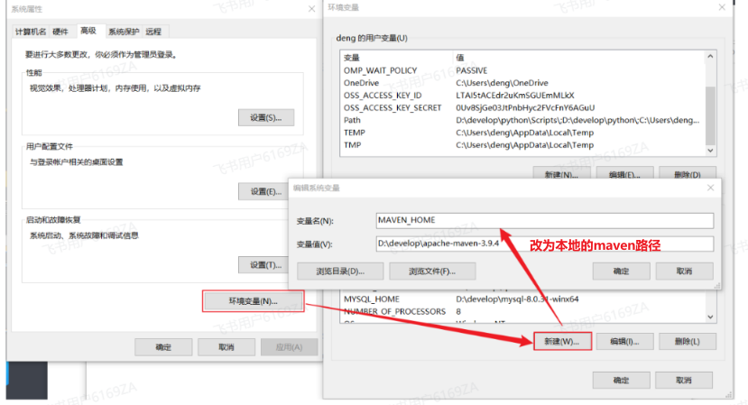
​

#### （2） 在 Path 中进行配置。 PATH 环境变量的值，设置为：%MAVEN_HOME%\bin​

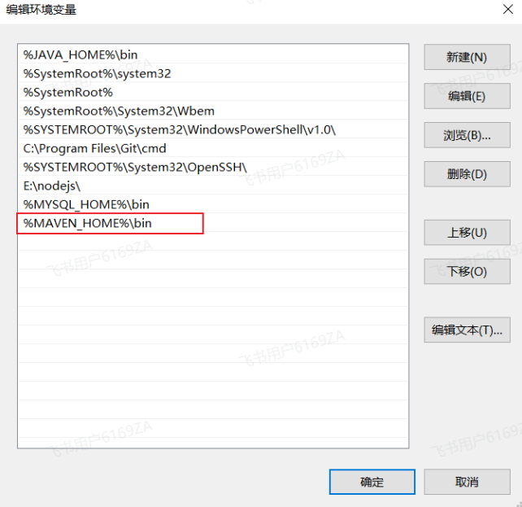
​

#### （3）cmd 测试

> #### 输入指令： <span style="color:red">mvn - v</span>

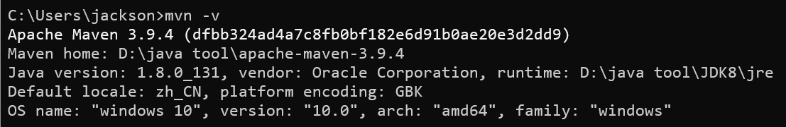

### 关联 JDK 版本（可选）

> #### 进入到 conf 目录下修改 settings.xml 配置文件，在 &lt;profiles&gt; &lt;/profiles&gt;中增加如下配置（以 JDK17 版本举例）

```xml
<profile>
        <id>jdk-17</id>
        <activation>
                <activeByDefault>true</activeByDefault>
                <jdk>17</jdk>
        </activation>
        <properties>
                <maven.compiler.source>17</maven.compiler.source>
                <maven.compiler.target>17</maven.compiler.target>
                <maven.compiler.compilerVersion>17</maven.compiler.compilerVersion>
        </properties>
</profile>
```

### 解决 Maven 面板报红

<br/>
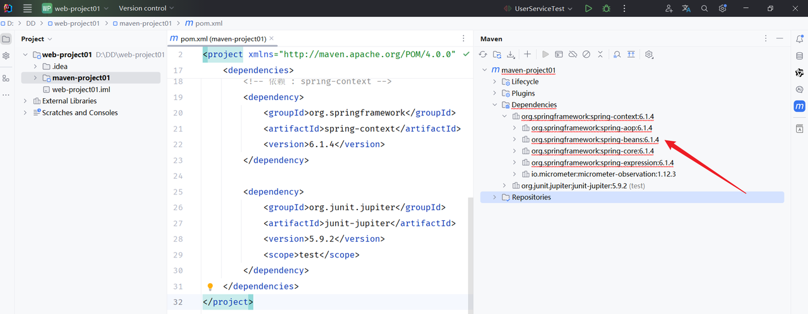

> #### 问题现象：Maven 项目中添加的依赖，未正确下载，造成右侧 Maven 面板中的依赖报红，再次 reload 重新加载也不会再下载
>
> #### 产生原因：由于网络原因，依赖没有下载完整导致的，在 maven 仓库中生成了 <span style="color:red">xxx.lastUpdated 文件</span>，该文件不删除，不会再重新下载

<br/>
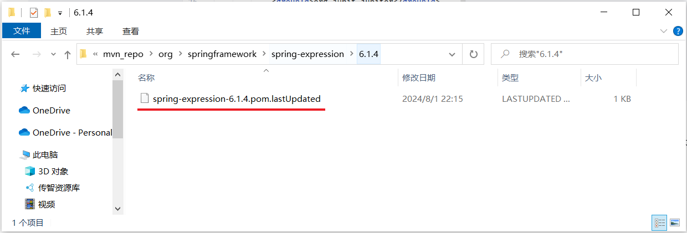

#### 解决方案

> #### （1）根据 maven 依赖的坐标，找到仓库中对应的 xxx.lastUpdated 文件，删除，删除之后重新加载项目即可
>
> #### （2）通过命令 (<span style="color:red">del /s \*.lastUpdated</span>) 批量递归删除指定目录下的 xxx.lastUpdated 文件，删除之后重新加载项目即可
>
> #### （3）重新加载依赖，依赖下载了之后，maven 面板可能还会报红，此时可以关闭 IDEA，重新打开 IDEA 加载此项目即可

## Maven 作用

> #### Maven 是一款用于管理和构建 Java 项目的工具，是 Apache 旗下的一个开源项目

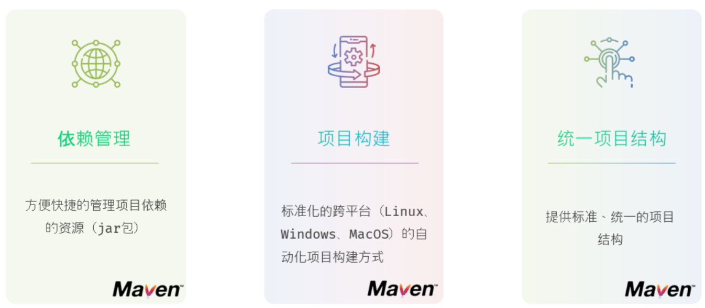

### 依赖管理

> #### 方便快捷的管理项目依赖的资源(jar 包)，避免版本冲突问题

#### （1）使用 maven 前

> #### 我们项目中要想使用某一个 jar 包，就需要把这个 jar 包从官方网站下载下来，然后再导入到项目中。然后在这个项目中，就可以使用这个 jar 包了

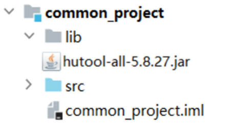

#### （2）使用 maven 后

> #### 当使用 maven 进行项目依赖(jar 包)管理，则很方便的可以解决这个问题。 我们只需要在 maven 项目的 pom.xml 文件中，添加一段如下图所示的配置即可实现

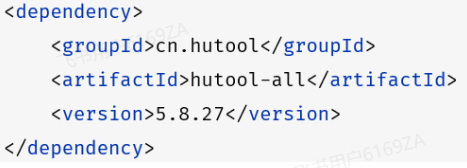

#### （3）小结

> #### 在 maven 项目的配置文件中，加入上面这么一段配置信息之后，maven 会自动的根据配置信息的描述，去下载对应的依赖。 然后在项目中，就可以直接使用了

### 项目构建

> #### Maven 还提供了标准化的跨平台的自动化构建方式


> #### 如上图所示我们开发了一套系统，代码需要进行编译、测试、打包、发布等过程，这些操作是所有项目中都需要做的，如果需要反复进行就显得特别麻烦，而 Maven 提供了一套简单的命令来完成项目构建

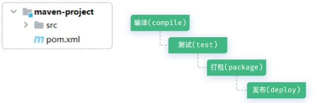

> #### 通过 Maven 中的命令，就可以很方便的完成项目的编译(compile)、测试(test)、打包(package)、发布(deploy) 等操作
>
> #### 而且这些操作都是跨平台的，也就是说无论你是 Windows 系统，还是 Linux 系统，还是 Mac 系统，这些命令都是支持的

### 统一项目结构

> #### Maven 还提供了标准、统一的项目结构

#### （1）未使用 Maven

> #### 由于 java 的开发工具呢，有很多，除了大家熟悉的 IDEA 以外，还有像早期的 Eclipse、MyEclipse。而不同的开发工具，创建出来的 java 项目的目录结构是存在差异的，那这就会出现一个问题
>
> #### Eclipse 创建的 java 项目，并不能直接导入 IDEA 中。 IDEA 创建的 java 项目，也没有办法直接导入到 Eclipse 中

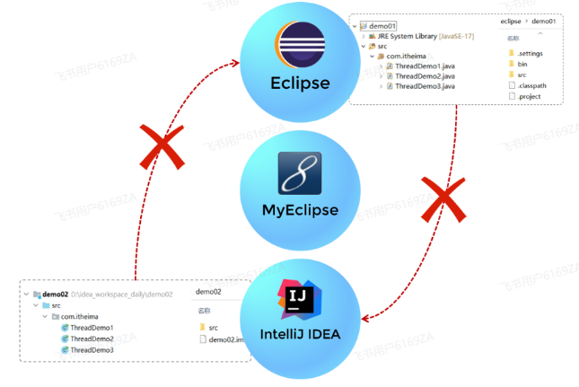

#### （2）使用 Maven

> #### 而如果我们使用了 Maven 这一款项目构建工具，它给我们提供了一套标准的 java 项目目录。如下所示

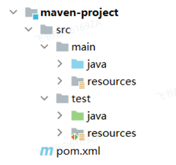

> #### 也就意味着，无论我们使用的是什么开发工具，只要是基于 maven 构建的 java 项目，最终的目录结构都是相同的，如图所示。 那这样呢，我们使用 Eclipse、MyEclipse、IDEA 创建的 maven 项目，就可以在各个开发工具直接直接导入使用了，更加方便、快捷

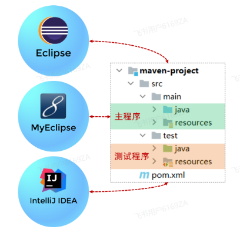

> #### 而在上面的 maven 项目的目录结构中，main 目录下存放的是项目的源代码，test 目录下存放的是项目的测试代码。 而无论是在 main 还是在 test 下，都有两个目录，一个是 java，用来存放源代码文件；另一个是 <span style="color:red">resources</span>，用来存放<span style="color:red">配置文件</span>

## Maven 介绍

### 基本介绍

> #### Apache Maven 是一个项目管理和构建工具，它基于项目对象模型(Project Object Model , 简称: POM)的概念，通过一小段描述信息来管理项目的构建、报告和文档

#### Maven 作用

> #### （1）方便的依赖管理
>
> #### （2）统一的项目结构
>
> #### （3）标准的项目构建流程

### Maven 模型

> #### （1）项目对象模型 (Project Object Model)
>
> #### （2）依赖管理模型(Dependency)
>
> #### （3）构建生命周期/阶段(Build lifecycle & phases)

#### （1）项目对象模型 (Project Object Model)

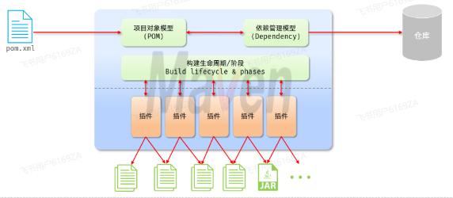

> #### 以上图中紫色框起来的部分，就是用来完成标准化构建流程 。当我们需要编译，Maven 提供了一个编译插件供我们使用；当我们需要打包，Maven 就提供了一个打包插件供我们使用等

#### （2）依赖管理模型(Dependency)

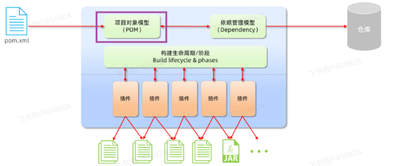

> #### 以上图中紫色框起来的部分属于项目对象模型，就是将我们自己的项目抽象成一个对象模型，有自己专属的坐标，如下图所示是一个 Maven 项目：

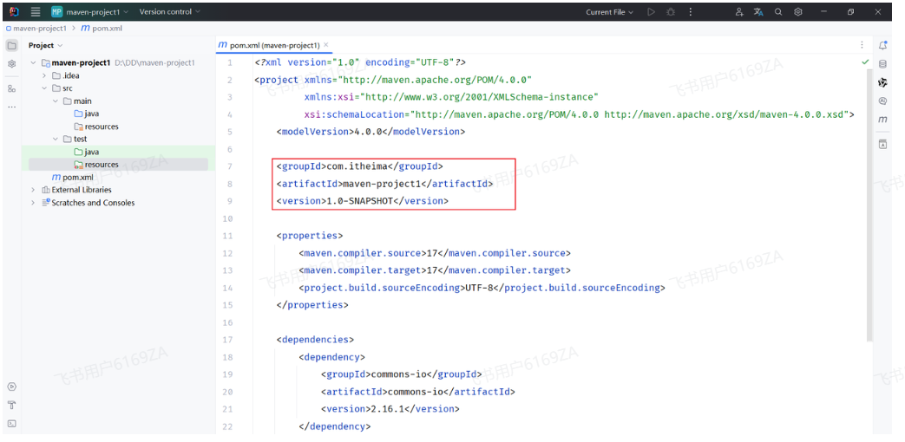

> #### 坐标，就是资源(jar 包)的唯一标识，通过坐标可以定位到所需资源(jar 包)位置
>
> #### 坐标的组成部分：
>
> #### （1）groupId: 组织名
>
> #### （2）arfitactId: 模块名
>
> #### （3）Version: 版本号

#### （3）构建生命周期/阶段(Build lifecycle & phases)

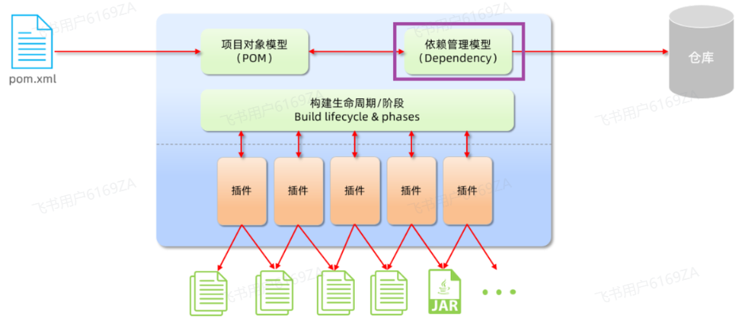

> #### 以上图中紫色框起来的部分属于依赖管理模型，是使用坐标来描述当前项目依赖哪些第三方 jar 包

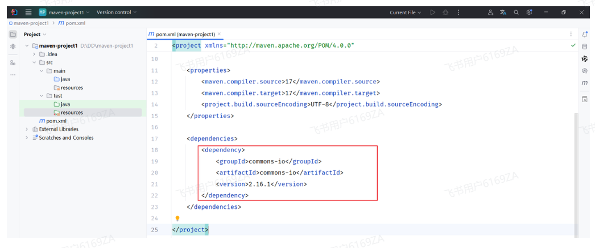

> #### 之前我们项目中需要 jar 包时，直接就把 jar 包复制到项目下的 lib 目录，而现在我们只需要在 pom.xml 中配置依赖的配置文件即可。 而这个依赖对应的 jar 包其实就在我们本地电脑上的 maven 仓库中
>
> #### 如下图，就是老师本地的 maven 仓库中的 jar 文件：

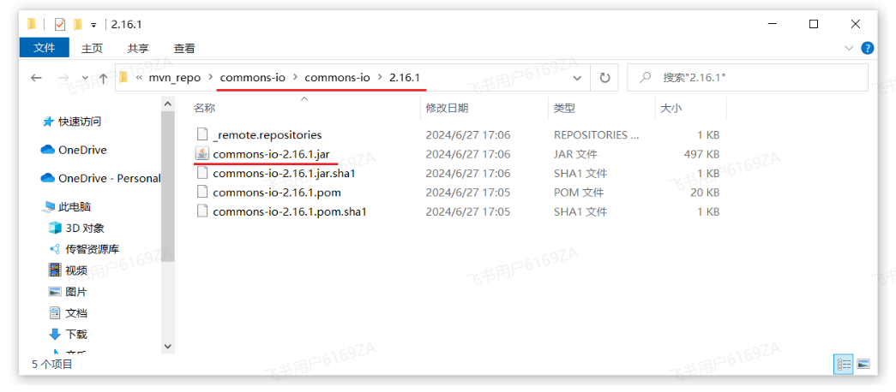

### Maven 仓库

> #### （1）本地仓库：自己计算机上的一个目录(用来存储 jar 包)
>
> #### （2）中央仓库：由 Maven 团队维护的全球唯一的。仓库地址：https://repo1.maven.org/maven2/
>
> #### （3）远程仓库(私服)：一般由公司团队搭建的私有仓库

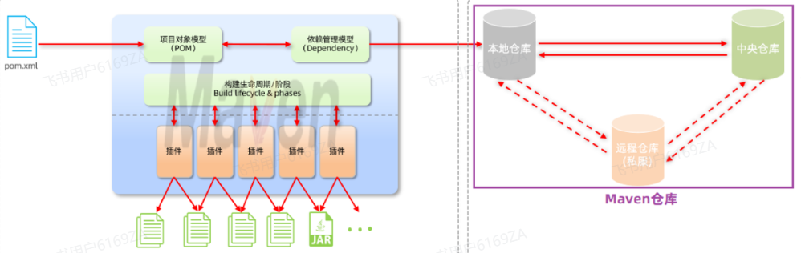

> #### 当项目中使用坐标引入对应依赖 jar 包后，
>
> - <h4>首先会查找本地仓库中是否有对应的 jar 包</h4>
>
> #### （1）如果有，则在项目直接引用
>
> #### （2）如果没有，则去中央仓库中下载对应的 jar 包到本地仓库
>
> - <h4> 如果还可以搭建远程仓库(私服)，将来 jar 包的查找顺序则变为： 本地仓库 --> 远程仓库--> 中央仓库</h4>

## IDEA 集成 Maven

### <span style="color:red">全局</span>配置

> #### ⚠️ 注意点：需要<span style="color:red">关闭项目</span>，到创建项目界面中找到设置，完成相关配置

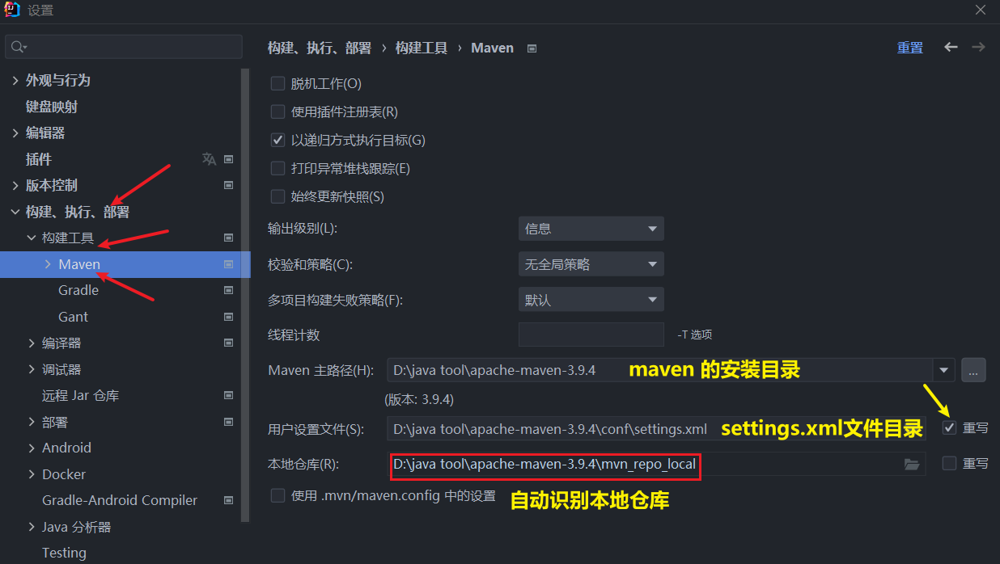

### 配置编译版本

<br/>
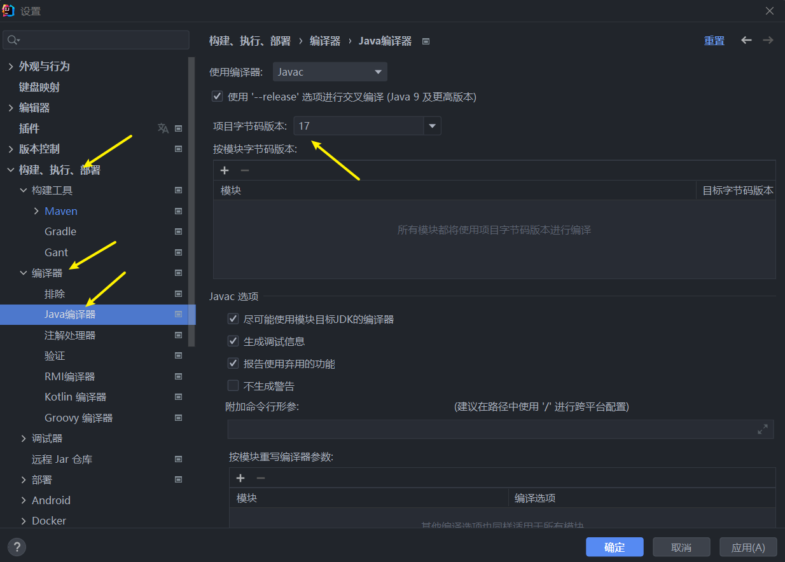

### 创建 Maven 项目

#### （1）创建一个空项目

<br/>
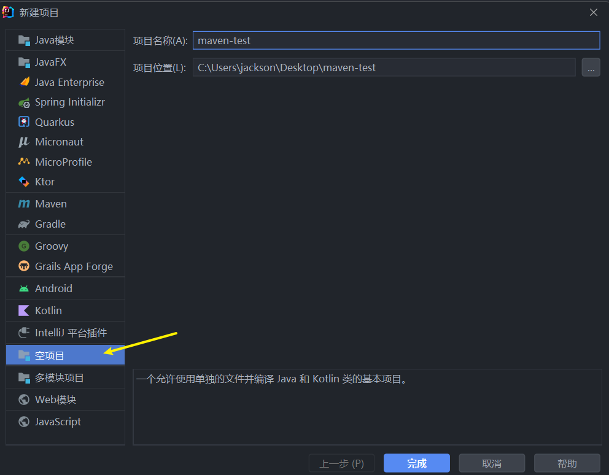

#### （2）配置 JDK 版本

<br/>
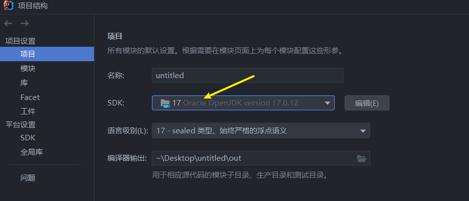

#### （3）创建模块

<br/>
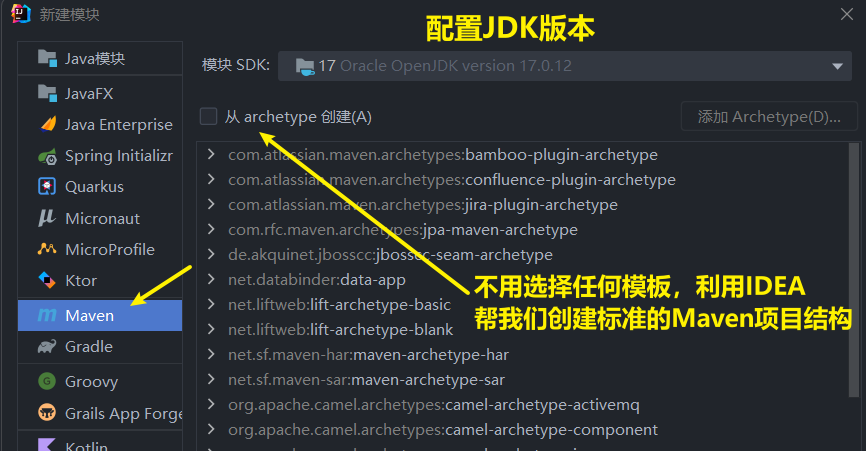

<br/>
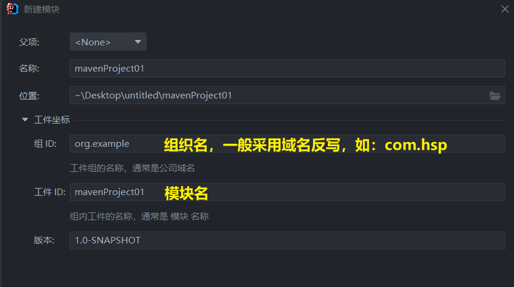

### 项目结构

<br/>
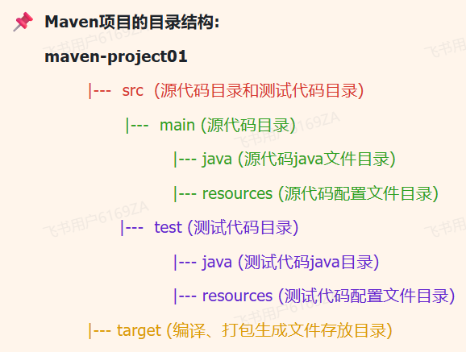

### pom 文件解读

> #### POM (Project Object Model) ：指的是项目对象模型，用来描述当前的 maven 项目

```xml
<?xml version="1.0" encoding="UTF-8"?>
<project xmlns="http://maven.apache.org/POM/4.0.0"
         xmlns:xsi="http://www.w3.org/2001/XMLSchema-instance"
         xsi:schemaLocation="http://maven.apache.org/POM/4.0.0 http://maven.apache.org/xsd/maven-4.0.0.xsd">

    <!--POM模型版本-->
    <modelVersion>4.0.0</modelVersion>

    <!--当前项目坐标-->
    <groupId>org.example</groupId>
    <artifactId>mavenProject01</artifactId>
    <version>1.0-SNAPSHOT</version>

    <!--项目的JDK版本及编码-->
    <properties>
        <maven.compiler.source>17</maven.compiler.source>
        <maven.compiler.target>17</maven.compiler.target>
    </properties>

</project>
```

> #### &lt;project&gt; ：pom 文件的根标签，表示当前 maven 项目
>
> #### &lt;modelVersion&gt;：声明项目描述遵循哪一个 POM 模型版本
>
> - <h4>虽然模型本身的版本很少改变，但它仍然是必不可少的。目前 POM 模型版本是 4.0.0</h4>
>
> #### 坐标
>
> - <h4> &lt;groupId&gt; &lt;artifactId&gt; &lt;version&gt;</h4>
>
> - <h4> 定位项目在本地仓库中的位置，由以上三个标签组成一个坐标</h4>
>
> #### &lt;maven.compiler.source&gt; ：<span style="color:red">编译</span> JDK 的版本
>
> #### &lt;maven.compiler.target&gt; ：<span style="color:red">运行</span> JDK 的版本
>
> #### &lt;project.build.sourceEncoding&gt; : 设置项目的字符集

### Maven 坐标

> #### （1）Maven 中的坐标是资源的<span style="color:red">唯一标识</span> , 通过该坐标可以唯一定位资源位置
>
> #### （2）使用坐标来定义项目或引入项目中需要的<span style="color:red">依赖</span>

#### Maven 坐标主要组成

#### （1）groupId：定义当前 Maven 项目隶属<span style="color:red">组织名称</span>（通常是<span style="color:red">域名反写</span>，例如：com.itheima）

#### （2）artifactId：定义当前 Maven <span style="color:red">项目名称</span>（通常是<span style="color:red">模块名称</span>，例如 order-service、goods-service）

#### （3）version：定义当前<span style="color:red">项目版本号</span>

> #### SNAPSHOT: 功能不稳定、尚处于<span style="color:red">开发中</span>的版本，即<span style="color:red">快照版本</span>
>
> #### RELEASE: 功能趋于稳定、当前更新停止，<span style="color:red">可以用于发行的版本</span>

#### 注意点

> #### （1）上面所说的资源可以是插件、依赖、当前项目
>
> #### （2） 我们的项目如果被其他的项目依赖时，也是需要坐标来引入的

### 导入 Maven 项目

#### （1）方式一

> #### File -> Project Structure -> Modules -> Import Module -> 选择 maven 项目的 pom.xml。

#### （2）方式二

> #### Maven 面板 -> +（Add Maven Projects） -> 选择 maven 项目的 pom.xml

## Maven 依赖

### 依赖配置

> #### 依赖：指当前项目运行所需要的 jar 包，一个项目中可以引入多个依赖

#### 配置步骤

> #### （1）在 pom.xml 中编写&lt;dependencies&gt;标签
>
> #### （2）在&lt;dependencies&gt;标签中使用&lt;dependency&gt;引入坐标
>
> #### （3）定义坐标的 groupId、artifactId、version
>
> #### （4）刷新依赖：保证每一次引入新的依赖，或者修改现有的依赖配置，都可以加入最新的坐标

#### 举例：需要 spring-context 依赖

```xml
<dependencies>
    <!-- 依赖 : spring-context -->
    <dependency>
        <groupId>org.springframework</groupId>
        <artifactId>spring-context</artifactId>
        <version>6.1.4</version>
    </dependency>
</dependencies>
```

### 依赖查找

> #### （1）方法一：利用中央仓库搜索的依赖坐标，以常见的 logback-classic 为例，网址：https://mvnrepository.com/
>
> #### （2）方法二：IDEA 搜索，快捷键（<span style="color:red">alt + insert</span>）

<br/>
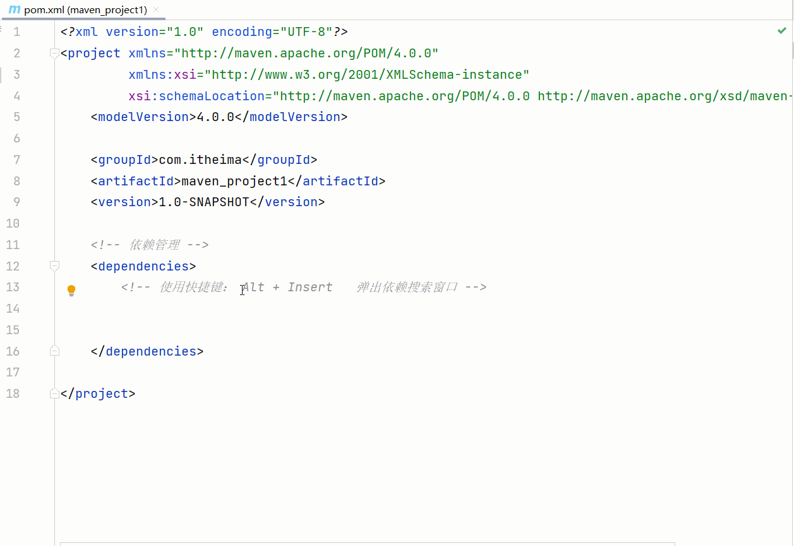

### 依赖传递

> #### 我们上面在 pom.xml 中配置了一项依赖，就是 spring-context，但是我们通过右侧的 maven 面板可以看到，其实引入进来的依赖，并不是这一项，有非常多的依赖，都引入进来了。我们可以看到如下图所示

<br/>
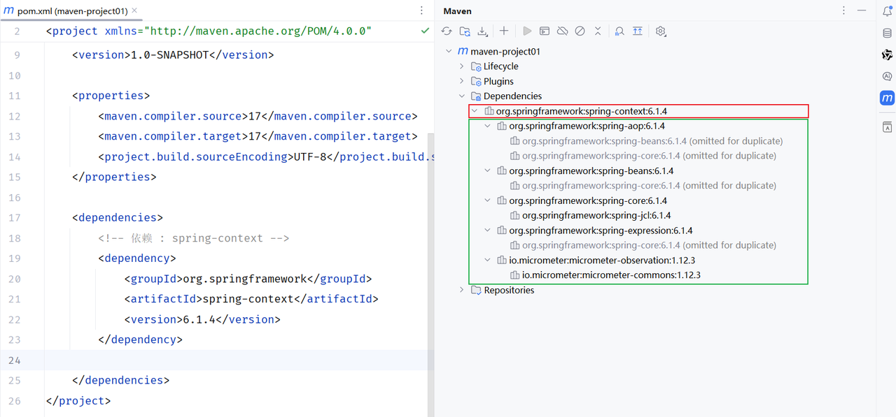

> #### 为什么会出现这样的现象呢? 那这里呢，就涉及到 maven 中非常重要的一个特性，那就是 Maven 中的依赖传递
>
> #### 所谓 maven 的依赖传递，指的就是如果在 maven 项目中，A 依赖了 B，B 依赖了 C，C 依赖了 D，那么在 A 项目中，也会有 C、D 依赖，因为依赖会传递
>
> #### 那如果，传递下来的依赖，在项目开发中，我们确实不需要，此时，我们可以通过 Maven 中的排除依赖功能，来将这个依赖排除掉

### 排除依赖

> #### 指主动断开依赖的资源，被排除的资源<span style="color:red">无需指定版本</span>

```xml
<dependency>
    <groupId>org.springframework</groupId>
    <artifactId>spring-context</artifactId>
    <version>6.1.4</version>

    <!--排除依赖, 主动断开依赖的资源-->
    <exclusions>
        <exclusion>
            <groupId>io.micrometer</groupId>
            <artifactId>micrometer-observation</artifactId>
        </exclusion>
    </exclusions>
</dependency>
```

#### 依赖排除案例

> #### （1）默认通过 maven 的依赖传递，传递下来了 micrometer-observation 的依赖

<br/>
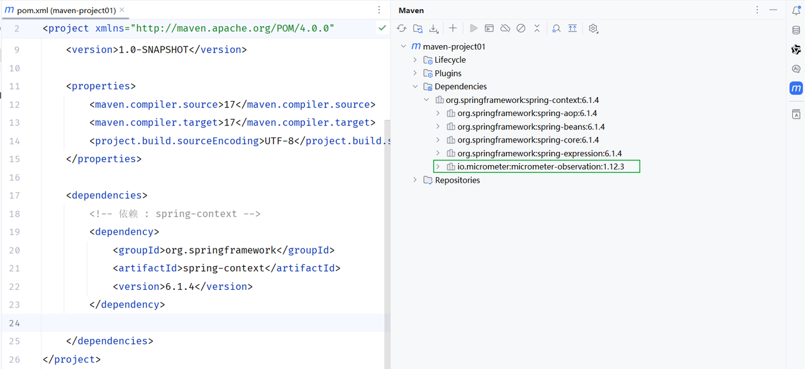

> #### （2）加入排除依赖的配置之后，该依赖就被排除掉了

<br/>
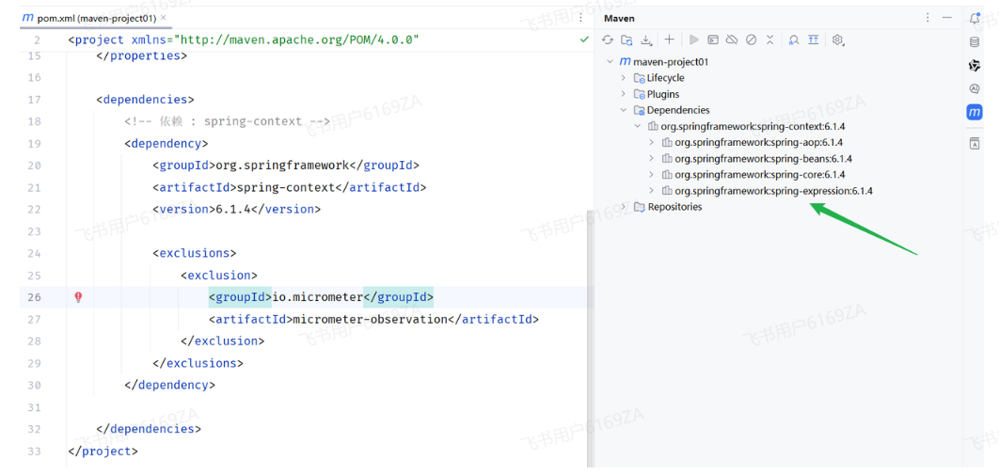

## Maven 生命周期

### 基本介绍

> #### Maven 的生命周期就是为了对所有的构建过程进行抽象和统一。 描述了一次项目构建，经历哪些阶段
>
> #### 在 Maven 出现之前，项目构建的生命周期就已经存在，软件开发人员每天都在对项目进行清理，编译，测试及部署。虽然大家都在不停地做构建工作，但公司和公司间、项目和项目间，往往使用不同的方式做类似的工作
>
> #### Maven 从大量项目和构建工具中学习和反思，然后总结了一套高度完美的，易扩展的项目构建生命周期。这个生命周期包含了项目的清理，初始化，编译，测试，打包，集成测试，验证，部署和站点生成等几乎所有构建步骤

<br/>
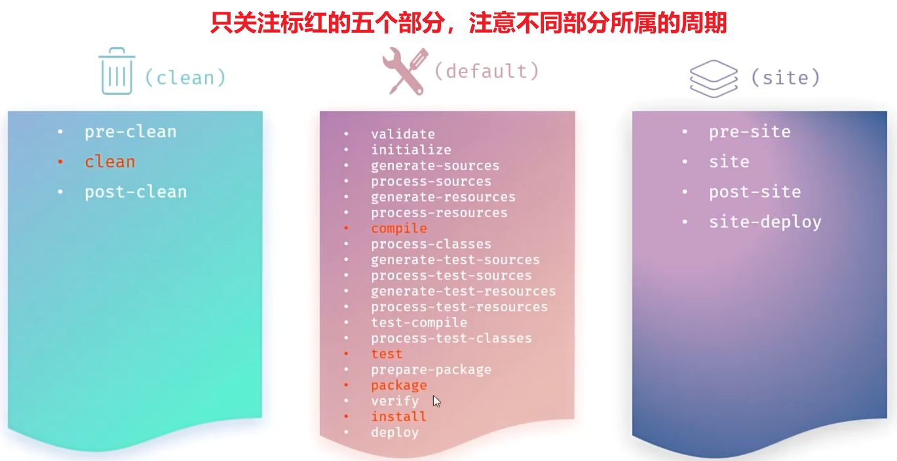

#### 每套生命周期包含一些阶段（phase），阶段是有顺序的，后面的阶段依赖于前面的阶段

#### 我们看到这三套生命周期，里面有很多很多的阶段，这么多生命周期阶段，其实我们常用的并不多，主要关注以下几个

> #### clean：移除上一次构建生成的文件
>
> #### compile：编译项目源代码
>
> #### test：使用合适的<span style="color:red">单元测试</span>框架运行测试（junit）
>
> #### package：将编译后的文件打包，如：jar、war 等
>
> #### install：安装项目到<span style="color:red">本地仓库</span>

### 执行

> #### Maven 的生命周期是抽象的，这意味着生命周期本身不做任何实际工作。在 Maven 的设计中，实际任务（如源代码编译）都交由<span style="color:red">插件</span>来完成
>
> #### <span style="color:red">在同一套生命周期中，我们在执行后面的生命周期时，前面的生命周期都会执行</span>

<br/>
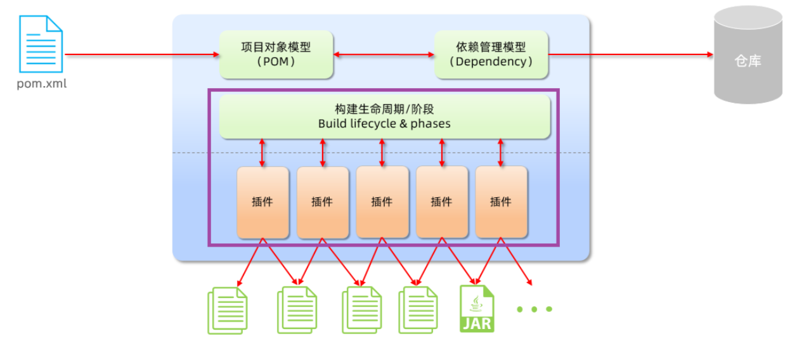

> #### ⚠️ 提示：IDEA 的 Maven 控制面板中，提供了快速运行 Maven 命令的功能

<br/>
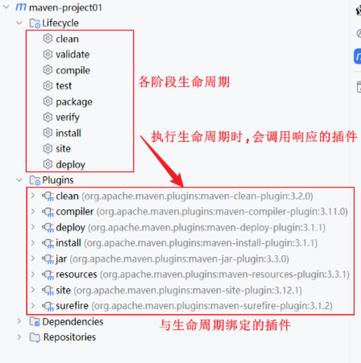

### 命令行操作

#### 操作步骤

> #### （1）打开 Maven 项目对应的磁盘目录
>
> #### （2）在该目录下打开 cmd 窗口，执行相关命令

#### 相关命令

> #### （1）mvn compile
>
> #### （2）mvn test
>
> #### （3）mvn package
>
> #### （4）mvn install

<br/>
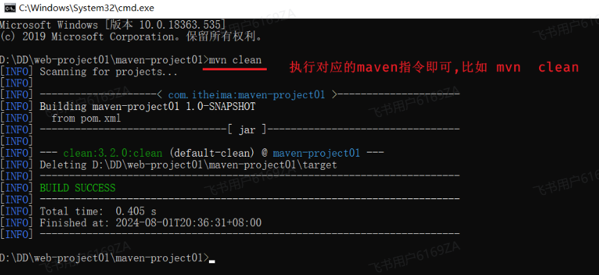

## 分模块开发与设计

### 基本介绍

> #### 所谓分模块设计，顾名思义指的就是我们在设计一个 Java 项目的时候，将一个 Java 项目拆分成多个模块进行开发

#### （1）未分模块设计的问题

<br/>
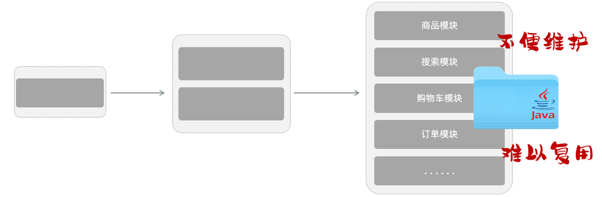

#### 如果项目不分模块，也就意味着所有的业务代码是不是都写在这一个 Java 项目当中。随着这个项目的业务扩张，项目当中的业务功能可能会越来越多

#### 假如我们开发的是一个大型的电商项目，里面可能就包括了商品模块的功能、搜索模块的功能、购物车模块、订单模块、用户中心等等。这些所有的业务代码我们都在一个 Java 项目当中编写

#### 此时大家可以试想一下，假如我们开发的是一个大型的电商网站，这个项目组至少几十号甚至几百号开发人员，这些开发人员全部操作这一个 Java 项目。此时大家就会发现我们项目管理和维护起来将会非常的困难。而且大家再来看，假如在我们的项目当中，我们自己定义了一些通用的工具类以及通用的组件，而公司还有其他的项目组，其他项目组也想使用我们所封装的这些组件和工具类，其实是非常不方便的。因为 Java 项目当中包含了当前项目的所有业务代码，所以就造成了这里面所封装的一些组件会难以复用

> #### ⭐ 总结起来，主要两点问题：不方便项目的维护和管理、项目中的通用组件难以复用

#### （2）分模块设计

> #### 分模块设计我们在进行项目设计阶段，就可以将一个大的项目拆分成若干个模块，每一个模块都是独立的

<br/>
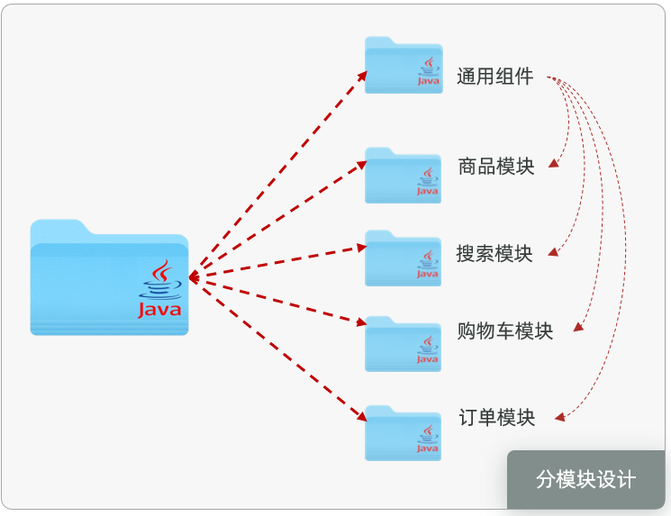

#### 比如我们可以将商品的相关功能放在商品模块当中，搜索的相关业务功能我都封装在搜索模块当中，还有像购物车模块、订单模块。而为了组件的复用，我们也可以将项目当中的实体类、工具类以及我们定义的通用的组件都单独的抽取到一个模块当中

#### 如果当前这个模块，比如订单模块需要用到这些实体类以及工具类或者这些通用组件，此时直接在订单模块当中引入工具类的坐标就可以了。这样我们就将一个项目拆分成了若干个模块儿，这就是分模块儿设计

#### 分模块儿设计之后，大家再来看。我们在进行项目管理的时候，我就可以几个人一组，几个人来负责订单模块儿，另外几个人来负责购物车模块儿，这样更加便于项目的管理以及项目的后期维护

#### 而且分模块设计之后，如果我们需要用到另外一个模块的功能，我们直接依赖模块就可以了。比如商品模块、搜索模块、购物车订单模块都需要依赖于通用组件当中封装的一些工具类，我只需要引入通用组件的坐标就可以了

> #### ⭐ 总结：分模块设计就是将项目按照功能/结构拆分成若干个子模块，方便项目的管理维护、拓展，也方便模块键的相互调用、资源共享

### 拆分策略

#### （1）策略一：按照功能模块拆分，比如：公共组件、商品模块、搜索模块、购物车模块、订单模块等

#### （2）策略二：按层拆分，比如：公共组件、实体类、控制层、业务层、数据访问层

#### （3）策略三：按照功能模块 + 层拆分

<br/>
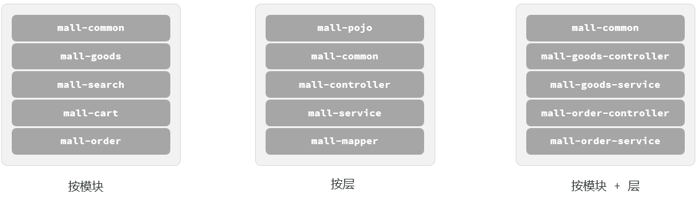

### ⚠️ 注意事项

> #### 分模块开发需要<span style="color:red">先针对模块功能进行设计，再进行编码</span>，不会先将工程开发完毕，然后进行拆分

## Maven 继承

### 问题引入

> #### 在案例项目分模块开发之后啊，我们会看到 tlias-pojo、tlias-utils、tlias-web-management 中都引入了一个依赖 lombok 的依赖。我们在三个模块中分别配置了一次

<br/>
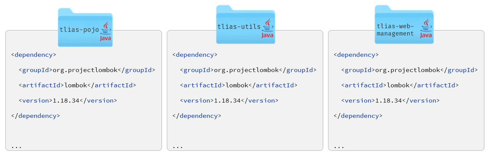

> #### 如果是做一个大型的项目，这三个模块当中重复的依赖可能会很多很多。如果每一个 Maven 模块里面，我们都来单独的配置一次，功能虽然能实现，但是配置是比较繁琐的

### 基本介绍

> #### 我们可以再创建一个父工程 tlias-parent ，然后让上述的三个模块 tlias-pojo、tlias-utils、tlias-web-management 都来继承这个父工程 。 然后再将各个模块中都共有的依赖，都提取到父工程 tlias-parent 中进行配置，只要子工程继承了父工程，依赖它也会继承下来，这样就无需在各个子工程中进行配置了

<br/>
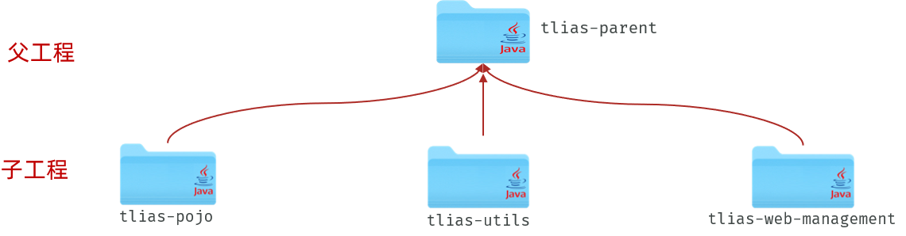

#### （1）概念：继承描述的是两个工程间的关系，与 java 中的继承相似，子工程可以继承父工程中的配置信息，常见于依赖关系的继承

#### （2）作用：简化依赖配置、统一管理依赖

#### （3）相关配置

```xml
<parent>
    <groupId>...</groupId>
    <artifactId>...</artifactId>
    <version>...</version>
    <relativePath>....</relativePath>
</parent>
```

### 实现案例

> #### 我们当前的项目 tlias-web-management，还稍微有一点特殊，因为是一个 springboot 项目，而所有的 springboot 项目都有一个统一的父工程，就是 spring-boot-starter-parent。 与 java 语言类似，Maven 不支持多继承，一个 maven 项目只能继承一个父工程，如果继承了 spring-boot-starter-parent，就没法继承我们自己定义的父工程 tlias-parent 了

#### 那我们怎么来解决这个问题呢？

> #### 那此时，大家可以想一下，Java <span style="color:red">虽然不支持多继承，但是可以支持多重继承</span>，比如：A 继承 B， B 继承 C。 那在 Maven 中也是支持多重继承的，所以呢，我们就可以让 我们自己创建的三个模块，都继承 tlias-parent，而 tlias-parent 再继承 spring-boot-starter-parent，就可以了。 具体结构如下

<br/>
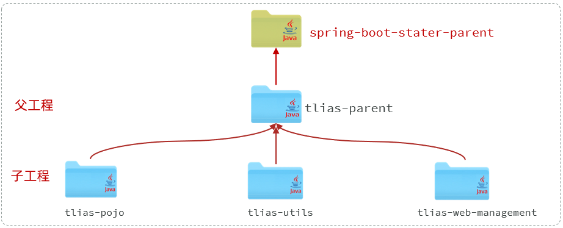

### Maven 的打包方式

> #### （1）jar（<span style="color:red">默认</span>）：普通模块打包，springboot 项目基本都是 jar 包（内嵌 tomcat 运行）
>
> #### （2）war：普通 web 程序打包，需要部署在外部的 tomcat 服务器中运行
>
> #### （3）pom：父工程或聚合工程，该模块不写代码，仅进行依赖管理

### ⚠️ 注意事项

#### （1）在子工程中，配置了<span style="color:red">继承关系</span>之后，坐标中的 <span style="color:red">groupId</span> 是<span style="color:red">可以省略</span>的，因为会自动继承父工程的

#### （2） <span style="color:red">relativePath</span> 指定<span style="color:red">父工程的 pom 文件的相对位置</span>（如果不指定，将从本地仓库 / 远程仓库查找该工程）

> #### .. / 代表的上一级目录

## Maven 版本锁定

### 需求场景

#### 如果项目中各个模块中都公共的这部分依赖，我们可以直接定义在父工程中，从而简化子工程的配置。 然而在项目开发中，还有一部分依赖，并不是各个模块都共有的，可能只是其中的一小部分模块中使用到了这个依赖

#### 比如：在 tlias-web-management、tlias-web-system、tlias-web-report 这三个子工程中，都使用到了 jwt 的依赖。 但是 tlias-pojo、tlias-utils 中并不需要这个依赖，那此时，这个依赖，我们不会直接配置在父工程 tlias-parent 中，而是哪个模块需要，就在哪个模块中配置

#### 而由于是一个项目中的多个模块，那多个模块中，我们要使用的同一个依赖的版本要一致，这样便于项目依赖的统一管理。比如：这个 jwt 依赖，我们都使用的是 0.9.1 这个版本

<br/>
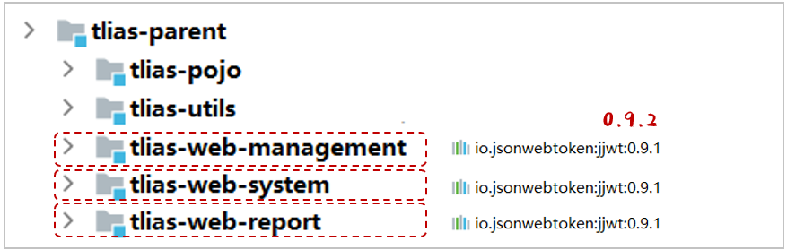

#### 那假如说，我们项目要升级，要使用到 jwt 最新版本 0.9.2 中的一个新功能，那此时需要将依赖的版本升级到 0.9.2，那此时该怎么做呢 ？

#### 第一步：去找当前项目中所有的模块的 pom.xml 配置文件，看哪些模块用到了 jwt 的依赖

#### 第二步：找到这个依赖之后，将其版本 version，更换为 0.9.2

> #### ⚠️ 问题：如果项目拆分的模块比较多，每一次更换版本，我们都得找到这个项目中的每一个模块，一个一个的更改。 很容易就会出现，遗漏掉一个模块，忘记更换版本的情况

### 版本管理实现

> #### 在 maven 中，可以在父工程的 pom 文件中通过 <span style="color:red">&lt;dependencyManagement&gt;</span> 来统一管理依赖版本

#### （1）父工程

```xml
<!--统一管理依赖版本-->
<dependencyManagement>
    <dependencies>
        <!--JWT令牌-->
        <dependency>
            <groupId>io.jsonwebtoken</groupId>
            <artifactId>jjwt</artifactId>
            <version>0.9.1</version>
        </dependency>
    </dependencies>
</dependencyManagement>
```

#### （2）子工程

```xml
<dependencies>
    <!--JWT令牌-->
    <dependency>
        <groupId>io.jsonwebtoken</groupId>
        <artifactId>jjwt</artifactId>
    </dependency>
</dependencies>
```

### ⚠️ 注意事项

> #### （1）在父工程中所配置的 &lt;dependencyManagement&gt; <span style="color:red">只能统一管理依赖版本，并不会将这个依赖直接引入进来</span>。 这点和 &lt;dependencies&gt; 是不同的
>
> #### （2）子工程要使用这个依赖，还是需要引入的，只是此时就无需指定 &lt;version&gt; 版本号了，父工程统一管理。变更依赖版本，只需在父工程中统一变更

#### 面试题：&lt;dependencyManagement&gt; 与 &lt;dependencies&gt; 的区别是什么?

> #### （1）&lt;dependencies&gt; 是直接依赖，在父工程配置了依赖，子工程会直接继承下来
>
> #### （2）&lt;dependencyManagement&gt; 是统一管理依赖版本，不会直接依赖，还需要在子工程中引入所需依赖（无需指定版本）

### ⭐ 属性配置

<br/>
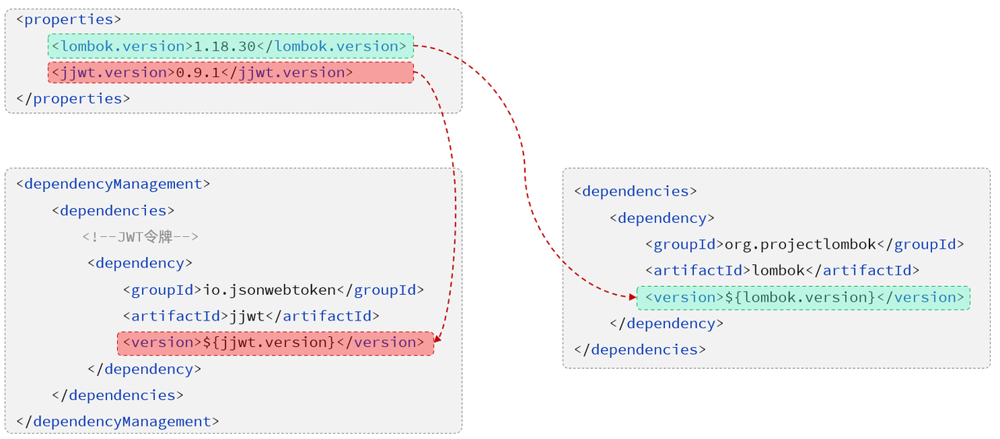

#### （1）自定义属性

```xml
<properties>
    <lombok.version>1.18.34</lombok.version>
</properties>
```

#### （2）引用属性

```xml
<dependency>
    <groupId>org.projectlombok</groupId>
    <artifactId>lombok</artifactId>
    <version>${lombok.version}</version>
</dependency>
```

## Maven 聚合

### 问题引入

> #### 分模块设计与开发之后啊，我们的项目被拆分为多个模块，而模块之间的关系，可能错综复杂。 那就比如我们当前的案例项目，结构如下（相对还是比较简单的）

<br/>
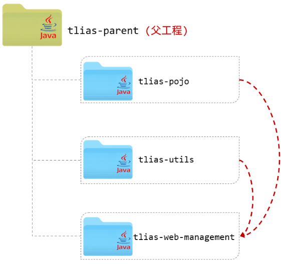

#### 此时，tlias-web-management 模块的父工程是 tlias-parent，该模块又依赖了 tlias-pojo、tlias-utils 模块。 那此时，我们要想将 tlias-web-management 模块打包，是比较繁琐的。因为在进行项目打包时，maven 会从本地仓库中来查找 tlias-parent 父工程，以及它所依赖的模块 tlias-pojo、tlias-utils，而本地仓库目前是没有这几个依赖的

#### 所以，我们再打包 tlias-web-management 模块前，需要将 tlias-parent、tlias-pojo、tlias-utils 分别执行 install 生命周期安装到 maven 的本地仓库，然后再针对于 tlias-web-management 模块执行 package 进行打包操作

#### 那此时，大家试想一下，如果开发一个大型项目，拆分的模块很多，模块之间的依赖关系错综复杂，那此时要进行项目的打包、安装操作，是非常繁琐的

#### 通过 maven 的聚合就可以轻松实现项目的一键构建（清理、编译、测试、打包、安装等）

### 聚合实现

<br/>
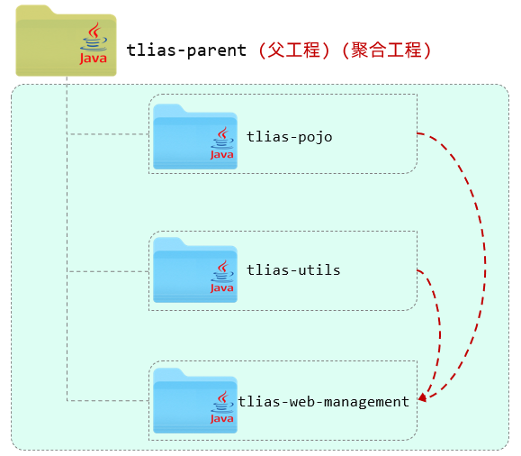

#### （1）聚合：将多个模块组织成一个整体，同时进行项目的构建

#### （2）聚合工程：一个不具有业务功能的“空”工程（有且仅有一个 pom 文件）

> #### 一般来说，继承关系中的父工程与聚合关系中的聚合工程是同一个

#### （3）作用：快速构建项目（无需根据依赖关系手动构建，直接在聚合工程上构建即可）

#### （4）在父工程中添加 <span style="color:red">modules</span> 标签，实现聚合

> #### <span style="color:red">实现聚合后，父工程执行某个 maven 命令时，则 tlias-parent 中所聚合的其他模块全部都会执行父工程中所执行的指令</span>，这就是通过聚合实现项目的一键构建（一键清理 clean、一键编译 compile、一键测试 test、一键打包 package、一键安装 install 等）

```xml
<modules>
    <module>../tlias-pojo</module>
    <module>../tlias-utils</module>
    <module>../tlias-web-management</module>
</modules>
```

## Maven 私服

### 需求引入

#### 假设现在有两个团队，A 和 B。 A 开发了一个模块 tlias-utils，模块开发完毕之后，将模块打成 jar 包，并安装到了 A 的本地仓库

<br/>


#### 那此时，该公司的 B 团队开发项目时，要想使用 tlias-utils 中提供的工具类，该怎么办呢？ 对于 maven 项目来说，是不是在 pom.xml 文件中引入 tlias-utils 的坐标就可以了呢？

<br/>
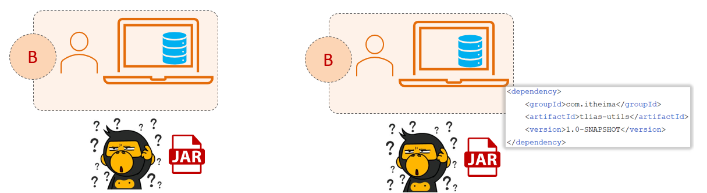

#### 大家可以思考一下，当 B 团队在 maven 项目的 pom.xml 配置文件中引入了依赖的坐标之后，maven 是如何查找这个依赖的？ 查找顺序为：

> #### （1）本地仓库：本地仓库中是没有这个依赖 jar 包的。
>
> #### （2）远程中央仓库：由于该模块时自己公司开发的，远程仓库中也没有这个依赖

#### 因为目前 tlias-utils 这个依赖，还在 A 的本地仓库中的。 B 电脑上的 maven 项目，是不可能找得到 A 电脑上 maven 本地仓库的 jar 包的。 那此时，大家可能会有一个想法：因为 A 和 B 都会连接中央仓库，我们可以将 A 本地仓库的 jar 包，直接上传到中央仓库，然后 B 从中央仓库中下载 tlias-utils 这个依赖

<br/>
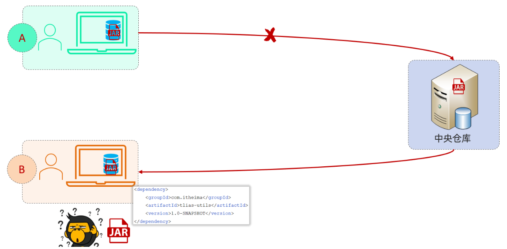

#### 这个想法很美好，但是现实很残酷。这个方案是行不通的，因为中央仓库全球只有一个，不是什么人都可以往中央仓库中来上传 jar 包的，我们是没有权限操作的

#### 那此时，maven 的私服就出场了，私服其实就是架设在公司局域网内部的一台服务器，就是一种特殊的远程仓库

#### 有了私服之后，各个团队就可以直接来连接私服了。 A 连接上私服之后，他就可以把 jar 包直接上传到私服当中。我公司自己内部搭建的服务器，我是不是有权限操作呀，把 jar 包上传到私服之后，我让 B 团队的所有开发人员也连接同一台私服。连接上这一台私服之后，他就会根据坐标的信息，直接从私服当中将对应的 jar 包下载到自己的本地仓库，这样就可以使用到依赖当中所提供的一些工具类了。这样我们就可以通过私服来完成资源的共享

<br/>
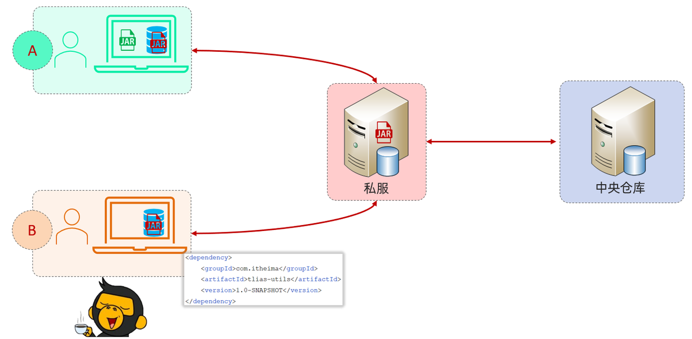

#### 而如果我们在项目中需要使用其他第三方提供的依赖，如果本地仓库没有，也会自动连接私服下载，如果私服没有，私服此时会自动连接中央仓库，去中央仓库中下载依赖，然后将下载的依赖存储在私服仓库及本地仓库中

### 基本介绍

#### （1）私服

> #### 是一种特殊的远程仓库，它是架设在局域网内的仓库服务，用来代理位于外部的中央仓库，用于解决团队内部的资源共享与资源同步问题

#### （2）依赖查找顺序

> #### 本地仓库
>
> #### 私服仓库
>
> #### 中央仓库

#### （3） ⚠️ 注意事项

> #### 私服在企业项目开发中，一个项目/公司，只需要一台即可（<span style="color:red">无需我们自己搭建，会使用即可</span>）

### 资源上传与下载

<br/>
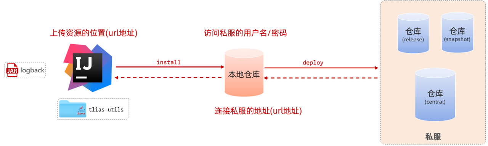

> #### 第一步配置：在 maven 的配置文件中配置访问私服的用户名、密码
>
> #### 第二步配置：在 maven 的配置文件中配置连接私服的地址(url 地址)
>
> #### 第三步配置：在项目的 pom.xml 文件中配置上传资源的位置(url 地址)
>
> #### 配置好了上述三步之后，要上传资源到私服仓库，就执行执行 maven 生命周期：deploy

### 私服仓库说明

> #### RELEASE：存储自己开发的 RELEASE 发布版本的资源
>
> #### SNAPSHOT：存储自己开发的 SNAPSHOT 发布版本的资源
>
> #### Central：存储的是从中央仓库下载下来的依赖

### 项目版本说明

> #### RELEASE(发布版本)：功能趋于稳定、当前更新停止，可以用于发行的版本，存储在私服中的 RELEASE 仓库中
>
> #### SNAPSHOT(快照版本)：功能不稳定、尚处于开发中的版本，即快照版本，存储在私服的 SNAPSHOT 仓库中

### 相关配置

::: tip <span style="font-size:18px">⚠️ 注意事项：以下内容只是案例，相关信息需要根据实际修改</span>

#### 以下配置完成之后，我们就可以在 tlias-parent 的 maven 面板中执行 <span style="color:red">deploy</span> 生命周期，将项目发布到私服仓库中

:::

#### （1）设置私服的访问用户名/密码（在自己 maven 安装目录下的 <span style="color:red">conf / settings.xml</span> 中的 <span style="color:red">servers</span> 中配置

```xml
<server>
    <id>maven-releases</id>
    <username>admin</username>
    <password>admin</password>
</server>

<server>
    <id>maven-snapshots</id>
    <username>admin</username>
    <password>admin</password>
</server>
```

#### （2）设置私服依赖下载的仓库组地址（在自己 maven 安装目录下的 conf/settings.xml 中的 mirrors 中配置）

```xml
<mirror>
    <id>maven-public</id>
    <mirrorOf>*</mirrorOf>
    <url>http://localhost:8081/repository/maven-public/</url>
</mirror>
```

#### （3）设置私服依赖下载的仓库组地址（在自己 maven 安装目录下的 conf/settings.xml 中的 profiles 中配置）

```xml
<profile>
    <id>allow-snapshots</id>
    <activation>
        <activeByDefault>true</activeByDefault>
    </activation>
    <repositories>
        <repository>
            <id>maven-public</id>
            <url>http://localhost:8081/repository/maven-public/</url>
            <releases>
                <enabled>true</enabled>
            </releases>
            <snapshots>
                <enabled>true</enabled>
            </snapshots>
        </repository>
    </repositories>
</profile>
```

#### （4）IDEA 的 maven 工程的 pom 文件中配置上传（发布）地址(直接在 tlias-parent 中配置发布地址)

```xml
<distributionManagement>
    <!-- release版本的发布地址 -->
    <repository>
        <id>maven-releases</id>
        <url>http://localhost:8081/repository/maven-releases/</url>
    </repository>
    <!-- snapshot版本的发布地址 -->
    <snapshotRepository>
        <id>maven-snapshots</id>
        <url>http://localhost:8081/repository/maven-snapshots/</url>
    </snapshotRepository>
</distributionManagement>
```

## 分模块搭建项目

### ⚠️ 层级不显示问题

<br/>
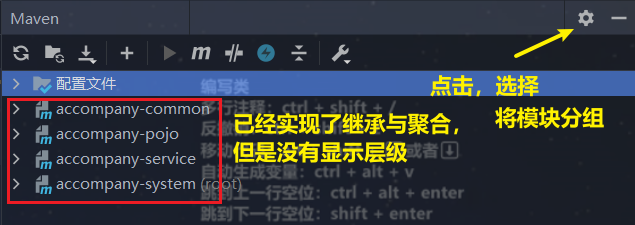

### ⚠️ 解决已忽略的 pom

<br/>
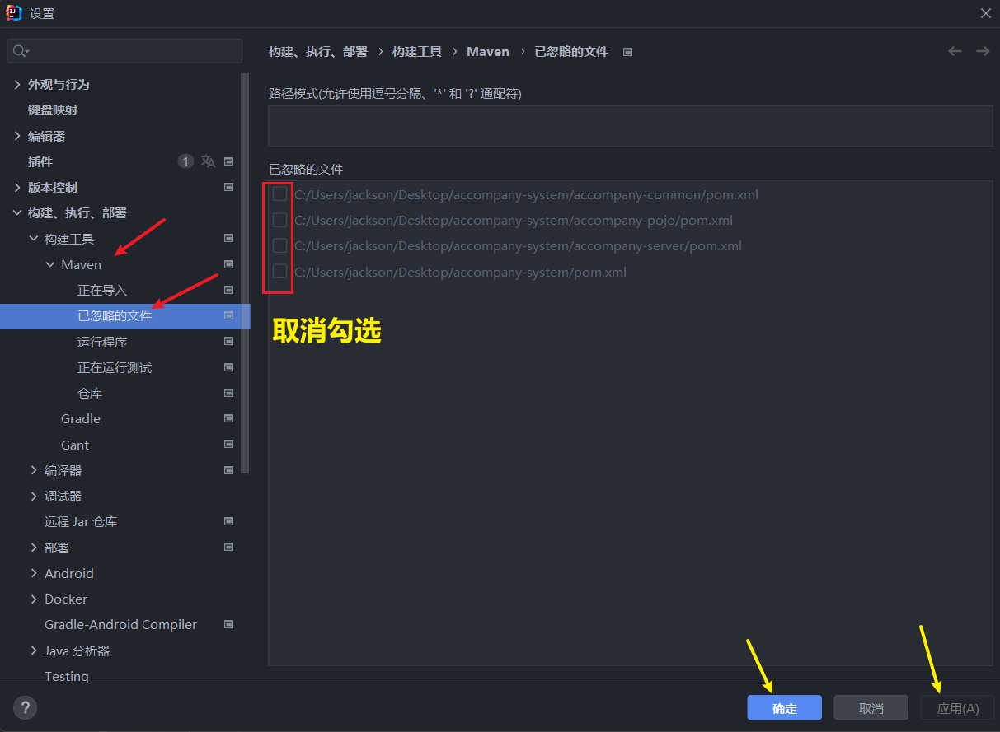

### 创建方法

#### （1）创建 springboot 项目，删除不必要的文件夹，只留下 pom 文件

> #### ⚠️ 注意：这里只做依赖的管理，不写代码，需要<span style="color:red">删除 build 标签</span>

#### （2）非 controller 层，创建 maven 模块

#### （3）controller 层，创建 springboot 项目模块

> #### controller 层中 pom 文件的 bulid 标签如下

```xml
<build>
    <plugins>
        <plugin>
            <groupId>org.springframework.boot</groupId>
            <artifactId>spring-boot-maven-plugin</artifactId>
        </plugin>
    </plugins>
</build>
```

#### （4）在父工程中声明子模块，同时指定打包方式

> #### pom：父工程或聚合工程，该模块<span style="color:red">不写代码</span>，仅进行<span style="color:red">依赖管理</span>
>
> #### jar（<span style="color:red">默认</span>）：普通模块打包，springboot 项目基本都是 jar 包（内嵌 tomcat 运行）

```xml
<!-- 父模块需要继承 springboot 依赖-->
<parent>
    <groupId>org.springframework.boot</groupId>
    <artifactId>spring-boot-starter-parent</artifactId>
    <version>3.4.11</version>
    <relativePath/> <!-- lookup parent from repository -->
</parent>

<!-- 声明需要聚合的子模块 -->
<modules>
    <module>accompany-common</module>
    <module>accompany-pojo</module>
    <module>accompany-service</module>
</modules>

<!-- 父模块的声明 -->
<groupId>com.accompany</groupId>
<artifactId>accompany-system</artifactId>
<version>0.0.1-SNAPSHOT</version>

<!--父模块的打包方式为 pom（只做依赖管理，不写代码，默认为 jar）-->
<packaging>pom</packaging>
```

#### 在每个子模块中添加对父模块的依赖

```xml
<!--声明父模块的依赖-->
<parent>
    <artifactId>accompany-system</artifactId>
    <groupId>com.accompany</groupId>
    <version>0.0.1-SNAPSHOT</version>
</parent>

<!--
    子模块的声明，用 <artifactId> 标签声明 maven 坐标即可，
    无需指定 groupId（继承了父类，无需重复声明）
-->
<artifactId>accompany-service</artifactId>
<version>0.0.1-SNAPSHOT</version>

```

### 依赖管理

#### （1）在父模块中声明项目需要的所有依赖并同一管理版本

#### （2）子模块需要使用某个依赖时，需要使用 &lt;dependency&gt; 标签声明父类中引入的依赖，且无需指定版本号（父类中统一管理）

#### （3）对于子模块中需要使用的<span style="color:red">特定依赖</span>，可以直接引入，<span style="color:red">并指定版本号</span>，无需交给父类管理

```xml
<!--依赖版本管理-->
<properties>
    <springboot-starter>3.4.11</springboot-starter>
</properties>

<!--
    1. 依赖管理
    2. 注意点
        （1）这里只是依赖管理，子模块需要使用某个依赖时需要使用 <dependency> 标签声明，
            且无需指定版本（父模块中统一管理）
        （2）若子模块需要用到特定的依赖，可以直接指定版本，可以不用父类管理
-->
<dependencyManagement>
    <dependencies>
        <dependency>
            <groupId>org.springframework.boot</groupId>
            <artifactId>spring-boot-starter</artifactId>
            <version>${springboot-starter}</version>
        </dependency>
    </dependencies>
</dependencyManagement>
```

#### （4）<span style="color:red">controller 层</span> 所在的模块，<span style="color:red">可以依赖一下其他子模块</span>，然后再声明本模块需要的依赖

```xml
<!--声明对其他子模块的依赖-->
<dependency>
    <groupId>com.accompany</groupId>
    <artifactId>accompany-common</artifactId>
    <version>0.0.1-SNAPSHOT</version>
</dependency>

<dependency>
    <groupId>com.accompany</groupId>
    <artifactId>accompany-pojo</artifactId>
    <version>0.0.1-SNAPSHOT</version>
</dependency>

<!--本模块所需要的依赖-->
<dependency>
    <groupId>org.springframework.boot</groupId>
    <artifactId>spring-boot-starter-web</artifactId>
</dependency>

......
```
