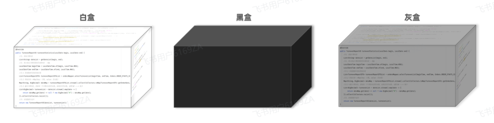
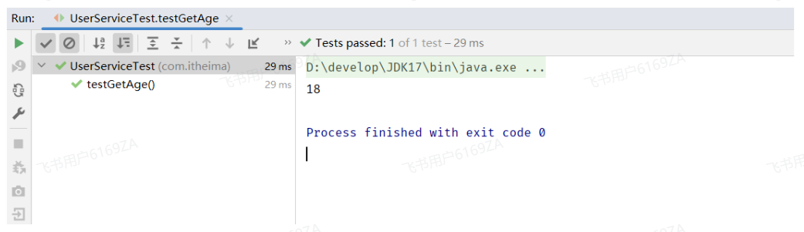
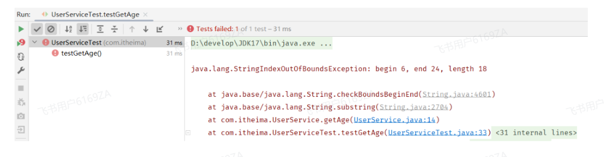
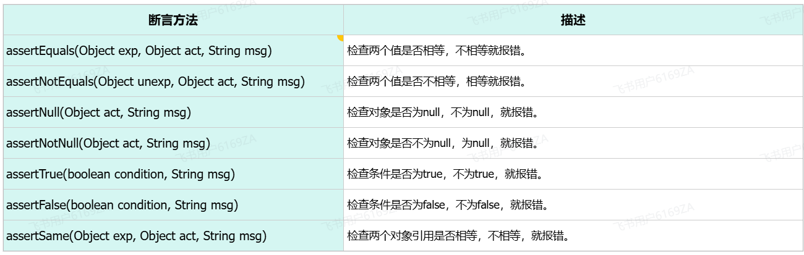
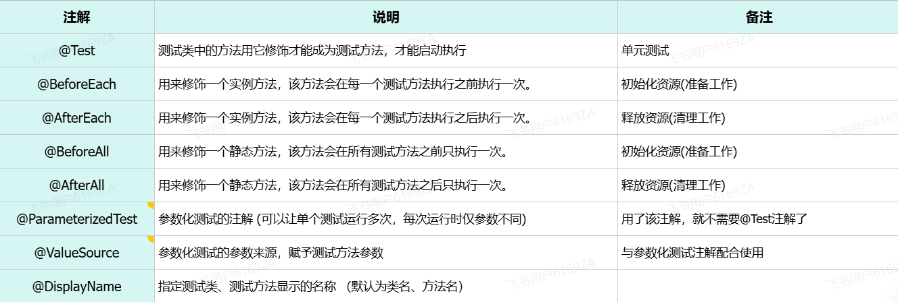
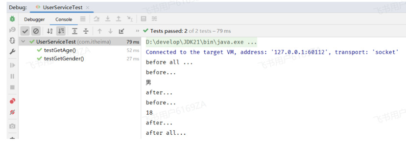
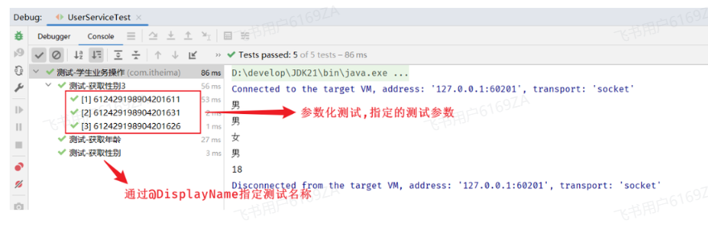
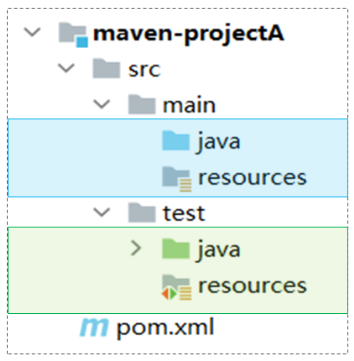
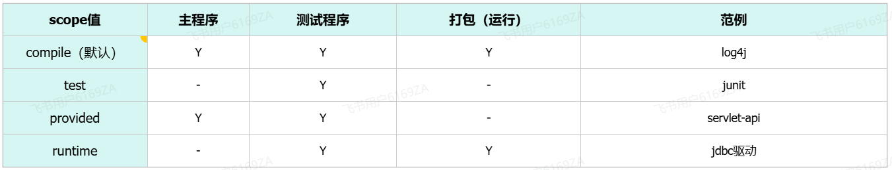

# <center>单元测试</center>

---

## 基本介绍

> #### 测试：是一种用来促进鉴定软件的正确性、完整性、安全性和质量的过程

### 测试种类


#### 单元测试

> #### （1） 介绍：对软件的基本组成单位进行测试，<span style="color:red">最小测试单位</span>
>
> #### （2） 目的：检验软件基本组成单位的正确性
>
> #### （3） 测试人员：开发人员

#### 集成测试

> #### （1） 介绍：将已分别通过测试的单元，按设计要求组合成系统或子系统，再进行的测试
>
> #### （2） 目的：检查单元之间的协作是否正确
>
> #### （3） 测试人员：开发人员

#### 系统测试

> #### （1）介绍：对已经集成好的软件系统进行彻底的测试
>
> #### （2）目的：验证软件系统的正确性、性能是否满足指定的要求
>
> #### （3）测试人员：测试人员

#### 验收测试

> #### 介绍：交付测试，是针对用户需求、业务流程进行的正式的测试
>
> #### 目的：验证软件系统是否满足验收标准
>
> #### 测试人员：客户/需求方

### 测试方法



#### 白盒测试

> #### 清楚软件内部结构、代码逻辑
>
> #### 用于验证代码、逻辑正确性

#### 黑盒测试

> #### 不清楚软件内部结构、代码逻辑
>
> #### 用于验证软件的功能、兼容性、验收测试等方面

#### 灰盒测试

> #### 结合了白盒测试和黑盒测试的特点，既关注软件的内部结构又考虑外部表现（功能）

## JUnit 单元测试

### 基本介绍

> #### （1） 单元测试：就是针对最小的功能单元(方法)，编写测试代码对其正确性进行测试
>
> #### （2） JUnit：最流行的 Java 测试框架之一，提供了一些功能，方便程序进行单元测试（第三方公司提供）

#### 通过 main 方法是可以进行测试的，可以测试程序是否正常运行。但是 main 方法进行测试时，会存在如下问题

> #### （1）测试代码与源代码未分开，难维护
>
> #### （2）一个方法测试失败，影响后面方法
>
> #### （3）无法自动化测试，得到测试报告

#### 而如果我们使用了 JUnit 单元测试框架进行测试，将会有以下优势：

> #### （1）测试代码与源代码分开，便于维护
>
> #### （2）可根据需要进行自动化测试
>
> #### （3）可自动分析测试结果，产出测试报告

### 测试规范

> #### （1）测试类的命名规范为：<span style="color:red">XxxxTest</span>
>
> #### （2）测试方法的命名规定为：<span style="color:red">public void</span> xxx <span style="color:red">( )</span> &#123; ... &#125;
>
> #### （3）在 maven 项目中，test 目录存放单元测试的代码，是否可以在 main 目录中编写单元测试呢 ？ 可以，但是<span style="color:red">不规范</span>

### 入门程序

#### （1）在 pom.xml 中，引入 JUnit 的依赖

```xml
<!--Junit单元测试依赖-->
<dependency>
    <groupId>org.junit.jupiter</groupId>
    <artifactId>junit-jupiter</artifactId>
    <version>5.9.1</version>
    <scope>test</scope>
</dependency>
```

#### （2）在 test/java 目录下，创建测试类，并编写对应的测试方法，并在方法上声明@Test 注解

```java
@Test
public void testGetAge(){
    Integer age = new UserService().getAge("110002200505091218");
    System.out.println(age);
}
```

#### （3）运行单元测试 （测试通过：绿色；测试失败：红色）

> #### 测试通过显示绿色



> #### 测试失败显示红色



### 断言

#### （1）断言引入

> #### 我们目前所编写的单元测试运行没有报错，但是不代表呗测试的业务方法它的逻辑就没有问题，只能说明我们的测试方法编写的没什么问题

#### （2）什么是断言？

> #### JUnit 提供了一些辅助方法，用来帮我们确定被测试的方法是否按照预期的效果正常工作，这种方式称为断言

#### （3）常见方法



#### （4）代码示例

```java
package com.itheima;

import org.junit.jupiter.api.*;
import org.junit.jupiter.params.ParameterizedTest;
import org.junit.jupiter.params.provider.ValueSource;

public class UserServiceTest {

    @Test
    public void testGetAge2(){
        Integer age = new UserService().getAge("110002200505091218");
        Assertions.assertNotEquals(18, age, "两个值相等");
//        String s1 = new String("Hello");
//        String s2 = "Hello";
//        Assertions.assertSame(s1, s2, "不是同一个对象引用");
    }

    @Test
    public void testGetGender2(){
        String gender = new UserService().getGender("612429198904201611");
        Assertions.assertEquals("男", gender);
    }
}
```

### 常见注解



#### 演示 @BeforeEach，@AfterEach，@BeforeAll，@AfterAll 注解

```java
public class UserServiceTest {

    @BeforeEach
    public void testBefore(){
        System.out.println("before...");
    }

    @AfterEach
    public void testAfter(){
        System.out.println("after...");
    }

    @BeforeAll //该方法必须被static修饰
    public static void testBeforeAll(){
        System.out.println("before all ...");
    }

    @AfterAll //该方法必须被static修饰
    public static void testAfterAll(){
        System.out.println("after all...");
    }

    @Test
    public void testGetAge(){
        Integer age = new UserService().getAge("110002200505091218");
        System.out.println(age);
    }

    @Test
    public void testGetGender(){
        String gender = new UserService().getGender("612429198904201611");
        System.out.println(gender);
    }
}
```



#### 演示 @ParameterizedTest ，@ValueSource ，@DisplayName 注解

```java
package com.itheima;

import org.junit.jupiter.api.*;
import org.junit.jupiter.params.ParameterizedTest;
import org.junit.jupiter.params.provider.ValueSource;

@DisplayName("测试-学生业务操作")
public class UserServiceTest {

    @DisplayName("测试-获取年龄")
    @Test
    public void testGetAge(){
        Integer age = new UserService().getAge("110002200505091218");
        System.out.println(age);
    }

    @DisplayName("测试-获取性别")
    @Test
    public void testGetGender(){
        String gender = new UserService().getGender("612429198904201611");
        System.out.println(gender);
    }

    @DisplayName("测试-获取性别3")
    @ParameterizedTest
    @ValueSource(strings = {"612429198904201611","612429198904201631","612429198904201626"})
    public void testGetGender3(String idcard){
        String gender = new UserService().getGender(idcard);
         System.out.println(gender);
    }
}

```



## Maven 依赖范围

### 基本介绍

> #### 依赖的 jar 包，默认情况下，可以在任何地方使用，在 main 目录下，可以使用；在 test 目录下，也可以使用。
>
> #### 在 maven 中，如果希望限制依赖的使用范围，可以通过 <span style="color:red">&lt;scope&gt;....&lt;/scope&gt; 设置其作用范围</span>



### 作用范围

> #### （1）主程序范围有效（main 文件夹范围内）
>
> #### （2）测试程序范围有效（test 文件夹范围内）
>
> #### （3）是否参与打包运行（package 指令范围内）



#### 案例：限制 JUnit 的适用范围只在测试程序范围内

```xml
<dependency>
    <groupId>org.junit.jupiter</groupId>
    <artifactId>junit-jupiter</artifactId>
    <version>5.9.3</version>
    <scope>test</scope>
</dependency>
```
