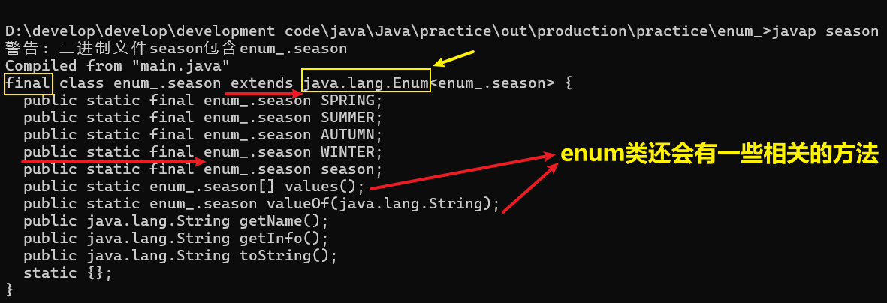

<h1 style="text-align: center; font-weight: bold;">枚举(enum)</h1>

---

## 基本介绍

> #### 引出关键字：<span style="color:red">enum</span>，全称为 enumerate

#### （1）枚举是一组<span style="color:red">常量集合</span>，所有常量均采用<span style="color:red">大写字母 + 下划线</span>命名

#### （2）枚举属于一种特殊的类，里面只包含一组有限的特定的对象

> #### 定义枚举类： enum + 类名

#### （3）枚举类的<span style="color:red">特点</span>：<span style="color:red">只读不改</span>

#### 使用场景

> #### 当一个类的属性<span style="color:red">有限定条件时</span>（例如一个星期只能有七天），可以使用枚举类

## 自定义枚举类

### 实现步骤

#### （1）<span style="color:red">构造器私有化</span>，不让 new 对象

#### （2）在类的内部直接<span style="color:red">创建固定对象</span>（使用 public 修饰：对外暴露对象）

#### （3）<span style="color:red">不提供 set（）</span>方法，因为枚举对象值通常为<span style="color:red">只读</span>

#### （4）对枚举对象使用 <span style="color:red">final + static</span> 共同修饰，实现底层优化（<span style="color:red">不会导致类加载</span>）

#### （5）枚举对象根据需要，也<span style="color:red">可以有多个属性</span>

### 代码示例

```java
package enum_;

public class main {
    public static void main(String[] args) {
        // 直接访问类中创建的对象，用过 toString 方法重写后会输出对象的信息
        System.out.println(season.SPRRING);
        System.out.println(season.SUMMER);
        System.out.println(season.AUTUMN);
        System.out.println(season.WINTER);
    }
}

class season{
    // 对象属性私有化
    private String name;
    private String info;

    // 创建实例对象提供给其他类进行读取
    public final static season SPRRING = new season("春天","温暖");
    public final static season SUMMER = new season("夏天","炎热");
    public final static season AUTUMN = new season("秋天","凉爽");
    public final static season WINTER = new season("冬天","寒冷");

    // 构造器私有化
    private season(String name, String info) {
        this.name = name;
        this.info = info;
    }

    public String getName() {
        return name;
    }

    public String getInfo() {
        return info;
    }

    // 重写 toString 方法，输出对象的信息
    @Override
    public String toString() {
        return "season{" +
                "name='" + name + '\'' +
                ", info='" + info + '\'' +
                '}';
    }
}

// 输出结果
season{name='春天', info='温暖'}
season{name='夏天', info='炎热'}
season{name='秋天', info='凉爽'}
season{name='冬天', info='寒冷'}
```

## enum 关键字实现枚举

### enum 底层源码

> #### 使用 javap 反编译



### 基本介绍

#### （1）若一个类声明为<span style="color:red">枚举类</span>（enum），则<span style="color:red">不能再继承其他类</span>

#### （2）枚举类<span style="color:red">不能被实例化</span>

#### （3）<span style="color:red">枚举对象必须位于枚举类的开头</span>，不同对象用逗号隔开，最后一个对象后使用分号

> #### 枚举对象格式：对象名（实参）

#### （4）enum 类底层是继承了 java.lang.Enum 这个类的，<span style="color:red">创建</span>枚举类时，<span style="color:red">必须明确调用哪个构造器</span>

> #### 如果调用的是无参构造器，实参列表和小括号都可以省略

#### （5）enum 枚举类在<span style="color:red">输出对象</span>时，<span style="color:red">可以不用重写 toString</span> 方法，底层<span style="color:red">继承</span>了 java.lang.Enum，<span style="color:red">调用父类</span>的 toString 方法，输出的是对象信息

#### （6）枚举对象<span style="color:red">底层</span>是<span style="color:red"> final + static</span> 共同修饰的，和自定义类实现枚举是等价的

> #### public final static season SPRRING = new season("春天","温暖")
>
> #### 等价于
>
> #### SPRING("春天","温暖")

### 代码示例

```java
package enum_;

public class main {
    public static void main(String[] args) {
        // 直接访问类中创建的对象，用过 toString 方法重写后会输出对象的信息
        System.out.println(season.SPRING);
        System.out.println(season.SUMMER);
        System.out.println(season.AUTUMN);
        System.out.println(season.WINTER);
        System.out.println(season.season);
    }

}

enum season{

    // 枚举对象必须位于枚举类的开头
    SPRING("春天","温暖"),SUMMER("夏天","炎热"),
    AUTUMN("秋天","凉爽"), WINTER("冬天","寒冷"),
    season;

    /*
        使用枚举对象代替了
        public final static season SPRRING = new season("春天","温暖");
        public final static season SUMMER = new season("夏天","炎热");
        public final static season AUTUMN = new season("秋天","凉爽");
        public final static season WINTER = new season("冬天","寒冷");
     */

    // 对象属性私有化
    private String name;
    private String info;

    // 构造器私有化
    private season(){

    }

    private season(String name, String info) {
        this.name = name;
        this.info = info;
    }

    public String getName() {
        return name;
    }

    public String getInfo() {
        return info;
    }

    // enum类在底层继承了父类，在子类中不重写该方法
    // 调用父类的方法，输出的是对象的名称
}
```

### 常用方法

| 方法      | 说明                                                                                                             |
| --------- | ---------------------------------------------------------------------------------------------------------------- |
| toString  | Enum 类已经重写过了，返回的是当前对象名，子类可以重写该方法，用于返回对象的属性信息                              |
| name      | 返回当前对象名（常量名），子类中不能重写                                                                         |
| ordinal   | 返回当前对象的位置号，默认<span style="color:red">从 0 开始</span>                                               |
| values    | 返回一个数组，存储当前枚举类中<span style="color:red">所有</span>的常量                                          |
| valueOf   | 接受一个字符串参数（枚举常量的名称，与枚举类中的常量名称完全一致），返回对应的枚举常量。如果不匹配，则会抛出异常 |
| compareTo | 比较两个枚举常量，<span style="color:red">比较的就是位置号</span>                                                |

### 代码示例

```java
package enum_;

public class main {
    public static void main(String[] args) {
        season spring = season.SPRING;

        // name 方法
        System.out.println("1. 调用 name() 方法：" + spring.name());
        System.out.println("spring.name() = " + spring.name());
        System.out.println();

        // ordinal 方法：从 0 开始编号
        System.out.println("2. 调用 ordinal() 方法");
        System.out.println("spring.ordinal() = "+ spring.ordinal());
        System.out.println();

        // values 方法 ：返回的是数组，存储 enum类 中的所有常量
        System.out.println("3. 调用 values() 方法，遍历数组，返回所有常量");
        season[] seasons = season.values();
        /*
        使用增强for循环
        for（变量类型 变量名：数组或集合）
         */
        for(season s:seasons){
            System.out.println(s);
        }
        System.out.println();

        // valueOf 方法：判断常量是否存在于enum类中，存在则返回常量名，否则报异常
        System.out.println("4. 调用 valueof() 方法");
        System.out.println("season.valueOf(\"AUTUMN\") = " + season.valueOf("AUTUMN"));
//        System.out.println("season.valueOf(\"hi\") = " + season.valueOf("hi")); // 会报异常
        System.out.println();

        // compareTo() 方法：计算两个枚举常量位置序号的差值
        System.out.println("5. 调用 compareTo() 方法");
        System.out.println("season.WINTER.compareTo(season.SPRING) = " + season.WINTER.compareTo(season.SPRING));
        System.out.println();
    }

}

enum season{

    // 枚举对象必须位于枚举类的开头
    SPRING("春天","温暖"),SUMMER("夏天","炎热"),
    AUTUMN("秋天","凉爽"), WINTER("冬天","寒冷");

    // 对象属性私有化
    private String name;
    private String info;

    // 构造器私有化
    private season(){

    }

    private season(String name, String info) {
        this.name = name;
        this.info = info;
    }

    public String getName() {
        return name;
    }

    public String getInfo() {
        return info;
    }

    // enum类在底层继承了父类，在子类中不重写该方法
    // 调用父类的方法，输出的是对象的名称

    /*
        enum类的 toString 方法

        public String toString() {
            return name;
        }
     */
}

// 输出结果
1. 调用 name() 方法：SPRING
spring.name() = SPRING

2. 调用 ordinal() 方法
spring.ordinal() = 0

3. 调用 values() 方法，遍历数组，返回所有常量
SPRING
SUMMER
AUTUMN
WINTER

4. 调用 valueof() 方法
season.valueOf("AUTUMN") = AUTUMN

5. 调用 compareTo() 方法
season.WINTER.compareTo(season.SPRING) = 3
```

## enum 类实现接口

> #### 通过类名调用在类中创建的对象实例，即<span style="color:red">类名 . 枚举对象名</span>（这就表示 enum 的一个实例对象），通过对象调用方法

#### 代码示例

```java
package enum_;

public class main {
    public static void main(String[] args) {
        // season.INTERFACE_METHIOD 是 enum 类的一个实例对象，通过对象调用方法
        season.INTERFACE_METHIOD.hi();
    }

}

interface A{
    public void hi();
}

enum season implements A{

    // 枚举对象必须位于枚举类的开头
    SPRING("春天","温暖"),SUMMER("夏天","炎热"),
    AUTUMN("秋天","凉爽"), WINTER("冬天","寒冷"),
    INTERFACE_METHIOD;

    // 对象属性私有化
    private String name;
    private String info;

    // 构造器私有化
    private season(){

    }

    private season(String name, String info) {
        this.name = name;
        this.info = info;
    }

    public String getName() {
        return name;
    }

    public String getInfo() {
        return info;
    }

    public void hi(){
        System.out.println("在 enum 类中实现了接口的 hi() 方法");
    }
}
```
