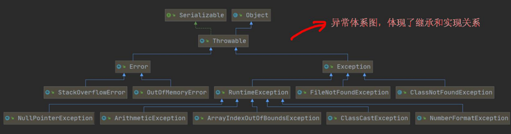
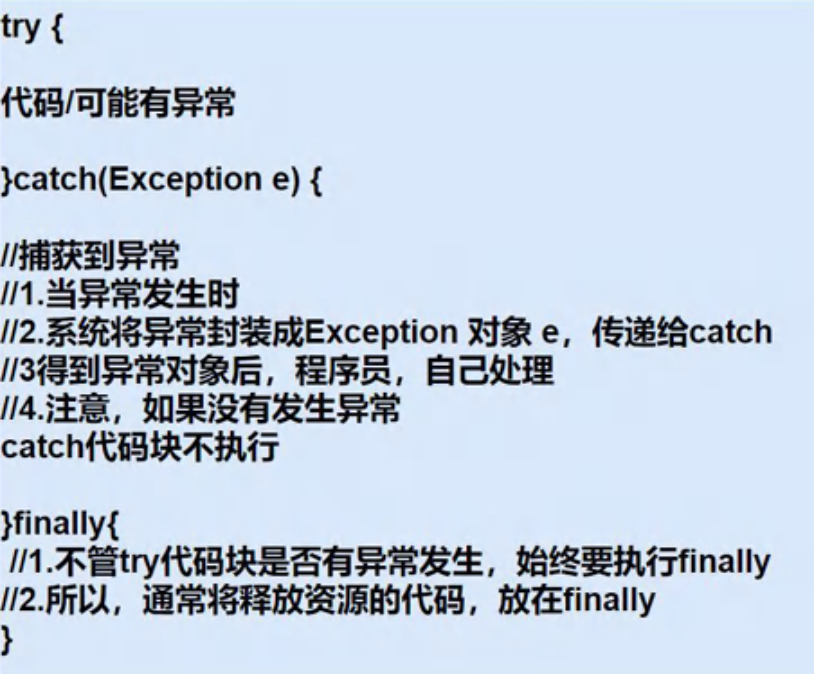
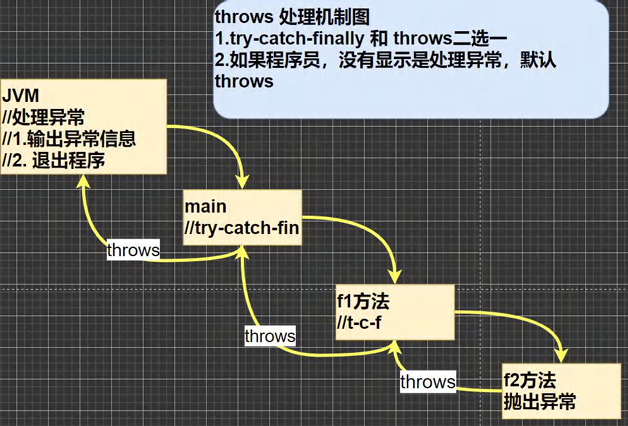

<h1 style="text-align: center; font-weight: bold;">异常（Exception）</h1>

---

## 基本介绍

> #### 在 Java 程序中，将运行中发生的<span style="color:red">不正常情况称为 “异常”</span>

## 异常的分类

### Error（错误）

> #### Error 是 Java 虚拟机无法解决的<span style="color:red">严重问题</span>，同时也是<span style="color:red">系统级的错误</span>，程序无法处理

#### 举例

> #### （1）JVM 虚拟机的崩溃、虚拟机内存溢出等 “严重” 问题
>
> #### （2）比如：StackOverflowError（栈溢出）和 OutOfMemoryError（内存溢出）等

### Exception（异常）

> #### 其他因编程错误或偶然的外在因素导致的<span style="color:red">一般性问题</span>，可以使用针对性的代码进行处理。例如：空指针异常、数组越界异常、文件找不到异常等

#### 1. 编译异常

> #### 编译时异常，是编译器要求<span style="color:red">必须处理</span>的异常。

#### 2. 运行异常

> #### （1）运行时异常，<span style="color:red">编译器检查不出来</span>。一般是指编程时的逻辑错误，是程序员应该避免其出现的异常
>
> #### （2）对于运行时异常，<span style="color:red">可以不作处理</span>，因为这类异常很普遍，若全处理可能会对程序的可读性和运行效率产生影响

### 自定义异常

> #### 程序出现了某些"错误"，但该错误信息并没有在 Throwable 子类中描述处理，这个时候可以自己设计异常类，<span style="color:red">自定义异常的描述信息</span>

## 异常体系图



#### Trowable 的两个子类

> #### （1）Error
>
> #### （2）Exception

#### Exception 的两个子类

> #### 以下列出的异常例子都是常见的异常

#### 1. 编译异常

> #### （1）ClassNotFoundException
>
> #### （2）FileNotFoundException

#### 2. 运行异常（RuntimeException）

> #### （1）NullPointerException：空指针异常
>
> #### （2）ArithmeticException：数学运算异常
>
> #### （3）ArrayIndexOutOfBoundsException：数组下标越界异常
>
> #### （4）ClassCastException：类型转换异常
>
> #### （5）NumberFormatException：数字格式不正确异常

## 编译异常

### 基本介绍

> #### 编译异常是指在编译期间，就<span style="color:red">必须处理</span>的异常，否则代码不能通过编译

### 常见类型

> #### （1） SQLException：操作数据库时，查询表可能发生异常
>
> #### （1） IOException：操作文件时，发生的异常
>
> #### （1） FileNotFoundException：操作一个不存在的文件时，发生异常
>
> #### （1） ClassNotFoundException：加载类，而该类不存在时，异常
>
> #### （1） EOFException：操作文件，到文件末尾，发生异常
>
> #### （1） IllegalArgumentException：参数异常

## 运行异常

### 基本介绍

> #### 在编译时不会发现，在程序运行时出现的逻辑错误导致的异常，<span style="color:red">若不做处理，默认抛出（throws）异常</span>，交给 <span style="color:red">父类 或 上一级</span> 来处理

### 常见类型

> #### （1） NullPointerException：空指针异常
>
> #### （2） ArithmeticException：数学运算异常
>
> #### （3） ArrayIndexOutOfBoundsException：数组下标越界异常
>
> #### （4） ClassCastException：类型转换异常
>
> #### （5） NumberFormatException：数字格式不正确异常

## 代码示例

### 空指针异常

> #### NullPointerException 异常：获取空字符窜的长度

```java
public class NullPointerException_ {
    public static void main(String[] args) {
        String name = null;
        System.out.println(name.length());
    }
}
```

### 数学运算异常

> #### ArithmeticException 异常：分母为 0

```java
public class ArithmeticException_ {
    public static void main(String[] args) {
        int a = 1;
        int b = 0;
        System.out.println("a / b = " + a / b);
    }
}
```

### 数组下标越界异常

> #### ArrayIndexOutOfBoundsException：异常：数组只有三个元素，却访问了第四个元素

```java
public class ArrayIndexOutOfBoundsException_ {
    public static void main(String[] args) {
        int[] arr = {1, 2, 3};
        for (int i = 0; i <= arr.length; i++) {
            System.out.println("arr[" + i + "] = " + arr[i]);
        }
    }
}
```

### 类型转换异常

> #### ClassCastException 异常：A 类 和 B 类 没有关系，不可以把指向 A 类 的对象转成指向 B 类 的对象

```java
public class ClassCastException_ {
    public static void main(String[] args) {
        person p_a = new A(); // 向上转型
        A a = (A)p_a; // 向下转型

        // 两个不相关的类进行转换会报异常
        B b = (B) p_a; // A 和 B 之间无关系，不可以把指向 A 的转换为 B
    }
}

class person {

}

class A extends person{

}

class B extends person{

}
```

### 数字格式不正确异常

> #### NumberFormatException 异常：无法将字符串转化为整数

```java
public class NumberFormatException_ {
    public static void main(String[] args) {
        String name = "异常";
        // 将 String 转成 int
        int num = Integer.parseInt(name);
        System.out.println(num);
    }
}
```

## try - catch - finally

### 快捷键

> #### 选中可能出现异常的代码，按 <span style="color:red">Ctrl + Alt + t</span>，在弹出的内容中选择需要的结构

### 三大结构

> #### （1）try - catch
>
> #### （2）try - finally
>
> #### （3）try - catch - finally

#### 注意：在 <span style="color:red">catch</span> 结构中，使用 <span style="color:red">getMessage（）</span>方法<span style="color:red">获取异常信息</span>

<br/>


### 代码示例

```java
public class main {
    public static void main(String[] args) {
        try {
            String name = "异常";
            // 将 String 转成 int
            int num = Integer.parseInt(name);  // 会抛出 NumberFormatException
            System.out.println(num);
        } catch (NumberFormatException e) {
            System.out.println(e.getMessage());
        } finally {
            System.out.println("程序执行到 finally 部分.....");
        }
    }
}
```

### try - catch 结构

#### （1）如果<span style="color:red">发生异常</span>，直接进入到 catch 块，<span style="color:red">异常所在行后面的代码不会执行</span>

#### （2）如果没有发生异常，不会进入到 catch，顺序执行 try 的代码块

#### （3）不管异常是否发生，都希望指向某段代码（比如：关闭连接，释放资源等），可以使用 finally 结构

> #### 注意：<span style="color:red">finally 中的代码一定会执行</span>

#### （4）<span style="color:red">可以有多个 catch 语句</span>，捕获不同的异常（进行不同的业务处理）

> #### 1. 只会匹配一个 catch
>
> #### 2. <span style="color:red">子类</span>异常<span style="color:red">在前</span>，<span style="color:red">父类</span>异常<span style="color:red">在后</span>

### 多个 catch 结构代码示例

```java
package exception_;

public class main {
    public static void main(String[] args) {
        try {
            // NullPointerException
            String name = null;
            System.out.println(name.length());

            // ArrayIndexOutOfBoundsException
            int[] arr = {1,2,3};
            for (int i = 0; i <= arr.length; i++) {
                System.out.println("arr[" + i + "] = " + arr[i]);
            }
        } catch (NullPointerException e) {
            System.out.println("空指针异常：" + e.getMessage());
        } catch (ArrayIndexOutOfBoundsException e){
            System.out.println("数组下标越界异常：" + e.getMessage());
        }
        System.out.println("程序继续执行......");
    }
}

// 运行结果
空指针异常：null
程序继续执行......
```

#### 代码分析

> #### （1）NullPointerException（子类异常）和 ArrayIndexOutOfBoundsException（子类异常）都是 RuntimeException（父类异常）的子类
>
> #### （2）RuntimeException（运行异常）又是 Exception 的子类
>
> #### （3）如果把父类 Exception 写在前面（父类异常包含了所有子类异常），后面再写子类异常就没有意义了

### try - finally 结构

> #### 此结构<span style="color:red">没有捕获异常</span>，当程序碰到异常时，程序会直接崩掉 / 退出

#### 应用场景

> #### try 中的代码执行完成后，不管是否发生异常，都<span style="color:red">必须执行</span>某个业务逻辑（finally 部分的代码）

### try - catch 练习题

```java
public class ExceptionExe01 {
    public static int method() {
        int i = 1;
        try {
            i++;
            String[] names = new String[3]; // 空指针异常
            if (names[1].equals("tom")) {
                System.out.println(names[1]);
            } else {
                names[3] = "jack";
            }
            return 1;
        } catch (ArrayIndexOutOfBoundsException e) {
            return 2;
        } catch (NullPointerException e) {
            return ++i;
        } finally {
            ++i;
            System.out.println("i = " + i);
        }
    }

    public static void main(String[] args) {
        System.out.println(method());
    }
}

// 输出结果
i = 4
3
```

#### 代码分析

> #### （1）finally 一定会执行，所以在调用方法的时候就执行了其中的代码，调用了 method()方法，输出的肯定是方法的返回值
>
> #### （2）代码中属于空指针异常，即会在 catch (NullPointerException e)中返回 i 的值

## throws

### 基本介绍

> #### 表示抛出异常，不做处理，由上一级或者父类做处理

#### （1）程序可能出现某些异常，通过 <span style="color:red">throws</span> 显示的声明，<span style="color:red">不做处理</span>

#### （2）在方法声明中用 throws 语句可以声明抛出异常的列表，抛出的异常类型可以是

> #### 1. 方法中产生的异常类型
>
> #### 2. 抛出的异常类型的<span style="color:red">父类</span>

#### （3）抛出的异常<span style="color:red">由上一级 / 调用者 / 父类进行处理</span>

> #### （1）上一级做 try - catch 的处理，捕获异常
>
> #### （2）上一级不做处理，继续抛出异常 throws
>
> #### 注意：如果抛出的是<span style="color:red">编译异常</span>，上一级<span style="color:red">必须显示声明</span>异常的处理

#### （4）如果上一级都不做处理，<span style="color:red">最后到 JVM 时，会直接结束程序，输出异常信息</span>

### 原理图



### 代码示例

#### （1）抛出方法中的异常

```java
public static void method() throws NullPointerException,ArrayIndexOutOfBoundsException{
    // NullPointerException
    String name = null;
    System.out.println(name.length());

    // ArrayIndexOutOfBoundsException
    int[] arr = {1,2,3};
    for (int i = 0; i <= arr.length; i++) {
        System.out.println("arr[" + i + "] = " + arr[i]);
    }
    System.out.println("程序继续执行......");
}
```

#### （2）抛出方法中的异常的父类

```java
public static void method() throws RuntimeException{
    // NullPointerException
    String name = null;
    System.out.println(name.length());

    // ArrayIndexOutOfBoundsException
    int[] arr = {1,2,3};
    for (int i = 0; i <= arr.length; i++) {
        System.out.println("arr[" + i + "] = " + arr[i]);
    }
    System.out.println("程序继续执行......");
}
```

#### 代码分析

#### （1）父类异常：RuntimeException

#### （2）子类异常： NullPointerException、ArrayIndexOutOfBoundsException

### 使用细节

#### （1） 对于<span style="color:red">编译异常</span>，程序中<span style="color:red">必须处理</span>（try-catch 或者 throws）

#### （2） 对于<span style="color:red">运行时异常</span>，程序中如果没有处理，默认就是 throws 的方式处理

#### （3） <span style="color:red">子类重写父类的方法</span>时，子类重写的方法所抛出异常类型的两种情况

> #### 1. 要么类型要和父类抛出的异常<span style="color:red">一致</span>
>
> #### 2. 要么为<span style="color:red">父类</span>抛出的异常的类型的<span style="color:red">子类型</span>

#### （4） 在 throws 过程中，如果方法 try-catch，就相当于处理异常，就可以不必 throws

#### 代码示例

```java
class a {
    public void method() throws RuntimeException{
        // NullPointerException
        String name = null;
        System.out.println(name.length());
    }
}

class b extends a {
    @Override
    public void method() throws ArrayIndexOutOfBoundsException{
        // ArrayIndexOutOfBoundsException
        int[] arr = {1, 2, 3};
        for (int i = 0; i <= arr.length; i++) {
            System.out.println("arr[" + i + "] = " + arr[i]);
        }
    }
}
```

#### 代码分析

> #### （1）b 类是 a 类的子类，则<span style="color:red">b 类抛出的异常必须是 a 类抛出异常类型的子类</span>，然而 a 类抛出异常的类型 NullPointerException`是 RuntimeException 的子类，抛出的异常类型用其父类代替是没有问题的
>
> #### （2）若将子类抛出异常的类型换成 Exception，必然会报错，因为扩大了父类抛出异常的类型（本质还是继承关系）

## 自定义异常（throw）

> #### 引入关键字：<span style="color:red">throw</span>
>
> ####

### 基本介绍

> #### 程序出现了某些"错误"，但该错误信息并没有在 throwable 子类中描述处理，这个时候可以自己设计异常类，<span style="color:red">自定义异常的描述信息</span>

### 实现方法

> #### 定义类，自定义异常类名（程序员自己写），<span style="color:red">继承 Exception 或 RuntimeException</span>
>
> #### （1）如果继承 Exception，属于<span style="color:red">编译时</span>异常（受检异常）
>
> #### （2）如果继承 RuntimeException，属于<span style="color:red">运行时</span>异常（非受检异常）

### 代码示例

> #### 接收 person 对象年龄时，要求年龄范围在 `18 - 120` 之间，否则抛出一个自定义异常，并给出提示信息

```java
package exception_;

public class main {
    public static void main(String[] args) {
        int age = 180;
        if(!(age >= 18 && age <= 120)){
            throw new AgeException("年龄需要在 18 - 120 之间");
        }
        System.out.println("你的年龄范围正确");
    }
}

class AgeException extends RuntimeException {
    // 调用 RuntimeException 的构造器，修改异常信息
    public AgeException(String message) {
        super(message);
    }
}
```

#### 输出结果

```java
Exception in thread "main" exception_.AgeException: 年龄需要在 18 - 120 之间
	at exception_.main.main(main.java:7)
```

#### 代码分析

> #### 创建了一个类，通过调用父类的构造器，在创建自定义异常调用构造器来传入自定义异常信息

#### 如何理解 new？

> #### 异常是一个类，<span style="color:red">抛出的必须是异常类的一个对象实例</span>，所以需要 new，创建对象时通过调用构造器传入信息来完成对象实例的初始化

### ⭐ 自定义异常信息

> #### <span style="color:red">throw new RuntimeException（"自定义异常信息"）</span>

## 对比 throw 和 throws

| 意义   | 位置       | 后面跟的东西                            |
| ------ | ---------- | --------------------------------------- |
| throws | 方法声明处 | 异常<span style="color:red">类</span>   |
| throw  | 方法体中   | 异常<span style="color:red">对象</span> |
