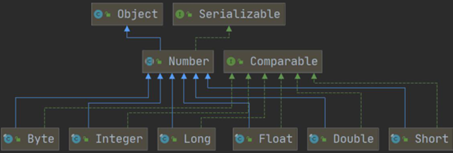
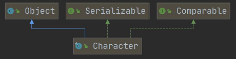
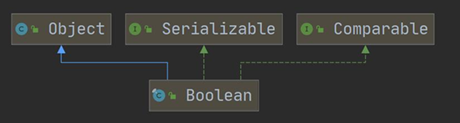
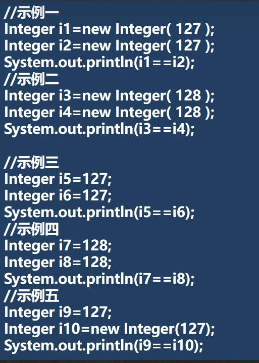
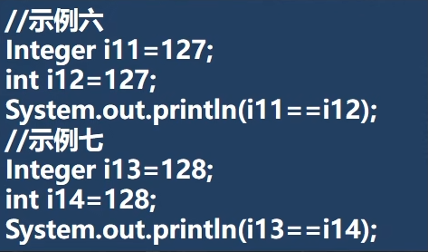
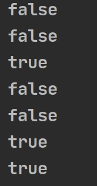

<h1 style="text-align: center; font-weight: bold;">包装类（Wrapper）</h1>

---

## 基本介绍

#### （1）包装类：八种<span style="color:red">基本数据类型</span>分别对应一种<span style="color:red">引用类型</span>，封装成一个类

#### （2）有了类的特点，就可以调用类中的方法

### 对应关系表

#### （1）包装类命名

> #### 除了 char 的包装类命名特殊，其余数据类型的包装类命名均为首字母大写

#### （2）父类

> #### <span style="color:red">char 和 boolean</span> 的父类是 <span style="color:red">Object</span>，其余数据类型的父类都是 <span style="color:red">Number</span>

| 基本数据类型 | 包装类                                   | 父类                                  |
| ------------ | ---------------------------------------- | ------------------------------------- |
| boolean      | <span style="color:red">Boolean</span>   | <span style="color:red">Object</span> |
| char         | <span style="color:red">Character</span> | <span style="color:red">Object</span> |
| byte         | Byte                                     | Number                                |
| short        | Short                                    | Number                                |
| int          | Integer                                  | Number                                |
| long         | Long                                     | Number                                |
| float        | Float                                    | Number                                |
| double       | Double                                   | Number                                |

### 类关系图

<br/>

<br/>

<br/>


## 包装类和基本数据类型转换

### 基本介绍

#### （1）<span style="color:red">jdk5 前</span>的<span style="color:red">手动装箱和拆箱</span>方式，

> #### 装箱：基本类型 --> 包装类型
>
> #### 拆箱：包装类型 --> 基本类型

#### （2）<span style="color:red">jdk5 以后</span>(含 jdk5)的<span style="color:red">自动装箱和拆箱</span>方式

#### （3）底层调用的方法

> #### 自动装箱：valueOf（）方法
>
> #### 自动拆箱：intValue（）方法

### 装箱（int --> Integer）

```java
int n = 10;

// 方式一
Integer integer = Integer.valueOf(n);

// 方式二
Integer integer1 = new Integer(n);
```

### 拆箱（Integer --> int）

```java
int n = 10;

// 装箱
Integer integer = Integer.valueOf(n);

// 拆箱
int n1 = integer.intValue();
```

### 自动装箱和自动拆箱

```java
int n = 10;

// 自动装箱
Integer integer = n; // 底层调用 valueOf() 方法

// 自动拆箱
int n1 = integer; // 底层调用 intValue() 方法
```

## Integer 转 String

### 转换方法

#### （1）方法一：⭐ 和空串拼接（推荐做法）

#### （2）方法二：使用 Integer . toString（）方法

#### （3）方法三：使用 String . valueOf（）方法

> #### String.valueOf（）方法在底层<span style="color:red">接收的是一个对象</span>，而 Integer 刚好就是一个对象

### 代码示例

```java
Integer integer = 5; // 自动装箱

// Integer --> String

// 方法一
String str1 = integer + "";

// 方法二
String str2 = integer.toString();

// 方法三
String str3 = String.valueOf(integer);
```

## String 转 Integer

### 转换方法

#### （1）方法一：使用 Integer.parseInt（）方法（利用<span style="color:red">自动装箱</span>）

> #### <span style="color:red">parseInt（）</span>方法<span style="color:red">返回 int 类型</span>，本质还是把 int 类型赋值给 Integer 类型，实现了自动装箱

#### （2）方法二：<span style="color:red">Integer.valueOf</span>（）方法

#### （3）方法三：使用构造器，创建 Integer 对象

### 代码示例

```java
String str = "123";

Integer integer1 = Integer.parseInt(str); // 使用自动装箱

Integer integer2 = new Integer(str); // 使用构造器
```

## String 转基本数据类型

### 转换方法

> #### 统一特性：转换类型的包装类 . parse 转换类型（"字符串"）

### 代码示例

```java
String s5 = "123";
int num1 = Integer.parseInt(s5);
double num2 = Double.parseDouble(s5);
float num3 = Float.parseFloat(s5);
long num4 = Long.parseLong(s5);
byte num5 = Byte.parseByte(s5);
boolean b = Boolean.parseBoolean("true");
short num6 = Short.parseShort(s5);
```

## 包装类常用方法

| 方法                         | 描述                                                |
| ---------------------------- | --------------------------------------------------- |
| Integer.MIN_VALUE            | 返回整数的最小值                                    |
| Integer.MAX_VALUE            | 返回整数的最大值                                    |
| Character.isDigit(char)`     | 判断字符是否为数字                                  |
| Character.isLetter(char)     | 判断字符是否为字母                                  |
| Character.isUpperCase(char)  | 判断字符是否为大写字母                              |
| Character.isLowerCase(char)  | 判断字符是否为小写字母                              |
| Character.isWhitespace(char) | 判断字符是否为空格                                  |
| Character.toUpperCase(char)  | 将字符<span style="color:red">转换为大写</span>字母 |
| Character.toLowerCase(char)  | 将字符<span style="color:red">转换为小写</span>字母 |

#### 代码示例

```java
public class Test {
    public static void main(String[] args) {
        System.out.println(Integer.MIN_VALUE); // 返回最小值
        System.out.println(Integer.MAX_VALUE); // 返回最大值

        System.out.println(Character.isDigit('a')); // 判断是不是数字
        System.out.println(Character.isLetter('a')); // 判断是不是字母
        System.out.println(Character.isUpperCase('a')); // 判断是不是大写
        System.out.println(Character.isLowerCase('a')); // 判断是不是小写

        System.out.println(Character.isWhitespace('a')); // 判断是不是空格
        System.out.println(Character.toUpperCase('a')); // 转成大写
        System.out.println(Character.toLowerCase('A')); // 转成小写
    }
}

// 运行结果
-2147483648 // 返回最小值
2147483647 // 返回最大值
false // 判断是不是数字
true // 判断是不是字母
false // 判断是不是大写
true // 判断是不是小写
false // 判断是不是空格
A // 转成大写
a // 转成小写
```

## ⭐ valueOf （）底层机制

#### 源码如下

```java
public static Integer valueOf(int i) {
        if (i >= IntegerCache.low && i <= IntegerCache.high)
            return IntegerCache.cache[i + (-IntegerCache.low)];
        return new Integer(i);
    }
```

#### 继续追源码，可以得到：<span style="color:red">low:-127、high:128</span>

#### int --> Integer 底层机制的解释

> #### （1）值在 <span style="color:red">-128 --> 127</span> 范围内会使用<span style="color:red">缓存池</span>，当两个 Integer 对象的值在这个<span style="color:red">范围内</span>时，它们会<span style="color:red">引用相同的缓存对象</span>（存储在<span style="color:red">Cache</span>数组中）
>
> #### （2）如果数值超出范围，转换时，底层会创建 Integer 对象

#### 代码示例

#### （1）数据在范围内：引用相同的缓存对象

```java
Integer integer1 = 1;
Integer integer2 = 1;
System.out.println(integer1 == integer2);

// 输出结果
true
```

#### （2）数据不再范围内：创建 Integer 对象

```java
Integer integer1 = 128;
Integer integer2 = 128;
System.out.println(integer1 == integer2);

// 输出结果
false
```

## 练习题

```java
Object obj1 = true ? new Integer(1) : new Double(2.0);
System.out.println(obj1);

// 输出结果
1.0
```

> #### （1）三元运算符看成一个整体，double 的优先级最高，所以输出 double
>
> #### （2）自动提升原则：表达式结果的类型自动提升为操作数中最大的类型

<br/>

<br/>


#### 答案

<br/>


#### 总结

#### （1）如果在 -128 - 127 范围内：同一个对象（引用的相同的缓存对象）

#### （2）如果超出范围或者 new：只要是创建了对象就不是同一个对象

#### （3）int 和 Integer：只要有基本数据类型，判断的是值是否相等
