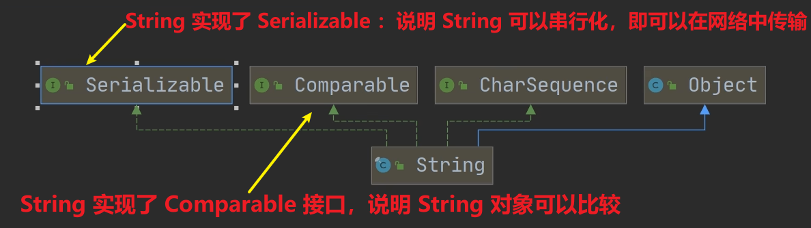
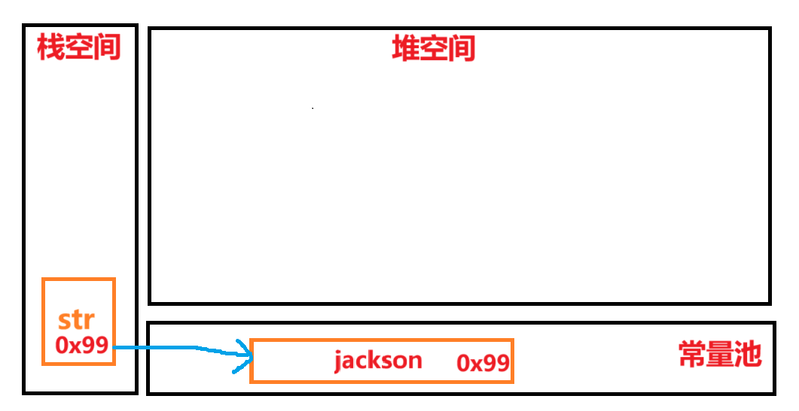
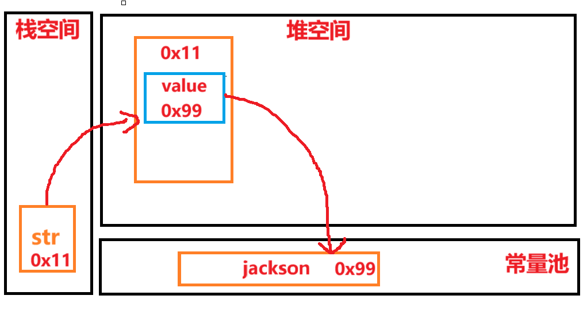
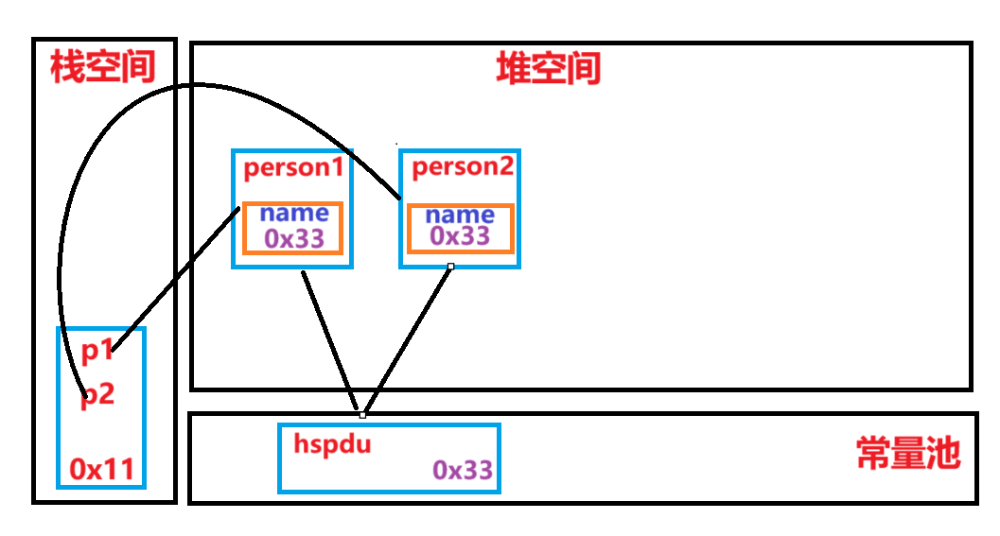
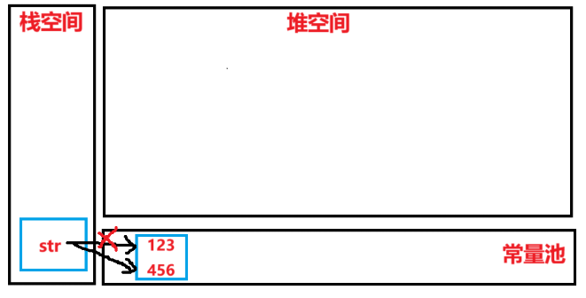
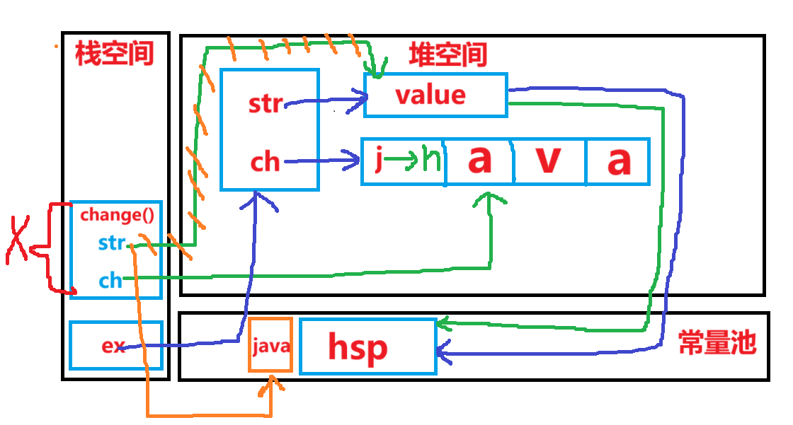

<h1 style="text-align: center; font-weight: bold;">String 类（重点）</h1>

---

## String 类关系图



## 基本介绍

#### （1）String 对象用于存储字符串，也就是一组字符序列

#### （2）字符串常量对象是用双引号括起的字符串序列

> #### 例如："你好"、"12.97"、"boy"等

#### （3）<span style="color:red">字符串</span>的字符使用 <span style="color:red">Unicode 字符编码</span>，一个字符(不区分字母还是汉字)占<span style="color:red">两个</span>字节

#### （4）String 类 是 <span style="color:red">final 类（⚠️ 内容不可变 ⚠️）</span>，不能被其他的类继承

#### （5）String 有属性 private <span style="color:red">final</span> char <span style="color:red">value</span> [ ]：用于存放字符串内容

#### （5）String 类<span style="color:red">常用构造器</span>

> #### String s1 = new String()
>
> #### String s2 = new String(String original)
>
> #### String s3 = new String(char [ ] a)
>
> #### String s4 = new String(char [ ] a, int startIndex, int count)

#### （6）String 类缺点

> #### 1. String 类 是保存字符串常量的，<span style="color:red">每次更新都要重新开辟空间，效率较低</span>
>
> #### 2. 后续可以用 StringBuffer 和 StringBuilder 来增强 String 的功能，提高效率

## ⭐String 对象创建机制

### 直接赋值

```java
String str = "jackson"
```

#### （1）先从常量池查看是否有"jackson"数据空间

#### （2）如果<span style="color:red">有</span>，直接<span style="color:red">指向</span>；如果<span style="color:red">没有</span>则重新<span style="color:red">创建</span>，然后<span style="color:red">指向</span>

#### （3）最终<span style="color:red">指向</span>的是<span style="color:red">常量池</span>的空间地址



### 调用构造器

```java
String str = new String("jackson")
```

#### （1）先在堆中创建空间，里面维护了 <span style="color:red">value 属性</span>，<span style="color:red">指向常量池</span>的 jackson 空间

#### （2）如果常量池有 "jackson"，直接通过 value 指向；如果没有，重新创建

#### （3）最终<span style="color:red">指向</span>的是<span style="color:red">堆中的空间地址</span>



### 第一题

```java
String a = "abc";
String b = "abc";
System.out.println(a.equals(b)); // T
System.out.println(a == b);      // T
```

#### 代码分析

> #### 1. equals 方法被重写，比较的是内容是否相同
>
> #### 2. 使用直接<span style="color:red">赋值法</span>，直接<span style="color:red">指向常量池的地址</span>
>
> #### （1）对于 a：常量池中没有 abc，需要创建
>
> #### （2）对于 b：常量值中有 abc，直接指向

### 第二题

```java
String a = new String("abc");
String b = new String("abc");
System.out.println(a.equals(b));  // T
System.out.println(a == b);       // F
```

#### 代码分析

> #### （1）字符串中重写了 equals()方法，比较的是字符串内容是否相同
>
> #### （2） 两个都是 new，是两个不同的对象，地址当然不 i 同

### 补充：intern()方法

> #### （1）如果池中已经包含一个等于此 String 对象的字符串（用 equals(Object) 方法确认）,则返回池中的字符串
>
> #### （2）否则，将此 String 对象添加到池中，并返回该 String 对象的引用。
>
> #### 总结：返回的是常量池的地址

### 第三题

```java
String a = "hsp";  // a指向常量池的"hsp"
String b = new String("hsp");  // b指向堆中对象
System.out.println(a.equals(b));  // T
System.out.println(a == b);       // F
System.out.println(a == b.intern());  // T 二者都指向常量池
System.out.println(b == b.intern());  // F b指向堆空间，b.intern()指向常量池
```

#### 代码分析

> #### （1）b.intern ( ) 返回的是常量池的地址
>
> #### （2） <span style="color:red">a</span> 指向的是<span style="color:red">常量池</span>；<span style="color:red">b</span> 指向的是<span style="color:red">堆空间</span>

### 第四题

```java
String s1 = "hspedu";  // 指向常量池 "hspedu"
String s2 = "java";    // 指向常量池 "java"
String s3 = new String("java"); // 指向堆中对象 "java"
String s4 = "java";    // 指向常量池 "java"
System.out.println(s2 == s3);  // F
System.out.println(s2 == s4);  // T
System.out.println(s2.equals(s3));  // T
System.out.println(s1 == s2);  // F
```

### 第五题

```java
Person p1 = new Person();
p1.name = "hspedu";
Person p2 = new Person();
p2.name = "hspedu";

System.out.println(p1.name.equals(p2.name)); // 比较内容：True
System.out.println(p1.name == p2.name);      // T
System.out.println(p1.name == "hspedu");     // T

String s1 = new String("bcde");
String s2 = new String("bcde");
System.out.println(s1 == s2); // False
```



## 字符串的特性

### 基本介绍

#### （1）String 是一个<span style="color:red">final 类</span>，<span style="color:red">内容不可变</span>

#### （2）可以通过<span style="color:red">修改引用</span>，间接的实现<span style="color:red">字符串内容的变化</span>

```java
String str = "123";
str = "456";
```



#### 底层分析

> #### （1）底层在常量池<span style="color:red">创建了两个对象</span>
>
> #### （1）首先在常量池创建 456 对象，通过改变 str 指向的地址（修改引用），实现了 str 内容的变化

### 第一题

```java
String a = "hello" + "abc";
```

#### 代码分析

> #### （1）底层<span style="color:red">创建了一个对象</span>
>
> #### （2）编译器会优化处理："hello" + "abc" 等价于 helloabc

### 第二题

```java
String a = "hello";
String b = "abc";
String c = a + b;
```

#### 代码分析

#### 1. 底层<span style="color:red">创建了三个对象</span>

#### 2. String c = a + b 的执行过程分析

> #### StringBuilder sb = new StringBuilder()
>
> #### sb.append(a)
>
> #### sb.append(b)
>
> #### sb 指向的是堆空间，并且 append 是在原来字符串的基础上追加的

#### 3. 总结

#### （1）<span style="color:red">常量</span>相加，看的是<span style="color:red">常量池</span>（String c1 = "ab" + "cd"）

#### （2）<span style="color:red">变量</span>相加，看的是<span style="color:red">堆空间</span>（String c1 = a + b）

### 第三题

```java
public class Test1 {
    String str = new String("hsp");
    final char[] ch = {'j', 'a', 'v', 'a'};

    public void change(String str, char[] ch) {
        str = "java";
        ch[0] = 'h';
    }

    public static void main(String[] args) {
        Test1 ex = new Test1();
        ex.change(ex.str, ex.ch);
        System.out.print(ex.str + " and ");
        System.out.println(ex.ch);
    }
}

// 输出结果
hsp and hava
```

> <h3>橙色的线代表调用 change 方法，str 指向的变化</h3>



## ⚠️String 拼接效率问题

```java
String s = "a"
```

> #### 初始时，常量池并没有 a 这个字符串，则会创建

```java
s += "b"
```

> #### （1）<span style="color:red">String 是不可变对象</span>，即字符的内容是无法修改的们只能通过修改引用间接实现修改字符串的内容
>
> #### （2）此时做<span style="color:red">字符串拼接</span>，底层会在常量池<span style="color:red">新创建一个对象</span> ab，然后修改字符串的引用
>
> #### （3）原先常量池中的字符串 a <span style="color:red">没有被引用</span>，底层执行<span style="color:red">垃圾回收机制</span>
>
> #### （4）如果<span style="color:red">多次执行拼接</span>操作，则会导致大量副本字符串对象存留在内存中，降低效率，<span style="color:red">极大影响程序的性能</span>
>
> #### （5）总结：如果需要<span style="color:red">字符串需要频繁修改</span>, 不要使用 String，可以使用 StringBuffer 或者 StringBuider（<span style="color:red">线程不安全</span>）

## ⭐String 类常用方法

### 基本介绍

| 方法                                                                  | 描述                                                                                                                                                              |
| --------------------------------------------------------------------- | ----------------------------------------------------------------------------------------------------------------------------------------------------------------- |
| equals                                                                | 区分大小写，判断内容是否相等                                                                                                                                      |
| equalsIgnoreCase                                                      | <span style="color:red">忽略大小写</span>的判断内容是否相等                                                                                                       |
| length                                                                | 获取字符串的个数，字符串的长度                                                                                                                                    |
| indexOf                                                               | 获取字符串在字符串中<span style="color:red">第 1 次</span>出现的索引，索引从 0 开始，如果<span style="color:red">找不到，返回 -1</span>                           |
| lastIndexOf                                                           | 获取字符串在字符串中<span style="color:red">最后 1 次</span>出现的索引，索引从 0 开始，如<span style="color:red">找不到，返回 -1</span>                           |
| substring                                                             | 截取指定范围的子串（<span style="color:red">传入下标</span>，<span style="color:red">区间左闭右开</span>）                                                        |
| trim                                                                  | 去前后空格                                                                                                                                                        |
| <span style="color:red">charAt（String 转 Char）</span>               | 获取某索引处的字符，注意不能使用 Str[index] 这种方式                                                                                                              |
| toUpperCase                                                           | <span style="color:red">全部</span>转换为<span style="color:red">大写</span>字母                                                                                  |
| toLowerCase                                                           | <span style="color:red">全部</span>转换为<span style="color:red">小写</span>字母                                                                                  |
| concat                                                                | 拼接字符串中的字符                                                                                                                                                |
| replace                                                               | 替换字符串中<span style="color:red">全部</span>要被替换的字符（传参：<span style="color:red">被替换的字符串</span>，<span style="color:red">替换的字符串</span>） |
| split                                                                 | 分割字符串，对于某些分割符，我们需要转义如 \\ 等                                                                                                                  |
| compareTo                                                             | 比较两个字符串的大小 （<span style="color:red">区别三种情况的比较方式</span>）                                                                                    |
| format                                                                | 格式化字符串，%s 字符串 %c 字符 %d 整型 %.2f 浮点型，<span style="color:red">%f 结果会自动四舍五入</span>                                                         |
| String.valueOf（<span style="color:red">char</span> arr，start，end） | 将<span style="color:red">字符数组</span>中指定范围的元素转换成字符串                                                                                             |
| <span style="color:red">toCharArray</span>                            | 转换成字符数组                                                                                                                                                    |
| <span style="color:red">copyValueOf(char[] data)</span>               | 复制 char[] 数组的内容，返回一个字符串                                                                                                                            |

### 代码示例

```java
public class StringMethodsExample {

    public static void main(String[] args) {

        // equals: 区分大小写，判断内容是否相等
        String a = "hello";
        String b = "Hello";
        System.out.println(a.equals(b));  // false

        // equalsIgnoreCase: 忽略大小写的判断内容是否相等
        System.out.println(a.equalsIgnoreCase(b));  // true

        // length: 获取字符串的个数，字符串的长度
        System.out.println("Length of 'hello': " + a.length());  // 5

        // indexOf: 获取字符串中第1次出现的索引
        String c = "hello world";
        System.out.println(c.indexOf('l'));  // 2

        // lastIndexOf: 获取字符串中最后1次出现的索引
        System.out.println(c.lastIndexOf('l'));  // 3

        // substring: 截取指定范围的子串
        System.out.println(c.substring(0, 5));  // hello

        // trim: 去前后空格
        String d = "   hello world   ";
        System.out.println(d.trim());  // "hello world"

        // charAt: 获取某索引处的字符
        System.out.println(c.charAt(0));  // h

        // toUpperCase: 转换为大写字母
        System.out.println(c.toUpperCase());  // HELLO WORLD

        // toLowerCase: 转换为小写字母
        System.out.println(c.toLowerCase());  // hello world

        // concat: 拼接字符串中的字符
        String e = "hello";
        String f = " world";
        System.out.println(e.concat(f));  // hello world

        // replace: 替换字符串中的字符
        System.out.println(c.replace('l', 'p'));  // heppo word

        // split: 分割字符串
        String g = "apple,banana,grape";
        String[] fruits = g.split(",");
        for (String fruit : fruits) {
            System.out.println(fruit + " ");
            /*
              apple banana grape
            */
        }

        // compareTo: 比较两个字符串的大小
        String h = "apple";
        String i = "banana";
        System.out.println(h.compareTo(i));  // -1 (apple < banana)

        // toCharArray: 转换成字符串数组
        char[] chars = h.toCharArray();
        for (char ch : chars) {
            System.out.println(ch);
            /*
               a
               p
               p
               l
               e
            */
        }

        // format: 格式化字符串
        String name = "John";
        int age = 30;
        System.out.println(String.format("My name is %s and I'm %d years old.", name, age));  // My name is John and I'm 30 years old.
    }
}

```

### concat（）

#### （1）可以传入<span style="color:red">变量</span>

#### （2）可以传入<span style="color:red">字符串常量</span>

#### （3）可以<span style="color:red">连续调用</span>

```java
String str = "I";
System.out.println(str.concat(" am").concat(" learning").concat(" java"));
// 输出：I am learning java

String str1 = "I am learning";
String str2 = " java";
String str3 = "!!!";
System.out.println(str1.concat(str2).concat(str3));
// 输出：I am learning java!!!
```

### split（）

#### （1）对字符分割，<span style="color:red">返回的是数组</span>

#### （2） 如果有<span style="color:red">特殊字符</span>，需要<span style="color:red">加转义符</span>（ \\ ）

```java
String str = "千里之行，始于足下";
String[] split_result = str.split("，");
for (int i = 0; i < split_result.length; i++) {
    System.out.println(split_result[i]);
}
// 输出结果
千里之行
始于足下

String str = "C:\\aaa\\bbb";
String[] split_reuslt = str.split("\\\\");
for (int i = 0; i < split_reuslt.length; i++) {
    System.out.println(split_reuslt[i]);
}
// 输出结果
C:
aaa
bbb
```

### replace（）

#### （1） 该方法会<span style="color:red">替换所有</span>需要被替换的字符

#### （2） 同样是可以传入<span style="color:red">常量</span>，也可以传入<span style="color:red">变量</span>

#### （3）返回的对象才是替换的结果，<span style="color:red">不会修改原字符串</span>

```java
String str = "jackson未来要走java后端，所以他正在学java";
System.out.println(str.replace("java","C++"));
// 输出：jackson未来要走C++后端，所以他正在学C++

String str1 = "我在学java";
String str2 = "C语言";
System.out.println(str1.replace("java",str2));
// 输出；我在学C语言
```

### compareTo（）

#### （1） 如果长度相同，并且每个个字符也相同，就<span style="color:red">返回 0</span>

```java
String str1 = "java";
String str2 = "java";
System.out.println(str1.compareTo(str2));

// 输出结果
0
```

#### （2）如果长度相同或者不相同，但是在比较时，可以区分大小

```java
String str1 = "javahahaha";
String str2 = "haha";
System.out.println(str1.compareTo(str2));

// 输出结果：2

解释：j 和 h 在字母表中的顺序相差 2
```

#### （3） 如果前面的部分都相同，就返回长度之差（ <span style="color:red">str1</span> . len - <span style="color:red">str2</span> . len ）

```java
String str1 = "javaha";
String str2 = "java";
System.out.println(str1.compareTo(str2));

// 输出结果
2

解释：多了两个字符 ha
```

### format（）

> #### 使用 <span style="color:red">%f</span> 占位符时，<span style="color:red">输出结果</span>会自动<span style="color:red">四舍五入</span>

```java
System.out.println(
    String.format
    ("%s今年%d岁了，正在学Java，未来打算走Java后端开发，期望薪资为%.1f","jackson",18,20000.55));

// 输出结果
jackson今年18岁了，正在学Java，未来打算走Java后端开发，期望薪资为20000.6
```
