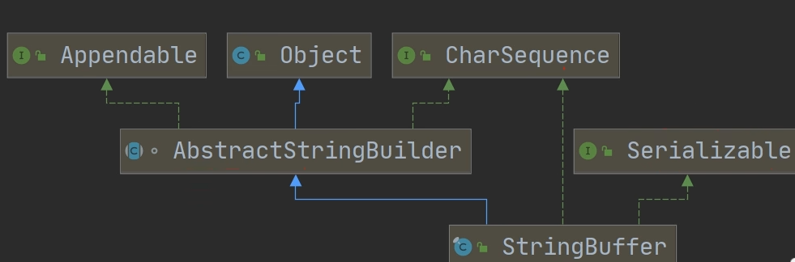

<h1 style="text-align: center; font-weight: bold;">StringBuffer（重点）</h1>

---

## 结构关系图



## 基本介绍

#### （1）StringBuffer 是<span style="color:red">可变的字符序列</span>，可以对字符串内容进行增删

> #### 对比：String 是不可变序列，内容无法修改

#### （2）StringBuffer 是<span style="color:red">线程安全</span>的

#### （3）StringBuffer 是一个<span style="color:red">容器</span>

#### （4）StringBuffer 是 <span style="color:red">final 类，不能被继承</span>

#### （5）StringBuffer <span style="color:red">实现了 Serializable</span>接口，即 StringBuffer 的对象<span style="color:red">可串行化的（可以在网络中传输）</span>

#### （6）数组的<span style="color:red">起始大小是 16</span>，如果<span style="color:red">大于 16</span> 个字符长度，会<span style="color:red">自动扩容</span>

#### （7）StringBuffer 的<span style="color:red">直接父类</span>是 AbstractStringBuilder，其中有属性 <span style="color:red">char [ ] value（不是 final）</span>，该 value 数组存放字符串内容

#### （8） 因为 StringBuffer 字符内容是存在 char [ ] value （<span style="color:red">堆空间</span>）, 在对字符串增加 / 删除时<span style="color:red">不用每次都更换地址</span>（即不是每次创建新对象），所以<span style="color:red">效率高于 String</span>

## String 转 StringBuffer

### 转换方法

#### （1）方法一：调用构造器，传入字符串，创建 StringBuffer 对象

#### （2）方法二：调用无参构造器创建 StringBuffer 对象，运用 append（）方法添加字符串

### 代码示例

```java
String str = "jackson";

// 方法一
StringBuffer stringBuffer = new StringBuffer(str);

// 方法二
StringBuffer stringBuffer1 = new StringBuffer();
stringBuffer1 = stringBuffer1.append(str);
```

## StringBuffer 转 String

#### （1）方法一：调用构造器，传入 StringBuffer 对象

#### （2）方法二：调用 StringBuffer 的 <span style="color:red">toString（）</span>方法

```java
StringBuffer stringBuffer = new StringBuffer("jackson");

// 方法一
String str1 = stringBuffer.toString();

// 方法二
String str2 = new String(stringBuffer);
```

## 常用方法

### 基本介绍

| 方法                            | 描述                                                                    |
| ------------------------------- | ----------------------------------------------------------------------- |
| append("字符串")                | 在字符串的末尾添加，可以连续调用                                        |
| delete(索引 1，索引 2)          | 索引区间是<span style="color:red">左闭右开</span>                       |
| deleteCharAt(索引)              | 删除指定索引的内容                                                      |
| replace(索引 1，索引 2，字符串) | 索引区间是<span style="color:red">左闭右开</span>                       |
| insert(索引，字符串)            | 指定索引位置插入字符串                                                  |
| reverse()                       | 翻转字符串                                                              |
| substring(索引 1，索引 2)       | 截取指定区间的子字符串，索引区间<span style="color:red">左闭右开</span> |
| indexOf("字符串")               | 获取<span style="color:red">第一次</span>出现的索引                     |
| lastIndexOf("字符串")           | 获取<span style="color:red">最后一次</span>出现的索引                   |

### 代码示例

```java
StringBuffer stringBuffer = new StringBuffer("hello~");

System.out.println("stringBuffer --> " + stringBuffer);

// append
stringBuffer.append("world");
System.out.println("append(\"world\") --> " + stringBuffer);

//delete
stringBuffer.delete(6,11);
System.out.println("delete(6,11) --> " + stringBuffer);

// deleteCharAt()
stringBuffer.deleteCharAt(5);
System.out.println("deleteCharAt(5) --> " + stringBuffer);

// insert()
stringBuffer.insert(5,"~world");
System.out.println("insert(5,\"~world\") --> " + stringBuffer);

// subString()
System.out.println("stringBuffer.substring(5,11) --> " + stringBuffer.substring(5,11));

// replace()
stringBuffer.replace(5,11,"");
System.out.println("replace(5,11,\"\") --> " + stringBuffer);

// indexOf()
System.out.println("indexOf(\"l\") --> " + stringBuffer.indexOf("l"));

// lastIndexOf()
System.out.println("lastIndexOf(\"l\") --> " + stringBuffer.lastIndexOf("l"));

// reverse()
System.out.println("reverse() --> " + stringBuffer.reverse());
```

#### 输出结果

```java
stringBuffer --> hello~
append("world") --> hello~world
delete(6,11) --> hello~
deleteCharAt(5) --> hello
insert(5,"~world") --> hello~world
stringBuffer.substring(5,11) --> ~world
replace(5,11,"") --> hello
indexOf("l") --> 2
lastIndexOf("l") --> 3
reverse() --> olleh
```

## 练习题

> #### 价格中小数点前的数字，每三位用逗号隔开

```java
String price = "8123564.59";
StringBuffer sb = new StringBuffer(price);

// 上面的两步需要做一个循环处理，才是正确的
for (int j = sb.lastIndexOf(".") - 3; j > 0; j -= 3) {
    sb = sb.insert(j, ",");
}

System.out.println(sb);  // 8,123,564.59
```
