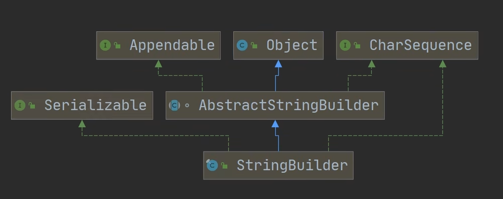

<h1 style="text-align: center; font-weight: bold;">StringBuilder（重点）</h1>

---

## 结构关系图



## 基本介绍

#### （1）StringBuilder 是一个<span style="color:red">可变的字符串序列</span>，且是<span style="color:red">线程不安全</span>的（没有做互斥处理，没有 synchronized 关键字）

#### （2） StringBuilder 适用于<span style="color:red">被频繁使用</span>的场景，它比 StringBuffer <span style="color:red">效率高</span>

#### （3） StringBuilder 是 <span style="color:red">final 类，不能被继承</span>

#### （4） 在 StringBuilder 上的<span style="color:red">主要操作是 append 和 insert 方法</span>，可重载这些方法，以接受任意类型的数值。

#### （5） StringBuilder 实现了 Serializable 接口，说明 StringBuilder 对象是<span style="color:red">可串行化的（可以在网络中传输）</span>

#### （6）StringBuilder 的<span style="color:red">直接父类</span>是 AbstractStringBuilder ，其中有属性 <span style="color:red">char [ ] value（不是 final）</span>，该 value 数组存放字符串内容

#### （7） 因为 StringBuilder 字符内容是存在 char [ ] value （<span style="color:red">堆空间</span>）, 在对字符串增加 / 删除时<span style="color:red">不用每次都更换地址</span>（即不是每次创建新对象），所以<span style="color:red">效率高于 String</span>

## 常用方法

### 基本介绍

> #### StringBuider 的<span style="color:red">方法与 StringBuffer 兼容</span>，调用 StringBuffer 中相应的方法即可

| 方法                                        | 描述                                                                    |
| ------------------------------------------- | ----------------------------------------------------------------------- |
| append("字符串")                            | 在字符串的末尾添加，可以连续调用                                        |
| delete(索引 1，索引 2)                      | 索引区间是<span style="color:red">左闭右开</span>                       |
| deleteCharAt(索引)                          | 删除指定索引的内容                                                      |
| replace(索引 1，索引 2，字符串)             | 索引区间是<span style="color:red">左闭右开</span>                       |
| insert(索引，字符串)                        | 指定索引位置插入字符串                                                  |
| reverse()                                   | 翻转字符串                                                              |
| substring(索引 1，索引 2)                   | 截取指定区间的子字符串，索引区间<span style="color:red">左闭右开</span> |
| indexOf("字符串")                           | 获取<span style="color:red">第一次</span>出现的索引                     |
| lastIndexOf("字符串")                       | 获取<span style="color:red">最后一次</span>出现的索引                   |
| <span style="color:red">setLength(0)</span> | 清空内容，但是缓存空间仍然保留，下次直接复用，性能更好                  |

### 代码示例

```java
StringBuffer stringBuffer = new StringBuffer("hello~");

System.out.println("stringBuffer --> " + stringBuffer);

// append
stringBuffer.append("world");
System.out.println("append(\"world\") --> " + stringBuffer);

//delete
stringBuffer.delete(6,11);
System.out.println("delete(6,11) --> " + stringBuffer);

// deleteCharAt()
stringBuffer.deleteCharAt(5);
System.out.println("deleteCharAt(5) --> " + stringBuffer);

// insert()
stringBuffer.insert(5,"~world");
System.out.println("insert(5,\"~world\") --> " + stringBuffer);

// subString()
System.out.println("stringBuffer.substring(5,11) --> " + stringBuffer.substring(5,11));

// replace()
stringBuffer.replace(5,11,"");
System.out.println("replace(5,11,\"\") --> " + stringBuffer);

// indexOf()
System.out.println("indexOf(\"l\") --> " + stringBuffer.indexOf("l"));

// lastIndexOf()
System.out.println("lastIndexOf(\"l\") --> " + stringBuffer.lastIndexOf("l"));

// reverse()
System.out.println("reverse() --> " + stringBuffer.reverse());
```

#### 输出结果

```java
stringBuffer --> hello~
append("world") --> hello~world
delete(6,11) --> hello~
deleteCharAt(5) --> hello
insert(5,"~world") --> hello~world
stringBuffer.substring(5,11) --> ~world
replace(5,11,"") --> hello
indexOf("l") --> 2
lastIndexOf("l") --> 3
reverse() --> olleh
```
