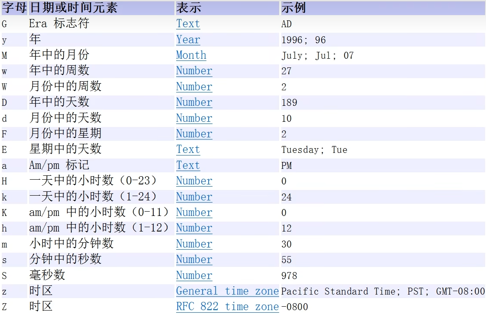

<h1 style="text-align: center; font-weight: bold;">日期类</h1>

---

## 第一代日期：Date

### Date

> #### 精确到毫秒，代表特定的瞬间

#### 相关方法

> #### （1）调用无参构造器：获取当前时间
>
> #### （2）构造器中传入数值（<span style="color:red">单位是毫秒</span>），计算从 <span style="color:red">1970 - 1 - 1 00:00:00</span> 开始，经过传入数值（毫秒）后的时间

### SimpleDateFormat

> #### 日期格式化（1）日期 --> 文本（2）文本 --> 日期

#### Date 格式化参数表



#### 相关方法

#### （1）创建对象，传入格式化日期形式的字符串

> #### <span style="color:red">yyy 年 MM 月 dd 日 hh:mm:ss E</span>，只有<span style="color:red">月份</span>的参数<span style="color:red">大写</span>，其余均为小写

#### （2）format（）：日期格式化为字符串

#### （3）parse（）：字符串转日期

> #### 1. 输出时会按照国外的形式输出，如果希望指定格式输出，需要使用 format （）格式化
>
> #### 2. String 中的格式必须和 SimpleDateFormat 中传入构造器的<span style="color:red">字符串格式一样</span>，否则会抛出 ParseException 转换异常

### 代码示例

```java
import java.text.ParseException;
import java.text.SimpleDateFormat;
import java.util.Date;

public class main {
    public static void main(String[] args) throws ParseException {
        Date date = new Date();
        System.out.println("date：" + date);

        Date date1 = new Date(89875);
        System.out.println("date1：" + date1);

        // 使用 SimpleDateFormat 来格式化日期（Date --> String）
        SimpleDateFormat sf = new SimpleDateFormat("yyyy 年 MM 月 dd 日 hh:mm:ss E");
        String format_date = sf.format(date);
        System.out.println("Formatted date: " + format_date);

        // String --> Date
        String s = "1996 年 01 月 01 日 10:20:30 星期一";
        Date String_to_Date = sf.parse(s);
        System.out.println("parse = " + sf.format(String_to_Date));
    }
}

// 输出结果
date：Sun Jun 08 17:51:23 CST 2025
date1：Thu Jan 01 08:01:29 CST 1970
Formatted date: 2025 年 06 月 08 日 05:51:23 星期日
parse = 1996 年 01 月 01 日 10:20:30 星期一
```

## 第二代日期：Calendar

### 基本介绍

#### （1）Calendar 类是一个<span style="color:red">抽象类</span>，<span style="color:red">构造器</span>是由<span style="color:red">private</span>修饰的，即<span style="color:red">不可以创建该对象</span>

#### （2）获取 Calendar 对象： <span style="color:red">getInstance（）</span>方法

#### （3）该类为特定时间与一组诸如 YEAR, MONTH, DAY_OF_MONTH, HOUR 等日历字段，可用于获取日期的相关信息

#### （4）Calendar 类<span style="color:red">没有日期格式化</span>的方法，使用 <span style="color:red">get（）</span>方法获取日期字段，通过<span style="color:red">日期字段拼接</span>的方法<span style="color:red">实现日期格式化</span>

### 常用字段

> #### 调用方法：<span style="color:red">Calendar . 字段</span>

| 字段                                        | 描述                                                            |
| ------------------------------------------- | --------------------------------------------------------------- |
| YEAR                                        | 年份                                                            |
| <span style="color:red">MONTH</span>        | 月份（0-11） <span style="color:red">从 0 开始编号</span>       |
| <span style="color:red">DAY_OF_MONTH</span> | 当前月的天数                                                    |
| HOUR                                        | 当前小时（0-23）                                                |
| MINUTE                                      | 当前分钟（0-59）                                                |
| SECOND                                      | 当前秒数（0-59）                                                |
| DAY_OF_WEEK                                 | 一周中的某一天（1-7，1 代表星期天）                             |
| WEEK_OF_YEAR                                | 一年的第几周                                                    |
| WEEK_OF_MONTH                               | 当前月的第几周                                                  |
| <span style="color:red">AM_PM</span>        | 上午或下午（<span style="color:red">0 为上午，1 为下午</span>） |

### 相关方法

#### （1）<span style="color:red">getInstance（）</span>：获取 Calendar 对象

#### （1）<span style="color:red">get （Calendar . 字段）</span>：获取日期的相关信息

#### （2）<span style="color:red">getTime（）</span>：获取当前时间

```java
Calendar date = Calendar.getInstance();

// 输出当前日期时间
System.out.println("日期：" + date.getTime());
```

### 代码示例

```java
package arrays;

import java.util.Calendar;

public class main {
    public static void main(String[] args) {
        Calendar date = Calendar.getInstance();

        // 输出当前日期时间
        System.out.println("=====输出当前日期时间=====");
        System.out.println("日期：" + date.getTime());
        System.out.println();

        // 输出年、月、日、时、分、秒等信息
        System.out.println("=====输出年、月、日、时、分、秒等信息=====");
        System.out.println("年：" + date.get(Calendar.YEAR));
        System.out.println("月：" + (date.get(Calendar.MONTH) + 1)); // 月份是从0开始的，所以要加1
        System.out.println("日：" + date.get(Calendar.DAY_OF_MONTH));
        System.out.println("小时：" + date.get(Calendar.HOUR_OF_DAY)); // 24小时制
        System.out.println("分钟：" + date.get(Calendar.MINUTE));
        System.out.println("秒：" + date.get(Calendar.SECOND));
        System.out.println();

        // 拼接年月日时分秒
        System.out.println("=====拼接年月日时分秒=====");
        String currentDateTime = date.get(Calendar.YEAR) + "年"
                + (date.get(Calendar.MONTH) + 1) + "月"
                + date.get(Calendar.DAY_OF_MONTH) + "日 "
                + date.get(Calendar.HOUR_OF_DAY) + ":"
                + date.get(Calendar.MINUTE) + ":"
                + date.get(Calendar.SECOND);

        System.out.println("当前时间：" + currentDateTime);
        System.out.println();

        // 输出一周中的某一天、周数等
        System.out.println("=====输出一周中的某一天、周数等=====");
        System.out.println("星期几：" + date.get(Calendar.DAY_OF_WEEK)); // 1代表星期天，7代表星期六
        System.out.println("一年中的第几周：" + date.get(Calendar.WEEK_OF_YEAR));
        System.out.println("当前月的第几周：" + date.get(Calendar.WEEK_OF_MONTH));
        System.out.println();

        // 输出上午下午信息
        System.out.println("=====输出上午下午信息=====");
        System.out.println("上午 / 下午：" + (date.get(Calendar.AM_PM)));
    }
}

// 输出结果
=====输出当前日期时间=====
日期：Sun Jun 08 18:14:53 CST 2025

=====输出年、月、日、时、分、秒等信息=====
年：2025
月：6
日：8
小时：18
分钟：14
秒：53

=====拼接年月日时分秒=====
当前时间：2025年6月8日 18:14:53

=====输出一周中的某一天、周数等=====
星期几：1
一年中的第几周：24
当前月的第几周：2

=====输出上午下午信息=====
上午 / 下午：1

```

## 第三代日期

### 前两代日期的不足

#### Date

> #### JDK 1.0 中包含了一个 java.util.Date 类，但是它的<span style="color:red">大多数方法</span>已经在 JDK 1.1 引入 Calendar 类之后<span style="color:red">被弃用</span>了

#### Calendar

> #### （1） 可变性：像日期和时间这种类别应该是不可变的。
>
> #### （2） 偏移性：Date 中的年份是从 1900 开始的，而月份都从 0 开始。
>
> #### （3） 格式化：格式化只对 Date 有效，Calendar 则不行。

#### ⚠️ 共同的缺点：它们<span style="color:red">不是线程安全</span>的；不能处理时区秒等（每隔 2 天，多出 1s）

### 基本介绍

#### （1）LocalDate

> #### 用于表示没有时间部分的日期（年、月、日）。例如：2025-06-08

#### （2）LocalTime

> #### 用于表示没有日期部分的时间（小时、分钟、秒）。例如：17:30:00。

#### （3）LocalDateTime

> #### 用于表示日期和时间。可以精确到秒或纳秒。例如：2025-06-08T17:30:00

### 相关方法

#### （1）通用方法

> #### 获取当前时间：<span style="color:red">now（）</span>
>
> #### 日期转为字符串：<span style="color:red">toString（）</span>

#### （2）获取日期的相关信息：<span style="color:red">get...（）</span>方法

> #### ⚠️ 注意：get（） 方法<span style="color:red">返回的是真实数据，并且不会从 0 开始编号</span>

| 方法                                                     | 描述                                                                     |
| -------------------------------------------------------- | ------------------------------------------------------------------------ |
| **年月日相关**                                           |                                                                          |
| getYear()                                                | 获取当前年份                                                             |
| <span style="color:red">getMonthValue()</span>           | 获取当前月份（<span style="color:red">1-12</span>）                      |
| getMonth()                                               | 获取当前月份的<span style="color:red">名称</span>                        |
| getDayOfMonth()                                          | 获取<span style="color:red">当前日期</span>（1-31）                      |
| getDayOfYear()                                           | 获取<span style="color:red">当前日期是今年的第几天</span>（1 - 365/366） |
| <span style="color:red">getDayOfWeek().getValue()</span> | 获取当前星期几（1=星期一, 7=星期天）                                     |
| **时分秒相关**                                           |                                                                          |
| getHour()                                                | 获取当前小时（0-23）                                                     |
| getMinute()                                              | 获取当前分钟（0-59）                                                     |
| getSecond()                                              | 获取当前秒数（0-59）                                                     |

#### （3）创建时间：<span style="color:red">of（）</span>方法

| 方法名                                           | 描述                                                              |
| ------------------------------------------------ | ----------------------------------------------------------------- |
| LocalTime.of(hour, minute)                       | 创建一个表示特定时间的 LocalTime 对象（包含小时、分钟）           |
| LocalTime.of(hour, minute, second)               | 创建一个表示特定时间的 LocalTime 对象（包含小时、分钟和秒）       |
| LocalTime.of(hour, minute, second, nanoOfSecond) | 创建一个表示特定时间的 LocalTime 对象（包含小时、分钟、秒和纳秒） |
| LocalDateTime.of(LocalDate, LocalTime)           | 创建一个表示特定日期和时间的 LocalDateTime 对象（包含日期和时间） |

#### （4）LocalDateTime 日期转换

> #### 转为 LocalDate：toLocalDate（）
>
> #### 转为 LocalTime：toLocalTime（）

### 代码示例

> #### LocalDate 和 LocalTime 方法类似，这以 LocalDateTime 为例

```java
import java.time.LocalDateTime;

public class main {
    public static void main(String[] args) {
        LocalDateTime now = LocalDateTime.now();

        // 年月日相关
        System.out.println("当前年份: " + now.getYear());
        System.out.println("当前月份（1-12）: " + now.getMonthValue());
        System.out.println("当前月份名称: " + now.getMonth());
        System.out.println("当前日期（1-31）: " + now.getDayOfMonth());
        System.out.println("当前日期是今年的第几天: " + now.getDayOfYear());
        System.out.println("当前星期几（1=星期一, 7=星期天）: " + now.getDayOfWeek().getValue());

        // 时分秒相关
        System.out.println("当前小时（0-23）: " + now.getHour());
        System.out.println("当前分钟（0-59）: " + now.getMinute());
        System.out.println("当前秒数（0-59）: " + now.getSecond());
    }
}

// 输出信息
当前年份: 2025
当前月份（1-12）: 6
当前月份名称: JUNE
当前日期（1-31）: 8
当前日期是今年的第几天: 159
当前星期几（1=星期一, 7=星期天）: 7
当前小时（0-23）: 19
当前分钟（0-59）: 55
当前秒数（0-59）: 59
```

### DateTimeFormatter

> #### 该类是 <span style="color:red">final 类</span>，且是<span style="color:red">线程安全</span>的

#### 1. ofPattern（）

> #### （1）传入格式化日期形式的字符串，创建 DateTimeFormatter 类对象
>
> #### （2）<span style="color:red">yyyy-MM-dd HH:mm:ss E</span>，<span style="color:red">月份和小时</span>的参数需要<span style="color:red">大写</span>，其余参数都是小写

#### ⚠️ 对比：Date 中的 <span style="color:red">SimpleDateFormat</span> 传入的格式化字符串，只有<span style="color:red">月份</span>的参数需要<span style="color:red">大写</span>

#### 2. format（）

> #### 作用：日期格式化为字符串

#### 代码示例

```java
import java.time.LocalDateTime;
import java.time.format.DateTimeFormatter;

public class main {
    public static void main(String[] args) {
        LocalDateTime now  = LocalDateTime.now();

        // 创建格式化对象
        DateTimeFormatter dtf = DateTimeFormatter.ofPattern("yyyy-MM-dd HH:mm:ss E");

        // 格式化字符串
        String format_date = dtf.format(now);

        // 输出格式化后的时间信息
        System.out.println(format_date);
    }
}

// 输出示例
2025-06-08 20:14:56 星期日
```

#### 3. parse（）

> #### 作用：<span style="color:red">把字符串转为日期</span>
>
> #### 方法参数：parse（n1，n2）
>
> #### （1）n1 ： 需要转为日期的字符串
>
> #### （2）n2：<span style="color:red">DateTimeFormatter 对象</span>，用于指定解析的格式

#### ⚠️ 注意：传入的字符串要和格式化字符串匹配，否则会抛出 DateTimeParseException 异常

#### 代码示例

```java
import java.time.LocalDateTime;
import java.time.format.DateTimeFormatter;

public class main {
    public static void main(String[] args) {
        String str_datetime = "2025-06-08 14:30:00";

        // 创建格式化对象
        DateTimeFormatter dtf = DateTimeFormatter.ofPattern("yyyy-MM-dd HH:mm:ss");

        // String --> LocalDateTime
        LocalDateTime localDateTime = LocalDateTime.parse(str_datetime,dtf);

        System.out.println(localDateTime);
    }
}

// 输出结果
2025-06-08T14:30
```

### 日期计算（年月日）

#### （1）相关方法

| 方法                               | 解释                                                   |
| ---------------------------------- | ------------------------------------------------------ |
| plusDays(long daysToAdd)           | 将指定的天数加到当前日期（LocalDate、LocalDateTime）   |
| minusDays(long daysToSubtract)     | 从当前日期（LocalDate、LocalDateTime）中减去指定的天数 |
| plusMonths(long monthsToAdd)       | 将指定的月数加到当前日期（LocalDate、LocalDateTime）   |
| minusMonths(long monthsToSubtract) | 从当前日期（LocalDate、LocalDateTime）中减去指定的月数 |
| plusYears(long yearsToAdd)         | 将指定的年数加到当前日期（LocalDate、LocalDateTime）   |
| minusYears(long yearsToSubtract)   | 从当前日期（LocalDate、LocalDateTime）中减去指定的年数 |

#### （2）代码示例

```java
import java.time.LocalDateTime;
import java.time.format.DateTimeFormatter;

public class main {
    public static void main(String[] args) {
        // 获取当前时间
        LocalDateTime now = LocalDateTime.now();

        // 定义日期格式化器
        DateTimeFormatter formatter = DateTimeFormatter.ofPattern("yyyy-MM-dd HH:mm:ss");

        // 格式化当前日期
        String formattedDate = now.format(formatter);
        System.out.println("当前日期和时间（格式化）: " + formattedDate);

        // 添加和减去天数并格式化
        LocalDateTime newDate = now.plusDays(10);
        System.out.println("加10天后的日期（格式化）: " + newDate.format(formatter));

        newDate = now.minusDays(5);
        System.out.println("减去5天后的日期（格式化）: " + newDate.format(formatter));

        // 添加和减去月数并格式化
        newDate = now.plusMonths(3);
        System.out.println("加3个月后的日期（格式化）: " + newDate.format(formatter));

        newDate = now.minusMonths(2);
        System.out.println("减去2个月后的日期（格式化）: " + newDate.format(formatter));

        // 添加和减去年数并格式化
        newDate = now.plusYears(1);
        System.out.println("加1年后的日期（格式化）: " + newDate.format(formatter));

        newDate = now.minusYears(4);
        System.out.println("减去4年后的日期（格式化）: " + newDate.format(formatter));
    }
}

// 输出结果
当前日期和时间（格式化）: 2025-06-08 20:48:42
加10天后的日期（格式化）: 2025-06-18 20:48:42
减去5天后的日期（格式化）: 2025-06-03 20:48:42
加3个月后的日期（格式化）: 2025-09-08 20:48:42
减去2个月后的日期（格式化）: 2025-04-08 20:48:42
加1年后的日期（格式化）: 2026-06-08 20:48:42
减去4年后的日期（格式化）: 2021-06-08 20:48:42
```

### 时间戳

#### 基本介绍

> #### 表示自 1970 年 1 月 1 日（UTC）以来的毫秒数，通常与 UTC 时间一起使用，精确到纳秒
>
> #### 例如：2025-06-08T09:30:00Z。

#### 相关方法

#### （1）<span style="color:red">from（）</span>：Instant <span style="color:red">转 Date</span>

#### （2）<span style="color:red">toInstant（）</span>：Date <span style="color:red">转 Instant</span>

#### 代码示例

```java
import java.time.Instant;
import java.util.Date;

public class main {
    public static void main(String[] args) {
        // 获取当前时间戳
        Instant instant_now = Instant.now();
        System.out.println("instant_now：" + instant_now);

        // Instant --> Date
        Date date = Date.from(instant_now);
        System.out.println("date：" + date);

        // Date --> instant
        Instant date_to_instant = date.toInstant();
        System.out.println(date_to_instant);
    }
}
```

## Period

### 基本介绍

> #### 常用于计算两个<span style="color:red">日期之间（年月日）</span>的差异

### 相关方法

#### （1）getYears（）：获取日期差的年份

#### （2）getMonths（）：获取日期差的月份

#### （3）getDays（）：获取日期差的天数

#### （4）between（）方法：计算日期差

| 方法名           | 传入参数类型                             | 适用情况                     | 说明                                                                    |
| ---------------- | ---------------------------------------- | ---------------------------- | ----------------------------------------------------------------------- |
| Period.between() | <span style="color:red">LocalDate</span> | 用于计算日期差（年、月、日） | 只能用于 LocalDate 类型的日期之间的差异。无法处理时间差（时、分、秒）。 |

### 代码示例

```java
import java.time.LocalDate;
import java.time.Period;

public class PeriodExample {
    public static void main(String[] args) {
        LocalDate startDate = LocalDate.of(2020, 1, 1);
        LocalDate endDate = LocalDate.of(2025, 6, 8);

        Period period = Period.between(startDate, endDate);

        System.out.println("期间：");
        System.out.println("年: " + period.getYears());
        System.out.println("月: " + period.getMonths());
        System.out.println("日: " + period.getDays());
    }
}

// 输出结果
期间：
年: 5
月: 5
日: 7
```

## Duration

### 基本介绍

> #### 常用于计算<span style="color:red">两个时间点（时分秒）</span>之间的差异

### 相关方法

#### （1）toHours（）：获取时间差的小时数

#### （2）toMinutes（）：获取时间差的分钟数

#### （3）getSeconds（）：获取时间差的秒数

#### （4）between（）方法：计算时间差

| 方法名             | 传入参数类型                                                                    | 适用情况                     | 说明                                                                                                    |
| ------------------ | ------------------------------------------------------------------------------- | ---------------------------- | ------------------------------------------------------------------------------------------------------- |
| Duration.between() | Temporal（如 <span style="color:red">LocalTime, LocalDateTime, Instant</span>） | 用于计算时间差（时、分、秒） | Temporal 是一个接口，LocalTime、LocalDateTime 和 Instant 实现了此接口，可以用于计算这三者之间的时间差。 |

### 代码示例

```java
import java.time.Duration;
import java.time.LocalDateTime;

public class DurationExample {
    public static void main(String[] args) {
        LocalDateTime startTime = LocalDateTime.of(2025, 6, 8, 10, 30, 0);
        LocalDateTime endTime = LocalDateTime.of(2025, 6, 9, 12, 45, 0);

        Duration duration = Duration.between(startTime, endTime);

        System.out.println("持续时间：");
        System.out.println("小时: " + duration.toHours());
        System.out.println("分钟: " + duration.toMinutes());
        System.out.println("秒: " + duration.getSeconds());
    }
}

// 运行结果
持续时间：
小时: 26
分钟: 1575
秒: 94500
```

## ⭐ 日期综合计算

> #### Period 类和 Duration 类的综合使用，计算年月日 + 时分秒之差
>
> #### ⚠️ 注意：在打印结果时，<span style="color:red">时间差结果需要取模</span>

```java
import java.time.Duration;
import java.time.LocalDateTime;
import java.time.Period;


public class main {
    public static void main(String[] args) {
        // 定义两个时间点
        LocalDateTime start = LocalDateTime.of(2025, 6, 1, 14, 30, 0);
        LocalDateTime end = LocalDateTime.of(2025, 6, 8, 18, 45, 30);

        // 计算日期差（年月日）
        Period period = Period.between(start.toLocalDate(), end.toLocalDate());

        // 计算时分秒差（从完整的时间差中提取）
        Duration duration = Duration.between(start, end);

        // 计算日期差（年、月、天）
        int years = period.getYears();
        int months = period.getMonths();
        int days = period.getDays();

        // 计算时间差（时、分、秒）
        long hours = duration.toHours() % 24; // 剩余小时
        long minutes = duration.toMinutes() % 60; // 剩余分钟
        long seconds = duration.getSeconds() % 60; // 剩余秒数

        // 输出日期差（年、月、天）
        System.out.println("日期差： " + years + "年 " + months + "月 " + days + "天");

        // 输出时间差（时、分、秒）
        System.out.println("时分秒差： " + hours + "小时 " + minutes + "分钟 " + seconds + "秒");
    }

// 运行结果
日期差： 0年 0月 7天
时分秒差： 4小时 15分钟 30秒
```
