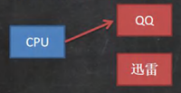
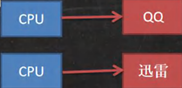
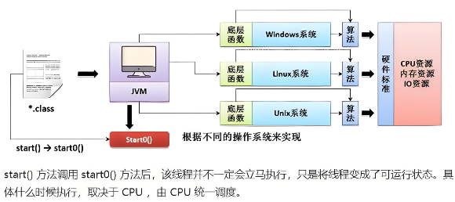

<h1 style="text-align: center; font-weight: bold;">线程基础</h1>

---

## 基本概念

### 程序

> #### 是为完成特定任务，用某种语言编写的一组指令的集合（即代码）

### 进程

> #### （1）进程是程序的一次执行过程，或是正在运行的一个程序，是<span style="color:red">动态过程</span>（有它自身的产生，存在和消亡的过程）
>
> #### （2）进程的启动<span style="color:red">会占用相应的资源</span>（CPU、内存等）
>
> #### （3）通俗理解：进程是指运行的程序，启动一个程序（打开一个软件）的过程就是启动一个进程，关闭程序的过程就是进程的消亡过程

### 线程

> #### （1）线程是由进程创建的，<span style="color:red">是进程的一个实体</span>
>
> #### （2）一个进程<span style="color:red">可以拥有多个线程</span>
>
> #### （3）举例：百度网盘同时下载多个文件，这就是<span style="color:red">多线程</span>

### 单线程

> #### 同一个时刻，只允许执行一个进程

### 多线程

> #### 同一个时刻，可以执行多个线程（举例：QQ 可以同时打开多个聊天窗口）

### 并发

> #### （1）同一个时刻，多个任务交替执行，造成一种 “ 貌似同时 ” 的错觉
>
> #### （2）实例：单核 CPU 实现的多任务就是并发



> #### 解释：由一个 CPU 来回切换任务，然后执行，这个过程很迅速

### 并行

> #### （1）同一个时刻，多个任务同时执行，多喝 CPU 可以实现并行，并发和并行
>
> #### （2）实例：多个 CPU 同时存在，每个 CPU 执行自己的进程



> #### 注意：<span style="color:red">每个 CPU 也可以实现并发</span>

### 创建线程的两种方法

> #### （1）<span style="color:red">继承 Thread 类</span>，重 run 方法
>
> #### （2）<span style="color:red">实现 Runnable 接口</span>，重写 run 方法

## 继承 Thead 类

### 代码示例

```java
package Thread;

public class main {
    public static void main(String[] args) {
        a a = new a();
        a.start();
        int i = 0;
        while (true) {
            System.out.println("main " + ++i + "--->" + Thread.currentThread().getName());
            try {
                Thread.sleep(1000);
            } catch (InterruptedException e) {
                e.printStackTrace();
            }
            if (i == 5) {
                break;
            }
        }
    }
}

class a extends Thread {
    @Override
    public void run() {
        int i = 0;
        while (true) {
            System.out.println("hello " + ++i + "--->" +  Thread.currentThread().getName());
            try {
                Thread.sleep(1000);
            } catch (InterruptedException e) {
                e.printStackTrace();
            }
            if (i == 10) {
                break;
            }
        }
    }
}

// 运行结果
main 1--->main
hello 1--->Thread-0
main 2--->main
hello 2--->Thread-0
hello 3--->Thread-0
main 3--->main
main 4--->main
hello 4--->Thread-0
main 5--->main
hello 5--->Thread-0
hello 6--->Thread-0
hello 7--->Thread-0
hello 8--->Thread-0
hello 9--->Thread-0
hello 10--->Thread-0
```

#### 代码分析

> #### （1）<span style="color:red">sleep()方法会抛出异常</span>，需要用 try - catch 包裹
>
> #### （2）关系：sleep()方法休眠的<span style="color:red">单位是毫秒</span>，<span style="color:red">1000 毫秒=1 秒</span>
>
> #### （3）获取线程名称的方法：Thread.currentThread().getName()
>
> #### （4）<span style="color:red">主线程的结束并不会导致进程的结束</span>，需要等到所有线程都执行完成进程才会退出

### 启动线程

> #### 真正<span style="color:red">启动线程</span>的是 <span style="color:red">start()</span>方法，而不是 run()方法，run()方法是普通方法，会造成线程阻塞

### ⭐start()方法

#### （1）首先 start()方法会调用 <span style="color:red">start0()</span> 方法

#### （2）start0()方法是<span style="color:red">native</span>方法，<span style="color:red">由 JVM 机调用</span>

#### （3）何时启动线程还需根据其他依据综合考虑



#### （4）如调用 run()方法，并不会启动线程，而是等 run()方法执行完之后才会启动 main 方法的调用

> #### 这里 run()方法的线程名就是 main，即<span style="color:red">调用 run()方法并没有启动线程</span>

```java
public class main {
    public static void main(String[] args) {
        a a = new a();
        a.run();
        int i = 0;
        while (true) {
            System.out.println("main " + ++i + "--->" + Thread.currentThread().getName());
            try {
                Thread.sleep(1000);
            } catch (InterruptedException e) {
                e.printStackTrace();
            }
            if (i == 5) {
                break;
            }
        }
    }
}

class a extends Thread {
    @Override
    public void run() {
        int i = 0;
        while (true) {
            System.out.println("hello " + ++i + "--->" +  Thread.currentThread().getName());
            try {
                Thread.sleep(1000);
            } catch (InterruptedException e) {
                e.printStackTrace();
            }
            if (i == 10) {
                break;
            }
        }
    }
}

// 运行结果
hello 1--->main
hello 2--->main
hello 3--->main
hello 4--->main
hello 5--->main
hello 6--->main
hello 7--->main
hello 8--->main
hello 9--->main
hello 10--->main
main 1--->main
main 2--->main
main 3--->main
main 4--->main
main 5--->main
```

## 实现 Runnable 接口

### 基本介绍

> #### （1）由于<span style="color:red">Java 是单继承机制</span>，如果类继承了其他类，这个时候可以通过实现接口的方式创建线程
>
> #### （2）实现 Runnable 接口方式更适合多<span style="color:red">个线程共享一个资源</span>的情况，并且避免了单继承的限制，建议使用 Runnable
>
> #### （3）<span style="color:red">Runnable 接口没有 start（）方法</span>，类实现接口后，实现 run（）方法，需要在主线程中创建 Thread 类，<span style="color:red">调用 Thread 类的 start（）方法启动线程</span>，采用了<span style="color:red">静态代理模式</span>

### 代码示例

```java
package Thread;

public class main {
    public static void main(String[] args) {
        a a = new a();
        Thread thread = new Thread(a);
        thread.start();
        int i = 0;
        while (true) {
            System.out.println("main " + ++i + "--->" + Thread.currentThread().getName());
            try {
                Thread.sleep(1000);
            } catch (InterruptedException e) {
                e.printStackTrace();
            }
            if (i == 5) {
                break;
            }
        }
    }
}

class a implements Runnable {
    @Override
    public void run() {
        int i = 0;
        while (true) {
            System.out.println("hello " + ++i + "--->" +  Thread.currentThread().getName());
            try {
                Thread.sleep(1000);
            } catch (InterruptedException e) {
                e.printStackTrace();
            }
            if (i == 10) {
                break;
            }
        }
    }
}

// 运行结果
main 1--->main
hello 1--->Thread-0
main 2--->main
hello 2--->Thread-0
hello 3--->Thread-0
main 3--->main
main 4--->main
hello 4--->Thread-0
hello 5--->Thread-0
main 5--->main
hello 6--->Thread-0
hello 7--->Thread-0
hello 8--->Thread-0
hello 9--->Thread-0
hello 10--->Thread-0
```

#### 代码分析

#### （1）实现了<span style="color:red">Runnable 接口</span>，但是这个接口中并<span style="color:red">没有 start()方法</span>，不可以直接调用

#### （2）通过把 a 对象作为参数传入构造器中，调用构造器创建 Thread 对象，调用 Thread 对象的 start()方法

### 模拟 Thread 类

> #### 为什么调用 Thread 的 start()方法就可以调用 a 类的 run()方法？底层采用了<span style="color:red">静态代理模式</span>

#### 思路分析

> #### 既然 Runnable 接口没有 start()方法，那就借助 Thread 类，让它来实现 start()方法（<span style="color:red">体现代理</span>）

```java
public class main {
    public static void main(String[] args) {
        test test = new test();
        Thread_proxy thread_proxy = new Thread_proxy(test);
        thread_proxy.start();
    }
}

class Thread_proxy implements Runnable{

    private Runnable target = null;

    // 构造器
    public Thread_proxy(Runnable target) {
        this.target = target;
    }

    // 实现 run() 方法
    @Override
    public void run() {
        if(target != null){
            target.run();
        }
    }

    public void start(){
        start0();
    }

    public void start0(){
        run();
    }
}

class test implements Runnable{

    @Override
    public void run() {
        System.out.println("调用了 test 类的 run() 方法");
    }
}
```

#### 代码分析

#### （1）创建 Thread_proxy 类，实现 Runnable() 接口，模拟 Thead 类

#### （2）创建 test 类，实现 Runnable()接口

#### （3）在主函数中创建 Thread_proxy 对象，在构造器中传入 test 对象，调用 Thread_proxy 对象的 start()方法来启动线程

#### 底层分析

#### 为什么可以传入 test？

> #### 因为 test 是实现了 Runnable 接口的一个类，根据接口的<span style="color:red">多态</span>，<span style="color:red">接口类型可指向实现该接口的类对象</span>

#### 如何实现调用 test 类的 run()方法的？

> #### （1）thread_proxy 调用 start()方法，最终调用 start0()方法，该方法调用该类中的 run()方法
>
> #### （2）此时 target 不为空（<span style="color:red">target 指向了传入的 test 对象</span>），根据<span style="color:red">动态绑定机制</span>，这个时候会调用 test 类的 run()方法

## 线程终止

### 基本介绍

#### （1）当线程完成任务后，会自动退出

#### （2）通过<span style="color:red">使用变量</span>来控制 run()方法退出的方式停止线程，即<span style="color:red">通知线程退出</span>

### 核心思想

> #### 子线程初始设置为死循环，提供 setter()方法，在主线程中在需要结束子线程的时候通过改变变量的值来实现

### 代码示例

```java
public class main {
    public static void main(String[] args) throws InterruptedException {
        a a = new a();
        a.start();
        System.out.println("主线程休眠10s~~");
        Thread.sleep(10 * 1000);
        a.setLoop(false);
    }
}

class a extends Thread {
    private int i = 0;

    public void setLoop(boolean loop) {
        this.loop = loop;
    }

    private boolean loop = true;
    @Override
    public void run() {

        while (loop) {
            System.out.println("a " + ++i + "--->" +  Thread.currentThread().getName());
            try {
                Thread.sleep(1000);
            } catch (InterruptedException e) {
                e.printStackTrace();
            }
        }
    }
}

// 输出结果
主线程休眠10s~~
a 1--->Thread-0
a 2--->Thread-0
a 3--->Thread-0
a 4--->Thread-0
a 5--->Thread-0
a 6--->Thread-0
a 7--->Thread-0
a 8--->Thread-0
a 9--->Thread-0
a 10--->Thread-0
```

#### 代码分析

> #### （1）在子线程中设置 loop 变量
>
> #### （2） 在主线程中，让主线程休眠 10s 后，通知子线程退出（<span style="color:red">loop = false</span>）
>
> #### （3） 由于子线程也是每输出依次就会休眠 1s，和主线程达到了同步，所以结果会输出 10 次
