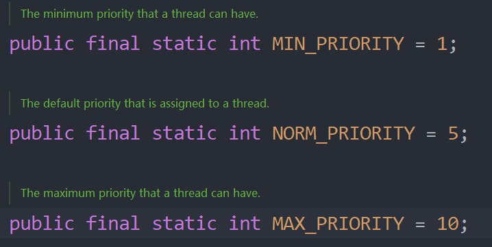

<h1 style="text-align: center; font-weight: bold;">线程的常用方法</h1>

---

## 常用方法

| 方法        | 说明                                                                             |
| ----------- | -------------------------------------------------------------------------------- |
| start       | <span style="color:red">启动线程</span>；Java 虚拟机底层调用该线程的 start0 方法 |
| run         | 调用线程对象的 run 方法                                                          |
| sleep       | 在指定的毫秒数内让当前正在执行的线程休眠（暂停执行）                             |
| getName     | 返回该线程的名称                                                                 |
| setName     | 设置线程名称，使之与参数 name 相同                                               |
| setPriority | 更改线程的优先级                                                                 |
| getPriority | 获取线程的优先级                                                                 |
| interrupt   | <span style="color:red">中断</span>线程                                          |

## 优先级字段

> #### 调用方法：setPriority（Thead . 优先级字段）



## 线程中断

### 基本介绍

> #### 关于 " 中断 " 的理解：<span style="color:red">中断</span>线程<span style="color:red">不等于结束</span>线程，一般用于<span style="color:red">中断</span>正在<span style="color:red">休眠</span>的线程

### 代码示例

```java
public class main {
    public static void main(String[] args) throws InterruptedException {
        a a = new a();
        a.setName("<子线程>");
        a.setPriority(Thread.MIN_PRIORITY);
        a.start();

        for (int i = 1; i < 6; i++) {
            Thread.sleep(1000);
            System.out.println(Thread.currentThread().getName() + "执行中~ ~ " + i);
        }
        System.out.println(a.getName() + "--->优先级为：" + a.getPriority());
        a.interrupt();
    }
}


class a extends Thread {
    private int i = 0;

    @Override
    public void run() {
        while (true) {
            for (int i = 1; i <= 5; i++) {
                System.out.println(Thread.currentThread().getName() + "线程启动：" + i);
            }
            try {
                System.out.println(Thread.currentThread().getName() + "休眠中~ ~");
                Thread.sleep(20000);
            } catch (InterruptedException e) {
                System.out.println(Thread.currentThread().getName() + "线程的休眠被中断了~ ~");
            }
        }
    }
}
```

## 输出结果

```java
<子线程>线程启动：1
<子线程>线程启动：2
<子线程>线程启动：3
<子线程>线程启动：4
<子线程>线程启动：5
<子线程>休眠中~ ~
main执行中~ ~ 1
main执行中~ ~ 2
main执行中~ ~ 3
main执行中~ ~ 4
main执行中~ ~ 5
<子线程>--->优先级为：1
<子线程>线程的休眠被中断了~ ~
<子线程>线程启动：1
<子线程>线程启动：2
<子线程>线程启动：3
<子线程>线程启动：4
<子线程>线程启动：5
<子线程>休眠中~ ~
```

#### 代码分析

> #### （1）首先启动子线程，然后启动主线程
>
> #### （2）在子线程中设置休眠 20s，在主线程执行完之后<span style="color:red">执行 intertupt()方法</span>，终止子线程的休眠
>
> #### （3）在子线程休眠被中断后又继续执行
>
> #### （4）由于是只中断了一次，子线程又进入休眠状态

## yield

> #### 线程的<span style="color:red">礼让</span>

#### （1）<span style="color:red">让出 CPU 占用资源</span>，让其他线程执行，但让出的时间不确定，所以也<span style="color:red">不一定礼让成功</span>

#### （2）能否礼让成功要<span style="color:red">根据底层资源的分配情况</span>，如果当前资源丰富，CPU 会同时执行两个线程，就不会有等待的过程，即不会礼让成功

> #### 简单来说就是让 CPU 先去执行别的线程，当前线程可以等会再执行

## join

### 基本介绍

> #### 表示线程的<span style="color:red">插队</span>，插队的线程一旦插队成功，则肯定先<span style="color:red">执行完</span>插入的线程所有的任务（<span style="color:red">插队是一定会成功的</span>）

### 代码示例

```java
public class main {
    public static void main(String[] args) throws InterruptedException {
        a a = new a();
        for (int i = 1; i <= 4; i++) {
            System.out.println("主线程执行中 " + i);
            if(i==2){
                a.start();
                a.join();
            }d
        }
    }
}

class a extends Thread{
    @Override
    public void run() {
        System.out.println("----子线程开始插队----");
        for (int i = 1; i <= 2; i++) {
            System.out.println("子线程插队中 " + i);
        }
        System.out.println("----子线程执行结束----");
    }
}

// 输出结果
主线程执行中 1
主线程执行中 2
----子线程开始插队----
子线程插队中 1
子线程插队中 2
----子线程执行结束----
主线程执行中 3
主线程执行中 4
```

#### 代码分析

> #### （1）首先让主线程开始执行
>
> #### （2）当主线程执行两次后，子线程开始插队
>
> #### （3）只有当子线程执行完之后，主线程才会继续执行
