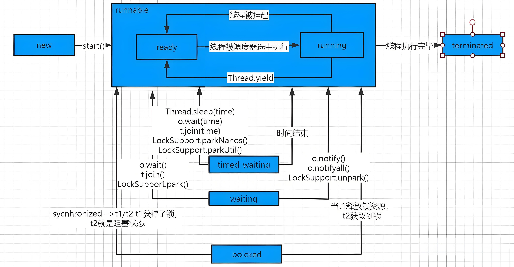
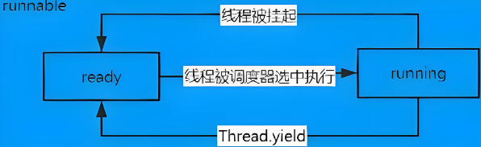
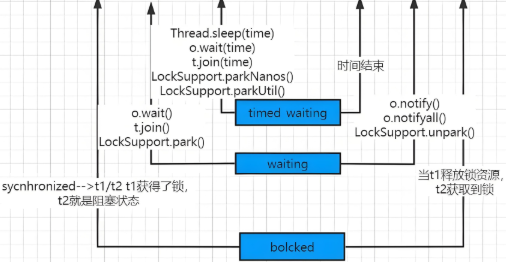

<h1 style="text-align: center; font-weight: bold;">线程的七种状态</h1>

---

## 线程生命周期图

## 七种状态

### NEW

> #### 尚未启动的线程处于此状态

### RUNNABLE

> #### 在 Java 虚拟机中执行的线程处于此状态（又细分为两种状态）
>
> #### （1）ready：预备状态
>
> #### （2）running：正在执行

### BLOCKED

> #### 被阻塞等待监视器锁定的线程处于此状态

### WAITING

> #### 正在等待另一个线程执行特定动作的线程处于此状态

### TIMED WAITING

> #### 正在等待另一个线程执行动作直到指定时间的线程处于此状态

### TERMINATED

> #### 已退出的线程处于此状态

## RUNNABLE 状态

## 其他状态

