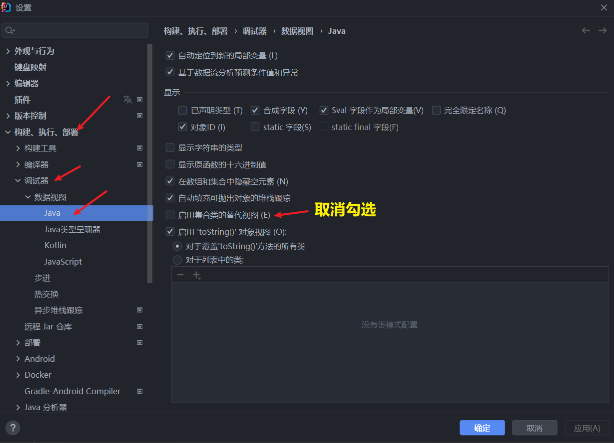
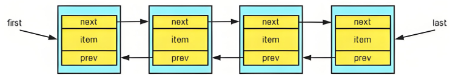

<h1 style="text-align: center; font-weight: bold;">List 接口</h1>

---

## 基本介绍

#### （1） List 集合类中元素<span style="color:red">有序</span>(即添加顺序和取出顺序一致)、且<span style="color:red">可重复</span>

#### （2） List 集合中的每个元素都有其对应的顺序索引，即<span style="color:red">支持索引</span>

#### （3） List 容器中的元素都对应一个整数型的序号记载其在容器中的位置，可以<span style="color:red">根据序号存取容器中的元素</span>

## 常用方法

> #### 说明：List 接口继承了 Collection 接口，则 <span style="color:red">List 接口的实现类即实现了 List 接口的方法，又实现了 Collection 接口的方法</span>，以下是 List 接口独有的方法

| 方法                                                                             | 描述                                                                                                                       |
| -------------------------------------------------------------------------------- | -------------------------------------------------------------------------------------------------------------------------- |
| get(int index)                                                                   | 返回列表中指定索引位置的元素。<span style="color:red">索引从 0 开始</span>，超出范围会抛出 IndexOutOfBoundsException       |
| void add(int index, E element)                                                   | 在列表的<span style="color:red">指定索引</span>位置插入指定元素。后续元素的索引会自动递增                                  |
| boolean addAll(int index, Collection<? extends E> c)                             | 从指定位置开始，将指定集合中的所有元素插入到列表中                                                                         |
| remove(int index)                                                                | <span style="color:red">移除</span>并返回列表中<span style="color:red">指定索引</span>位置的元素。后续元素的索引会自动递减 |
| set(int index, E element)                                                        | 用指定元素<span style="color:red">替换</span>列表中指定位置的元素，并返回被替换的原元素                                    |
| int indexOf(Object o)                                                            | 返回指定元素在列表中<span style="color:red">第一次</span>出现的索引，不存在则返回 -1                                       |
| int lastIndexOf(Object o)                                                        | 返回指定元素在列表中<span style="color:red">最后一次</span>出现的索引，不存在则返回 -1                                     |
| List&lt;E&gt; <span style="color:red">subList</span>(int fromIndex, int toIndex) | 返回列表中指定范围的子列表 (fromIndex，toIndex) <span style="color:red">左闭右开</span>                                    |
| List.sort（<span style="color:red">Comparator.naturalOrder()</span>）            | 从<span style="color:red">小到大</span>排序                                                                                |
| List.sort（<span style="color:red">Comparator.reverseOrder()</span>）            | 从<span style="color:red">大到小</span>排序                                                                                |

> #### 方法特点
>
> #### （1）由于 <span style="color:red">List 接口</span>的特点是支持索引，所以方法都是带有<span style="color:red">索引性质</span>的
>
> #### （2）List 接口继承了 <span style="color:red">Collection 接口</span>，然而 Collection 接口的方法都是<span style="color:red">针对对象</span>的

#### 代码示例

```java
import java.util.ArrayList;
import java.util.List;

public class practise {
    public static void main(String[] args) {
        List list = new ArrayList();
        List list1 = new ArrayList();

        list.add("jack");
        list.add("computer");
        list.add("hello");
        list.add("java");

        list1.add("list2 - 1");
        list1.add("list2 - 2");

        System.out.println("list[0] = " + list.get(0));
        System.out.println("subList(0,1)：" + list.subList(0,1));

        list.add(list.size() - 1,"list");
        System.out.println("add(list.size() - 1,\"list\")：" + list);

        list.remove(list.size() - 1);
        System.out.println("remove(list.size() - 1)：" + list);

        list.add("jack");

        list.set(list.size() - 1,"jack");

        list.addAll(0,list1);
        System.out.println("addAll(list1)：" + list);
        System.out.println("indexOf(\"jack\") ：" + list.indexOf("jack"));
        System.out.println("lastIndexOf(\"jack\") ：" + list.lastIndexOf("jack"));


    }
}

// 输出结果
list[0] = jack
subList(0,1)：[jack]
add(list.size() - 1,"list")：[jack, computer, hello, list, java]
remove(list.size() - 1)：[jack, computer, hello, list]
addAll(list1)：[list2 - 1, list2 - 2, jack, computer, hello, list, jack]
indexOf("jack") ：2
lastIndexOf("jack") ：6
```

## 遍历方式

### Iterator 迭代器

> #### 返回一个 List 对象的迭代器，方法和 Collection 中的相同

### 增强 for 循环

> #### 返回一个 List 对象的迭代器，方法和 Collection 中的相同

### 普通 for 循环 + get（）

> #### 利用 List 接口<span style="color:red">索引</span>的特点，使用 <span style="color:red">get（）</span>方法取值

```java
import java.util.ArrayList;
import java.util.List;

public class practise {
    public static void main(String[] args) {
        List list = new ArrayList();
        List list1 = new ArrayList();

        list.add("jack");
        list.add("computer");
        list.add("hello");
        list.add("java");

        for (int i = 0; i < list.size(); i++) {
            System.out.println(list.get(i));
        }
    }
}
```

### 应用案例

> #### 创建 book 对象（名称，价格），添加到 List 结合中，<span style="color:red">价格从低到高</span>排序，并输出结果
>
> #### （1）通过<span style="color:red">get（）</span>方法：获取对象
>
> #### （2）通过<span style="color:red">set（）</span>方法：交换位置

```java
import java.util.ArrayList;
import java.util.Iterator;
import java.util.List;

@SuppressWarnings("all")
public class practise {
    public static void main(String[] args) {
        List list = new ArrayList();
        list.add(new book("西游记", 18));
        list.add(new book("水浒传", 20));
        list.add(new book("红楼梦", 30));

        for (int i = 0; i < list.size() - 1; i++) {
            for (int j = 0; j < list.size() - 1 - i; j++) {
                // 向下转型
                book book1 = (book) (list.get(i));
                book book2 = (book) (list.get(i));

                if (book1.price > book2.price) {
                    // 用 set() 方法交换位置
                    list.set(j + 1, book1);
                    list.set(j, book2);
                }
            }
        }

        // 使用迭代器遍历
        Iterator iterator = list.iterator();
        while(iterator.hasNext()){
            Object obj = iterator.next();
            System.out.println(obj);
        }
    }
}

class book {
    String name;
    double price;

    public book(String name, double price) {
        this.name = name;
        this.price = price;
    }

    public String getName() {
        return name;
    }

    public void setName(String name) {
        this.name = name;
    }

    public double getPrice() {
        return price;
    }

    public void setPrice(double price) {
        this.price = price;
    }

    @Override
    public String toString() {
        return "book{" +
                "name='" + name + '\'' +
                ", price=" + price +
                '}';
    }
}

// 输出结果
book{name='西游记', price=18.0}
book{name='水浒传', price=20.0}
book{name='红楼梦', price=30.0}
```

## Arraylist

### 基本介绍

#### （1）ArrayList <span style="color:red">允许加入多个 null</span>

#### （2） ArrayList 是由<span style="color:red">数组来实现数据存储</span>的

#### （3）ArrayList 是<span style="color:red">线程不安全</span>的（不建议在多线程中使用），但是<span style="color:red">执行效率高</span>

### 常用方法

> #### ArrayList 是 List 接口的实现子类，List 接口继承了 Collection 接口，即 ArrayList 同时拥有这两个接口的方法

#### Collection 接口

| 方法                                      | 描述                                                |
| ----------------------------------------- | --------------------------------------------------- |
| int size()                                | 返回集合中的元素数量                                |
| boolean isEmpty()                         | 判断集合是否为空                                    |
| void clear()                              | 移除集合中的所有元素                                |
| boolean add()                             | 向集合中添加元素，如果集合因此发生变化则返回 true   |
| boolean addAll(Collection<? extends E> c) | 将指定集合中的所有元素添加到当前集合                |
| boolean remove(Object o)                  | 从集合中移除指定元素，如果集合包含该元素则返回 true |
| boolean removeAll(Collection<?> c)        | 移除当前集合中所有包含在指定集合中的元素            |
| boolean contains(Object o)                | 判断集合是否包含指定元素                            |
| boolean containsAll(Collection<?> c)      | 判断集合是否包含指定集合中的所有元素                |

#### List 接口

| 方法                                                                             | 描述                                                                                                                       |
| -------------------------------------------------------------------------------- | -------------------------------------------------------------------------------------------------------------------------- |
| get(int index)                                                                   | 返回列表中指定索引位置的元素。<span style="color:red">索引从 0 开始</span>，超出范围会抛出 IndexOutOfBoundsException       |
| void add(int index, E element)                                                   | 在列表的<span style="color:red">指定索引</span>位置插入指定元素。后续元素的索引会自动递增                                  |
| boolean addAll(int index, Collection<? extends E> c)                             | 从指定位置开始，将指定集合中的所有元素插入到列表中                                                                         |
| remove(int index)                                                                | <span style="color:red">移除</span>并返回列表中<span style="color:red">指定索引</span>位置的元素。后续元素的索引会自动递减 |
| set(int index, E element)                                                        | 用指定元素<span style="color:red">替换</span>列表中指定位置的元素，并返回被替换的原元素                                    |
| int indexOf(Object o)                                                            | 返回指定元素在列表中<span style="color:red">第一次</span>出现的索引，不存在则返回 -1                                       |
| int lastIndexOf(Object o)                                                        | 返回指定元素在列表中<span style="color:red">最后一次</span>出现的索引，不存在则返回 -1                                     |
| List&lt;E&gt; <span style="color:red">subList</span>(int fromIndex, int toIndex) | 返回列表中指定范围的子列表 (fromIndex，toIndex) <span style="color:red">左闭右开</span>                                    |

### ⭐ 源码分析

#### （1） ArrayList 中维护了一个 Object 类型的数组

> #### 1. transient Object[] elementData
>
> #### 2. transient 表示瞬间、短暂的，表示<span style="color:red">该属性不会被序列化</span>

#### （2）如果使用的是<span style="color:red">无参构造器</span>

> #### 1. 初始：elementData 容量为 0，<span style="color:red">第 1 次添加元素</span>，elementData 扩容 为 <span style="color:red">10</span>
>
> #### 2. <span style="color:red">再次</span>扩容：按原先的 <span style="color:red">1.5 倍</span>扩容

#### （3）如果在<span style="color:red">构造器中指定大小</span>

> #### 1. 初始：elementData 容量为指定大小
>
> #### 2. <span style="color:red">再次</span>扩容：按原先的 <span style="color:red">1.5 倍</span>扩容

#### 预备工作

> #### IDEA 设置：在调试时显示隐藏的数据



#### 调试代码示例

```java
public static void main(String[] args) {
    ArrayList list = new ArrayList();

    // 默认初始化10个大小的容量
    for (int i = 0; i < 10; i++) {
        list.add(i);
    }

    // 查看扩容的原理
    for (int i = 10; i < 13; i++) {
        list.add(i);
    }
}
```

#### （1）调用无参构造器,创建了一个数组（transient Object[] elementData）

> #### 补充：在 add 之前会进行 valueOf（）方法的执行进行装箱，这部分略过不看

```java
public ArrayList() {
    this.elementData = DEFAULTCAPACITY_EMPTY_ELEMENTDATA;
}
```

#### （2）执行 add（）方法

> #### 先确定是否要扩容，然后再进行赋值

```java
public boolean add(E e) {
    ensureCapacityInternal(size + 1);  // Increments modCount!!
    elementData[size++] = e;
    return true;
}
```

#### （3）进入 ensureCapacityInternal（）方法

> #### 找最大值，通过传值给函数，判断是否需要扩容

```java
private void ensureCapacityInternal(int minCapacity) {
    if (elementData == DEFAULTCAPACITY_EMPTY_ELEMENTDATA) {
        minCapacity = Math.max(DEFAULT_CAPACITY, minCapacity);
    }

    ensureExplicitCapacity(minCapacity);
}
```

#### （4） 进入 ensureExplicitCapacity（）方法

> #### 1. modCount 记录集合修改的次数
>
> #### 2. 根据之前的值，如果发现目前数组的大小比默认值（初始化为 10）大，执行 grow（）方法，执行扩容

```java
private void ensureExplicitCapacity(int minCapacity) {
    modCount++;

    // overflow-conscious code
    if (minCapacity - elementData.length > 0)
        grow(minCapacity);
}
```

#### （5）进入 grow（）方法

> #### 1. 向右位移（>>）一个大小：就是除以二的意思，即<span style="color:red">如果数组需求的空间比默认值大，就在原基础上扩容为 1.5 倍</span>
>
> #### 2. 使用 Arrays.copyOf（）方法先完成原内容的复制，扩容部分的位置值是 null，之后返回 add（）方法，添加新内容到 elementData [ ] 数组中，完成内容的添加

```java
private void grow(int minCapacity) {
    // overflow-conscious code
    int oldCapacity = elementData.length;
    int newCapacity = oldCapacity + (oldCapacity >> 1);
    if (newCapacity - minCapacity < 0)
        newCapacity = minCapacity;
    if (newCapacity - MAX_ARRAY_SIZE > 0)
        newCapacity = hugeCapacity(minCapacity);
    // minCapacity is usually close to size, so this is a win:
    elementData = Arrays.copyOf(elementData, newCapacity);
}
```

## Vector

### 基本介绍

> #### Vector 和 ArrayList 主要区别在于扩容机制和线程安全

#### （1）Vector 是<span style="color:red">线程安全</span>的（该类方法中都带有关键字<span style="color:red">synchronized</span>）

#### （2） Vecotr 底层也是一个对象数组：protected Object [ ] elementData

### 常用方法

> #### 参考 ArrayList 的方法即可

### 扩容机制

> #### 唯一和 ArrayList 不同的点在：如需要<span style="color:red">再次扩容</span>，则按原先的<span style="color:red">2 倍</span>扩容

| 底层结构  | 版本              | 线程安全（同步） | 效率                                                                         | 扩容机制                                                                                                                                                                                                                                                              |
| --------- | ----------------- | ---------------- | ---------------------------------------------------------------------------- | --------------------------------------------------------------------------------------------------------------------------------------------------------------------------------------------------------------------------------------------------------------------- |
| ArrayList | 可变数组          | jdk1.2           | <span style="color:red">不安全</span>, <span style="color:red">效率高</span> | 1. 如果是<span style="color:red">无参</span>构造器, <span style="color:red">默认为 10</span>, 满后, 就按 <span style="color:red">1.5 倍扩容</span> <br> 2. 如果构造器<span style="color:red">指定大小</span>, 则每次按原先的<span style="color:red">1.5 倍扩容</span> |
| Vector    | 可变数组 Object[] | jdk1.0           | <span style="color:red">安全</span>, <span style="color:red">效率不高</span> | 1. 如果是<span style="color:red">无参</span>构造器, <span style="color:red">默认为 10</span>, 满后, 就按 <span style="color:red">2 倍扩容</span> <br> 2. 如果构造器<span style="color:red">指定大小</span>, 则每次按原先的<span style="color:red">2 倍扩容</span>     |

## LinkedList

### 基本介绍

#### （1）底层实现了<span style="color:red">双向链表</span>和<span style="color:red">双端队列</span>特点

#### （2）可以添加任意元素（<span style="color:red">元素可以重复</span>），包括 null

#### （3）LinkedList 是<span style="color:red">线程不安全</span>的

### 结构图



> #### first：指向头节点
>
> #### last：指向尾节点
>
> #### item：节点值
>
> #### prev：指向前驱检点
>
> #### next：指向后继节点

### 常用方法

| 方法                      | 描述                                                        |
| ------------------------- | ----------------------------------------------------------- |
| 增                        |
| add(E e)                  | 向链表<span style="color:red">末尾</span>添加元素。         |
| add(int index, E element) | 在<span style="color:red">指定索引</span>处插入元素。       |
| addFirst(E e)             | 在链表的<span style="color:red">开头</span>添加元素。       |
| addLast(E e)              | 在链表的<span style="color:red">末尾</span>添加元素。       |
| 删                        |
| remove(int index)         | 删除<span style="color:red">指定索引</span>位置的元素。     |
| remove(Object o)          | 删除<span style="color:red">首次出现</span>的指定元素。     |
| removeFirst()             | 删除链表的<span style="color:red">第一个</span>元素。       |
| removeLast()              | 删除链表的<span style="color:red">最后一个</span>元素。     |
| 改                        |
| set(int index, E element) | 替换指定索引位置的元素，并返回被替换的元素。                |
| 查                        |
| get(int index)            | 获取<span style="color:red">指定索引</span>位置的元素。     |
| getFirst()                | 获取链表的<span style="color:red">第一个</span>元素。       |
| getLast()                 | 获取链表的<span style="color:red">最后一个</span>元素。     |
| contains(Object o)        | 判断链表中是否包含<span style="color:red">指定元素</span>。 |
| 其他方法                  |
| clear()                   | 清空链表中的所有元素。                                      |
| size()                    | 获取链表中的元素数量。                                      |
| isEmpty()                 | 判断链表是否为空。                                          |
| toArray(T [ ] a)          | 将链表转换为数组。                                          |

### 模拟双向链表

```java
public class pra {
    public static void main(String[] args) {
        /*
            模拟插入节点：jack,java,tom

            1. 首先生成节点
            2. 把节点连接起来
         */

        node jack = new node("jack");
        node java = new node("java");
        node tom = new node("tom");

        // 连接 jack 和 java
        jack.next = java;
        java.pre = jack;

        // 连接 java 和 tom
        java.next = tom;
        tom.pre = java;

        tom.next = null;

        // 设置头尾指针
        node head = jack;
        node tail = tom;

        System.out.print("从头到尾遍历：");
        // 遍历链表（从头到尾巴）
        while (true){
            if(head == null){
                break;
            }else{
                System.out.print(head.item + " ---> ");
                head = head.next;
            }
        }

        System.out.println();

        System.out.print("从尾到头遍历：");
        // 遍历链表（从尾到头）
        while (true){
            if(tail == null){
                break;
            }else{
                System.out.print(tail.item + " ---> ");
                tail = tail.pre;
            }
        }
    }
}

class node {
    Object item; // 节点元素值
    node pre; // 前驱结点指针
    node next; // 后继节点指针

    public node(Object item) {
        this.item = item;
    }

    @Override
    public String toString() {
        return "node{" +
                "item=" + item +
                '}';
    }
}

// 输出结果
从头到尾遍历：jack ---> java ---> tom --->
从尾到头遍历：tom ---> java ---> jack --->
```

### 与 ArrayList 对比

| 底层结构   | 增删的效率 | 查找的效率                                        |
| ---------- | ---------- | ------------------------------------------------- |
| ArrayList  | 可变数组   | <span style="color:red">较低</span>               |
| LinkedList | 双向链表   | <span style="color:red">较高</span>，通过链表添加 |

#### 如何选择 ArrayList 和 LinkedList？

#### （1） 如果我们<span style="color:red">查看</span>的操作多，选择 <span style="color:red">ArrayList</span>

#### （2） 如果我们<span style="color:red">增删</span>的操作多，选择 <span style="color:red">LinkedList</span>

#### （3） 一般来说，在程序中，80% - 90%都是查询，因此大部分情况下会选择 ArrayList

#### （4） 在一个项目中，根据业务灵活选择，也可能这样，一个模块使用的是 ArrayList，另一个模块是 LinkedList，也就是说，要根据业务来选择
