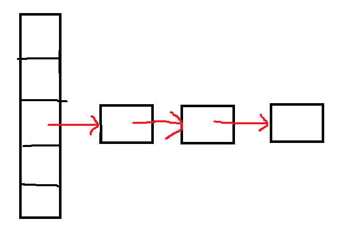
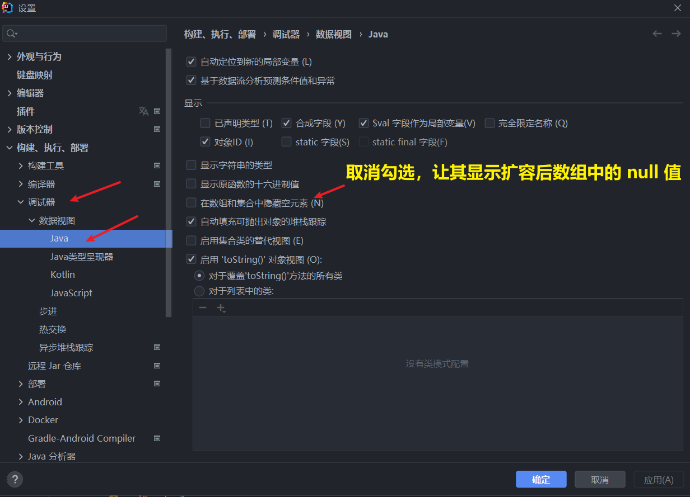
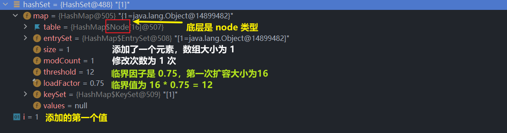
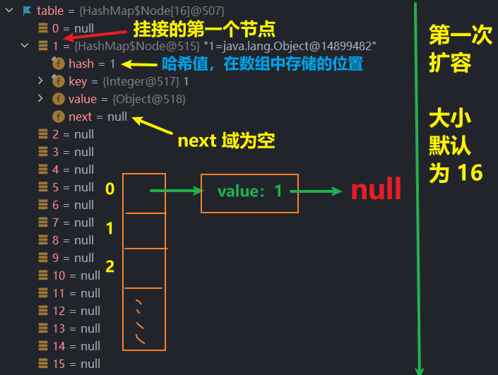
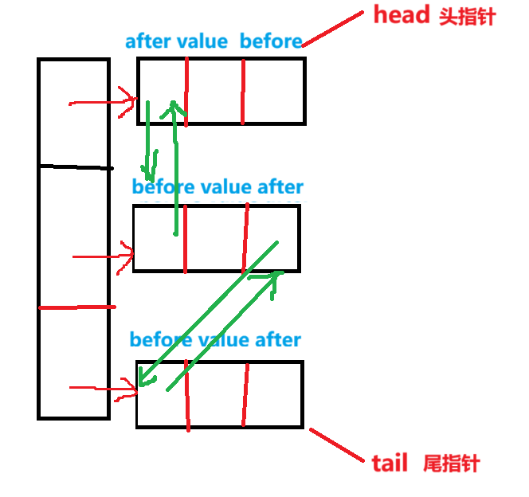

<h1 style="text-align: center; font-weight: bold;">Set 接口</h1>

---

## 基本介绍

#### （1）<span style="color:red">无序</span>（添加和取出的顺序不一致），没有索引

> #### 添加的顺序和取出的顺序不一致（强调二者顺序不一致）
>
> #### 但是取出的顺序是固定的（强调存储后，位置是固定的，不会变化）

#### （2）<span style="color:red">不允许</span>有<span style="color:red">重复</span>元素，<span style="color:red">最多包含一个 null</span>

## 常用方法

> #### 该接口是继承了 Collection 接口，方法参考 Collection 接口的即可

#### Set 接口方法

| 方法名                                                    | 描述                                                                                                                                         |
| --------------------------------------------------------- | -------------------------------------------------------------------------------------------------------------------------------------------- |
| <span style="color:red">retainAll</span>(Collection<?> c) | <span style="color:red">保留</span>当前集合和集合 c 中的<span style="color:red">共同元素</span>，<span style="color:red">删除其他元素</span> |
| toArray()                                                 | 返回包含集合中所有元素的数组                                                                                                                 |

#### Collection 接口方法

| 方法                                      | 描述                                                |
| ----------------------------------------- | --------------------------------------------------- |
| int size()                                | 返回集合中的元素数量                                |
| boolean isEmpty()                         | 判断集合是否为空                                    |
| void clear()                              | 移除集合中的所有元素                                |
| boolean add()                             | 向集合中添加元素，如果集合因此发生变化则返回 true   |
| boolean addAll(Collection<? extends E> c) | 将指定集合中的所有元素添加到当前集合                |
| boolean remove(Object o)                  | 从集合中移除指定元素，如果集合包含该元素则返回 true |
| boolean removeAll(Collection<?> c)        | 移除当前集合中所有包含在指定集合中的元素            |
| boolean contains(Object o)                | 判断集合是否包含指定元素                            |
| boolean containsAll(Collection<?> c)      | 判断集合是否包含指定集合中的所有元素                |

## 遍历方式

### Iterator 迭代器

```java
public class Test {
    public static void main(String[] args) {
        Set<String> set = new HashSet<>();
        set.add("Apple");
        set.add("Banana");
        set.add("Cherry");

        // 使用迭代器遍历 Set
        Iterator<String> iterator = set.iterator();
        while (iterator.hasNext()) {
            System.out.println(iterator.next());
        }
    }
}
```

### 增强 for 循环

```java
public class Test {
    public static void main(String[] args) {
        Set<String> set = new HashSet<>();
        set.add("Apple");
        set.add("Banana");
        set.add("Cherry");

        // 使用增强型 for 循环遍历 Set
        for (String fruit : set) {
            System.out.println(fruit);
        }
    }
}
```

## Set 无序特性说明

```java
public class pra {
    public static void main(String[] args) {

        Set set = new HashSet();

        // jack
        set.add("jack");
        set.add("jack");
        // null
        set.add(null);
        // java
        set.add("java");
        // tom
        set.add("tom");

        System.out.println(set + "\n");

        for (int i = 0; i < 5; i++) {
            System.out.println(set);
        }
    }
}

// 输出结果
[null, java, tom, jack]

[null, java, tom, jack]
[null, java, tom, jack]
[null, java, tom, jack]
[null, java, tom, jack]
[null, java, tom, jack]
```

#### 代码分析

> #### （1）添加顺序和取出的顺序是不一致的
>
> #### （2）取出的顺序是固定的
>
> #### （3）元素是不能重复的

## ⭐ 面试经典易错题

```java
import java.util.HashSet;

@SuppressWarnings("all")
public class pra {
    public static void main(String[] args) {
        HashSet hashSet = new HashSet();
        hashSet.add(new dog(8));
        hashSet.add(new dog(8));

        hashSet.add("dog：8");
        hashSet.add("dog：8");

        System.out.println(hashSet);
    }
}

class dog{
    int age;

    public dog(int age) {
        this.age = age;
    }

    @Override
    public String toString() {
        return "dog{" +
                "age=" + age +
                '}';
    }
}

// 输出结果
[dog{age=8}, dog{age=8}, dog：8]
```

#### 代码分析

> #### （1）对于创建的对象（即时内容相同），可以添加（不够成重复元素的判断条件）
>
> #### （2）但是对于<span style="color:red">字符串对象，只能添加一个</span>
>
> #### （3）具体原因：和 <span style="color:red">HashSet 的底层添加机制</span>有关

## HashSet

### 基本介绍

#### （1）⭐HashSet 底层是 <span style="color:red">HashMap</span>

#### （2）不能有重复元素，可以存放空值，且<span style="color:red">只能有一个 null</span>

#### （3）HashSet 不能保证元素是有序的，取决于 <span style="color:red">hash 后的索引值</span>（即无法保证存储元素顺序和取出元素顺序一致）

#### （4）HashSet、HashMap 都是<span style="color:red">线程不安全</span>的

### 常用方法

> #### HashSet 是 Set 接口的实现子类，拥有 Set 接口和 Collection 接口的方法

### HashMap 底层实现

> #### 结构：<span style="color:red">数组 + 单链表 + 红黑树</span>



### ⭐HashSet 添加机制

> #### HashSet 底层是 <span style="color:red">HashMap</span>

#### HashMap

#### （1） 添加一个元素时，<span style="color:red">先得到 hash 值</span>（hashCode 方法），底层会把<span style="color:red">哈希值转换为索引值</span>

#### （2） 查看哈希表 table（即数组），看这个索引位置是否已经存放的元素

> #### 1. 如果没有，直接加入
>
> #### 2. 如果有，调用 <span style="color:red">equals</span> 方法（由程序员决定，可以被重写） 比较
>
> #### （1）如果<span style="color:red">相同</span>，就<span style="color:red">放弃添加</span>
>
> #### （2）如果<span style="color:red">不同</span>，则<span style="color:red">添加到最后</span>

### ⭐HashMap 扩容机制

#### （1）<span style="color:red">第一次</span>添加时，table 数组扩容到 <span style="color:red">16</span>，<span style="color:red">临界值</span> (threshold) 是 <span style="color:red">12</span>

> #### 临界值：16 \* <span style="color:red">加载因子</span> (loadFactor) <span style="color:red">0.75</span> = <span style="color:red">12</span>

#### （2）如果 table 数组的大小<span style="color:red">达到临界值</span> 12，就会<span style="color:red">扩容为原先的 2 倍</span>，此时数组的大小为：16 \* 2 = <span style="color:red">32</span>

> #### 新的临界值： 32 \* <span style="color:red">加载因子</span> (loadFactor) <span style="color:red">0.75</span> = 24，依次类推

#### （4） 在 Java8 中

> #### 1. 如果<span style="color:red">单链表的元素个数</span>达到 TREEIFY_THRESHOLD（<span style="color:red">临界值：默认是 8</span>）
>
> #### 2. 并且 table 的大小 >= MIN_TREEIFY_CAPACITY（<span style="color:red">执行树化需要 table 数组的大小：默认 64</span>），就会进行<span style="color:red">树化</span>（<span style="color:red">红黑树</span>）
>
> #### ⚠️ 3. 如果单链表的元素个数达到八，但是数组空间小于 64，先采用数组扩容机制，直到数组大小扩容为 64 之后才会进行树化

## ⚠️HashMap 底层源码

### 调试示例代码

```java
public class pra {
    public static void main(String[] args) {
        HashSet hashSet = new HashSet();
        for (int i = 1; i <= 100; i++) {
            hashSet.add(i);
        }
        System.out.println(hashSet);
    }
}
```

### ⭐ 第一次添加元素调试

#### （1）调用构造器，底层是 HashMap

```java
public HashSet() {
    map = new HashMap<>();
}
```

#### （2）首先进行<span style="color:red">装箱</span>操作（valueOf（）方法），这部分不看，<span style="color:red">进入 add（）方法</span>

```java
public boolean add(E e) {
    return map.put(e, PRESENT)==null;
}
```

#### 代码分析

> #### PRESENT：private static final Object PRESENT = new Object（），这里起到的<span style="color:red">占位作用</span>，在后续<span style="color:red">在 put（）方法中传值给 value</span>

#### （3）进入 put（）方法

```java
public V put(K key, V value) {
    return putVal(hash(key), key, value, false, true);
}
```

#### 代码分析

> #### key：add（）方法中添加的内容

#### （4）调用 hash（）方法，计算哈希值

```java
static final int hash(Object key) {
    int h;
    return (key == null) ? 0 : (h = key.hashCode()) ^ (h >>> 16);
}
```

> #### <span style="color:red">hashCode（）</span>方法得到的是<span style="color:red">十六进制值</span>，需要<span style="color:red">转换为二进制</span>值后做<span style="color:red">异或</span>（^）运算

#### 补充：resize（）方法

```java
final Node<K,V>[] resize() {
    Node<K,V>[] oldTab = table;
    int oldCap = (oldTab == null) ? 0 : oldTab.length;
    int oldThr = threshold;
    int newCap, newThr = 0;
    if (oldCap > 0) {
        if (oldCap >= MAXIMUM_CAPACITY) {
            threshold = Integer.MAX_VALUE;
            return oldTab;
        }
        else if ((newCap = oldCap << 1) < MAXIMUM_CAPACITY &&
                    oldCap >= DEFAULT_INITIAL_CAPACITY)
            newThr = oldThr << 1; // double threshold
    }
    else if (oldThr > 0) // initial capacity was placed in threshold
        newCap = oldThr;
    else {               // zero initial threshold signifies using defaults
        newCap = DEFAULT_INITIAL_CAPACITY;
        newThr = (int)(DEFAULT_LOAD_FACTOR * DEFAULT_INITIAL_CAPACITY);
    }
    if (newThr == 0) {
        float ft = (float)newCap * loadFactor;
        newThr = (newCap < MAXIMUM_CAPACITY && ft < (float)MAXIMUM_CAPACITY ?
                    (int)ft : Integer.MAX_VALUE);
    }
    threshold = newThr;
    @SuppressWarnings({"rawtypes","unchecked"})
        Node<K,V>[] newTab = (Node<K,V>[])new Node[newCap];
    table = newTab;
    if (oldTab != null) {
        for (int j = 0; j < oldCap; ++j) {
            Node<K,V> e;
            if ((e = oldTab[j]) != null) {
                oldTab[j] = null;
                if (e.next == null)
                    newTab[e.hash & (newCap - 1)] = e;
                else if (e instanceof TreeNode)
                    ((TreeNode<K,V>)e).split(this, newTab, j, oldCap);
                else { // preserve order
                    Node<K,V> loHead = null, loTail = null;
                    Node<K,V> hiHead = null, hiTail = null;
                    Node<K,V> next;
                    do {
                        next = e.next;
                        if ((e.hash & oldCap) == 0) {
                            if (loTail == null)
                                loHead = e;
                            else
                                loTail.next = e;
                            loTail = e;
                        }
                        else {
                            if (hiTail == null)
                                hiHead = e;
                            else
                                hiTail.next = e;
                            hiTail = e;
                        }
                    } while ((e = next) != null);
                    if (loTail != null) {
                        loTail.next = null;
                        newTab[j] = loHead;
                    }
                    if (hiTail != null) {
                        hiTail.next = null;
                        newTab[j + oldCap] = hiHead;
                    }
                }
            }
        }
    }
    return newTab;
}
```

#### 代码分析

```java
static final float DEFAULT_LOAD_FACTOR = 0.75f;

static final int DEFAULT_INITIAL_CAPACITY = 1 << 4; // aka 16
```

> #### （1）初始化空间大小（table 数组）：16
>
> #### （2）临界因子：0.75
>
> #### 解释：16 \* 0.75 = 12，当数组大小达到 12 时候，数组就会进行扩容（扩容 2 倍），变为 16 \* 2 = 32
>
> #### 扩容：newCap = oldCap << 1; // double threshold
>
> #### （3）最后返回一个新的数组

#### 总结

> #### <span style="color:red">resize（）</span>方法的<span style="color:red">本质</span>就是<span style="color:red">初始化 table 数组</span>，初始化空间为 16，同时设置临界因子为 0.75 \* size

#### （5）⭐ 进入 putVal（）方法（重点 ❗❗）

```java
final V putVal(int hash, K key, V value, boolean onlyIfAbsent,
                boolean evict) {
    Node<K,V>[] tab; Node<K,V> p; int n, i;// 定义了一些临时变量
    if ((tab = table) == null || (n = tab.length) == 0)
        n = (tab = resize()).length;
    if ((p = tab[i = (n - 1) & hash]) == null)
        tab[i] = newNode(hash, key, value, null);
    else {
        Node<K,V> e; K k;
        if (p.hash == hash &&
            ((k = p.key) == key || (key != null && key.equals(k))))
            e = p;
        else if (p instanceof TreeNode)
            e = ((TreeNode<K,V>)p).putTreeVal(this, tab, hash, key, value);
        else {
            for (int binCount = 0; ; ++binCount) {
                if ((e = p.next) == null) {
                    p.next = newNode(hash, key, value, null);
                    if (binCount >= TREEIFY_THRESHOLD - 1) // -1 for 1st
                        treeifyBin(tab, hash);
                    break;
                }
                if (e.hash == hash &&
                    ((k = e.key) == key || (key != null && key.equals(k))))
                    break;
                p = e;
            }
        }
        if (e != null) { // existing mapping for key
            V oldValue = e.value;
            if (!onlyIfAbsent || oldValue == null)
                e.value = value;
            afterNodeAccess(e);
            return oldValue;
        }
    }
    ++modCount;
    if (++size > threshold)
        resize();
    afterNodeInsertion(evict);
    return null;
}
```

> #### table：是 HashMap 的一个属性（数组），类型是 Node[ ]（即为 HashMap 底层实现示意图中的数组）

#### 1. if 语句：如果 table 数组当前为空或者大小为 0，就进行第一次初始化

```java
if ((tab = table) == null || (n = tab.length) == 0)
    n = (tab = resize()).length;
```

#### 2. 执行完 resize（）方法后，table 数组的空间大小初始化为 16，里面元素为 null

```java
if ((p = tab[i = (n - 1) & hash]) == null)
    tab[i] = newNode(hash, key, value, null);
```

#### 代码分析

#### （1）根据 key （add（） 方法中添加的内容），得到 hash 去计算该 key 应该存放到 table 表的哪个索引位置，并把这个位置的对象，赋给 p

#### （2）判断 p 是否为 null

> #### 如果 p 为 null，表示还没有存放元素，就创建一个 Node （key = 传入的值，value = PRESENT）
>
> #### tab [ i ] = newNode（hash, key, value, null），<span style="color:red">传入 hash 的目的是</span>：下一次添加节点时，判断该位置是否已经存放了元素（避免冲突）

#### 3. 如上 if 分支代码执行后，不进入其匹配的 else 分支，代码继续执行

```java
++modCount;
if (++size > threshold)
    resize();
afterNodeInsertion(evict);
return null;
```

#### 代码分析

#### （1）记录修改次数，自增一次

#### （2）如果当前数组大小<span style="color:red">大于了临界值</span>，数组就需要进行<span style="color:red">扩容（2 倍大小）</span>

#### （3）在 HashMap 中，afterNodeInsertion（）方法体为空，目的是<span style="color:red">留给子类实现</span>（例如：LinkedHashMap），<span style="color:red">涉及插入后的有序问题</span>（void afterNodeInsertion(boolean evict) { }）

#### （4）返回 null

> #### putval（）方法返回空，传递给 put（）方法

```java
public V put(K key, V value) {
    return putVal(hash(key), key, value, false, true); // 返回空，传递给 put() 方法
}
```

> #### put（）方法也返回空，传递给 add（）方法，接下来在 add（）方法中判断是否为空，返回 add（）方法的值

```java
public boolean add(E e) {
    return map.put(e, PRESENT)==null;
} // 返回空， 传递给 add() 方法
```

> #### （1）如果返回空，add（）方法返回 true，插入成功
>
> #### （2）如果不返回空（即返回的是 oldValue），add（）方法返回 false，插入失败

### 调式结果视图

> #### 预备工作：调试过程中显示 null 值



#### （1）内存视图



#### （2）table 数组

<br/>


### ⭐ 添加相同元素调试

#### 调式代码示例

```java
public class pra {
    public static void main(String[] args) {
        HashSet hashSet = new HashSet();

        hashSet.add("java");
        hashSet.add("java");
        System.out.println(hashSet);
    }
}
```

#### （1）进入 putVal（）方法

```java
if ((p = tab[i = (n - 1) & hash]) == null){
    tab[i] = newNode(hash, key, value, null);
}
...
```

#### （2） 因为<span style="color:red">添加的是同一个对象，计算的 hash 值相同</span>，此时 p 的指向不为空，进入 else 分支

```java
else {
    // 编程习惯：需要用到什么变量，在局部定义
    Node<K,V> e; K k;
    if (p.hash == hash &&
        ((k = p.key) == key || (key != null && key.equals(k))))
        e = p;
    else if (p instanceof TreeNode)
        e = ((TreeNode<K,V>)p).putTreeVal(this, tab, hash, key, value);
    else {
        for (int binCount = 0; ; ++binCount) {
            if ((e = p.next) == null) {
                p.next = newNode(hash, key, value, null);
                if (binCount >= TREEIFY_THRESHOLD - 1) // -1 for 1st
                    treeifyBin(tab, hash);
                break;
            }
            if (e.hash == hash &&
                ((k = e.key) == key || (key != null && key.equals(k))))
                break;
            p = e;
        }
    }
    if (e != null) { // existing mapping for key
        V oldValue = e.value;
        if (!onlyIfAbsent || oldValue == null)
            e.value = value;
        afterNodeAccess(e);
        return oldValue;
    }
}
```

#### （3）第一个分支判断

```java
if (p.hash == hash &&
    ((k = p.key) == key || (key != null && key.equals(k))))
    e = p;
```

#### 代码分析

> #### 在进入 putVal（） 方法后，首先进入 if 分支，通过计算得到 p，此时 p 指向的是链表的第一个元素，如果链表中添加的第一个元素的 hash 值和准备添加的 key 的 hash 值一样
>
> #### 并且满足下面两个条件之一，就不能加入
>
> #### （1） 准备加入的 key 和 p 指向的 Node 结点的 key 是<span style="color:red">同一个对象</span>（<span style="color:red">hash 值相同</span>）
>
> #### （2） p 指向的 Node 结点的 key 的 <span style="color:red">equals（）</span> 和准备加入的 <span style="color:red">key</span> 比较后<span style="color:red">相同</span>

#### （4）第二个分支判断

> #### 如果 p 是红黑树，就调用 putTreeVal()方法来添加

```java
else if (p instanceof TreeNode){
    e = ((TreeNode<K,V>)p).putTreeVal(this, tab, hash, key, value);
}
```

#### （5）第三个分支判断

> #### 如果前两个分支都不满足，则进入该分支，table 数组的每一个元素位置首先会存放一个元素值，之后在其后面挂接单链表，此时会<span style="color:red">从单链表的第一个节点开始循环遍历</span>，判断当前添加的元素是否已经存在（即判断是否添加重复元素），因为在执行第一个 if 分支判断时，已经判断了当前添加元素是否和 table 数组中存放的元素为同一个元素

```java
else {
    for (int binCount = 0; ; ++binCount) {
        if ((e = p.next) == null) {
            p.next = newNode(hash, key, value, null);
            if (binCount >= TREEIFY_THRESHOLD - 1) // -1 for 1st
                treeifyBin(tab, hash);
            break;
        }
        if (e.hash == hash &&
            ((k = e.key) == key || (key != null && key.equals(k))))
            break;
        p = e; // p指向下一个元素
    }
}
```

#### 代码分析

#### （1）情况一：遍历过程中发现添加的元素和已有的元素重复（即添加了重复元素），直接跳出循环，不执行添加

```java
if (e.hash == hash &&
    ((k = e.key) == key || (key != null && key.equals(k))))
    break;
```

#### （2）情况二：遍历一遍后，发现当前添加的元素和单链表中的元素没有一个是相同的（即添加的不是重复元素），则执行<span style="color:red">添加到单链表的末尾</span>

```java
if ((e = p.next) == null) {
    p.next = newNode(hash, key, value, null);
    if (binCount >= TREEIFY_THRESHOLD - 1) // -1 for 1st
        treeifyBin(tab, hash);
    break;
}
```

> #### 代码分析
>
> #### （1）如果元素可以添加进来，在链接到单链表末尾之后，会立即<span style="color:red">判断单链表的节点个数是否达到了 8 个，准备进行树化</span>（需要满足两个条件），进入 treeifyBin（）方法
>
> ```java
> final void treeifyBin(Node<K,V>[] tab, int hash) {
>     int n, index; Node<K,V> e;
>     if (tab == null || (n = tab.length) < MIN_TREEIFY_CAPACITY)
>         resize();
>     else if ((e = tab[index = (n - 1) & hash]) != null) {
>         TreeNode<K,V> hd = null, tl = null;
>         do {
>             TreeNode<K,V> p = replacementTreeNode(e, null);
>             if (tl == null)
>                 hd = p;
>             else {
>                 p.prev = tl;
>                 tl.next = p;
>             }
>             tl = p;
>         } while ((e = e.next) != null);
>         if ((tab[index] = hd) != null)
>             hd.treeify(tab);
>     }
> }
> ```
>
> #### （2）treeifyBin（）方法会首<span style="color:red">先判断数组大小是否 >= 64（默认值）</span>，如果不满足，会调用 resize（）方法进行扩容，直到数组大小满足>=64 后，才会<span style="color:red">进行树化</span>

#### （6）第四个分支判断

> #### 本次调试为第二次添加元素，且添加的元素和第一次添加的元素是同一个元素，进入 putVal（）方法后，第一个分支判断条件成立，此时 e 不为空，进入如下分支判断

```java
if (e != null) { // existing mapping for key
    V oldValue = e.value;
    if (!onlyIfAbsent || oldValue == null)
        e.value = value;
    afterNodeAccess(e);
    return oldValue;
}
```

#### 代码分析

#### （1）e . value 的值就是 PRESENT（在 put（）方法中，value 位置接收的值是 PRESENT），此时返回 oldValue

#### （2）返回到 add（）函数

> #### put（）方法返回值为 oldValue，不为空，add（）方法返回 false，添加失败，即<span style="color:red">不能添加相同的元素</span>

```java
public boolean add(E e) {
    return map.put(e, PRESENT)==null;
}
```

## LinkedHashSet

### 基本介绍

#### （1）LinkedHashSet 继承了 HashSet，不允许添加重复元素

#### （2）LinkedHashSet 底层是 <span style="color:red">LinkedHashMap</span>

#### （3）LinkedHashSet 根据元素的 hashCode 值来决定元素的存储位置，用链表<span style="color:red">维护</span>了元素的<span style="color:red">次序</span>（是 HashSet 的升级版），即<span style="color:red">添加顺序和取出顺序是一致</span>

### 底层机制

> #### <span style="color:red">数组 + 双向链表</span>

<br/>


#### （1） LinkedHashSet 中维护的是一个 hash 表和双向链表（LinkedHashSet 有 head 和 tail）

#### （2）每个节点有 <span style="color:red">pre 和 next 属性</span>，这样可以形成双向链表

#### （3） 在添加一个元素时，先计算 hash 值，再求索引索引，确定该元素在 table 的位置，然后将添加的元素加入到双向链表，如果元素已经存在，则不添加（<span style="color:red">添加原则和 hashset 一样</span>）

### 代码示例

> #### 定义员工类，如果名字和年龄相同就不添到 HashSet 中
>
> #### ⚠️ 注意：需要<span style="color:red">同时重写 hashCode() 和 equals() 方法</span>

```java
import java.util.HashSet;
import java.util.Iterator;
import java.util.Objects;

@SuppressWarnings("all")
public class pra {
    public static void main(String[] args) {
        HashSet hashSet = new HashSet();

        hashSet.add(new employee("jack",18));
        hashSet.add(new employee("tom",23));
        hashSet.add(new employee("jack",18));

        Iterator iterator = hashSet.iterator();
        while(iterator.hasNext()){
            System.out.println(iterator.next());
        }
    }
}

class employee{
    String name;
    int age;

    public employee(String name, int age) {
        this.name = name;
        this.age = age;
    }

    public String getName() {
        return name;
    }

    public void setName(String name) {
        this.name = name;
    }

    public int getAge() {
        return age;
    }


    public void setAge(int age) {
        this.age = age;
    }

    @Override
    public String toString() {
        return "employee{" +
                "name='" + name + '\'' +
                ", age=" + age +
                '}';
    }

    // 重写 hashCode() 和 equals() 方法
    @Override
    public boolean equals(Object o) {
        if (this == o) return true;
        if (o == null || getClass() != o.getClass()) return false;
        employee employee = (employee) o;
        return age == employee.age && Objects.equals(name, employee.name);
    }

    @Override
    public int hashCode() {
        // 名字和年龄相同，hashCode相同
        return Objects.hash(name, age);
    }
}
```

## TreeSet

### 基本介绍

#### （1）TreeSet 的<span style="color:red">底层是 TreeMap</span>

#### （2）<span style="color:red">添加顺序和取出顺序不一致</span>，底层还是计算 hash 值

#### （3）⚠️ 提供了一个构造器可以传入 <span style="color:red">Comparator 接口</span>，通过实现 compare（）方法来<span style="color:red">指定添加顺序</span>，如果<span style="color:red">返回值为 0</span>，则<span style="color:red">不会</span>进行<span style="color:red">添加</span>

### 示例代码

```java
public class pra {
    public static void main(String[] args) {
        TreeSet treeSet = new TreeSet(new Comparator() {
            @Override
            public int compare(Object o1, Object o2) {
                return ((String)o1).compareTo((String)o2);
            }
        });

        treeSet.add("jack");
        treeSet.add("tom");
        treeSet.add("hi");
        treeSet.add("jack");

        System.out.println("treeSet = " + treeSet);
    }
}

// 输出结果
treeSet = [hi, jack, tom]
```

#### 代码分析

> #### （1） 调用构造器传入实现 Comparator 接口的实例对象（<span style="color:red">匿名内部类</span>），通过实现 compare()方法来指定添加顺序
>
> #### （2） <span style="color:red">调用字符串的 compareTo（）方法</span>，由于添加的字符串都不相同，可见添加的顺序是按照字典序排列的

#### 补充：字符串的 compareTo()方法回顾

```java
public int compareTo(String anotherString) {
    int len1 = value.length;
    int len2 = anotherString.value.length;
    int lim = Math.min(len1, len2);
    char v1[] = value;
    char v2[] = anotherString.value;

    int k = 0;
    while (k < lim) {
        char c1 = v1[k];
        char c2 = v2[k];
        if (c1 != c2) {
            return c1 - c2;
        }
        k++;
    }
    return len1 - len2;
}
```

> #### （1）如果长度相同，并且每个个字符也相同，就返回 0
>
> #### （2）如果长度相同或者不相同，但是在比较时，可以区分大小
>
> #### （3）如果前面的部分都相同，就返回长度之差（ str1 . len - str2 . len ）

### ⭐ 源码分析

> #### 添加元素有序的实现原理

#### （1）进入 add() 方法

```java
public boolean add(E e) {
    return m.put(e, PRESENT)==null;
}
```

#### （2）进入 put() 方法

> #### 底层其实是调用了传入的匿名内部类中实现的 compare 方法，即实现了可以自定义添加顺序

```java
public V put(K key, V value) {
    Entry<K,V> t = root;
    if (t == null) {
        compare(key, key); // type (and possibly null) check

        root = new Entry<>(key, value, null);
        size = 1;
        modCount++;
        return null;
    }
    int cmp;
    Entry<K,V> parent;
    // split comparator and comparable paths
    Comparator<? super K> cpr = comparator;
    if (cpr != null) {
        /*  核心部分
            do {
                parent = t;
                cmp = cpr.compare(key, t.key);
                if (cmp < 0)
                    t = t.left;
                else if (cmp > 0)
                    t = t.right;
                else
                    return t.setValue(value);
            } while (t != null);
        */
    }
    else {
        if (key == null)
            throw new NullPointerException();
        @SuppressWarnings("unchecked")
            Comparable<? super K> k = (Comparable<? super K>) key;
        do {
            parent = t;
            cmp = k.compareTo(t.key);
            if (cmp < 0)
                t = t.left;
            else if (cmp > 0)
                t = t.right;
            else
                return t.setValue(value);
        } while (t != null);
    }
    Entry<K,V> e = new Entry<>(key, value, parent);
    if (cmp < 0)
        parent.left = e;
    else
        parent.right = e;
    fixAfterInsertion(e);
    size++;
    modCount++;
    return null;
}
```

### ⭐ 面试经典易错题

> #### 在下面的代码中，java 能否被添加到 TreeSet 中

```java
public class pra {
    public static void main(String[] args) {

        TreeSet treeSet = new TreeSet(new Comparator() {
            @Override
            public int compare(Object o1, Object o2) {
                return ((String)o1).length() - ((String)o2).length();
            }
        });

        treeSet.add("jack");
        treeSet.add("tom");
        treeSet.add("hi");
        treeSet.add("java");

        System.out.println("treeSet = " + treeSet);
    }
}

// 运行结果
treeSet = [hi, tom, jack]
```

#### 答案：不能

#### 代码分析

> #### （1）根据传入的比较器，这里是根据<span style="color:red">字符串的长度</span>指定添加顺序
>
> #### （2）java 和 jack 的字符串长度相同，调用字符串的 compareTo（）方法，<span style="color:red">返回 0</span>，putVal（）方法进入 else 分支，该元素不会被添加进入 treeSet 中

```java
if (cpr != null) {
    do {
        parent = t;
        cmp = cpr.compare(key, t.key);
        if (cmp < 0)
            t = t.left;
        else if (cmp > 0)
            t = t.right;
        else
            return t.setValue(value); // compare方法返回0，不会执行添加操作
    } while (t != null);
}
```
