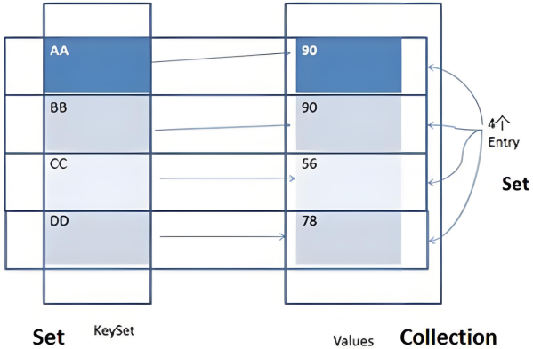
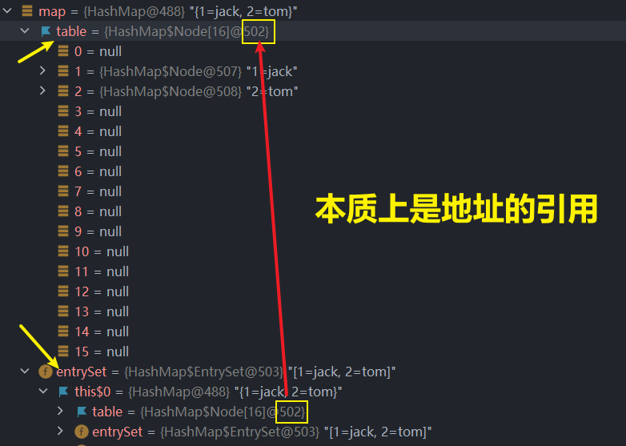

<h1 style="text-align: center; font-weight: bold;">Map 接口</h1>

---

## ⭐ 体系图


## 基本介绍

#### （1）Map 是双列集合，元素形式为 Key - Value（键值对）

#### （2） <span style="color:red">key 和 value</span> 可以是<span style="color:red">任何引用类型</span>的数据，通常会封装到 HashMap$Node 对象中（Node 实现了 Entry 接口）

#### （3） <span style="color:red">key 不允许重复</span>（HashSet 的底层是 HashMap），但是 <span style="color:red">value 可以重复</span>

#### （4） key 可以为 null，value 也可以为 null

> #### ⚠️ 注意：<span style="color:red">key 为 null，只能有一个键值对</span>

#### （5）常用 String 类型作为 Map 的 key，<span style="color:red">key 和 value</span> 之间存在<span style="color:red">单向一对一</span>关系，即通过指定的 key 能找到对应的 value（get（）方法）

## 常用方法

| 方法                                                                    | 描述                                                                                                                                                  |
| ----------------------------------------------------------------------- | ----------------------------------------------------------------------------------------------------------------------------------------------------- |
| size()                                                                  | 返回 Map 中键值对的数量                                                                                                                               |
| isEmpty()                                                               | 检查 Map 是否为空，若为空返回 true，否则返回 false                                                                                                    |
| clear()                                                                 | 清空 Map 中的所有键值对                                                                                                                               |
| put(K key, V value)                                                     | 将指定的键和值添加到 Map 中，若键已存在则更新对应的值                                                                                                 |
| get(Object key)                                                         | 根据指定的键返回对应的值，若键不存在则返回 null。                                                                                                     |
| <span style="color:red">getOrDefault</span>(Object key, V defaultValue) | 若键存在则返回对应值，否则返回默认值                                                                                                                  |
| remove(Object key)                                                      | <span style="color:red">删除指定的键及其对应的值（通过键值删除键值对）</span>，返回被删除的值，若键不存在则返回 null                                  |
| entrySet()                                                              | 返回 Map 中所有键值对的 Set 集合，每个元素为 Map.Entry 对象                                                                                           |
| keySet()                                                                | 返回 Map 中所有键的 Set 集合                                                                                                                          |
| values()                                                                | 返回 Map 中所有值的 <span style="color:red">Collection 集合</span>                                                                                    |
| containsKey(Object key)                                                 | 检查 Map 是否包含指定的键，返回 true 或 false                                                                                                         |
| containsValue(Object value)                                             | 检查 Map 是否包含指定的值，返回 true 或 false                                                                                                         |
| replace(K key, V value)                                                 | <span style="color:red">指定键替换对应的 value 值</span>，若键不存在，则不做任何操作                                                                  |
| replaceALL(<span style="color:red">(k,v) -> 新的 value 值</span> )      | <span style="color:red">(k,v) -></span>这部分是固定写法，把所有的键值对中的 oldvalue 替换成新的 newvalue，<span style="color:red">可以写表达式</span> |

## ⭐Map 接口底层

#### （1）每一对键值对会存储在 HashMap 的内部 <span style="color:red">table 数组</span> 中（table 数组的类型是 HashMap$Node [ ] ）。table 数组中的每个位置存储的是一个 <span style="color:red">Node 对象</span>

> #### 1. HashMap $ Node 是 Node 的全名，表示它是 HashMap 类的一个<span style="color:red">内部类</span> 。在 Java 中，<span style="color:red">$ 是用于区分内部类和外部类的符号</span>

#### （2）每个 Node 对象封装了四个属性

> #### key、value、hash、next

#### （3）HashMap$Node <span style="color:red">implements Map.Entry</span> ，这个接口提供了 getKey（）和 getValue（）方法，用于遍历 Map 接口中的元素

## EntrySet

### 结构视图



### 基本介绍

#### （1）entrySet 是 Map 接口的一个方法，返回一个 Set<Map.Entry<K,V>> 集合

> #### 集合的名字叫做 EntrySet
>
> #### 集合的类型是 Set
>
> #### 集合中每个元素的类型是 Map.Entry
>
> #### 每个 Entry 对象封装了一个键值对（Key - Value）

#### （2） EntrySet 集合中每个 Entry 元素中的 <span style="color:red">key 被封装成 KeySet 集合（类型是 Set）</span>

#### （3）EntrySet 集合中每个 Entry 元素中的 <span style="color:red">value 被封装成 Values 集合（类型是 Collection）</span>

#### （4） 最终通过<span style="color:red">引用</span>把 table 数组中存储的每个 <span style="color:red">Node 节点中的 key 和 value 指向 KeySet 集合和 Values 集合</span>

> #### entry 对象的运行类型是 HashMap$Node
>
> #### 键值对 Key - Value 是存储在 table 数组 Node 节点中，这里只是作为引用传递



## 遍历方式

### 基本介绍

#### （1）entrySet（）：提取每一对键值对

> #### map.entrySet()方法返回的是一个 Set<Map.Entry<K, V>> 类型的集合，包含多个 Map.Entry 对象，每个 Entry 对象封装了一个键值对（Key - Value）

#### （2） keySet() 方法：提取所有的 key

#### （3） values() 方法：提取所有的 value

### 遍历 key

#### 思路分析

> #### 首先通过 map.keySet()方法提取键值对中的键值
>
> #### 然后通过遍历 keySet 数组获取键值对中的键值

#### 方法一：增强 for 循环

```java
public class pra {
    public static void main(String[] args) {
        Map map = new HashMap();

        map.put("1", "jack");
        map.put("2", "tom");
        map.put("3", "lucy");

        Set set = map.keySet();
        for (Object key : set) {
            System.out.println("键：" + key);
        }
    }
}

键：1
键：2
键：3
```

#### 方法二：Iterator 迭代器遍历

```java
public class pra {
    public static void main(String[] args) {
        Map map = new HashMap();

        map.put("1", "jack");
        map.put("2", "tom");
        map.put("3", "lucy");

        Set set = map.keySet();
        Iterator iterator = set.iterator();
        while (iterator.hasNext()) {
            Object key =  iterator.next();
            System.out.println("键：" + key + " --> " + "值：" + map.get(key));
        }
    }
}

// 输出结果
键：1
键：2
键：3
```

### 遍历 value

#### 思路分析

> #### 首先通过 map.values()方法提取键值对中的值
>
> #### 然后通过遍历 values 数组获取键值对中的值

#### 方法一：增强 for 循环

```java
public class pra {
    public static void main(String[] args) {
        Map map = new HashMap();

        map.put("1", "jack");
        map.put("2", "tom");
        map.put("3", "lucy");

        Collection set = map.values();
        for (Object values :set) {
            System.out.println("值：" + values);
        }
    }
}

// 输出结果
值：jack
值：tom
值：lucy
```

#### 方法二：迭代器

```java
public class pra {
    public static void main(String[] args) {
        Map map = new HashMap();

        map.put("1", "jack");
        map.put("2", "tom");
        map.put("3", "lucy");

        Collection set = map.values();
        Iterator iterator = set.iterator();
        while (iterator.hasNext()) {
            Object values =  iterator.next();
            System.out.println("值：" + values);
        }
    }
}
// 输出结果
值：jack
值：tom
值：lucy
```

### 遍历 key - value

#### 思路一

> #### Map 接口提供了 get（）方法，可以通过遍历键，之后调用 get（）方法获取键值对对应的值

#### 方法一：增强 for 循环

```java
public class pra {
    public static void main(String[] args) {
        Map map = new HashMap();

        map.put("1", "jack");
        map.put("2", "tom");
        map.put("3", "lucy");

        Set set = map.keySet();
        for (Object key : map.keySet()) {
            System.out.println("键：" + key + " --> " + "值：" + map.get(key));
        }
    }
}

// 输出结果
键：1 --> 值：jack
键：2 --> 值：tom
键：3 --> 值：lucy
```

#### 方法二：Iterator 迭代器遍历

```java
public class pra {
    public static void main(String[] args) {
        Map map = new HashMap();

        map.put("1", "jack");
        map.put("2", "tom");
        map.put("3", "lucy");

        Set set = map.keySet();
        Iterator iterator = set.iterator();
        while (iterator.hasNext()) {
            Object key =  iterator.next();
            System.out.println("键：" + key + " --> " + "值：" + map.get(key));
        }
    }
}

// 输出结果
键：1 --> 值：jack
键：2 --> 值：tom
键：3 --> 值：lucy
```

#### 思路二

> #### 通过 entryset（）方法，获取 entry 对象（）（<span style="color:red">类型是 Map . entry</span>），通过 getKey（）和 getValues（）方法（需要<span style="color:red">向下转型为 Map . entry 类型的对象</span>后调用）获取键和值

#### 方法一：增强 for 循环

```java
public class pra {
    public static void main(String[] args) {
        Map map = new HashMap();

        map.put("1", "jack");
        map.put("2", "tom");
        map.put("3", "lucy");

        Set set = map.entrySet();
        for (Object obj :set) {
            // 向下转型
            Map.Entry entry =(Map.Entry) obj;
            System.out.println("键：" + entry.getKey() + " --> 值：" + entry.getValue());
        }
    }
}

// 输出结果
键：1 --> 值：jack
键：2 --> 值：tom
键：3 --> 值：lucy
```

#### 方法二：迭代器

```java

public class pra {
    public static void main(String[] args) {
        Map map = new HashMap();

        map.put("1", "jack");
        map.put("2", "tom");
        map.put("3", "lucy");

        Set set = map.entrySet();
        Iterator iterator = set.iterator();
        while (iterator.hasNext()) {
            Object obj =  iterator.next();
            Map.Entry entry = (Map.Entry)obj;
            System.out.println("键：" + entry.getKey() + " --> 值：" + entry.getValue());
        }
    }
}
```

## HashMap

### 基本介绍

#### （1）HashMap 是 Map 接口中使用频率最高的实现类

#### （2）HashMap 是以 key - value 对的方式存储数据的（<span style="color:red">HashMap$Node 类型</span>）

#### （3）<span style="color:red">key 不能重复，value 可以重复</span>，允许使用 null 键和 null 值，<span style="color:red">key 的 null 值只能有一个</span>

#### （4）添加的 key - value 中如果<span style="color:red">key 相同，value 会被覆盖</span>（因为 key 不能重复）

#### （5）与 HashSet 一样, <span style="color:red">不保证映射的顺序</span>, 因为底层是以 hash 表的方式来存储的.

#### （6）jdk8 的 HashMap 底层是<span style="color:red">数组 + 链表 + 红黑树</span>

#### （7）HashMap 是<span style="color:red">线程不安全</span>的

### ⭐ 底层源码

> #### 关于 HashMap 的底层添加机制和扩容机制在 Set 接口中的 HashSet 中已经分析，这里重点看一下如果<span style="color:red">添加键值相同时，value 是如何被替换的</span>

#### 源码如下

> #### 当添加相同元素时，e 不为空，进入如下分支判断
>
> #### 前面的源码可以参考 Set 接口的笔记，其中对 HashMap 底层源码的分析

```java
if (e != null) { // existing mapping for key
    V oldValue = e.value;
    if (!onlyIfAbsent || oldValue == null)
        e.value = value;
    afterNodeAccess(e);
    return oldValue;
}
```

#### 代码分析

> #### （1）在 HashSet 中，底层调用的其实是 HashMap，但是由于 HashSet 是单列集合，HashMap 是双列集合，调用 put（）方法会传入两个值，value 由 PRESENT 代替
>
> #### （2）HashSet 中的 e.value 就是 PRSENT，在 HashMap 中 PRESENT 的值变成了传入的 value，即 <span style="color:red">e . value 表示传入的 value</span>
>
> #### （3）<span style="color:red">V oldValue = e.value</span>，这一步实现了<span style="color:red">新的 value 覆盖旧的 value</span>

## Hashtable

### 基本介绍

#### （1）存放的元素是键值对：即 K-V

#### （2） Hashtable 的<span style="color:red">键和值都不能为 null</span>，否则会抛出 NullPointerException 异常

#### （3） Hashtable 使用方法基本和 HashMap 一样

#### （4） <span style="color:red">Hashtable</span> 是<span style="color:red">线程安全</span>的 (synchronized)

### 对比 HashMap

| 类型      | 版本 | 线程安全（同步） | 效率                              | 允许 null 键 null 值 |
| --------- | ---- | ---------------- | --------------------------------- | -------------------- |
| HashMap   | 1.2  | 不安全           | 高                                | 可以                 |
| Hashtable | 1.0  | 安全             | <span style="color:red">低</span> | 不可以               |

## Properties

#### （1） Properties 类<span style="color:red">继承自 Hashtable 类</span>，并且实现了 Map 接口，也是使用一种键值对（Key - Value）的形式来存储数据

#### （2） Properties 是<span style="color:red">线程安全</span>的

#### （3） Properties 可以从 xxx.properties <span style="color:red">配置文件</span>中加载数据，通过 Properties 对象对配置文件信息进行读取和修改

> #### ⚠️ 提醒：Properties 主要应用在文件操作，相关使用和相关方法请查看 Java 第二阶段 IO 流部分的笔记

## TreeMap

### 基本介绍

> #### TreeMap 提供了一个构造器，可以传入 Comparator 比较器来指定添加的顺序
>
> #### ⚠️TreeSet 的底层是 TreeMap，更多相关介绍可以查看 Set 接口中关于 TreeSet 的笔记

### ⭐ 源码分析

> #### 区别于 TreeSet，TreeMap 是双列集合，不会进入 add（）方法，而是直接进入 put（）方法

#### 进入 put（）方法

```java
public V put(K key, V value) {
    Entry<K,V> t = root;
    if (t == null) {
        compare(key, key); // type (and possibly null) check

        root = new Entry<>(key, value, null);
        size = 1;
        modCount++;
        return null;
    }
    int cmp;
    Entry<K,V> parent;
    // split comparator and comparable paths
    Comparator<? super K> cpr = comparator;
    if (cpr != null) {
        do {
            parent = t;
            cmp = cpr.compare(key, t.key);
            if (cmp < 0)
                t = t.left;
            else if (cmp > 0)
                t = t.right;
            else
                return t.setValue(value);
        } while (t != null);
    }
    else {
        if (key == null)
            throw new NullPointerException();
        @SuppressWarnings("unchecked")
            Comparable<? super K> k = (Comparable<? super K>) key;
        do {
            parent = t;
            cmp = k.compareTo(t.key);
            if (cmp < 0)
                t = t.left;
            else if (cmp > 0)
                t = t.right;
            else
                return t.setValue(value);
        } while (t != null);
    }
    Entry<K,V> e = new Entry<>(key, value, parent);
    if (cmp < 0)
        parent.left = e;
    else
        parent.right = e;
    fixAfterInsertion(e);
    size++;
    modCount++;
    return null;
}
```

#### 第一次添加

> #### 第一次添加，把 <span style="color:red">k - v</span> 键值对<span style="color:red">封装到 Entry 对象中</span>

```java
Entry<K,V> t = root;
if (t == null) {
    compare(key, key); // type (and possibly null) check

    root = new Entry<>(key, value, null);
    size = 1;
    modCount++;
    return null;
}
```

#### 之后的添加

```java
Comparable<? super K> k = (Comparable<? super K>) key;
do {
    parent = t;
    cmp = k.compareTo(t.key);
    if (cmp < 0)
        t = t.left;
    else if (cmp > 0)
        t = t.right;
    else
        return t.setValue(value);
} while (t != null);
```

#### 代码分析

> #### （1）遍历所有的 key，给当前的 key - value 键值对找到插入位置
>
> #### （2）调用传入的比较器，实现 compare 方法（<span style="color:red">动态绑定机制</span>）
>
> #### （3）else 分支：在遍历过程中，如果发现当前的 key 和添加的 key 一样，就不会执行添加操作

### ⭐ 面试经典易错题

> #### 下面代码中的 java 是否会被添加到 TreeMap 中

```java
public class pra {
    public static void main(String[] args) {

        TreeMap treeMap = new TreeMap(new Comparator() {
            @Override
            public int compare(Object o1, Object o2) {
                return ((String)o1).length() - ((String)o2).length();
            }
        });

        treeMap.put("jack","1");
        treeMap.put("tom","2");
        treeMap.put("hi","3");
        treeMap.put("java","4");

        System.out.println("treeSet = " + treeMap);
    }
}

// 输出结果
treeSet = {hi=3, tom=2, jack=4}
```

#### 答案：不会，当添加的 Key 相同时，会对 Value 进行更新

#### 底层源码

```java
do {
    parent = t;
    cmp = k.compareTo(t.key);
    if (cmp < 0)
        t = t.left;
    else if (cmp > 0)
        t = t.right;
    else
        return t.setValue(value);
} while (t != null);
```

#### 代码分析

> #### （1）传入的比较器是比较字符串的长度，<span style="color:red">字符串的长度相同时返回 0</span>，进入 else 分支
>
> #### （2）调用 <span style="color:red">setValue（）</span>方法，<span style="color:red">更新 key 对应的 value</span>，返回这个 value
