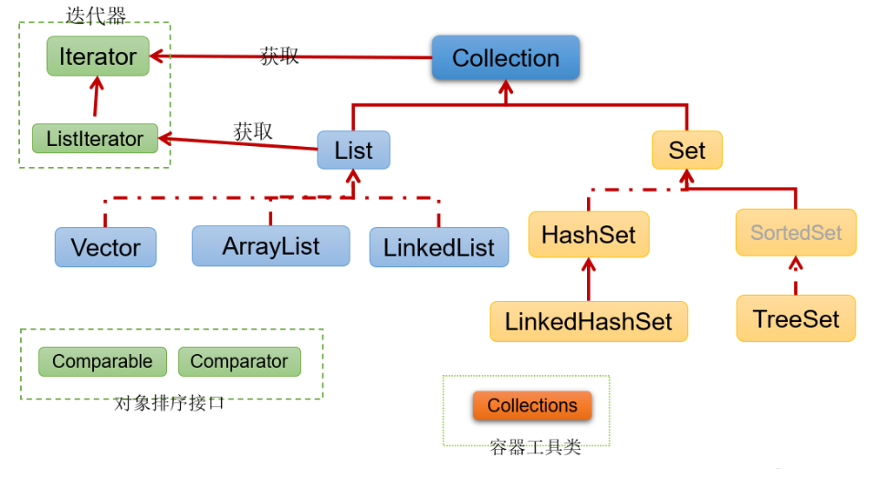
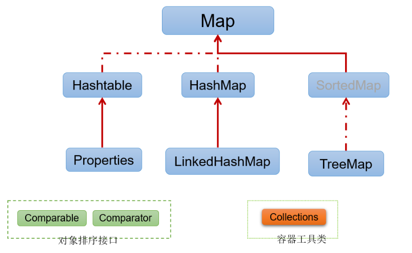
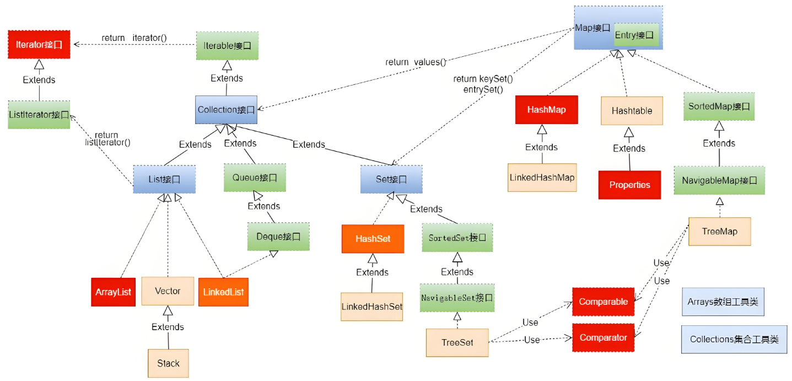

<h1 style="text-align: center; font-weight: bold;">集合的总结</h1>

---

## ⭐ 集合体系回顾

### Collection

 

### Map

 

### 集合体系

## 线程安全

> #### 只有 Vector、Hashtable、Properties 是线程安全的，其余都不是线程的

## 集合类及其特点总结

| 类/接口       | 所属接口                            | 底层实现                                          | 主要特点                                           |
| ------------- | ----------------------------------- | ------------------------------------------------- | -------------------------------------------------- |
| Collection    | 接口 | 实现了 Iterator 接口                              | 所有集合的顶层父接口                               |
| List          | 接口 | 实现了 Collection 接口                            | 有序、可重复元素    |
| ArrayList     | List                                | 动态数组                                          | 查询快、增删慢                                     |
| Vector        | List                                | 动态数组                                          | 查询快、效率低                                     |
| LinkedList    | List                                | 双向链表                                          | 增删快、查询慢、可做队列                           |
| Set           | 接口 | 实现了 Collection 接口                            | 无序、不重复元素    |
| HashSet       | Set                                 | HashMap                                           | 查询快、不保证顺序                                 |
| LinkedHashSet | Set                                 | LinkedHashMap                                     | 有序（插入顺序）    |
| TreeSet       | Set                                 | TreeMap（红黑树）                                 | 可排序，有序        |
| Map           | 接口 | 实现了 Collection 接口                            | 键值对集合，键唯一                                 |
| HashMap       | Map                                 | 数组+单链表+红黑树                                | 查询快、不保证顺序                                 |
| LinkedHashMap | Map                                 | HashMap + 双向链表 | 有序（插入顺序）                                   |
| Hashtable     | Map                                 | 哈希表                                            | 效率低              |
| Properties    | Map                                 | 继承了 Hashtable                                  | 属性配置专用，键值为字符串                         |
| TreeMap       | Map                                 | 红黑树（Entry 节点）                              | 可排序，按 key 有序 |

## 集合选择

#### 根据存储元素确定集合的存储类型

> #### 单列集合：存储一个值
>
> #### 双列集合：存储键值对（Key - Value）

#### 👉 单列集合：Collection 接口

#### （1）允许重复：List 接口

> #### 增删多：LinkedList（底层维护了一个双向链表）
>
> #### 改查多：ArrayList（底层维护 Object 类型的数组）

#### （2）不允许重复：Set 接口

> #### 无序：HashSet（底层是 HashMap，底层结构：数组+链表+红黑树）
>
> #### 排序：TreeSet
>
> #### 插入和取出顺序一致：LinkedHashSet（底层是 LinkedHashMap，底层结构：数组 + 双向链表）

#### 👉 双列集合（键值对）：Map 接口

#### （1）键值对：HashMap（底层采用哈希表（Hash Table），通过哈希函数对键进行散列，存储元素）

#### （2）键值对：TreeMap（底层采用红黑树）

> #### 1. 可以传入 Comparator 比较器，指定添加顺序
>
> #### 2. 不允许空键空值

#### （3）插入和取出顺序一致：LinkedHashMap

#### （4）配置文件操作：Properties

## 关系对比

### ArrayList 和 Vector

| 底层结构  | 版本              | 线程安全（同步） | 效率                                                                         | 扩容机制                                                                                                                                                                                                                                                              |
| --------- | ----------------- | ---------------- | ---------------------------------------------------------------------------- | --------------------------------------------------------------------------------------------------------------------------------------------------------------------------------------------------------------------------------------------------------------------- |
| ArrayList | 可变数组          | jdk1.2           | 不安全, 效率高 | 1. 如果是无参构造器, 默认为 10, 满后, 就按 1.5 倍扩容   2. 如果构造器指定大小, 则每次按原先的1.5 倍扩容 |
| Vector    | 可变数组 Object[] | jdk1.0           | 安全, 效率不高 | 1. 如果是无参构造器, 默认为 10, 满后, 就按 2 倍扩容   2. 如果构造器指定大小, 则每次按原先的2 倍扩容     |

### ArrayList 和 LinkedList

| 底层结构                 | 底层实现 | 查找的效率                                        |
| ------------------------ | -------- | ------------------------------------------------- |
| ArrayList（适用查找多）  | 可变数组 | 较低               |
| LinkedList（适用增删多） | 双向链表 | 较高，通过链表添加 |

### HashMap 和 Hashtable

| 类型      | 版本 | 线程安全（同步） | 效率                              | 允许 null 键 null 值 |
| --------- | ---- | ---------------- | --------------------------------- | -------------------- |
| HashMap   | 1.2  | 不安全           | 高                                | 可以                 |
| Hashtable | 1.0  | 安全             | 低 | 不可以               |
