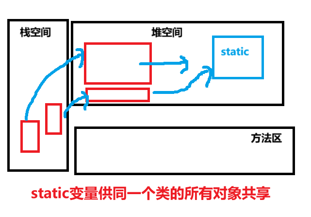

<h1 style="text-align: center; font-weight: bold;">类变量</h1>

---

## 基本介绍

> #### 引出关键字：<span style="color:red">static</span>
>
> #### 又名：静态变量，静态字段，类字段（字段又名属性，成员方法），类属性

#### static 字段是一个供该<span style="color:red">同一个类</span>的<span style="color:red">所有对象共享</span>的变量

> #### （1）任何一个该类的对象去访问它时，取到的都是相同的值
>
> #### （2）同样任何一个该类的对象去修改它时，修改的也是同一个变量
>
> #### （3）随着<span style="color:red">类的加载而创建</span>

## ⭐ 创建机制

#### （1）第一种说法（<span style="color:red">JDK8 以前</span>的版本）

> #### 类加载的时候会在<span style="color:red">方法区</span>创建一块空间（称为静态域），static 修饰的变量存储在其中

#### 第二种说法（<span style="color:red">JDK8 以后</span>的版本）

> #### staic 变量保存在<span style="color:red">堆空间</span>中
>
> #### <span style="color:red">类加载</span>时候的时候通过<span style="color:red">反射机制</span>加载一个<span style="color:red">Class 对象</span>，static 变量保存在 <span style="color:red">Class 实例的尾部</span>



## 类变量的定义

#### （1）访问修饰符 static 变量类型 变量名

```java
public static int age;
```

#### （2） static 访问修饰符 变量类型 变量名

```java
static public int age;
```

## 类变量的访问

#### 两种方式

> #### （1）类名 . 类变量名
>
> #### （2）对象名 . 类变量名

#### 注意事项

> #### 1. 由于类变量供<span style="color:red">同一个类</span>的<span style="color:red">所有对象共享</span>，因此可以通过<span style="color:red">类名访问</span>
>
> #### 2. 静态变量的访问修饰符的<span style="color:red">访问权限和范围</span> 和普通类属性是一样的

## 代码示例

> #### 统计创建对象的个数

```java
public class practise01 {
    public static void main(String[] args) {
        statictest statictest1 = new statictest();
        statictest statictest2 = new statictest();
        statictest statictest3 = new statictest();
        int tot = statictest.totalobjectnum();
        System.out.println("创建statictest类对象的总个数是：" + tot);
    }
}

class statictest{

    static int objectnum;

    public statictest(){
        statictest.objectnum ++;
    }

    public static int totalobjectnum(){
        return objectnum;
    }
}
// 输出结果
创建statictest类对象的总个数是：3
```

#### 代码分析

> #### （1） 创建类变量 objectnum 用于统计创建该类对象的个数
>
> #### （2） 在构造器中加入逻辑，只要创建对象，类变量 objectnum 的值就自增一
>
> #### （3） 使用 totalobjectnum 方法返回该类对象创建的个数

## 使用细节

#### （1）什么时候需要用类变量？

> #### 当我们需要让某个<span style="color:red">类的所有对象共享一个变量</span>时，就可以考虑使用类变量（静态变量）

#### （2）区别类变量与实例变量（普通属性）

> #### 1. <span style="color:red">类变量</span>是该类的<span style="color:red">所有对象共享</span>的
>
> #### 2. <span style="color:red">实例变量</span>是<span style="color:red">每个对象独享</span>的。

#### （3）类变量可以通过<span style="color:red">类名.类变量</span>来访问；但实例变量只能通过<span style="color:red">对象.类变量</span>来访问

> #### ⭐ 推荐使用：类名 . 类变量

#### （4）实例变量不能通过 <<类名 . 类变量>> 方式访问，需要创建对象后才能通过 <<对象名 . 属性>> 的方法访问

#### （5）<span style="color:red">类变量</span>是随<span style="color:red">类加载时就初始化了</span>，也就是说，即使你没有创建对象，只要类加载了，就可以使用类变量

#### （6）类变量的生命周期是随着类的加载开始，随着类消失而销毁
