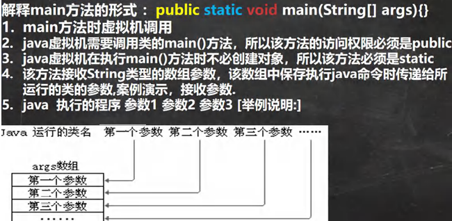
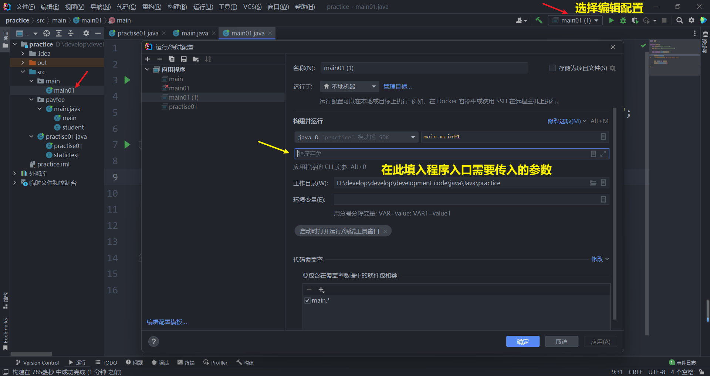
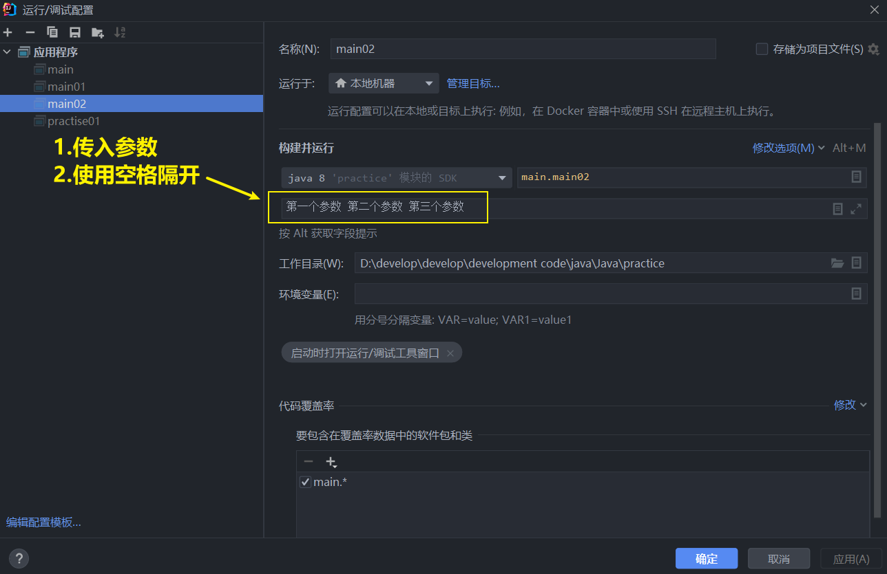

<h1 style="text-align: center; font-weight: bold;">main 方法</h1>

---

## 基本介绍



## 使用细节

> #### （1） 在 main()方法中，可以直接调用 mian 方法所在类的静态方法或静态属性
>
> #### （2） <span style="color:red">不能访问</span>该类中的<span style="color:red">非静态成员</span>，必须创建该类的一个实例对象后，才能通过这个对象去访问类中的非静态成员

## 代码示例

```java
package main;

public class main01 {
    static String n = "我是静态成员 n，可以通过类名直接访问";
    String n1 = "我是静态成员 n1，不可以通过类名直接访问，需要创建对象后，用对象访问";

    public static void main(String[] args) {

        System.out.println(n);
//        System.out.println(n1);  // 会报错，无法解析 n1，因为 n1 不是静态变量

        main01 main01 = new main01();
        System.out.println(main01.n1);
    }
}

```

## args 数组

### 传参

> #### 在参数区中填入字符串，不同数组元素使用<span style="color:red">空格隔开</span>即可





### 代码示例

```java
package main;
public class main02 {
    public static void main(String[] args) {
        for (int i = 0; i < args.length; i++) {
            System.out.println("args[" + i + "]：" + args[i]);
        }
    }
}
```

#### 输出结果

```java
args[0]：第一个参数
args[1]：第二个参数
args[2]：第三个参数
```
