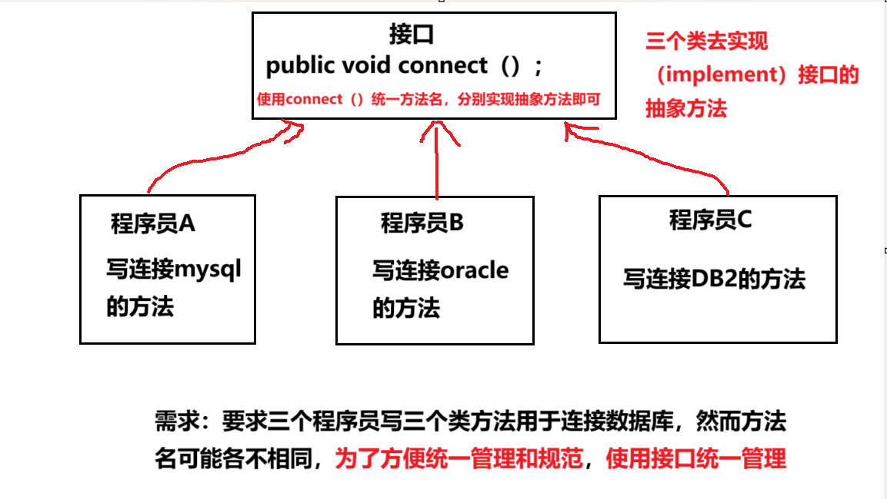

<h1 style="text-align: center; font-weight: bold;">接口</h1>

---

## 基本介绍



#### 理解：接口就是一个编程规范，统一了某个方法的命名，同一个方法但是需要实现不同的功能就可以通过方法重写实现

> #### 引入关键字：<span style="color:red">interface、implements</span>

#### 定义接口

```java
interface 接口名{
    // 属性
    // 抽象方法
}
```

#### 实现接口

```java
class a implements 接口名{

}
```

## 接口中的属性

### 基本介绍

> #### 属性默认是 <span style="color:red">public static final</span> 修饰的，即表示一个<span style="color:red">常量</span>（命名采用全部大写 + 下划线），定义时<span style="color:red">必须赋值</span>

#### （1）final：无法通过接口修改接口中属性的值

#### （2）static：可以通过接口名（即类名）访问接口中的属性

### 访问属性

```java
public class main {
    public static void main(String[] args) {
        B b = new B();

        System.out.println(b.a);
        System.out.println(A.a);
        System.out.println(B.a);
    }
}

interface A{
    int a = 10; // 等价于 public static final a = 10;
}

class B implements A{

}

// 输出结果
10
10
10
```

#### 代码分析

#### （1）b . a：类实现了接口，b 是类 B 的一个实例，当然可以用实例对象去访问

#### （2）A . a：接口中的属性是 <span style="color:red"> public static final</span> 修饰的，是静态属性，当然可以用类名访问

#### （3）B . a：类 B 实现了接口，当然可以用类去访问

## 接口中的方法

#### （1）接口中一般定义抽象方法，用 abstract 修饰

#### （2）接口中所有的方法<span style="color:red">默认是 public 修饰</span>，定义抽象方法时<span style="color:red">可以省略 abstract</span> 修饰符

#### （3） <span style="color:red">JDK7 之前</span>接口里的方法都<span style="color:red">没有方法体</span>

#### （4） <span style="color:red">JDK8 之后</span>接口里的方法<span style="color:red">可以有静态方法、默认方法（使用 default 关键字修饰）</span>（即接口中可以有方法的具体实现）

```java
// defualt 关键字可以省略
default public void hi(){

}

public static void hi(){

}
```

## 代码示例

```java
package interface_;

public class main {
    public static void main(String[] args) {
        person_a person_a = new person_a();
        person_b person_b = new person_b();
        interface_implement.t(person_a);
        System.out.println("============================");
        interface_implement.t(person_b);
    }
}

interface database_tool{

    public void connect();
    public void close();

}

class interface_implement{
    public static void t(database_tool n){
        n.connect();
        n.close();
    }
}

class person_a implements database_tool{

    @Override
    public void connect() {
        System.out.println("程序员a  连接  了mysql数据库");
    }

    @Override
    public void close() {
        System.out.println("程序员a  关闭  了mysql数据库");
    }
}

class person_b implements database_tool{

    @Override
    public void connect() {
        System.out.println("程序员b  连接  了oracle数据库");
    }

    @Override
    public void close() {
        System.out.println("程序员b  连接  了oracle数据库");
    }
}

// 输出结果
程序员a  连接  了mysql数据库
程序员a  关闭  了mysql数据库
============================
程序员b  连接  了oracle数据库
程序员b  连接  了oracle数据库

```

#### 代码分析

#### （1）在接口中编写抽象方法，用于连接和关闭数据库，由类具体实现抽象方法

> #### connect()
>
> #### close()

#### （2）类中使用 implements 实现接口，编写具体的方法实现接口中的抽象方法

#### （3）编写 interface_implement 类，实现调用接口，传入不同实现类的对象，方法会自动调用对应类的具体实现

## 使用细节

#### （1）<span style="color:red">接口的修饰符</span>只能是 <span style="color:red">public 、默认</span>，这点和类的修饰符是一样的

#### （2）<span style="color:red">接口不能被实例化</span>（即不能创建一个接口对象）

#### （3）接口<span style="color:red">不能继承</span>其它的<span style="color:red">类</span>，但是<span style="color:red">可以继承</span>多个<span style="color:red">接口</span>

> #### 没有接口实现接口之说，实现的对象应该是一个类，只能是继承接口

#### （4）一个普通<span style="color:red">类实现接口</span>，就<span style="color:red">必须实现</span>该接口中的<span style="color:red">所有方法</span>

#### （5）一个类<span style="color:red">可以同时实现多个接口</span>

#### （6）抽象类实现接口，可以不用实现接口的方法

## 接口与继承

### 基本介绍

> #### 接口是对 Java 中<span style="color:red">单继承机制的补充</span>说明

#### （1）继承的价值主要在于：解决代码的复用性和可维护性

#### （2）接口的价值主要在于：设计好各种规范(方法)，让其它类去实现这些方法，更加的灵活

> #### 1. 接口比继承更加灵活，继承满足 is - a 的关系。而接口只需要满足 like - a 的关系
>
> #### 2. 接口在一定程度上实现代码解耦（<span style="color:red">接口规范性 + 动态绑定机制</span>）

### 代码示例

> #### monkey 通过实现接口，获取鱼类的游泳技能和鸟类的飞行技能

```java
public class Test {
    public static void main(String[] args) {
        monkey monkey = new monkey("monkey");
        monkey.climb_tree();
        monkey.swim();
        monkey.fly();
    }
}

interface fish{
    void swim();  // 默认是 public abstract
}

class animal{
    String name;
    // 构造器
    public animal(String name){
        this.name = name;
    }
}

// 类可以继承多个接口
class monkey extends animal implements fish{

    // 构造器
    public monkey(String name){
        super(name);
    }

    @Override
    public void swim() {
        System.out.println(getName() + "通过学习,获得——>鱼类的swim()方法");
    }

    public void climb_tree(){
        System.out.println(getName() + "本身拥有——>climb_tree（）方法");
    }
}

// 输出结果
monkey本身拥有——>climb_tree（）方法
monkey通过学习,获得——>鱼类的swim()方法
```

#### 代码分析

> #### （1）首先创建两个接口，定义抽象方法
>
> #### （2）让 monkey 类实现多个接口
>
> #### （3）在 monkey 类中具体实现方法
>
> #### （4）在主函数中实现方法

## 接口与多态

### 基本介绍

> #### 接口中体现了多态的应用，主要是如下几个方面

#### （1）多态参数

> #### 接口类型的变量可以指向任何实现该接口的对象，并通过接口调用方法（<span style="color:red">动态绑定机制</span>）

#### （2）多态数组

> #### 可以定义一个接口类型的数组，数组元素是实现了该接口的类对象

#### （3）多态传递

> #### 可以用一个父类接口变量指向实现了子类接口的对象

### 多态参数

> #### bbb 类实现了 aaa 接口，在 ccc 类中编写 hi（）方法，接收一个 aaa 类型接口的参数，通过该参数调用 hi（）方法

```java
public class Test {
    public static void main(String[] args) {
        ccc ccc = new ccc();
        // 运行类型是 bbb，根据动态绑定机制，会调用 bbb 的 hi（）方法
        bbb bbb = new bbb();
        ccc.hi(bbb);
    }
}

interface aaa{
    // 默认是 public abstract 修饰
    void hi();
}

class bbb implements aaa{
    @Override
    public void hi() {
        System.out.println("调用了 bbb 类的 hi（）方法");
    }
}

class ccc {
    public void hi(aaa interFace) {
        interFace.hi();
    }
}

// 输出结果
调用了 bbb 类的 hi（）方法
```

### 多态数组

> #### （1）编写 a 类，b 类，二者实现同一个接口，定义接口数组，存放 a 类、b 类的实例对象
>
> #### （2）遍历数组，调用共有的方法，如果遍历的是 b 类，调用独有的方法

```java
package a;

public class main {
    public static void main(String[] args) {
        arr[] interface_arr = new arr[2];
        interface_arr[0] = new a();
        interface_arr[1] = new b();
        for (int i = 0; i < interface_arr.length; i++) {
            interface_arr[i].shared_method();
            // 如果是b对象就调用其独有的方法
            if(interface_arr[i] instanceof b){
                ((b) interface_arr[i]).unique_method();
            }
        }
    }
}

interface arr{
    void shared_method();
}


class a implements arr{
    public void shared_method(){
        System.out.println("a类中调用了共有的方法");
    }
}

class b implements arr{
    public void shared_method(){
        System.out.println("b类中调用了共有的方法");
    }

    public void unique_method(){
        System.out.println("调用了b类独有的方法");
    }
}

// 输出结果
a类中调用了共有的方法
b类中调用了共有的方法
调用了b类独有的方法

```

### 多态传递

> #### 间接实现多继承

```java
package d;

public class main {
    public static void main(String[] args) {
        B b = new test_class();
        A a = new test_class();
    }
}

interface A{
    void a();
}

interface B extends A{
    void b();
}

class test_class implements B{

    @Override
    public void a() {

    }

    @Override
    public void b() {

    }
}
```

#### 代码分析

#### （1）B b = new test_class();

> #### 接口类型的变量可以指向，实现了该接口的类的对象实例

#### （2）A a = new test_class();

> #### 1. 类实现了接口 B，然而接口 B 是<span style="color:red">继承</span>了接口 A，也相当于类实现了接口 A
>
> #### 2. 类即需要实现接口 A 中所有的抽象方法，也要实现接口 B 中所有的抽象方法
>
> #### 3. 体现了多态传递
