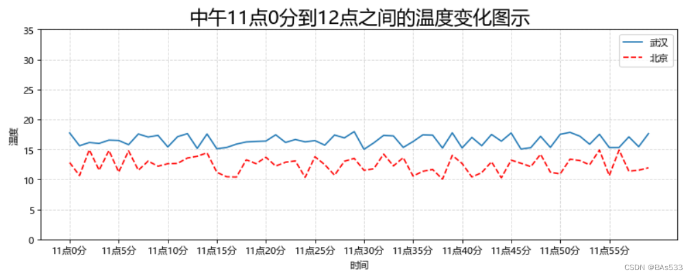

# Matplotlib 数据可视化

---

## 概述

Matplotlib 是 Python 最常用的**数据可视化库**，专门用于绘制 2D/3D 图表，以渐进、交互式方式呈现数据。

```python
import matplotlib.pyplot as plt
```

> 数据可视化是数据分析/挖掘的关键辅助工具，让数据更直观、更具说服力。

---

## 绘制流程（三步骤）

```
创建画布 → 绘制图像 → 显示图像
```

```python
import matplotlib.pyplot as plt

# 1. 创建画布
plt.figure(figsize=(5, 5), dpi=100)

# 2. 绘制折线图
plt.plot([1, 2, 3, 4, 5, 6, 7], [17, 17, 18, 15, 11, 11, 13])

# 3. 显示图像
plt.show()
```

| 参数 | 说明 |
|------|------|
| `figsize=(w, h)` | 画布宽高（单位：英寸） |
| `dpi` | 图像清晰度（Dots Per Inch） |


---

## 图像结构


| 组成部分 | 说明 |
|----------|------|
| Figure（画布） | 最外层容器，容纳所有内容 |
| Axes（坐标区） | 实际绘图区域，含 X/Y 轴 |
| Axis（轴） | 横/纵坐标轴 |
| Tick（刻度） | 坐标轴上的刻度线 + 标签 |
| Legend（图例） | 区分不同数据系列的标注 |
| Title（标题） | 图表标题 |

---

## 完整案例：温度变化图

需求：画出某城市 11:00~12:00 每分钟的温度变化折线图。

### 准备数据

```python
import matplotlib.pyplot as plt
import random

x = range(60)  # 60 分钟
y_wuhan = [random.uniform(15, 18) for i in x]  # 15°C ~ 18°C
```

### 自定义刻度

```python
# x 轴：每 5 分钟显示一个标签
x_ticks_label = ["11点{}分".format(i) for i in x]
plt.xticks(list(x)[::5], x_ticks_label[::5])

# y 轴：0 ~ 40，每 5 度一个刻度
y_ticks = range(40)
plt.yticks(list(y_ticks)[::5])
```

> `xticks` 第一个参数必须是数字，第二个参数是对应的文本标签。

### 网格与说明

```python
plt.grid(True, linestyle='--', alpha=0.5)

plt.xlabel("时间")
plt.ylabel("温度")
plt.title("中午11点0分到12点之间的温度变化图示", fontsize=20)
```

| 网格参数 | 说明 | 取值示例 |
|----------|------|----------|
| `b` | 是否显示 | `True` / `False` |
| `axis` | 方向 | `"both"` / `"x"` / `"y"` |
| `color` | 颜色 | `'r'`, `'#ccc'` |
| `linestyle` | 线型 | `'-'`, `'--'`, `'-.'`, `':'` |
| `alpha` | 透明度 | `0.5` |

### 多条折线 + 图例

```python
# 第二条折线（北京）
y_beijing = [random.uniform(1, 3) for i in x]

plt.plot(x, y_wuhan, label="武汉")
plt.plot(x, y_beijing, color='r', linestyle='--', label="北京")

plt.legend()
```



### 保存图像

```python
# 一定要在 show() 之前保存！
plt.savefig("temperature.png")
plt.show()
```

---

## 常用 API 速查

| 功能 | API | 关键参数 |
|------|-----|----------|
| 创建画布 | `plt.figure()` | `figsize`, `dpi` |
| 折线图 | `plt.plot(x, y)` | `color`, `linestyle`, `label`, `marker` |
| x 轴刻度 | `plt.xticks()` | `ticks`, `labels` |
| 网格线 | `plt.grid()` | `b`, `linestyle`, `alpha` |
| x/y 标签 | `plt.xlabel()` / `ylabel()` | `fontsize` |
| 标题 | `plt.title()` | `fontsize` |
| 图例 | `plt.legend()` | `loc` |
| 保存 | `plt.savefig(path)` | 文件路径 |
| 显示 | `plt.show()` | — |

### plot 常用样式参数

| 参数 | 说明 | 示例 |
|------|------|------|
| `color` | 颜色 | `'r'` 红、`'b'` 蓝、`'#ff0000'` |
| `linestyle` | 线型 | `'-'` 实线、`'--'` 虚线、`':'` 点线 |
| `marker` | 数据点标记 | `'o'` 圆、`'^'` 三角、`'*'` 星 |
| `linewidth` | 线宽 | `2.0` |

---

## 面试要点

**Q: Matplotlib 绘制流程？**

创建画布（`figure`）→ 绘制图像（`plot`）→ 设置属性（刻度、标签、图例）→ 保存（`savefig`）→ 显示（`show`）。

**Q: savefig 和 show 的顺序？**

`savefig` 必须在 `show` 之前。因为 `show` 会清空画布，之后再保存会得到空白图。

**Q: 如何在一张图上画多条折线？**

多次调用 `plt.plot()`，每次传入不同的数据，配合 `label` 参数区分，最后用 `plt.legend()` 显示图例。

**Q: xticks 的第一个参数为什么必须是数字？**

因为刻度位置需要用数字定位到坐标轴的对应位置。文本标签只是"替换显示"，底层位置仍是数字坐标。
