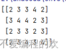
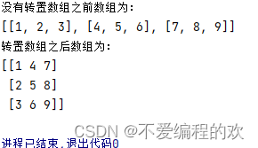
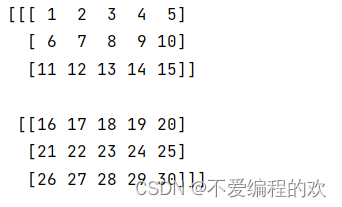
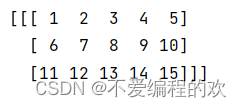

# NumPy 科学计算库

---

## 概述

NumPy（Numerical Python）是 Python 中最重要的**科学计算库**，核心是 **ndarray**（N 维数组对象），底层用 C 语言实现，性能远超 Python 原生列表。

### 六大特点

| 特点 | 说明 |
|------|------|
| 多维数组 | ndarray 存储同质数据类型，连续内存 |
| 广播 | 自动调整不同形状数组执行运算 |
| 数学函数 | 丰富的线性代数、统计、傅里叶变换 |
| 灵活索引 | 支持切片、布尔索引、花式索引 |
| 高性能 | C 底层 + BLAS/LAPACK 加速 |
| 生态集成 | Pandas、SciPy、Matplotlib 基础 |

### 安装

```bash
pip install numpy
```

### 导入

```python
import numpy as np
```

---

## 创建数组

### 基本创建

```python
import numpy as np

# 从列表创建一维数组
arr1 = np.array([1, 2, 3, 4])
print(arr1)  # [1 2 3 4]

# 二维数组（矩阵）
arr2 = np.array([[1, 2, 3], [4, 5, 6]])
print(arr2)
# [[1 2 3]
#  [4 5 6]]
```

### 占位数组

```python
# 全零数组
np.zeros(shape=(3, 4))       # 3行4列全零

# 全一数组
np.ones(shape=(2, 5))        # 2行5列全一

# 全空数组（接近 0 但不为 0）
np.empty(shape=(3, 3))
```

### 序列数组

```python
# arange：类似 range，支持小数步长
np.arange(10, 16, 2)         # [10, 12, 14]
np.arange(0, 1, 0.2)         # [0.  0.2 0.4 0.6 0.8]

# linspace：等分区间，包含两端
np.linspace(1, 10, 20)       # 1到10，均匀分成20份
```

### 随机数组

```python
# 均匀分布 [0, 1)
np.random.rand(3, 4)         # 3行4列

# 随机整数
np.random.randint(2, 10, size=(3, 5))  # 2~9 的随机整数
```



---

## 数组属性

```python
arr = np.array([[[1, 2], [3, 4]], [[5, 6], [7, 8]]])

arr.ndim    # 维度数 → 3
arr.shape   # 形状 → (2, 2, 2)
arr.size    # 元素总个数 → 8
arr.dtype   # 数据类型 → int32
```

| 属性 | 含义 |
|------|------|
| `ndim` | 数组的维度数 |
| `shape` | 各维度的长度（每个方向有几个元素） |
| `size` | 元素总个数 |
| `dtype` | 元素的数据类型 |

---

## 数组变换

### reshape 重塑

```python
arr = np.array([[1, 2, 3, 4, 5],
                [6, 7, 8, 9, 10]])

arr.shape         # (2, 5)

# 重塑为 5 行 2 列
new_arr = arr.reshape((5, 2))
new_arr.shape     # (5, 2)
```


> reshape 的元素总数必须和原数组一致。本质是**按顺序展开再回填**。

### 转置

```python
arr = np.array([[1, 2, 3],
                [4, 5, 6],
                [7, 8, 9]])

arr.T
# [[1 4 7]
#  [2 5 8]
#  [3 6 9]]
```



---

## 数组运算

### 元素级运算

```python
a = np.array([1, 2, 3])
b = np.array([4, 5, 6])

a + b    # [5 7 9]
a - b    # [-3 -3 -3]
a * b    # [4 10 18]  （逐元素乘，非矩阵乘）
a / b    # [0.25 0.4  0.5]

a + 10   # 广播：[11 12 13]
a ** 2   # [1 4 9]
```

### 矩阵乘法

```python
a = np.array([[1, 2], [3, 4]])
b = np.array([[5, 6], [7, 8]])

np.dot(a, b)       # 矩阵点积
# [[19 22]
#  [34 44]]

a @ b              # @ 运算符（Python 3.5+）
# 结果同上
```

---

## 统计函数

```python
arr = np.array([1, 5, 6, 9, 2, 8])

arr.mean()     # 平均值 → 5.166...
np.median(arr) # 中位数 → 5.5
arr.std()      # 标准差
arr.var()      # 方差
arr.min()      # 最小值 → 1
arr.max()      # 最大值 → 9
arr.sum()      # 求和 → 31
arr.cumsum()   # 累积和 → [1 6 12 21 23 31]
```

| 函数 | 作用 |
|------|------|
| `mean()` | 平均值 |
| `median()` | 中位数 |
| `std()` | 标准差 |
| `var()` | 方差 |
| `min()` / `max()` | 最小值 / 最大值 |
| `sum()` | 求和 |
| `cumsum()` | 累积和 |

> 所有统计函数都支持 `axis` 参数，指定沿哪个轴计算。

---

## 索引与切片

### 一维数组

```python
arr = np.array([1, 2, 3, 4, 5])

arr[0]       # 1
arr[-1]      # 5
arr[1:4]     # [2 3 4]（左闭右开）
arr[::2]     # [1 3 5]（步长为 2）
```

### 多维数组



理解三维数组的核心方法：**一维一维地拆分，一维一维地切片**。

```python
# shape = (2, 3, 5) 的三维数组
# 维度解读：2块 × 每块3行 × 每行5列

# 取第 0 块
data[0]               # shape → (3, 5)

# 取第 0 块的前 2 行
data[0, :2]           # shape → (2, 5)

# 取所有块的前 2 列
data[:, :, :2]        # shape → (2, 3, 2)

# 取第 1 块，所有行，第 2 到 4 列
data[1, :, 2:5]
```



---

## 数组堆叠

```python
a = np.array([1, 2, 3])
b = np.array([4, 5, 6])

# 垂直堆叠（行方向）
np.vstack((a, b))
# [[1 2 3]
#  [4 5 6]]

# 水平堆叠（列方向）
np.hstack((a, b))
# [1 2 3 4 5 6]
```

---

## 保存与加载

```python
# 保存为 .npy 格式
np.save('my_array.npy', arr)

# 加载
loaded = np.load('my_array.npy')
```

---

## 面试要点

**Q: NumPy 数组和 Python 列表的区别？**

| 对比 | NumPy 数组 | Python 列表 |
|------|-----------|-------------|
| 元素类型 | 同质（都同类型） | 异质（可混合） |
| 内存 | 连续存储，占内存小 | 分散存储，有指针开销 |
| 运算 | 向量化运算，快 10~100x | 逐元素循环 |
| 功能 | 多维索引、广播、统计 | 基础增删改查 |

**Q: reshape 和 T 的区别？**

- `reshape`：按任意形状重塑，元素总数必须一致
- `T`：专用于转置，行列互换

**Q: arange 和 linspace 的区别？**

- `arange(start, end, step)`：按步长生成，不包含 end
- `linspace(start, end, n)`：等分为 n 份，**包含两端**
