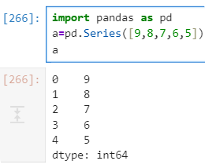
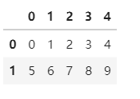
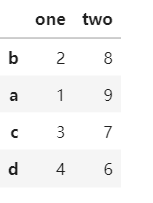
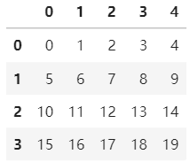
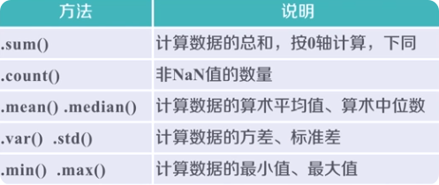

# Pandas 数据分析库

---

## 概述

Pandas 是基于 NumPy 的 Python **数据分析核心库**，提供两大数据结构：**Series**（一维带标签数组）和 **DataFrame**（二维表格）。常与 NumPy、Matplotlib 搭配使用。

```python
import pandas as pd
```

> NumPy 关注数据结构关系，Pandas 关注数据应用与提取。

---

## Series（一维）

Series 类似增强版列表，带自定义索引标签。

### 创建方式

```python
import pandas as pd

# 默认索引（0, 1, 2...）
s = pd.Series([9, 8, 7, 6, 5])

# 自定义索引
s = pd.Series([5, 6, 7, 8], index=['a', 'b', 'c', 'd'])

# 从标量创建（所有值相同）
s = pd.Series(5, index=['a', 'b', 'c', 'd'])

# 从字典创建
s = pd.Series({'a': 9, 'b': 8, 'c': 7})

# 从 ndarray 创建
s = pd.Series(np.arange(5), index=np.arange(9, 4, -1))
```



### 基本操作

```python
s = pd.Series([5, 6, 7, 8], index=['a', 'b', 'c', 'd'])

s[0]           # 按位置取 → 5
s['a']         # 按索引标签取 → 5
'a' in s       # True — 查索引标签
5 in s         # False — 不查值

# 获取值
s.get('a', 100)   # 有则返回值，无则返默认 100

# 索引对齐运算（共同索引才运算）
a = pd.Series([1, 2, 3], index=['c', 'd', 'e'])
s + a  # 只有 c、d 有结果，其余为 NaN
```

---

## DataFrame（二维表格）

DataFrame 是 Pandas 最核心的数据结构，类似于 Excel 表格或 SQL 表。

### 创建方式

```python
import pandas as pd
import numpy as np

# 从 ndarray 创建
d = pd.DataFrame(np.arange(10).reshape(2, 5))

# 从字典创建（键 → 列名，值 → 列数据）
dt = {
    'one': pd.Series([1, 2, 3], index=['a', 'b', 'c']),
    'two': pd.Series([9, 8, 7, 6], index=['a', 'b', 'c', 'd'])
}
df = pd.DataFrame(dt)

# 简化版（索引完全相同时）
dl = {'one': [1, 2, 3, 4], 'two': [9, 8, 7, 6]}
df = pd.DataFrame(dl, index=['a', 'b', 'c', 'd'])
```



> 索引不匹配时自动填充 NaN。

### 重新索引

```python
# 交换行顺序
df = df.reindex(index=['b', 'a', 'c', 'd'])

# 交换列顺序
df = df.reindex(columns=['two', 'one'])
```



---

## 数据运算

### 算术运算

```python
# 相同维度：索引标签对齐后运算
a = pd.DataFrame(np.arange(12).reshape(3, 4))
b = pd.DataFrame(np.arange(20).reshape(4, 5))

a + b  # 不同标签补齐，NaN 参与运算得 NaN
```

```python
# 方法形式：支持 fill_value 填补缺失值
b.add(a, fill_value=100)  # NaN 位置用 100 代替后相加
a.mul(b, fill_value=0)    # NaN 位置用 0 代替后相乘
```

### 广播运算（不同维度）

```python
# 二维 DataFrame vs 一维 Series
# 默认沿 axis=1（行方向）广播
df + series

# 指定 axis=0（列方向）广播
df.add(series, axis=0)
```



### 比较运算

```python
a > 5         # 逐元素比较，返回布尔 DataFrame
a > c         # 维度需要兼容
c > 0         # Series 也可比较
```

---

## 数据排序

### 按索引排序

```python
df.sort_index()                        # 默认升序
df.sort_index(ascending=False)         # 降序
df.sort_index(axis=1, ascending=False) # 按列索引排序
```

### 按值排序

```python
# 按第 2 列的值降序
df.sort_values(2, ascending=False)

# 按 'a' 行的值降序
df.sort_values('a', axis=1, ascending=False)
```

---

## 统计分析

Pandas 内置丰富的统计函数。



```python
df.count()    # 非 NaN 元素个数
df.sum()      # 求和（默认 axis=0，列方向）
df.sum(axis=1)  # 按行求和
df.mean()     # 平均值
df.std()      # 标准差
df.min()      # 最小值
df.max()      # 最大值
df.median()   # 中位数
df.var()      # 方差
df.describe() # 汇总统计（最常用）
```

```python
# describe() 输出示例
df.describe()
#        count   mean    std    min    25%    50%    75%    max
# one     4.0    2.5   1.29    1.0   1.75   2.50   3.25    4.0
```

---

## Series vs DataFrame 速查

| 对比 | Series | DataFrame |
|------|--------|-----------|
| 维度 | 一维 | 二维 |
| 类比 | 增强版列表 | Excel 表格 |
| 索引 | 行索引 | 行索引 + 列索引 |
| 创建 | `pd.Series([...])` | `pd.DataFrame(...)` |
| 属性 | `.index`, `.values` | `.index`, `.columns`, `.values` |

---

## 面试要点

**Q: Series 和 NumPy ndarray 的区别？**

| Series | ndarray |
|--------|---------|
| 有标签索引，可通过索引名访问 | 只有位置索引 |
| 运算时按索引对齐 | 运算时按位置对齐 |
| 支持 `in` 成员检测 | 不支持 `in` 检测索引 |

**Q: DataFrame 如何创建？**

三种常用方式：`pd.DataFrame(ndarray)`、`pd.DataFrame(dict)`、`pd.DataFrame(列表嵌套)`。

**Q: `reindex` 和 `sort_index` 的区别？**

- `reindex`：按指定顺序**重排**索引
- `sort_index`：按**大小顺序**排列索引

**Q: 如何处理 NaN？**

- `fill_value` 参数在运算时填补
- `fillna()` 方法填充固定值
- `dropna()` 方法删除含有 NaN 的行/列

**Q: `count()` 和 `size` 的区别？**

- `count()` 统计非 NaN 元素个数，会跳过缺失值
- `size` 返回总元素个数（含 NaN）
