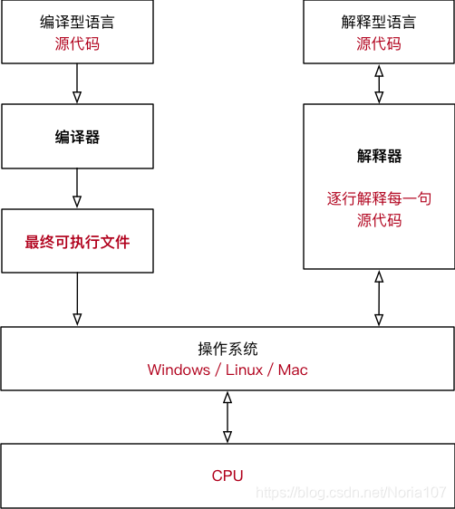
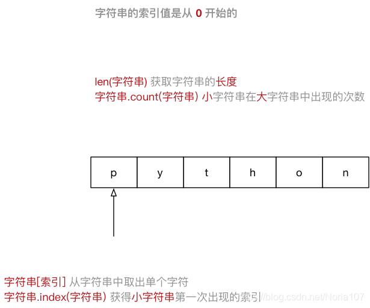
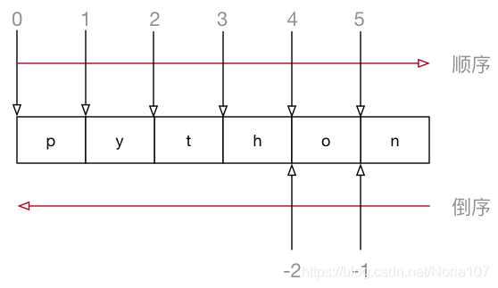
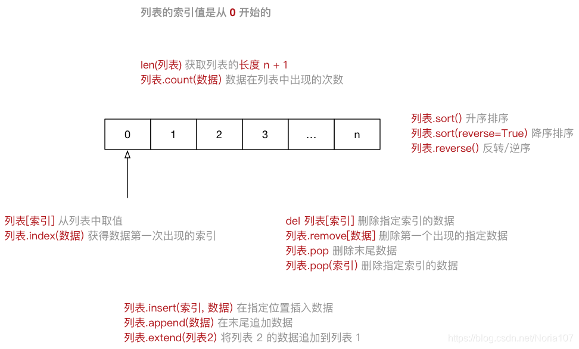
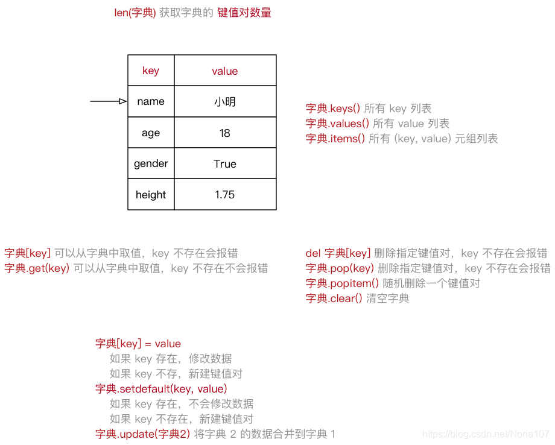

# Python 基础语法

---

## 概述

Python 是一种**解释型、面向对象**的高级编程语言。由 Guido van Rossum 于 1989 年发明，第一个公开发行版于 1991 年发布。

### 特点

| 特性 | 说明 |
|------|------|
| 解释型 | 逐行翻译执行，跨平台性好 |
| 面向对象 | 一切皆对象，函数、数字、字符串都是对象 |
| 动态类型 | 变量无需声明类型，赋值即创建 |
| 简洁易读 | 缩进定义代码块，语法接近自然语言 |
| 库丰富 | 标准库 + 海量第三方库 |

### 编译型 vs 解释型



| 对比 | 编译型 | 解释型 |
|------|--------|--------|
| 翻译时机 | 执行前一次性编译 | 运行时逐行翻译 |
| 执行速度 | 快 | 较慢 |
| 跨平台性 | 差 | 好 |
| 代表语言 | C、C++ | Python、JavaScript |

### 执行 Python 的三种方式

| 方式 | 说明 |
|------|------|
| 解释器 | `python xxx.py` / `python3 xxx.py` |
| 交互式 | `ipython` 逐行执行，适合测试 |
| IDE | PyCharm — 最常用的 Python IDE |

---

## 变量

### 变量定义

```python
# 变量 = 值（赋值即创建，无需声明类型）
name = "小明"
age = 18
score = 98.5
is_pass = True
```

变量在内存中保存的是**数据的引用（地址）**，用 `id()` 可查看内存地址。

### 数据类型

```
数字型：int、float、bool（True=1, False=0）、complex（复数）

非数字型：str、list、tuple、dict
```

| 类型 | 特点 | 示例 |
|------|------|------|
| int | 整数 | `10` |
| float | 浮点数 | `3.14` |
| bool | 布尔（True/False） | `True` |
| str | 字符串 | `"hello"` |
| list | 列表（可变） | `[1, 2, 3]` |
| tuple | 元组（不可变） | `(1, 2, 3)` |
| dict | 字典（键值对） | `{"name": "小明"}` |

### 可变 vs 不可变类型

| 分类 | 类型 | 说明 |
|------|------|------|
| 不可变 | int、float、bool、str、tuple | 内存数据不可修改 |
| 可变 | list、dict | 内存数据可修改 |

> 字典的 key 只能使用不可变类型。

### 输入与输出

```python
# input — 用户输入（返回字符串）
name = input("请输入姓名：")

# print — 格式化输出
print("我叫 %s，今年 %d 岁" % (name, age))
```

| 格式符 | 含义 |
|--------|------|
| `%s` | 字符串 |
| `%d` | 整数（`%06d` 表示 6 位补零） |
| `%f` | 浮点数（`%.2f` 表示保留两位小数） |
| `%%` | 输出 `%` |

### 变量进阶

```python
# 局部变量 — 函数内部定义，函数执行完回收
def test():
    a = 10  # 局部变量

# 全局变量 — 函数外部定义，所有函数可用
total = 0  # 全局变量

def add():
    global total  # 声明要修改全局变量
    total += 1
```

函数内部查找变量的顺序：**先局部，后全局**。

---

## 运算符

### 算术运算符

```python
a = 10
b = 3

a + b   # 加   → 13
a - b   # 减   → 7
a * b   # 乘   → 30
a / b   # 除   → 3.333...
a // b  # 整除 → 3
a % b   # 取余 → 1
a ** b  # 幂   → 1000
```

### 比较与逻辑

```python
# 比较运算符：==  !=  >  <  >=  <=
a == b  # 等于
a != b  # 不等于

# 逻辑运算符
a > 5 and b < 5   # 与：同真才真
a > 5 or b > 5    # 或：一真即真
not a > 5         # 非：取反
```

### 优先级（从高到低）

```
** → * / % // → + - → 比较 → 逻辑
```

> 不想记优先级？用 `()` 明确指定即可。

---

## 字符串

### 定义与遍历

```python
s1 = "Hello"
s2 = 'Python'

# for 遍历每个字符
for c in s1:
    print(c)
```

### 索引与切片





```python
s = "Hello Python"

# 索引（从 0 开始，-1 表示最后一个）
s[0]    # 'H'
s[-1]   # 'n'

# 切片 [开始:结束:步长] — 左闭右开
s[0:5]   # 'Hello'
s[6:]    # 'Python'
s[::-1]  # 'nohtyP olleH'（反转）
```

### 常用方法

```python
# 查找替换
"hello".find("e")        # 1（找不到返回 -1）
"hello".index("e")       # 1（找不到报错）
"hello".replace("h", "H")  # 'Hello'

# 大小写转换
"hello".upper()          # 'HELLO'
"HELLO".lower()          # 'hello'
"hello world".title()    # 'Hello World'

# 去除空白
"  abc  ".strip()        # 'abc'
"  abc".lstrip()         # 'abc'

# 拆分与连接
"a,b,c".split(",")       # ['a', 'b', 'c']
"-".join(["a", "b", "c"])  # 'a-b-c'
```

---

## 列表

### 定义

```python
names = ["张三", "李四", "王五"]
```



### CRUD 操作

```python
# 增
names.append("赵六")        # 末尾追加
names.insert(1, "小明")    # 指定位置插入
names.extend(["A", "B"])   # 合并另一列表

# 删
del names[1]               # 删除指定索引
names.remove("张三")       # 删除指定数据
names.pop()                # 弹出末尾
names.pop(2)               # 弹出指定位置
names.clear()              # 清空

# 改
names[0] = "新名字"        # 直接赋值修改

# 查
len(names)                 # 长度
names.count("张三")        # 计数

# 排序
names.sort()               # 升序
names.sort(reverse=True)   # 降序
names.reverse()            # 反转
```

### 遍历

```python
for name in names:
    print(name)
```

---

## 元组

```python
# 定义
info = ("小明", 18, True)

# 单元素元组必须加逗号
single = (50,)
```

> 元组与列表最大区别：元组元素**不可修改**，适合保护数据安全。

### 常用场景

```python
# 场景1：格式化字符串
info = ("张三", 18)
print("%s 今年 %d 岁" % info)

# 场景2：list/tuple 互转
list((1, 2, 3))       # 元组 → 列表
tuple([1, 2, 3])      # 列表 → 元组
```

---

## 字典



### 定义

```python
person = {
    "name": "小明",
    "age": 18,
    "gender": True,
    "height": 1.75
}
```

| 特性 | 说明 |
|------|------|
| 结构 | 键值对，`{"key": value}` |
| 键 | 必须唯一，不可变类型（str、int、tuple） |
| 值 | 任意类型 |
| 有序性 | Python 3.7+ 有序，之前无序 |

### 常用操作

```python
# 取值
person["name"]            # 键不存在会报错
person.get("name")        # 键不存在返回 None

# 增/改
person["weight"] = 70     # 新增键值对
person["age"] = 20        # 修改已有键

# 删
person.pop("age")         # 删除指定键
person.clear()            # 清空

# 遍历
for k in person:
    print("%s: %s" % (k, person[k]))

for k, v in person.items():
    print(k, v)
```

---

## 条件判断

```python
if 条件1:
    # 条件1 成立
elif 条件2:
    # 条件2 成立
else:
    # 都不成立

# 嵌套
if 条件1:
    if 条件2:
        # 条件1 且 条件2 成立
```

```python
# 实战：猜数字
import random

answer = random.randint(1, 100)  # 1~100 随机数
guess = int(input("猜数字（1-100）："))

if guess == answer:
    print("猜对了！")
elif guess > answer:
    print("猜大了")
else:
    print("猜小了")
```

---

## 循环

### while 循环

```python
i = 0
while i < 5:
    print(i)
    i += 1  # 计数器 +1，否则死循环
```

### for 循环

```python
# 遍历列表
for name in ["张三", "李四", "王五"]:
    print(name)

# range() 生成数字序列
for i in range(5):       # 0, 1, 2, 3, 4
    print(i)

for i in range(2, 6):    # 2, 3, 4, 5
    print(i)
```

### break vs continue

```python
# break：退出循环
for i in range(10):
    if i == 5:
        break       # 到 5 就停了

# continue：跳过本次，继续下一次
for i in range(10):
    if i % 2 == 0:
        continue    # 跳过偶数，只打印奇数
    print(i)
```

---

## 函数

### 定义与调用

```python
def say_hello(name):
    """ 问候函数 """
    print("你好，" + name)

say_hello("小明")  # 调用
```

### 参数

```python
# 缺省参数（有默认值，必须放末尾）
def greet(name, msg="你好"):
    print("%s，%s！" % (msg, name))

greet("小明")            # 你好，小明！
greet("小明", "早上好")  # 早上好，小明！

# 多值参数
def sum_all(*args):        # *args → 元组
    return sum(args)

sum_all(1, 2, 3, 4)       # 10

def print_info(**kwargs):  # **kwargs → 字典
    for k, v in kwargs.items():
        print(k, v)
```

### 返回值

```python
def calc(a, b):
    """ 返回多个值（本质是元组） """
    return a + b, a - b, a * b

add_result, sub_result, mul_result = calc(10, 5)
# add_result=15, sub_result=5, mul_result=50
```

### 递归

```python
def fact(n):
    """ 阶乘 """
    if n == 1:          # 递归出口
        return 1
    return n * fact(n - 1)

fact(5)  # 120
```

---

## 其他要点

### 注释

```python
# 单行注释

"""
多行注释（本质是字符串，不会被解释）
"""
```

### 公共方法

```python
# 内置函数
len([1, 2, 3])        # 3
max(1, 3, 2)          # 3
min(1, 3, 2)          # 1

# 成员运算符
"a" in ["a", "b"]     # True
"c" not in ["a", "b"]  # True

# 合并与重复
[1, 2] + [3, 4]       # [1, 2, 3, 4]
"hello" * 3           # 'hellohellohello'
```

### print 技巧

```python
# 不换行
print("*", end="")
print("-", end="")

# 输出：*-

# 单纯换行
print("")
```

---

## 面试要点

**Q: Python 是编译型还是解释型？**

解释型 —— 逐行翻译执行，跨平台性好，但速度较慢。

**Q: 可变对象和不可变对象的区别？**

- 不可变：int、float、str、tuple — 值不可修改，修改即创建新对象
- 可变：list、dict — 值可以原地修改，所有引用都会看到变化

**Q: `==` 和 `is` 的区别？**

- `==` 比较**值**是否相等
- `is` 比较**引用（内存地址）**是否相同

**Q: `*args` 和 `**kwargs` 的区别？**

- `*args` 接收任意数量的位置参数，打包为**元组**
- `**kwargs` 接收任意数量的关键字参数，打包为**字典**

**Q: 列表和元组的区别？**

- 列表用 `[]`，可变，支持增删改
- 元组用 `()`，不可变，占内存更少，可作字典 key

**Q: break 和 continue 的区别？**

- `break` —— 终止整个循环
- `continue` —— 跳过本次，继续下一次循环
