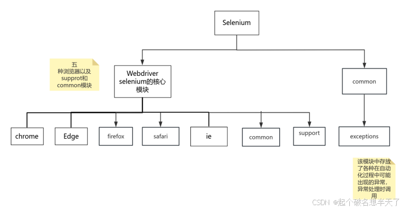
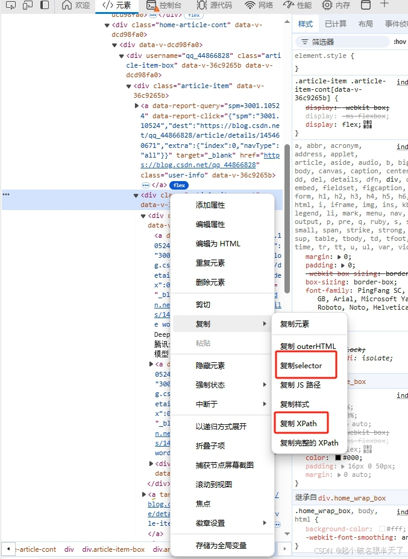
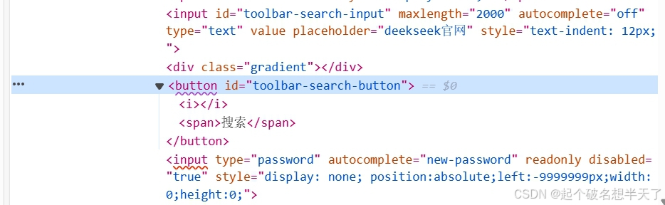
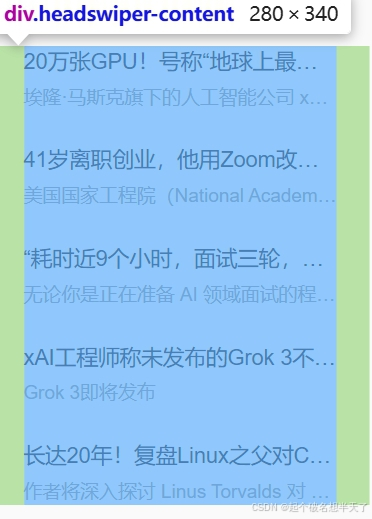

# Selenium 网页自动化

---

## 概述

Selenium 是一个基于 WebDriver 的**开源自动化测试工具**，支持模拟用户操作（点击、输入、拖拽等），广泛应用于 Web 自动化测试、数据爬取、表单自动填写等场景。

### 支持特性

| 特性 | 说明 |
|------|------|
| 多浏览器 | Chrome、Firefox、Edge、Safari |
| 多语言 | Python、Java、C#、JavaScript |
| 元素定位 | 8 种定位方式（XPATH、CSS、ID 等） |
| 用户模拟 | 鼠标、键盘操作 |
| JS 执行 | 可直接执行 JavaScript |

### Selenium 模块结构



---

## 环境搭建

### 安装 Selenium

```bash
pip install -i https://mirrors.tuna.tsinghua.edu.cn/pypi/web/simple selenium
```

### 下载 WebDriver

Selenium 需要通过 WebDriver 来驱动浏览器：

| 浏览器 | 驱动 |
|--------|------|
| Edge | [Edge WebDriver](https://developer.microsoft.com/en-us/microsoft-edge/tools/webdriver/) |
| Chrome | [ChromeDriver](https://chromedriver.chromium.org/) |
| Firefox | [geckodriver](https://github.com/mozilla/geckodriver/releases) |

> **版本必须与浏览器版本一致**。下载后放入 Python 安装目录或添加到系统 PATH。

---

## 基础使用

### 完整导入清单

```python
from selenium import webdriver
from selenium.webdriver.edge.options import Options
from selenium.webdriver.common.by import By
from selenium.webdriver.common.keys import Keys
from selenium.webdriver.support.ui import WebDriverWait
from selenium.webdriver import ActionChains
from selenium.webdriver.support import expected_conditions as EC
from selenium.common.exceptions import TimeoutException
from selenium.common.exceptions import NoSuchElementException
```

### 创建 WebDriver

```python
# Edge
browser = webdriver.ChromiumEdge()

# Chrome
browser = webdriver.Chrome()

# Firefox
browser = webdriver.Firefox()
```

### Options 配置（防检测）

```python
options = Options()

# 隐藏自动化痕迹
options.add_argument('--disable-blink-features=AutomationControlled')
options.add_experimental_option('excludeSwitches', ['enable-automation'])

# 忽略 SSL/证书错误
options.add_argument('--ignore-ssl-errors')
options.add_argument('--ignore-certificate-errors')

# 设置默认下载路径
prefs = {
    'download.default_directory': 'D:/downloads',
    "profile.default_content_setting_values.automatic_downloads": True
}
options.add_experimental_option("prefs", prefs)

browser = webdriver.ChromiumEdge(options)
```

### 打开网页

```python
browser.get('https://www.example.com')
```

---

## 元素定位

Selenium 提供 **8 种定位方式**，核心 API：

```python
# 单个元素（找不到抛异常）
browser.find_element(By.XXX, '值')

# 多个元素（找不到返回空列表）
browser.find_elements(By.XXX, '值')
```

### 1. XPATH 和 CSS_SELECTOR（最常用）

浏览器可直接复制元素的 XPATH 或 CSS Selector：



```python
# XPATH
element = browser.find_element(By.XPATH, '//*[@id="main"]/div[1]/a')

# CSS Selector
element = browser.find_element(By.CSS_SELECTOR, '#main > div:nth-child(1) > a')
```

> 优点：几乎能定位任意元素。缺点：页面结构变化后可能失效。

### 2. ID 定位



```python
element = browser.find_element(By.ID, 'su')  # 百度搜索按钮
```

> ID 在页面中唯一，是**最快**的定位方式。

### 3. CLASS_NAME 定位



```python
element = browser.find_element(By.CLASS_NAME, 'topic_title')
```

### 4. 其他定位方式

```python
# NAME 属性
browser.find_element(By.NAME, 'username')

# TAG_NAME（标签名）
browser.find_element(By.TAG_NAME, 'input')

# 完整链接文字
browser.find_element(By.LINK_TEXT, '新闻')

# 部分链接文字
browser.find_element(By.PARTIAL_LINK_TEXT, '图书')
```

### 链式查找

```python
# 在已定位的元素内部继续查找
container = browser.find_element(By.ID, 'main')
items = container.find_elements(By.TAG_NAME, 'li')
```

### 定位方式总结

| 定位方式 | 速度 | 稳定性 | 使用场景 |
|----------|------|--------|----------|
| ID | 最快 | 高 | 元素有唯一 ID 时首选 |
| NAME | 快 | 高 | 表单元素常用 |
| CLASS_NAME | 快 | 中 | 通过 class 名 |
| LINK_TEXT | 快 | 中 | 定位链接 |
| CSS_SELECTOR | 中 | 中 | 通用性强 |
| XPATH | 慢 | 中 | 最灵活，能覆盖所有场景 |
| TAG_NAME | 慢 | 低 | 批量获取同标签元素 |

---

## WebDriver 常用方法

### 浏览器控制

```python
browser.get(url)               # 打开网页
browser.back()                 # 回退到上一页
browser.forward()              # 前进到下一页
browser.refresh()              # 刷新当前页面
browser.close()                # 关闭当前窗口
browser.quit()                 # 关闭 WebDriver（释放资源）
browser.current_url            # 获取当前 URL
```

### 窗口管理

```python
# 获取所有窗口句柄
handles = browser.window_handles

# 切换到最新打开的窗口
browser.switch_to.window(handles[-1])

# 获取当前窗口句柄
browser.current_window_handle

# 切换到 iframe
browser.switch_to.frame('iframe_id')
browser.switch_to.default_content()  # 切回主页面
```

### 元素交互

```python
element = browser.find_element(By.ID, 'input_box')

element.click()                    # 点击
element.send_keys('输入内容')       # 输入
element.send_keys(Keys.ENTER)      # 模拟回车键
element.send_keys(Keys.TAB)        # 模拟 Tab 键
element.text                       # 获取元素文本
element.get_attribute('href')      # 获取属性值
```

### JavaScript 执行

```python
# 执行同步 JS
browser.execute_script('window.scrollTo(0, document.body.scrollHeight)')

# 用 JS 点击（绕过拦截）
browser.execute_script('arguments[0].click()', element)

# 执行异步 JS
browser.execute_async_script('...')
```

### 弹窗处理

```python
# 关闭 alert 弹窗
browser.switch_to.alert.dismiss()

# 接受 alert
browser.switch_to.alert.accept()

# 获取弹窗文本
browser.switch_to.alert.text
```

---

## 等待机制

### 三种等待方式对比

| 方式 | 特点 | 适用场景 |
|------|------|----------|
| `time.sleep()` | 固定等待，简单粗暴 | 调试阶段 |
| 隐式等待 | 全局生效，智能等待 | 页面整体加载 |
| 显式等待 | 精确条件，灵活高效 | 特定元素等待 |

### 隐式等待

```python
# 设置一次，全局生效：在指定时间内轮询查找元素
browser.implicitly_wait(10)
```

### 显式等待

```python
from selenium.webdriver.support.ui import WebDriverWait
from selenium.webdriver.support import expected_conditions as EC

# 等待元素出现（最多等 10 秒）
element = WebDriverWait(browser, 10).until(
    EC.presence_of_element_located((By.ID, 'my_element'))
)

# 等待元素消失
WebDriverWait(browser, 10).until_not(
    EC.presence_of_element_located((By.XPATH, '//div[@class="loading"]'))
)

# 等待元素可点击
element = WebDriverWait(browser, 10).until(
    EC.element_to_be_clickable((By.ID, 'submit_btn'))
)
```

**常用 expected_conditions**：

| 条件 | 含义 |
|------|------|
| `presence_of_element_located` | 元素存在于 DOM |
| `visibility_of_element_located` | 元素可见 |
| `element_to_be_clickable` | 元素可点击 |
| `text_to_be_present_in_element` | 元素包含指定文本 |
| `title_contains` | 页面标题包含某文本 |
| `alert_is_present` | 弹窗出现 |

---

## ActionChains（鼠标操作）

```python
from selenium.webdriver import ActionChains

action = ActionChains(browser)
element = browser.find_element(By.XPATH, '//div[@class="target"]')

# 左键单击
action.click(element).perform()

# 右键单击
action.context_click(element).perform()

# 悬停
action.move_to_element(element).perform()

# 长按
action.click_and_hold(element).perform()

# 双击
action.double_click(element).perform()

# 拖拽：将元素1拖到元素2
action.drag_and_drop(element1, element2).perform()

# 按偏移量移动鼠标
action.move_by_offset(100, 0).perform()

# 按偏移量拖拽元素（常用于滑块验证）
action.drag_and_drop_by_offset(element, 200, 0).perform()
```

> 每个链式调用末尾必须加 `.perform()` 才会执行。

---

## Cookie 免登录

手动登录后保存 Cookie，后续直接加载即可跳过登录步骤。

### 保存 Cookie

```python
import json

# 手动登录后保存
cookies = browser.get_cookies()
with open('cookies.json', 'w') as f:
    json.dump(cookies, f)
```

### 加载 Cookie

```python
with open('cookies.json', 'r') as f:
    cookies = json.loads(f.read())
    for cookie in cookies:
        browser.add_cookie({
            'domain': cookie.get('domain'),
            'name': cookie.get('name'),
            'value': cookie.get('value'),
            'path': '/',
            'httpOnly': False,
            'HostOnly': False,
            'Secure': False
        })

browser.refresh()  # 刷新使 Cookie 生效
```

> 注意：Cookie 有时效性，过期后需重新获取。

---

## 截图

```python
# 方式1：保存为文件
browser.get_screenshot_as_file('screenshot.png')

# 方式2：获取 bytes 数据后手动保存
pic_data = browser.get_screenshot_as_png()
with open('screenshot.png', 'wb') as f:
    f.write(pic_data)

# 方式3：获取 base64 编码
base64_data = browser.get_screenshot_as_base64()

# 元素截图（仅截取单个元素）
element = browser.find_element(By.XPATH, '//div[@class="target"]')
element.screenshot('element_screenshot.png')
```

---

## 异常处理

```python
from selenium.common.exceptions import (
    NoSuchElementException,
    TimeoutException,
    ElementClickInterceptedException
)

try:
    element = browser.find_element(By.XPATH, '//button[@id="submit"]')
    element.click()
except NoSuchElementException:
    print('未找到目标元素！')
except ElementClickInterceptedException:
    # 点击被遮挡时，用 JS 点击绕过
    browser.execute_script('arguments[0].click()', element)
except TimeoutException:
    print('等待超时！')
finally:
    browser.quit()
```

---

## 常见问题

**Q: 点击被拦截（ElementClickInterceptedException）？**

两种解决方案：

```python
# 方法1：用 JS 执行点击
browser.execute_script('arguments[0].click()', element)

# 方法2：用 ActionChains 悬停后点击
ActionChains(browser).move_to_element(element).click(element).perform()
```

**Q: find_element 和 find_elements 的区别？**

| 方法 | 找到 | 找不到 |
|------|------|--------|
| `find_element` | 返回单个元素 | 抛出 `NoSuchElementException` |
| `find_elements` | 返回列表 | 返回空列表 `[]` |

---

## 面试要点

**Q: Selenium 的工作原理？**

通过 WebDriver 协议与浏览器通信：Selenium 脚本 → WebDriver → 浏览器（执行操作 → 返回结果）。

**Q: 隐式等待和显式等待的区别？**

- 隐式等待：设置一次，全局生效，等待元素出现在 DOM
- 显式等待：针对特定元素，可指定等待条件（可见、可点击、文本匹配等）

**Q: 如何绕过自动化检测？**

1. `--disable-blink-features=AutomationControlled`
2. `excludeSwitches: ['enable-automation']`
3. 修改 `navigator.webdriver` 属性为 `false`

**Q: 如何定位动态变化的元素？**

使用相对稳定的属性（ID、name）或用 `contains()` 等模糊匹配的 XPATH 表达式，如 `//div[contains(@class, 'title')]`。

**Q: 滑块验证码怎么处理？**

使用 ActionChains 的 `drag_and_drop_by_offset()` 逐步模拟拖拽，配合轨迹生成算法来模仿人类行为。
