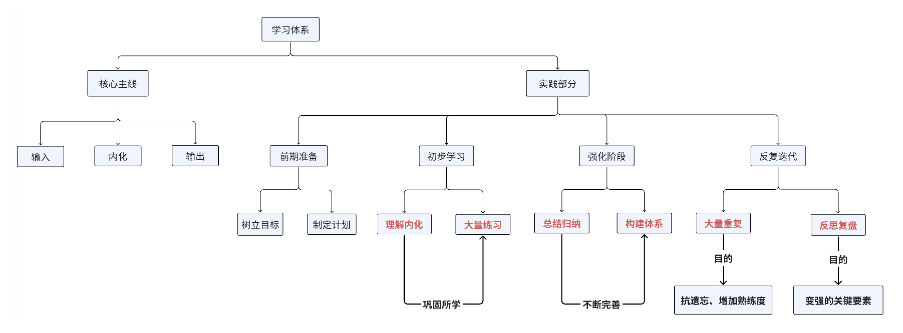

<h1 style="text-align: center; font-weight: bold;">一些学习忠告❗❗❗</h1>

---

 

::: tip 👉 提醒 

 

编程学习 3 分学，7 分练，没有主观能动性，做任何事情都不可能成功，同时提高个人的不可替代性

:::

## 🎯 明确目标

> #### ⚠️ 灵魂反问：想做的这件事当下对我有用吗？是我需要的吗？

#### 目标是行动的导向标，有了目标，才有努力的方向

#### 目标有如下要求

> #### （1）结合自身，明确，核心，具体，可行，不要不切实际，要有侧重点
>
> > - <h4> 明确：明确自身缺陷，当下能力，真实需求，可支配资源和时间，拒绝跟风，被外界带动而影响自身</h4>
> > - <h4> 核心：目标必须聚焦 1-2 个关键项，❌ 拒绝贪心的什么都要（想的很多，过于理想化，当下还是原地踏步，没有实际行动，空想浪费实践，带来无意义的焦虑，自我内耗）， 精力分散反而学得多而浅</h4>
> > - <h4>具体：目标必须拆到能直接动手的步骤，❌ 拒绝笼统的我要做，需要有通过实践输出的结果作为衡量</h4>
> > - <h4>可行：降低预期，目标必须小到一定能完成，❌ 拒绝贪心的一步到位，建立即时反馈</h4>
>
> #### （2）❌ 目标不要定的太高，这样容易给自身压力，然后心态崩溃
>
> #### （3）目标应该是核心的，❌ 不要贪多，导致精力分散，竹篮打水一场空

#### 常见问题

> #### 整天很忙，但是不知道在忙什么
>
> #### 很努力学习，但是感觉很空虚，不知道学了能干什么

---

## 📢 动手实践

#### 学习的两个核心：输入、输出

#### ❌ 只输入，不输出，永远都学不会 ❗❗❗

::: tip 提醒 👇

<h2 style="text-align:center;font-size:30px">拒绝被动学习，主动学习，主动思考，内化理解，不要被牵着走</h2>
:::

#### 实践有如下要求

> #### （1）基础  永远是  核心，打下扎实的基础是学习新知识的前提
>
> #### （2）❌拒绝装懂、得过且过，想赶进度，能够完整的复述过程，理解了，才算是会了
>
> #### （3）不断重复，大量练习，提高熟练度
>
> #### （4）动脑思考，知识需要内化、理解（听懂 ≠ 学会），变成自己的东西，建立知识体系
>
> #### （5）把目标拆解为实践的可视化结果作为衡量标准，建立及时的反馈和成就感，更专注于当下，而非产生懂了、往后学，赶进度的错误主观思想
>
> #### （6）定期复习，遗忘是常态，这不应该成为焦虑的起点......
>
> #### （7）⭐ 学习需要有侧重点，而非平均用力，把力都用在刀刃上

#### 常见问题

> #### 学习的时候会，能理解，但是合上书或者关闭视频，回想学过的东西，大脑一片空，啥也不知道
>
> #### 很喜欢看视频学习，看的越多越有动力，但是从来不练习，出现看着很眼熟，但是动手就啥也不会
>
> #### 学的很多，总想着快点学完，但是心里没底
>
> #### 学的越多，会的越少，有恐惧、焦虑的心理

---

## 💪 调整心态

#### 🔔 态度决定一切，细节决定成败，良好的心态是引领正确行动的基础

> #### ⏳ 成功需要时间，需要耐心，慢即快，❌不要急于求成，赶进度
>
> #### ⚠️精力有限，专注一个目标并为之努力

::: tip 👉 提醒 

拒绝畏难情绪，专注一件事，尽力把他做好，不要遇到困难就逃避，感觉自己不适合，接着换一件事继续做，陷入新手保护期的舒适圈中 如此往复，无法真的深耕某一个领域，都是浅薄只谈，最后结局只会一事无成，永远都无法成功

:::

#### 心态上有如下注意点

#### （1）目标不是完成多少量，应该是我学到了什么？我学会了没有？我真的掌握了吗？

#### （2）不要过于焦虑，想的很多，规划的很多，过于贪心，计划赶不上变化，专注当下，把它做好❗❗❗

#### （3）遗忘是常态，定期复习，这不应该成为焦虑的起点......

#### （4）❌不要为了做而做，具象化目标，需要达到什么效果？

#### （5）认真对待每个知识点，理解内化，不要得过且过，结果不会陪你演戏

#### （6）❌拒绝被动学习，多多思考，而不是一直输入，发挥主观能动性

#### 常见问题

> #### 喜欢看很多视频学习，潜意识以为看完就学会了，一直处于赶进度的状态，无法自拔，但是学的越多会的越少，内心恐惧，陷入焦虑，开始规划，容易想的很多，目标不明确，死循环
>
> #### 急着学习后面的内容，焦虑让自己的压力倍增，感觉时间不够，匆匆忙忙，对于某个内容可能并不是完全理解，但是会想没事，放一放，后面再回头看，实际上根本不会看，也没时间看

---

## ⚠️ 老韩的肺腑之言

#### 1. 计算机基础很重要，很重要，不要追求时髦的技术，否则会陷入迷茫

#### 2. 选择适合自己的语言，不纠结，不同语言适用场景不同，不同语言逻辑语法大同小异，触类旁通，推荐学 JAVA，简单上手并好就业一些

> #### 问题：学的越多，心里越没底，感觉会的很少，很焦虑，迷茫
>
> #### 3. 动手写代码非常重要，光看不练白搭，内化理解，计算机是在做的过程中学会的
>
> #### 4. 听懂 ≠ 会做，会应用才是真的懂了，缺少大量练习，缺少深度思考

> #### 问题：合上书，关了视频啥也不知道，回想学了什么却浑然不知
>
> #### 5. 学习要有笔记、思维导图或代码记录，有自己的想法积累或总结（内化理解，编程自己的东西），长期以往就会把精华学进脑内，就会知道怎么解决问题或者知道解决问题需要用哪段代码，最后就有了自己的学习方法

#### 6. 不要全部死记硬背，不变的语法，结构等需要背下来，其他功能性的内容知道在哪或者怎么找到解决办法就行了，实在理解不了就硬背然后实践中理解

#### 7. 报错一定不要逃避，这是提高自己能力的重要方法，排除错误才会提升能力也会避免犯错

#### 8. 不要闭门造车，敢于交流分享，交流分享技术很重要，不要让自己成为井底之蛙，很多问题别人也许有特别好的解决办法，不怕嘲笑，都是过来人，越战越勇！

#### 9. 跟风新技术，什么都学，没有明确目标，瞎忙活，学习技术要建立体系，定好学习目标和方向，要有精通的技术和竞争力，用有限的时间做高效的事

#### 10. 别让收藏夹吃灰，别让磁盘充满也不学习，资源在精不在多，同上，规划好学习目标

#### 11. 学编程同性别无关，职场中女生有劣势，做好职业规划

#### 12. 学编程和专业无关，技术和业务逻辑分离，都重要

#### 13. 数学不好不是学不好编程的借口，绝大多数程序员不需要用到高深的数学知识，除非是算法、大数据等方向

 

::: tip 总结 👇

<h4 style="text-align:center">🚀调整心态（明确目标，坚持下去）重视基础（大量练习，多写多练），知识内化，建立体系（总结提炼），及时复习（堆熟练度）🚀</h4>
:::

## ⭐ 编程学习感悟

#### （1）什么时候你越觉得业务逻辑比代码重要，才说明你能力在提升

> #### 假设是 6 个单位时间。你都是花 1 个小时单位时间听完了知识点
>
> #### 第一个：你花 2 个单位时间做了小案例。再花 3 个单位时间做了项目
>
> #### 第二个：你直接进去项目摸索，你觉得 5 个单位时间你可以重复多少次这个项目？
>
> #### 就算给你复现，第一种情况可能根本就无法复现项目，因为业务逻辑根本就没有搞清楚

#### （2）做难且正确的事情，难到别人无法到达轻易到达的程度，这才说明你不容易被替换，能让你很快能速成的东西都不是什么能让你成长很多的东西

> #### 一件事很容易能做到，那很多人都能做到了，当机会来临时，那凭什么是你呢？
