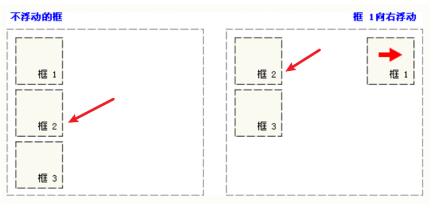
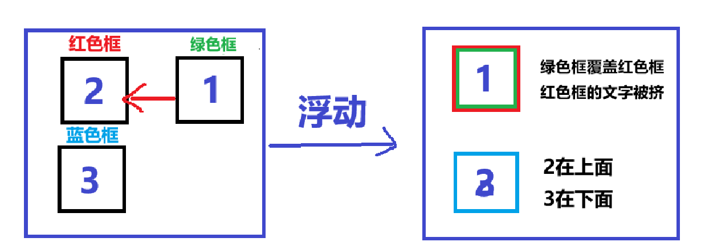
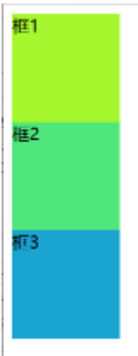
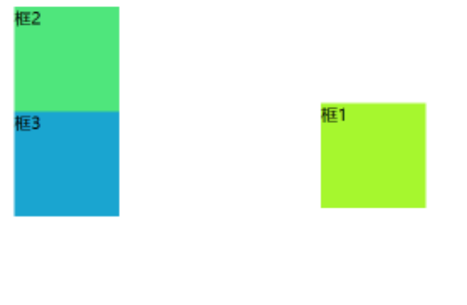
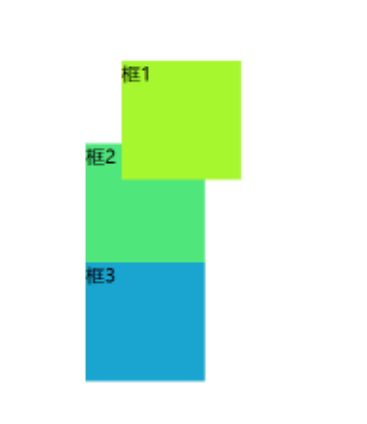

<h1 style="text-align: center; font-weight: bold;">CSS 笔记</h1>

---

## 基本介绍

> <h3>CSS <span style = "color:red;font-weight:bold">层叠样式表</span>(英文全称：(Cascading Style Sheets)) 能够对网页中元素位置的排版进行像素级精确控制，支持几乎所有的字体字号样式，拥有对网页对象和模型样式编辑的能力 ,简单来说,美化页面</h3>

## 引入方式

### 行内式

> <h3><span style = "color:red;font-weight:bold">常配合JS使用</span></h3>
> <h3>语法： `style="样式名: 样式值; 样式名: 样式值; ..."</h3>
>
> <h3>缺点如下</h3>
>
> <h3>1. 代码<span style = "color:red;font-weight:bold">复用性低</span>，不利于维护</h3>
>
> <h3>2. css 样式代码和 html 结构代码紧在一起，<span style = "color:red;font-weight:bold">影响阅读</span>，影响文件大小，<span style = "color:red;font-weight:bold">影响性能</span></h3>

```html
<input
  type="button"
  value="按钮"
  style="
            width: 60px;    /* 宽度 */
            height: 40px;  /* 高度 */
            background-color: rgb(140, 235, 100);  /* 背景色 */
            color: white;   /* 字体颜色 */
            border: 3px solid green;   /* 边框线：实线（solid） */
            font-size: 22px;  /* 字体大小 */
            font-family: '隶书';  /* 字体样式 */
            border-radius: 5px;   /* 边角弧度 */
    "
/>
```

### 内嵌式

> <h3>说明</h3>

> - **内嵌式样式需要<span style = "color:red;font-weight:bold">在 head 标签</span>中,使用<span style = "color:red;font-weight:bold">一对 style 标签</span>，通过<span style = "color:red;font-weight:bold">指定标签</span>的方式来<span style = "color:red;font-weight:bold">定义 CSS 样式</span>（缺点：无法精确控制，只能全局改变）**
> - **CSS 样式的<span style = "color:red;font-weight:bold">作用范围</span>控制要<span style = "color:red;font-weight:bold">依赖选择器</span>**
> - **CSS 的样式代码中注释的方式为 /\* \*/**
> - **内嵌式虽然对样式代码做了抽取,但是 CSS 代码仍然在 html 文件中**
> - **内嵌样式<span style = "color:red;font-weight:bold">仅仅能作用于当前文件</span>,代码<span style = "color:red;font-weight:bold">复用度还是不够</span>,不利于网站风格统一**

```html
<head>
  <meta charset="UTF-8" />
  <style>
    /* 通过选择器确定样式的作用范围 */
    input {
      width: 60px; /* 宽度 */
      height: 40px; /* 高度 */
      background-color: rgb(140, 235, 100); /* 背景色 */
      color: white; /* 字体颜色 */
      border: 3px solid green; /* 边框线：实线（solid） */
      font-size: 22px; /* 字体大小 */
      font-family: "隶书"; /* 字体样式 */
      border-radius: 5px; /* 边角弧度 */
    }
  </style>
</head>
<body>
  <input type="button" value="按钮1" />
  <input type="button" value="按钮2" />
  <input type="button" value="按钮3" />
  <input type="button" value="按钮4" />
</body>
```

### 外部样式表

**说明**

> - **CSS 样式代码从 html 文件中剥离,利于代码的维护**
> - **CSS 样式文件可以被多个不同的 html 引入,利于网站风格统一**
> - **将 css 代码单独放入一个 `.css` 文件中，通过<span style = "color:red;font-weight:bold">&lt;link&gt;标签</span>从外部引入 CSS 样式表，<span style = "color:red;font-weight:bold;font-size:20px">&lt;link href="CSS 文件路径" rel="stylesheet" /&gt;</span>，rel 后填写的是文件类型，CSS 指定是 stylesheet**

```html
<head>
  <meta charset="UTF-8" />
  <!--引入外部样式表-->
  <link href="CSS文件路径" rel="stylesheet" />
</head>
<body>
  <!--主体内容-->
</body>
```

## 选择器

| 选择器     | 写法                                                                 | 示例                                                              | 示例说明                                        |
| ---------- | -------------------------------------------------------------------- | ----------------------------------------------------------------- | ----------------------------------------------- |
| 元素选择器 | <span style="color:red">元素名称</span> &#123;...&#125;              | <span style="color:red">h1</span> &#123;...&#125;                 | 选择页面上的所有&lt;h1&gt;标签                  |
| 类选择器   | <span style="color:red">.class 属性值</span> &#123;...&#125;         | <span style="color:red">.cls</span> &#123;...&#125;               | 选择页面上 class 属性为 cls 的标签              |
| id 选择器  | <span style="color:red">#id 属性值</span> &#123;...&#125;            | <span style="color:red">#hid</span> &#123;...&#125;               | 选择页面上 id 属性为 hid 的标签                 |
| 分组选择器 | <span style="color:red">选择器 1,选择器 2</span> &#123;...&#125;     | <span style="color:red">h1,h2</span> &#123;...&#125;              | 选择页面上所有的&lt;h1&gt;和&lt;h2&gt;标签      |
| 属性选择器 | <span style="color:red">元素名称[属性]</span> &#123;...&#125;        | <span style="color:red">input[type]</span> &#123;...&#125;        | 选择页面上有 type 属性的&lt;input&gt;标签       |
| 属性选择器 | <span style="color:red">元素名称[属性名="值"]</span> &#123;...&#125; | <span style="color:red">input[type="text"]</span> &#123;...&#125; | 选择页面上 type 属性为 text 的&lt;input&gt;标签 |
| 后代选择器 | <span style="color:red">元素 1 元素 2</span> &#123;...&#125;         | <span style="color:red">form input</span> &#123;...&#125;         | 选择&lt;form&gt;标签内的所有&lt;input&gt;标签   |

### 元素选择器

> <h3>说明</h3>

> - **语法：<span style = "color:red;font-weight:bold;font-size:20px">元素名{}</span>**
> - **引入方式：在 <span style = "color:red;font-weight:bold">head 标签</span>中，使用<span style = "color:red;font-weight:bold">一对 style 标签</span>，通过<span style = "color:red;font-weight:bold">指定标签</span>的方式来<span style = "color:red;font-weight:bold">定义 CSS 样式</span>**
> - **根据标签名确定样式的作用范围**
> - **样式只能作用到同名标签上,其他标签不可用**
> - **相同的标签未必需要相同的样式,会造成样式的作用范围太大**

```html
<head>
  <meta charset="UTF-8" />
  <style>
    input {
      width: 60px; /* 宽度 */
      height: 40px; /* 高度 */
      background-color: rgb(140, 235, 100); /* 背景色 */
      color: white; /* 字体颜色 */
      border: 3px solid green; /* 边框线：实线（solid） */
      font-size: 22px; /* 字体大小 */
      font-family: "隶书"; /* 字体样式 */
      border-radius: 5px; /* 边角弧度 */
    }
  </style>
</head>
<body>
  <input type="button" value="按钮1" />
  <input type="button" value="按钮2" />
  <input type="button" value="按钮3" />
  <input type="button" value="按钮4" />
  <button>按钮5</button>
</body>
```

### id 选择器

> <h3>说明</h3>

> - **语法：<span style = "color:red;font-weight:bold;font-size:20px">#（id 值） {}</span>**
> - **定义方式：在 <span style = "color:red;font-weight:bold">head 标签</span>中，使用<span style = "color:red;font-weight:bold">一对 style 标签</span>，通过<span style = "color:red;font-weight:bold">指定标签</span>的方式来<span style = "color:red;font-weight:bold">定义 CSS 样式</span>**
> - **引入方式：添加属性 id="id 值"**
> - **根据元素 id 属性的值确定样式的作用范围**
> - **id 属性的值在页面上具有<span style = "color:red;font-weight:bold">唯一性</span>,所有 id 选择器也<span style = "color:red;font-weight:bold">只能影响一个元素</span>的样式**
> - **因为 id 属性值不够灵活,所以使用该选择器的情况较少**

```html
<head>
  <meta charset="UTF-8" />
  <style>
    #btn1 {
      width: 60px; /* 宽度 */
      height: 40px; /* 高度 */
      background-color: rgb(140, 235, 100); /* 背景色 */
      color: white; /* 字体颜色 */
      border: 3px solid green; /* 边框线：实线（solid） */
      font-size: 22px; /* 字体大小 */
      font-family: "隶书"; /* 字体样式 */
      border-radius: 5px; /* 边角弧度 */
    }
  </style>
</head>
<body>
  <input id="btn1" type="button" value="按钮1" />
  <input id="btn2" type="button" value="按钮2" />
  <input id="btn3" type="button" value="按钮3" />
  <input id="btn4" type="button" value="按钮4" />
  <button id="btn5">按钮5</button>
</body>
```

### class 选择器

> <h3>说明</h3>

> - **语法：<span style = "color:red;font-weight:bold;font-size:20px"> .(class 值) {}</span>**
> - **定义方式（1）在 <span style = "color:red;font-weight:bold">head 标签</span>中，使用<span style = "color:red;font-weight:bold">一对 style 标签</span>，通过<span style = "color:red;font-weight:bold">指定标签</span>的方式来<span style = "color:red;font-weight:bold">定义 CSS 样式</span>（2）还可以写在 CSS 文件中，在 html 标签中通过<span style = "color:red;font-weight:bold">&lt;link&gt;标签</span>从外部引入 CSS 样式表，**
> - **引入方式：添加属性 class="class 值 1 class 值 2 class 值 3..."，使用<span style = "color:red;font-weight:bold">多个 class 值时，用空格隔开</span>**
> - **根据元素 class 属性的值确定样式的作用范围**
> - **class 属性值<span style = "color:red;font-weight:bold">可以有一个,也可以有多个</span>,多个不同的标签也<span style = "color:red;font-weight:bold">可以是使用相同的 class 值</span>**
> - **多个选择器的<span style = "color:red;font-weight:bold">样式</span>可以在同一个元素上进行<span style = "color:red;font-weight:bold">叠加</span>**
> - **因为 class 选择器非常灵活,所以在 CSS 中,使用该选择器的情况较多**

```html
<head>
  <meta charset="UTF-8" />
  <style>
    .shapeClass {
      display: block;
      width: 80px;
      height: 40px;
      border-radius: 5px;
    }
    .colorClass {
      background-color: rgb(140, 235, 100);
      color: white;
      border: 3px solid green;
    }
    .fontClass {
      font-size: 22px;
      font-family: "隶书";
      line-height: 30px;
    }
  </style>
</head>
<body>
  <input class="shapeClass colorClass fontClass" type="button" value="按钮1" />
</body>
```

### 选择器优先级

> #### <span style="color:red">id 选择器 > 类选择器 > 元素选择器</span>

### 颜色设置方法

| 表示方式       | 属性值           | 说明                                  | 取值                                        |
| -------------- | ---------------- | ------------------------------------- | ------------------------------------------- |
| 关键字         | 颜色英文单词     | red, green, blue                      | red, green, blue...                         |
| rgb 表示法     | rgb(r, g, b)     | 红绿蓝三原色，每项取值范围：0-255     | rgb(0,0,0), rgb(255,255,255), rgb(255,0,0)  |
| rgba 表示法    | rgba(r, g, b, a) | 红绿蓝三原色，a 表示透明度，取值：0-1 | rgb(0,0,0,0.3), rgb(255,255,255,0.5)        |
| 十六进制表示法 | #rrggbb          | #开头，将数字转换成十六进制表示       | #000000, #ff0000, #cccccc, 简写：#000, #ccc |

#### 代码示例

```html
<!DOCTYPE html>
<html lang="en">
  <head>
    <meta charset="UTF-8" />
    <meta name="viewport" content="width=device-width, initial-scale=1.0" />
    <title>【新思想引领新征程】推进长江十年禁渔 谱写长江大保护新篇章</title>
    <!-- 2. 内部样式 -->
    <style>
      .publish-date {
        color: #b2b2b2;
      }
    </style>
    <!-- 3. 外部样式 -->
    <!-- <link rel="stylesheet" href="css/news.css"> -->
  </head>
  <body>
    <!-- 定义网页标题, 标题内容： 【新思想引领新征程】推进长江十年禁渔 谱写长江大保护新篇章 -->
    <h1 id="title">
      【新思想引领新征程】推进长江十年禁渔 谱写长江大保护新篇章
    </h1>

    <!-- 定义一个超链接, 链接地址：https://news.cctv.com/, 链接内容：央视网 -->
    <a href="https://news.cctv.com/" target="_blank">央视网</a>

    <!-- 1. 行内样式 -->
    <!-- <span style="color: #b2b2b2;">2024年05月15日 20:07</span> -->

    <span class="publish-date">2024年05月15日 20:07</span>
  </body>
</html>
```

### ⭐ 常用样式总结

```css
.style {
  /* 文本相关 */
  font-family: "Arial"; /* 设置字体样式 */
  color: #333; /* 设置文字颜色 */
  font-size: 16px; /* 设置字体大小 */
  font-weight: bold; /* 设置字体粗细 */
  font-style: italic; /* 设置斜体 */
  line-height: 1.5; /* 设置行高 */
  text-align: center; /* 设置文字居中对齐 */
  text-indent: 2em; /* 首行缩进 2em */
  text-decoration: underline; /* 设置文字下划线 */

  /* 背景样式 */
  background-color: #f4f4f4; /* 设置背景颜色 */
  background-image: url("background.jpg"); /* 设置背景图片 */
  background-size: cover; /* 背景图片覆盖整个元素 */
  background-position: center; /* 背景图片居中显示 */

  /* 边框样式 */
  border: 2px solid #ccc; /* 设置边框宽度、样式和颜色 */
  border-radius: 8px; /* 设置圆角边框 */

  /* 外边距和内边距 */
  margin: 20px; /* 设置外边距 */
  padding: 15px; /* 设置内边距 */

  /* 宽度与高度 */
  width: 100%; /* 设置宽度为父元素的100% */
  height: 200px; /* 设置高度 */

  /* 显示与定位 */
  display: block; /* 设置元素为块级元素 */
  position: relative; /* 设置相对定位 */
  top: 10px; /* 设置元素距离上边缘的距离 */
  left: 20px; /* 设置元素距离左边缘的距离 */

  /* 表格相关 */
  border-collapse: collapse; /* 合并表格边框 */
  min-width: 100%; /* 表格宽度为100% */
  border: 2px solid #ddd; /* 设置边框为实线，同时设置边框颜色 */
}
```

## CSS 浮动

### 基本介绍

> <h4>CSS 的 Float（浮动）使元素脱离文档流，按照指定的方向（左或右发生移动），直到它的外边缘碰到包含框或另一个浮动框的边框为止</h4>

- <h4>浮动设计的初衷为了解决文字环绕图片问题，<span style = "color:red;font-weight:bold">浮动后一定不会将文字挡住，这是设计初衷</span></h4>
- <h4>文档流是是文档中可显示对象在排列时所占用的位置/空间，而脱离文档流就是在页面中不占位置了</h4>

### 浮动属性

| left  | 元素**向左**浮动。                                   |
| ----- | ---------------------------------------------------- |
| right | 元素**向右**浮动。                                   |
| none  | 默认值，元素不浮动，并会显示在其在文本中出现的位置。 |

### 浮动原则

#### （1）当一个元素浮动后，空位会由下方的元素补齐，就像汽水冒泡一样



#### （2）浮动过程中，块会被覆盖，但是<span style = "color:red;font-weight:bold">文字不会被覆盖</span>，会被挤出去



### 示例代码

```html
<head>
  <meta charset="UTF-8" />
  <style>
    .outerDiv {
      width: 500px;
      height: 300px;
      border: 1px solid green;
      background-color: rgb(230, 224, 224);
    }
    .innerDiv {
      width: 100px;
      height: 100px;
      border: 1px solid blue;
      float: left;
    }
    .d1 {
      background-color: greenyellow;
      /*  float: right; */
    }
    .d2 {
      background-color: rgb(79, 230, 124);
    }
    .d3 {
      background-color: rgb(26, 165, 208);
    }
  </style>
</head>
<body>
  <div class="outerDiv">
    <div class="innerDiv d1">框1</div>
    <div class="innerDiv d2">框2</div>
    <div class="innerDiv d3">框3</div>
  </div>
</body>
```

<image src="./浮动效果图.png" style="width:600px;margin: 0px auto"/>

## CSS 定位

### 基本介绍

> #### position 属性指定了元素的定位类型

| 值       | 描述                                                                                                                                                                                     |
| -------- | ---------------------------------------------------------------------------------------------------------------------------------------------------------------------------------------- |
| static   | 默认值，没有定位，元素按照正常的文档流进行排列（忽略 top、bottom、left、right 以及 z-index 等属性）。                                                                                    |
| absolute | 生成相对于定位的元素，相对于 static 定位之外的第一个父元素进行定位。元素的位置通过 <span style = "color:red;font-weight:bold">"left"、"top"、"right" 以及 "bottom"</span> 属性进行控制。 |
| relative | 生成相对于其正常位置进行定位。因此，"left:20" 会向元素的 LEFT 位置添加 20 像素。                                                                                                         |
| fixed    | 生成<span style = "color:red;font-weight:bold">相对于浏览器窗口</span>定位。元素的位置通过 "left"、"top"、"right" 以及 "bottom" 属性进行控制。                                           |

### static

> #### 不设置的时候的默认值就是 static，静态定位，没有定位，元素出现在该出现的位置，<span style = "color:red;font-weight:bold">块级元素垂直排列，行内元素水平排列</span>

```html
<head>
  <meta charset="UTF-8" />
  <style>
    .innerDiv {
      width: 100px;
      height: 100px;
    }
    .d1 {
      background-color: rgb(166, 247, 46);
      position: static;
    }
    .d2 {
      background-color: rgb(79, 230, 124);
    }
    .d3 {
      background-color: rgb(26, 165, 208);
    }
  </style>
</head>
<body>
  <div class="innerDiv d1">框1</div>
  <div class="innerDiv d2">框2</div>
  <div class="innerDiv d3">框3</div>
</body>
```



### absolute

> - #### absolute，通过 <span style = "color:red;font-weight:bold">top left right bottom</span> 指定元素在页面上的固定位置
> - #### 定位后元素会让出原来位置,其他元素可以占用

```html
<head>
  <meta charset="UTF-8" />
  <style>
    .innerDiv {
      width: 100px;
      height: 100px;
    }
    .d1 {
      background-color: rgb(166, 247, 46);
      position: absolute;
      left: 300px;
      top: 100px;
    }
    .d2 {
      background-color: rgb(79, 230, 124);
    }
    .d3 {
      background-color: rgb(26, 165, 208);
    }
  </style>
</head>
<body>
  <div class="innerDiv d1">框1</div>
  <div class="innerDiv d2">框2</div>
  <div class="innerDiv d3">框3</div>
</body>
```



### relative

> - #### relative <span style = "color:red;font-weight:bold">相对于自己原来的位置</span>进行地位
> - #### 定位后<span style = "color:red;font-weight:bold">保留原来的站位</span>,其他元素不会移动到该位置

```html
<head>
  <meta charset="UTF-8" />
  <style>
    .innerDiv {
      width: 100px;
      height: 100px;
    }
    .d1 {
      background-color: rgb(166, 247, 46);
      position: relative;
      left: 30px;
      top: 30px;
    }
    .d2 {
      background-color: rgb(79, 230, 124);
    }
    .d3 {
      background-color: rgb(26, 165, 208);
    }
  </style>
</head>
<body>
  <div class="innerDiv d1">框1</div>
  <div class="innerDiv d2">框2</div>
  <div class="innerDiv d3">框3</div>
</body>
```



### fixd

> - #### fixed 始终在<span style = "color:red;font-weight:bold">浏览器窗口固定位置</span>,不会随着页面的上下移动而移动
> - #### 元素定位后会<span style = "color:red;font-weight:bold">让出原来的位置</span>,其他元素可以占用

```html
<head>
  <meta charset="UTF-8" />
  <style>
    .innerDiv {
      width: 100px;
      height: 100px;
    }
    .d1 {
      background-color: rgb(166, 247, 46);
      position: fixed;
      right: 30px;
      top: 30px;
    }
    .d2 {
      background-color: rgb(79, 230, 124);
    }
    .d3 {
      background-color: rgb(26, 165, 208);
    }
  </style>
</head>
<body>
  <div class="innerDiv d1">框1</div>
  <div class="innerDiv d2">框2</div>
  <div class="innerDiv d3">框3</div>
  br*100+tab
</body>
```

<image src="./固态定位.gif" style="width:500px;margin:0px auto"/>

## 盒子模型

### 基本介绍

> - #### CSS 盒模型本质上是一个盒子，封装周围的 HTML 元素，它包括：边距（margin），边框（border），填充（padding），和实际内容（content）

<image src="./盒子模型-1.png" style="width:700px;margin:0px auto"/>

### 属性

> - #### content(内容) - 盒子的内容，显示文本和图像
> - #### border(边框) - 围绕在内边距和内容外的边框（<span style = "color:red;font-weight:bold">不会侵占内容的空间</span>）
> - #### padding(内边距) - 清除内容周围的区域，内边距是透明的（<span style = "color:red;font-weight:bold">不会侵占内容的空间</span>）
>   - #### padding-top：上内边距
>   - #### padding-right：右内边距
>   - #### padding-bottom：下内边距
>   - #### padding-left：左内边距
> - #### margin(外边距) - 清除边框外的区域，外边距是透明的
>   - #### margin-top：上外边距
>   - #### margin-right：右外边距
>   - #### margin-bottom：下外边距
>   - #### margin-left：左外边距
>   - #### 如果不指定方向，默认是<span style = "color:red;font-weight:bold">上右下左（顺时针方向）</span>，即 margin:(margin-top)(margin-right)(margin-bottom)(margin-left)
>   - #### margin：（上下边距）（左右边距）（<span style = "color:red;font-weight:bold">只填写两个值的情况</span>）
>   - #### <span style = "color:red;font-weight:bold">居中应用-->margin：0px auto</span>

<br/>

<image src="./盒子模型-2.png" style="width:700px;margin:0px auto"/>

### 示例代码

```html
<head>
  <meta charset="UTF-8" />
  <style>
    .outerDiv {
      width: 800px;
      height: 300px;
      border: 1px solid green;
      background-color: rgb(230, 224, 224);
      margin: 0px auto;
    }
    .innerDiv {
      width: 100px;
      height: 100px;
      border: 1px solid blue;
      float: left;
      /* margin-top: 10px;
            margin-right: 20px;
            margin-bottom: 30px;
            margin-left: 40px; */
      margin: 10px 20px 30px 40px;
    }
    .d1 {
      background-color: greenyellow;
      /* padding-top: 10px;
            padding-right: 20px;
            padding-bottom: 30px;
            padding-left: 40px; */
      padding: 10px 20px 30px 40px;
    }
    .d2 {
      background-color: rgb(79, 230, 124);
    }
    .d3 {
      background-color: rgb(26, 165, 208);
    }
  </style>
</head>
<body>
  <div class="outerDiv">
    <div class="innerDiv d1">框1</div>
    <div class="innerDiv d2">框2</div>
    <div class="innerDiv d3">框3</div>
  </div>
</body>
```

<image src="./盒子模型-3.png" style="width:800px;margin:0px auto"/>

## Tlias 员工管理界面案例


```html
<!DOCTYPE html>
<html lang="en">
  <head>
    <meta charset="UTF-8" />
    <meta
      name="viewport"
      content="width=
    , initial-scale=1.0"
    />
    <title>Document</title>
    <style>
      /* 整体布局 */
      #container {
        width: 80%;
        margin: 0 auto;
      }
      /* 顶栏样式 */
      .header {
        display: flex;
        background-color: #c2c0c0;
        justify-content: space-between;
      }

      /* 加大加粗标题 */
      .header h1 {
        margin: 0 10px;
        font-size: 24px;
        font-weight: bold;
      }

      /* 导航链接样式 */
      .header a {
        text-decoration: none;
        color: #333;
        font-size: 16px;
        font-weight: bold;
        padding-top: 5px;
        padding-right: 5px;
      }

      /* 搜索表单样式 */
      .search-form input[type="text"],
      .search-form select {
        margin-top: 10px;
        padding: 5px 10px;
        margin-left: 10px;
        border: 1px solid #ccc;
        border-radius: 4px;
        width: 200px;
      }

      /* 搜索表单按钮样式 */
      .search-form input[type="submit"] {
        background-color: #4e6de9;
        color: white;
        margin-left: 10px;
        border-radius: 5px;
      }
      .search-form input[type="reset"] {
        background-color: #888b94;
        color: white;
        margin-left: 10px;
        border-radius: 5px;
      }

      /* 设置表格单元格边框 */
      .table {
        margin-top: 10px;
        min-width: 100%;
        border-collapse: collapse;
      }

      .table td,
      .table th {
        border: 2px solid #ddd;
        padding: 8px;
        text-align: center;
      }

      .image {
        width: 50px;
        height: 50px;
      }
      .btn {
        font-size: 15px;
        width: 50px;
        height: 25px;
        margin-left: 10px;
        padding: 0px auto;
      }
      .footer {
        margin-top: 10px;
        color: white;
        text-align: center;
        background-color: #c2c0c0;
        padding: 100px auto;
      }
    </style>
  </head>
  <body>
    <div id="container">
      <!-- 顶栏 -->
      <div class="header">
        <h1>Tlias智能学习辅助系统</h1>
        <a href="login.html">退出登录</a>
      </div>
      <!-- 搜索表单区域 -->
      <form class="search-form" method="post">
        <input type="text" placeholder="请输入姓名" />
        <select name="gender">
          <option value="">性别</option>
          <option value="男">男</option>
          <option value="女">女</option>
        </select>
        <select name="position">
          <option value="">职位</option>
          <option value="讲师">讲师</option>
          <option value="学工主管">学工主管</option>
          <option value="教师主管">教师主管</option>
          <option value="班主任">班主任</option>
        </select>
        <input type="submit" value="查询" />
        <input type="reset" value="清空" />
      </form>
      <!-- 表格部分 -->
      <table class="table">
        <thead>
          <tr>
            <th>姓名</th>
            <th>性别</th>
            <th>头像</th>
            <th>职位</th>
            <th>入职日期</th>
            <th>最后操作时间</th>
            <th>操作</th>
          </tr>
        </thead>
        <tbody>
          <tr>
            <td>令狐冲</td>
            <td>男</td>
            <td>
              
            </td>
            <td>讲师</td>
            <td>2021-03-15</td>
            <td>2023-07-30T12:00:00Z</td>
            <td>
              <button class="btn">编辑</button>
              <button class="btn">删除</button>
            </td>
          </tr>
          <tr>
            <td>任盈盈</td>
            <td>女</td>
            <td>
              
            </td>
            <td>学工主管</td>
            <td>2020-04-10</td>
            <td>2023-07-29T15:00:00Z</td>
            <td>
              <button class="btn">编辑</button>
              <button class="btn">删除</button>
            </td>
          </tr>
          <tr>
            <td>岳不群</td>
            <td>男</td>
            <td>
              
            </td>
            <td>教研主管</td>
            <td>2019-01-01</td>
            <td>2023-07-30T10:00:00Z</td>
            <td>
              <button class="btn">编辑</button>
              <button class="btn">删除</button>
            </td>
          </tr>
          <tr>
            <td>宁中则</td>
            <td>女</td>
            <td>
              
            </td>
            <td>班主任</td>
            <td>2018-06-01</td>
            <td>2023-07-29T09:00:00Z</td>
            <td>
              <button class="btn">编辑</button>
              <button class="btn">删除</button>
            </td>
          </tr>
        </tbody>
      </table>
      <footer class="footer">
        <p>江苏传智播客教育科技股份有限公司</p>
        <p>版权所有 Copyright 2006-2024 All Rights Reserved</p>
      </footer>
    </div>
  </body>
</html>
```
