<h1 style="text-align: center;">ElementPlus</h1>

---

> <h3>官方网站：<a href="https://element-plus.org/zh-CN/#/zh-CN" style="text-decoration:none" target="_blank">https://element-plus.org/zh-CN/#/zh-CN</a></h3>

## 基本介绍

#### Element：是饿了么公司前端开发团队提供的一套基于 Vue3 的网站组件库，用于快速构建网页

#### Element 提供了很多组件（组成网页的部件）供我们使用。例如 超链接、按钮、图片、表格等

#### 如下图所示就是我们开发的页面和 ElementUI 提供的效果对比：可以发现 ElementUI 提供的各式各样好看的按钮

<br/>
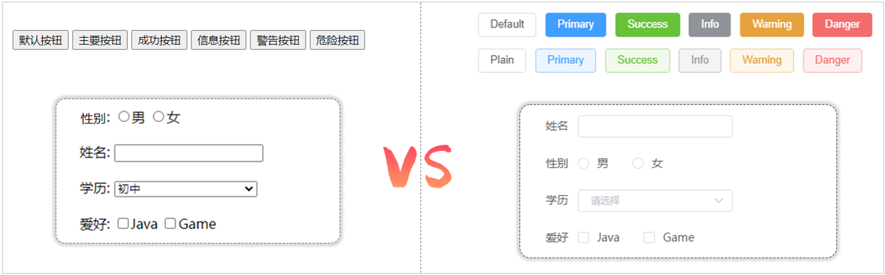

#### ElementPlus 的学习方式和我们之前的学习方式不太一样，对于 ElementPlus，我们作为一个后台开发者，<span style="color:red">只需要学会如何从 ElementPlus 的官网拷贝组件到我们自己的页面中，并且做一些修改即可</span>

#### 我们主要学习的是 ElementPlus 中提供的常用组件，至于其他组件同学们可以通过我们这几个组件的学习掌握到 ElementPlus 的学习技巧，然后课后自行学习

## 快速入门

### 安装组件库依赖

```bash
npm install element-plus@2.4.4 --save
```

### 引入组件库

> #### 在 main.js 中引入 ElementPlus 组件库 （参照官方文档），最终 main.js 中代码如下

```js
import { createApp } from "vue";
import App from "./App.vue";

//引入ElmentPlus
import ElementPlus from "element-plus"; // [!code ++]
import "element-plus/dist/index.css"; // [!code ++]
import zhCn from "element-plus/es/locale/lang/zh-cn"; // [!code ++]

createApp(App).use(ElementPlus, { locale: zhCn }).mount("#app"); // [!code ++]
```

### 组件汉化

#### <span style="color:red">默认</span>情况下，ElementPlus 的组件是<span style="color:red">s 英文</span>的，如果希望使用中文语言，可以在 <span style="color:red">main.js</span> 中做如下配置

```js
import zhCn from "element-plus/dist/locale/zh-cn.mjs";
app.use(ElementPlus, { locale: zhCn });
```

### 入门案例

#### （1）找到官网的按钮组件

<br/>
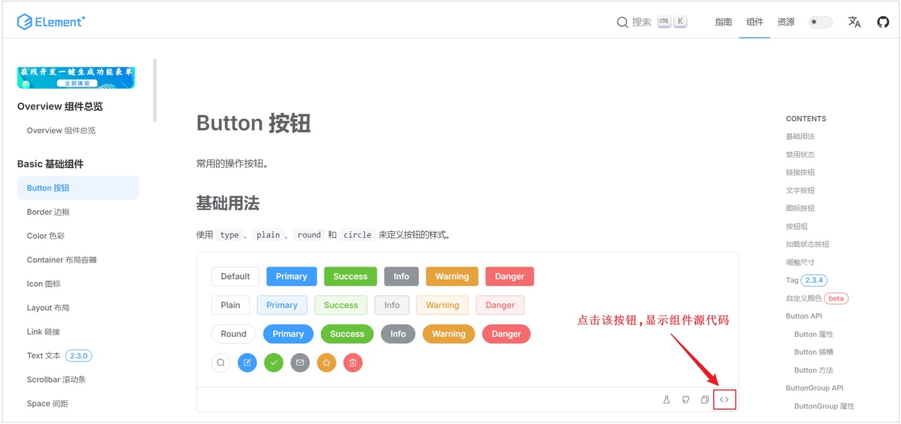

#### （2） 在 src 下<span style="color:red">创建 views 目录</span>，在 views 目录下，创建 <span style="color:red">Element.vue</span> 组件文件，复制组件代码，调整成自己想要的

```vue
<script setup></script>

<template>
  <el-row class="mb-4">
    <el-button>Default</el-button>
    <el-button type="primary">Primary</el-button>
    <el-button type="success">Success</el-button>
    <el-button type="info">Info</el-button>
    <el-button type="warning">Warning</el-button>
    <el-button type="danger">Danger</el-button>
  </el-row>
</template>

<style scoped></style>
```

#### （3）在根组件 app.vue 中引入 Element.vue

> #### import 后面就是引入文件的<span style="color:red">别名</span>，在 <span style="color:red">templete</span> 标签中使用<span style="color:red">别名标签</span>来实现<span style="color:red">页面渲染</span>

```vue
<script setup>
import Element from "./views/Element.vue";
</script>

<template>
  <Element></Element>
</template>

<style scoped></style>
```

#### （4）启动项目，查看渲染效果

<br/>
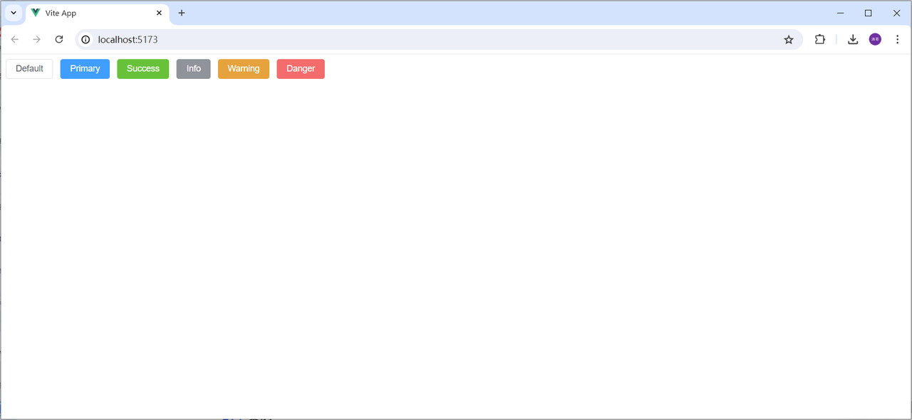

## 常用组件案例

### 表格组件

<br/>
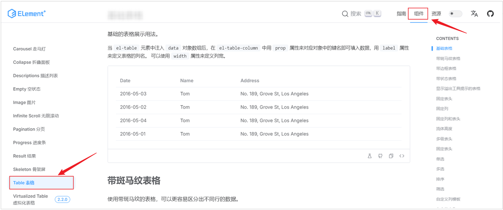

#### 然后在 Element.vue 组件中继续制作表格。组件中，需要注意的是，我们组件包括了 3 个部分，如果官方有除了&lt;template&gt;部分之外的&lt;style&gt;和&lt;script&gt;都需要复制。具体操作如下图所示

<br/>
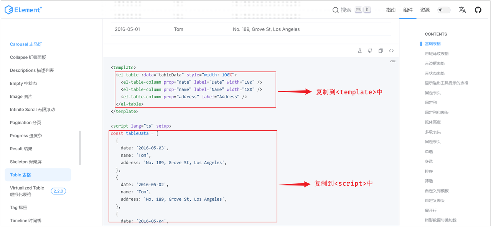

#### Table 表格组件，属性说明

> #### data: 主要定义 table 组件的数据模型
>
> #### prop: 定义列的数据应该绑定 data 中定义的具体的数据模型
>
> #### label: 定义列的标题
>
> #### width: 定义列的宽度

```vue
<script setup>
const tableData = [
  {
    date: "2016-05-03",
    name: "Tom",
    address: "No. 189, Grove St, Los Angeles",
  },
  {
    date: "2016-05-02",
    name: "Tom",
    address: "No. 189, Grove St, Los Angeles",
  },
  {
    date: "2016-05-04",
    name: "Tom",
    address: "No. 189, Grove St, Los Angeles",
  },
  {
    date: "2016-05-01",
    name: "Tom",
    address: "No. 189, Grove St, Los Angeles",
  },
];
</script>

<template>
  <!-- Button按钮 -->
  <el-row class="mb-4">
    <el-button>Default</el-button>
    <el-button type="primary">Primary</el-button>
    <el-button type="success">Success</el-button>
    <el-button type="info">Info</el-button>
    <el-button type="warning">Warning</el-button>
    <el-button type="danger">Danger</el-button>
  </el-row>

  <br />

  <!-- Table表格 -->
  <el-table :data="tableData" border style="width: 100%">
    <el-table-column prop="date" label="Date" width="180" />
    <el-table-column prop="name" label="Name" width="180" />
    <el-table-column prop="address" label="Address" />
  </el-table>
</template>

<style scoped></style>
```

### 分页条组件

#### 首先在官网找到分页组件，我们选择带背景色分页组件，如下图所示

<br/>
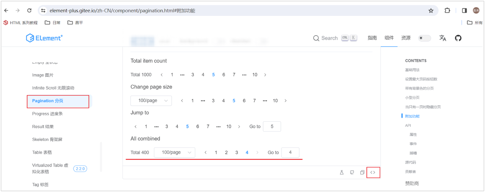

#### 然后复制代码到我们的 Element.vue 组件文件的 template 中，在 &lt;template&gt; &lt;/template&gt; 拷贝如下代码

```html
<el-pagination
  v-model:current-page="currentPage4"
  v-model:page-size="pageSize4"
  :page-sizes="[100, 200, 300, 400]"
  layout="total, sizes, prev, pager, next, jumper"
  :total="400"
  @size-change="handleSizeChange"
  @current-change="handleCurrentChange"
/>
```

#### 在 &lt;script&gt; &lt;/script&gt; 中拷贝如下代码

```js
import { ref } from "vue";

const currentPage4 = ref(4);
const pageSize4 = ref(100);

const handleSizeChange = (val) => {
  console.log(`${val} items per page`);
};
const handleCurrentChange = (val) => {
  console.log(`current page: ${val}`);
};
```

#### 完整代码如下

<details>
<summary
  style="font-size:18px;font-weight:bold;background-color:#D3D3D3;padding-left:20px;padding-top:10px;padding-bottom:10px;"
>
  点我查看代码
</summary>

```vue
<script setup>
import { ref } from "vue";

const tableData = [
  {
    date: "2016-05-03",
    name: "Tom",
    address: "No. 189, Grove St, Los Angeles",
  },
  {
    date: "2016-05-02",
    name: "Tom",
    address: "No. 189, Grove St, Los Angeles",
  },
  {
    date: "2016-05-04",
    name: "Tom",
    address: "No. 189, Grove St, Los Angeles",
  },
  {
    date: "2016-05-01",
    name: "Tom",
    address: "No. 189, Grove St, Los Angeles",
  },
];

const currentPage4 = ref(4);
const pageSize4 = ref(100);

const handleSizeChange = (val) => {
  console.log(`${val} items per page`);
};
const handleCurrentChange = (val) => {
  console.log(`current page: ${val}`);
};
</script>

<template>
  <!-- Button按钮 -->
  <el-row class="mb-4">
    <el-button>Default</el-button>
    <el-button type="primary">Primary</el-button>
    <el-button type="success">Success</el-button>
    <el-button type="info">Info</el-button>
    <el-button type="warning">Warning</el-button>
    <el-button type="danger">Danger</el-button>
  </el-row>

  <br />

  <!-- Table表格 -->
  <el-table :data="tableData" border style="width: 100%">
    <el-table-column prop="date" label="Date" width="180" />
    <el-table-column prop="name" label="Name" width="180" />
    <el-table-column prop="address" label="Address" />
  </el-table>

  <br />

  <el-pagination
    v-model:current-page="currentPage4"
    v-model:page-size="pageSize4"
    :page-sizes="[100, 200, 300, 400]"
    layout="total, sizes, prev, pager, next, jumper"
    :total="400"
    @size-change="handleSizeChange"
    @current-change="handleCurrentChange"
  />
</template>

<style scoped></style>
```

</details>

### 分页组件相关属性

#### 对于分页组件我们需要关注的是如下几个重要属性（可以通过查阅官网组件中最下面的组件属性详细说明得到）

> #### background: 添加北京颜色，也就是上图蓝色背景色效果。
>
> #### layout: 分页工具条的布局，其具体值包含 sizes, prev, pager, next, jumper, total 这些值
>
> #### total: 数据的总数量

<br/>
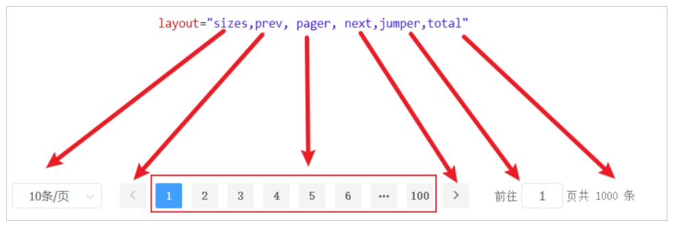

#### 对于分页组件，除了上述几个属性，还有 2 个非常重要的事件我们需要去学习：

> #### size-change ： pageSize 改变时会触发
>
> #### current-change ：currentPage 改变时会触发

### 对话框组件

#### 首先我们需要在 ElementPlus 官方找到 Dialog 组件，如下图所示

<br/>
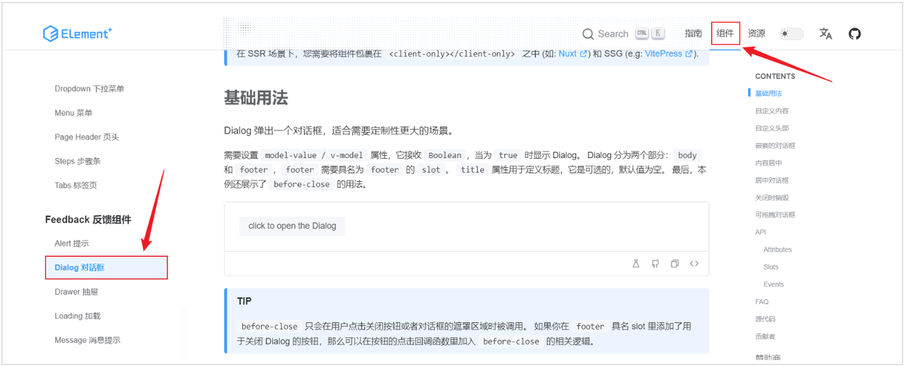

#### 然后复制如下代码到我们的组件文件 Element.vue 的 &lt;template&gt;&lt;/template&gt; 模块中

```html
<el-button @click="dialogTableVisible = true"> 打开对话框 </el-button>

<el-dialog v-model="dialogTableVisible" title="Shipping address">
  <el-table :data="tableData">
    <el-table-column property="date" label="Date" width="150" />
    <el-table-column property="name" label="Name" width="200" />
    <el-table-column property="address" label="Address" />
  </el-table>
</el-dialog>
```

#### 然后复制如下代码到我们的组件文件 Element.vue 的 &lt;script&gt;&lt;/script&gt; 模块中

```js
const dialogTableVisible = ref(false);
```

#### 完整代码如下

> #### Dialog 对话框组件使用的<span style="color:red">关键点</span>，就是<span style="color:red">控制其显示与隐藏</span>
>
> #### 通过 <span style="color:red">v-model</span> 给定的 boolean 值，来控制 Dialog 的显示与隐藏

<details>
<summary
  style="font-size:18px;font-weight:bold;background-color:#D3D3D3;padding-left:20px;padding-top:10px;padding-bottom:10px;"
>
  点我查看代码
</summary>

```vue
<script setup>
import { ref } from "vue";

const tableData = [
  {
    date: "2016-05-03",
    name: "Tom",
    address: "No. 189, Grove St, Los Angeles",
  },
  {
    date: "2016-05-02",
    name: "Tom",
    address: "No. 189, Grove St, Los Angeles",
  },
  {
    date: "2016-05-04",
    name: "Tom",
    address: "No. 189, Grove St, Los Angeles",
  },
  {
    date: "2016-05-01",
    name: "Tom",
    address: "No. 189, Grove St, Los Angeles",
  },
];

const currentPage4 = ref(4);
const pageSize4 = ref(100);

const handleSizeChange = (val) => {
  console.log(`${val} items per page`);
};
const handleCurrentChange = (val) => {
  console.log(`current page: ${val}`);
};

// Dialog对话框
const dialogTableVisible = ref(false);
</script>

<template>
  <!-- Button按钮 -->
  <el-row class="mb-4">
    <el-button>Default</el-button>
    <el-button type="primary">Primary</el-button>
    <el-button type="success">Success</el-button>
    <el-button type="info">Info</el-button>
    <el-button type="warning">Warning</el-button>
    <el-button type="danger">Danger</el-button>
  </el-row>

  <br />

  <!-- Table表格 -->
  <el-table :data="tableData" border style="width: 100%">
    <el-table-column prop="date" label="Date" width="180" />
    <el-table-column prop="name" label="Name" width="180" />
    <el-table-column prop="address" label="Address" />
  </el-table>

  <br />

  <el-pagination
    v-model:current-page="currentPage4"
    v-model:page-size="pageSize4"
    :page-sizes="[100, 200, 300, 400]"
    layout="total, sizes, prev, pager, next, jumper"
    :total="400"
    @size-change="handleSizeChange"
    @current-change="handleCurrentChange"
  />

  <br />

  <el-button @click="dialogTableVisible = true"> 打开对话框 </el-button>

  <el-dialog v-model="dialogTableVisible" title="Shipping address">
    <el-table :data="tableData">
      <el-table-column property="date" label="Date" width="150" />
      <el-table-column property="name" label="Name" width="200" />
      <el-table-column property="address" label="Address" />
    </el-table>
  </el-dialog>
</template>

<style scoped></style>
```

</details>

<br/>
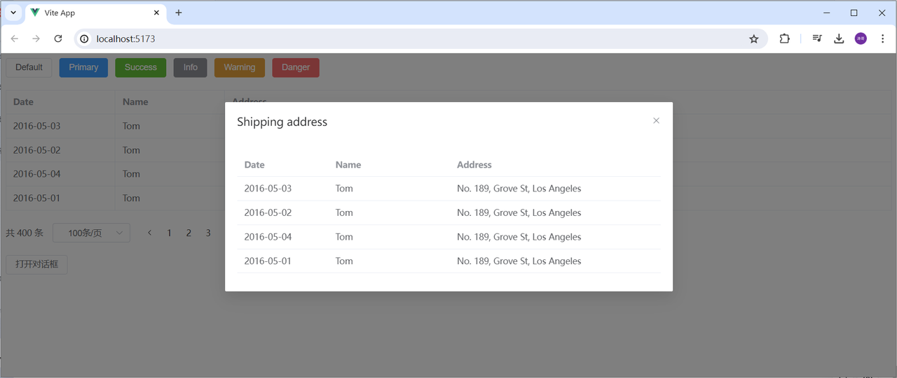

### 表单组件

#### Form 表单：由输入框、选择器、单选框、多选框等控件组成，用以收集、校验、提交数据

#### 表单在我们前端的开发中使用的还是比较多的，接下来我们学习这个组件，与之前的流程一样，我们首先需要在 ElementPlus 的官方找到对应的组件示例：如下图所示

<br/>
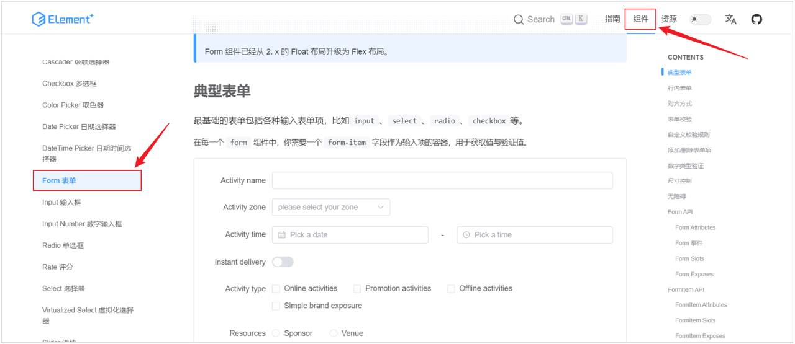

#### 然后复制如下代码到我们的组件文件 Element.vue 的 &lt;template&gt;&lt;/template&gt; 模块中

```html
<!-- Form 表单 -->
<el-form :inline="true" :model="formInline" class="demo-form-inline">
  <el-form-item label="Approved by">
    <el-input v-model="formInline.user" placeholder="Approved by" clearable />
  </el-form-item>

  <el-form-item label="Activity zone">
    <el-select
      v-model="formInline.region"
      placeholder="Activity zone"
      clearable
    >
      <el-option label="Zone one" value="shanghai" />
      <el-option label="Zone two" value="beijing" />
    </el-select>
  </el-form-item>

  <el-form-item label="Activity time">
    <el-date-picker
      v-model="formInline.date"
      type="date"
      placeholder="Pick a date"
      clearable
    />
  </el-form-item>

  <el-form-item>
    <el-button type="primary" @click="onSubmit">Query</el-button>
  </el-form-item>
</el-form>
```

#### 然后复制如下代码到我们的组件文件 Element.vue 的 &lt;script&gt;&lt;/script&gt; 模块中

```js
// Form表单
const formInline = ref({
  user: "",
  region: "",
  date: "",
});

const onSubmit = () => {
  console.log("submit!");
};
```

#### 完整代码如下

<details>
<summary
  style="font-size:18px;font-weight:bold;background-color:#D3D3D3;padding-left:20px;padding-top:10px;padding-bottom:10px;"
>
  点我查看代码
</summary>

```vue
<script setup>
import { ref } from "vue";

const tableData = [
  {
    date: "2016-05-03",
    name: "Tom",
    address: "No. 189, Grove St, Los Angeles",
  },
  {
    date: "2016-05-02",
    name: "Tom",
    address: "No. 189, Grove St, Los Angeles",
  },
  {
    date: "2016-05-04",
    name: "Tom",
    address: "No. 189, Grove St, Los Angeles",
  },
  {
    date: "2016-05-01",
    name: "Tom",
    address: "No. 189, Grove St, Los Angeles",
  },
];

const currentPage4 = ref(4);
const pageSize4 = ref(100);

const handleSizeChange = (val) => {
  console.log(`${val} items per page`);
};
const handleCurrentChange = (val) => {
  console.log(`current page: ${val}`);
};

// Dialog对话框
const dialogTableVisible = ref(false);

// Form表单
const formInline = ref({
  user: "",
  region: "",
  date: "",
});

const onSubmit = () => {
  console.log("submit!");
};
</script>

<template>
  <!-- Button按钮 -->
  <el-row class="mb-4">
    <el-button>Default</el-button>
    <el-button type="primary">Primary</el-button>
    <el-button type="success">Success</el-button>
    <el-button type="info">Info</el-button>
    <el-button type="warning">Warning</el-button>
    <el-button type="danger">Danger</el-button>
  </el-row>

  <br />

  <!-- Table表格 -->
  <el-table :data="tableData" border style="width: 100%">
    <el-table-column prop="date" label="Date" width="180" />
    <el-table-column prop="name" label="Name" width="180" />
    <el-table-column prop="address" label="Address" />
  </el-table>

  <br />

  <el-pagination
    v-model:current-page="currentPage4"
    v-model:page-size="pageSize4"
    :page-sizes="[100, 200, 300, 400]"
    layout="total, sizes, prev, pager, next, jumper"
    :total="400"
    @size-change="handleSizeChange"
    @current-change="handleCurrentChange"
  />

  <br />

  <el-button @click="dialogTableVisible = true"> 打开对话框 </el-button>

  <el-dialog v-model="dialogTableVisible" title="Shipping address">
    <el-table :data="tableData">
      <el-table-column property="date" label="Date" width="150" />
      <el-table-column property="name" label="Name" width="200" />
      <el-table-column property="address" label="Address" />
    </el-table>
  </el-dialog>

  <br /><br />

  <!-- Form 表单 -->
  <el-form :inline="true" :model="formInline" class="demo-form-inline">
    <el-form-item label="Approved by">
      <el-input v-model="formInline.user" placeholder="Approved by" clearable />
    </el-form-item>

    <el-form-item label="Activity zone">
      <el-select
        v-model="formInline.region"
        placeholder="Activity zone"
        clearable
      >
        <el-option label="Zone one" value="shanghai" />
        <el-option label="Zone two" value="beijing" />
      </el-select>
    </el-form-item>

    <el-form-item label="Activity time">
      <el-date-picker
        v-model="formInline.date"
        type="date"
        placeholder="Pick a date"
        clearable
      />
    </el-form-item>

    <el-form-item>
      <el-button type="primary" @click="onSubmit">Query</el-button>
    </el-form-item>
  </el-form>
</template>

<style scoped></style>
```

</details>

<br/>
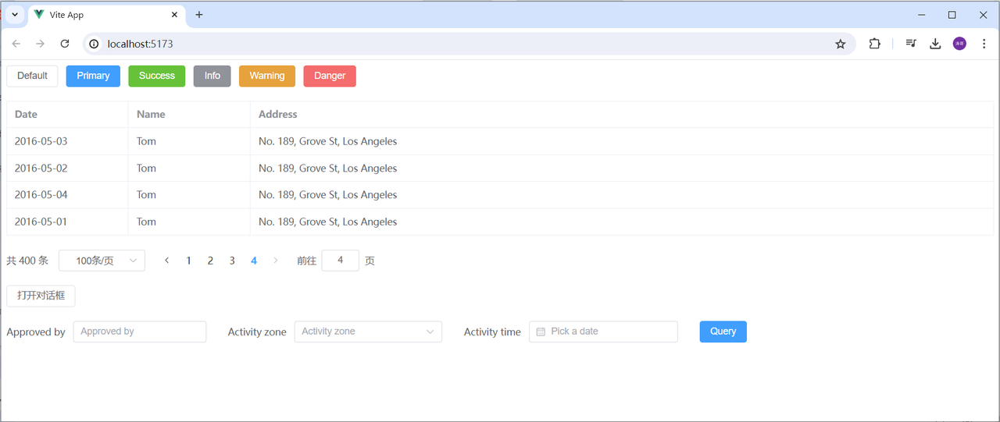

## 综合案例

### 需求分析

#### 基于 ElementPlus 组件库制作如下页面，并异步获取数据，完成页面展示

<br/>
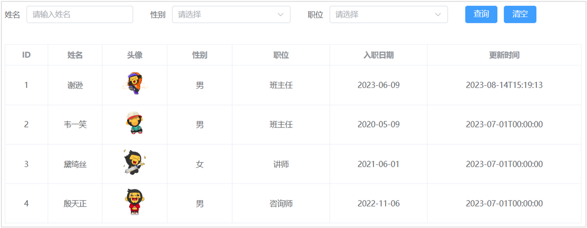

### 准备工作

#### 由于在案例中，我们需要在 vue 项目中使用 Axios，需要安装 axios，需要在当前项目的目录下执行如下命令

```bash
npm install axios
```

### 编码实现

#### 在 views 目录下，再定义一个文件 <span style="color:red">EmpList.vue</span>，具体代码实现如下

```vue
<script setup>
import { ref, onMounted } from "vue";
import axios from "axios";

//表单
const emp = ref({ name: "", gender: "", job: "" });

//钩子函数
onMounted(() => {
  search();
});

//查询
const search = async () => {
  const result = await axios.get(
    `https://web-server.itheima.net/emps/list?name=${emp.value.name}&gender=${emp.value.gender}&job=${emp.value.job}`
  );
  empList.value = result.data.data;
};

//清空
const clear = () => {
  emp.value = { name: "", gender: "", job: "" };
  search();
};

const empList = ref([]);
</script>

<template>
  <div id="container">
    <!-- 搜索表单 -->
    <el-form :inline="true" :model="emp" class="demo-form-inline">
      <el-form-item label="姓名">
        <el-input v-model="emp.name" placeholder="请输入姓名" />
      </el-form-item>

      <el-form-item label="性别">
        <el-select v-model="emp.gender" placeholder="请选择">
          <el-option label="男" value="1" />
          <el-option label="女" value="2" />
        </el-select>
      </el-form-item>

      <el-form-item label="职位">
        <el-select v-model="emp.job" placeholder="请选择">
          <el-option label="班主任" value="1" />
          <el-option label="讲师" value="2" />
          <el-option label="学工主管" value="3" />
          <el-option label="教研主管" value="4" />
          <el-option label="咨询师" value="5" />
        </el-select>
      </el-form-item>

      <el-form-item>
        <el-button type="primary" @click="search">查询</el-button>
        <el-button type="info" @click="clear">清空</el-button>
      </el-form-item>
    </el-form>

    <!-- 表格 -->
    <el-table :data="empList" border style="width: 100%">
      <el-table-column prop="id" label="ID" width="100" align="center" />
      <el-table-column prop="name" label="姓名" width="120" align="center" />
      <el-table-column label="头像" width="180" align="center">
        <template #default="scope">
          
        </template>
      </el-table-column>
      <el-table-column label="性别" width="180" align="center">
        <template #default="scope">
          {{ scope.row.gender == 1 ? "男" : "女" }}
        </template>
      </el-table-column>
      <el-table-column label="职位" width="180" align="center">
        <template #default="scope">
          <span v-if="scope.row.job == 1">班主任</span>
          <span v-else-if="scope.row.job == 2">讲师</span>
          <span v-else-if="scope.row.job == 3">学工主管</span>
          <span v-else-if="scope.row.job == 4">教研主管</span>
          <span v-else-if="scope.row.job == 5">咨询师</span>
          <span v-else>其他</span>
        </template>
      </el-table-column>
      <el-table-column
        prop="entrydate"
        label="入职日期"
        width="180"
        align="center"
      />
      <el-table-column prop="updatetime" label="更新时间" align="center" />
    </el-table>
  </div>
</template>

<style scoped>
#container {
  width: 70%;
  margin-left: 15%;
  margin-right: 15%;
}
</style>
```

#### 在 App.vue 中引入 <span style="color:red">EmpList.vue</span> 文件

```vue
<script setup>
import EmpList from "./views/EmpList.vue";
</script>

<template>
  <EmpList></EmpList>
</template>

<style scoped></style>
```
