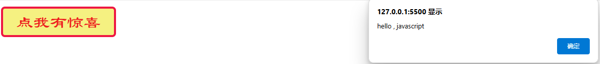
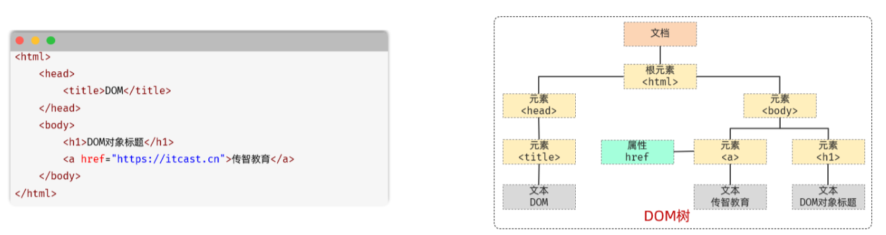
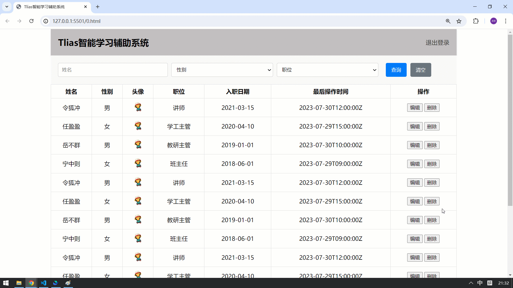
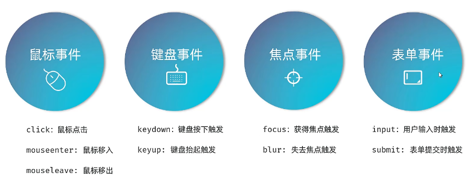

<h1 style="text-align: center; font-weight: bold;"> JavaScript 笔记</h1>

---

## 基本介绍

### 历史

> #### Javascript 是一种由 Netscape(网景)的 LiveScript 发展而来的原型化继承的面向对象的动态类型的区分大小写的<span style="color:red;font-weight:bold">客户端脚本语言</span>，主要<span style="color:red;font-weight:bold">目的是为了解决服务器端语言，遗留的速度问题</span>，为客户提供更流畅的浏览效果。当时服务端需要对数据进行验证，由于网络速度相当缓慢,只有 28.8kbps，验证步骤浪费的时间太多。于是 Netscape 的浏览器 Navigator 加入了 Javascript，提供了数据验证的基本功能。<span style="color:red;font-weight:bold">ECMA-262 是正式的 JavaScript 标准</span>。这个标准基于 JavaScript (Netscape) 和 JScript (Microsoft)。ECMA-262 的开发始于 1996 年，在 1997 年 7 月，ECMA 会员大会采纳了它的首个版本。这个标准由 ECMA 组织发展和维护。JavaScript 的正式名称是 "ECMAScript"。<span style="color:blue;font-weight:bold">JavaScript 的组成包含 ECMAScript、DOM、BOM</span>。<span style="color:red;font-weight:bold">JS 是一种运行于浏览器端上的小脚本语句,可以实现网页如文本内容动,数据动态变化和动画特效等</span>

### 特点

#### （1）脚本语言

> #### JavaScript 是一种<span style="color:red;font-weight:bold">解释型的脚本语言</span>。不同于 C、C--、Java 等语言先编译后执行, JavaScript 不会产生编译出来的字节码文件，而是在程序的<span style="color:red;font-weight:bold">运行过程中对源文件逐行进行解释</span>

#### （2）基于对象

> #### JavaScript 是一种基于对象的脚本语言，它不仅可以创建对象，也能使用现有的对象。但是面向对象的三大特性：『封装』、『继承』、『多态』中，JavaScript <span style="color:red;font-weight:bold">能够实现封装，可以模拟继承</span>，<span style="color:blue;font-weight:bold">不支持多态</span>，所以它<span style="color:red;font-weight:bold">不是</span>一门<span style="color:red;font-weight:bold">面向对象</span>的编程语言

#### （3）弱类型

> #### JavaScript 中也有明确的数据类型，但是声明一个<span style="color:red;font-weight:bold">变量</span>后它<span style="color:red;font-weight:bold">可以接收任何类型的数据</span>，并且会在程序执行过程中<span style="color:red;font-weight:bold">根据上下文自动转换类型</span>

#### （4）事件驱动

> #### JavaScript 是一种采用事件驱动的脚本语言，它不需要经过 Web 服务器就可以对用户的输入做出响应

#### （5）跨平台性

> #### JavaScript 脚本语言<span style="color:red;font-weight:bold">不依赖于操作系统，仅需要浏览器的支持</span>。因此一个 JavaScript 脚本在编写后可以带到任意机器上使用，前提是机器上的浏览器支持 JavaScript 脚本语言。目前 JavaScript 已被大多数的浏览器所支持

### ECMA 及版本变化

- 是一种由欧洲计算机制造商协会（ECMA）通过 ECMA-262 标准化的脚本程序语言,ECMAScript 描述了语法、类型、语句、关键字、保留字、运算符和对象。它就是定义了脚本语言的所有属性、方法和对象。

- ECMA-262 第 1 版本质上跟网景的 JavaScript 1.1 相同，删除了浏览器特定代码和少量细微的修改.ECMA-262 要求支持 Unicode 标准（以支持多语言）且对象要与平台无关
- ECMA-262 第 2 版只是做了一些编校工作，主要是为了严格符合 ISO/IEC-16262 的要求，并没有增减或改变任何特性。

- ECMA-262 第 3 版第一次真正对 ECMAScript 进行更新，更新了字符串处理、错误定义和数值输出，增加了对正则表达式、新的控制语句、try/catch 异常处理的支持。
- ECMA-262 第 4 版是对这门语言的一次彻底修订。开发者开始修订 ECMAScript 以满足全球 Web 开发日益增长的需求。 第 4 版包括强类型变量、新语句和数据结构、真正的类和经典的继承，以及操作数据的新手段。
- ECMA-262 第 5 版是 ECMA-262 第 3 版的小幅改进，于 2009 年 12 月 3 日正式发布。第 5 版致力于厘清第 3 版存在的歧义，也增加了新功能。新功能包括原生的解析和序列化 JSON 数据的 JSON 对象、方便继承和高级属性定义的方法、新的增强 ECMAScript 引擎解释和执行代码能力的严格模式。
- ECMA-262 第 6 版俗称 <span style="color:red;font-weight:bold">ES6</span>、ES2015 或 ES Harmony（和谐版），于 2015 年 6 月发布。<span style="color:red;font-weight:bold">这一版包含了大概这个规范有史以来最重要的一批增强特性。</span>ES6 正式支持了类、模块、迭代器、生成器、箭头函数、期约、反射、代理和众多新的数据类型。但是并不是所有的浏览器都全面支持了 ES6,很多情况下我们需要将 ES6 的语法通过工具转换成 5 以后运行
- ECMA-262 第 7 版也称为 ES7 或 ES2016，于 2016 年 6 月发布。这次修订只包含少量语法层面的增强，如 Array.prototype.includes 和指数操作符。
- ECMA-262 第 8 版也称为 ES8、ES2017，完成于 2017 年 6 月。这一版主要增加了异步函数（async/await）、SharedArrayBuffer 及 Atomics API、Object.values()/Object.entries()/Object.getOwnProperty- Descriptors()和字符串填充方法，另外明确支持对象字面量最后的逗号。
- ECMA-262 第 9 版也称为 ES9、ES2018，发布于 2018 年 6 月。这次修订包括异步迭代、剩余和扩展属性、一组新的正则表达式特性、Promise finally()以及模板字面量修订。
- ECMA-262 第 10 版也称为 ES10、ES2019，发布于 2019 年 6 月。这次修订增加了 Array.prototype.flat()/flatMap()、String.prototype.trimStart()/trimEnd()、Object.fromEntries()方法以及 Symbol.prototype.description 属性，明确定义了 Function.prototype.toString()的返回值并固定了 Array.prototype.sort()的顺序。另外，这次修订解决了与 JSON 字符串兼容的问题，并定义了 catch 子句的可选绑定。
- ECMA-262 第 11 版，也成为 ES11、ES2020，发布于 2020 年 6 月。这次修订增加了 String 的 matchAll 方法、动态导入语句 import()、import.meta、export \* as ns from 'module'、Promise.allSettled、GlobalThis、Nullish coalescing Operator、Optional Chaining 以及一种新的数据类型 BigInt，在此之后 JavaScript 正式迎来第 8 位数据类型。

## 引入方式

### 内嵌式

#### （1）基本介绍

> #### 在 &lt;head&gt; 标签中，使用 &lt;script&gt; &lt;/script&gt;标签引入
>
> #### 函数类型可以使用 <span style="color:red;font-weight:bold">function</span> 定义
>
> #### <span style="color:red;font-weight:bold">弹窗提示</span>函数：<span style="color:red;font-weight:bold">alert( )</span>
>
> #### 函数<span style="color:red;font-weight:bold">绑定点击行为</span>：<span style="color:red;font-weight:bold">onclick</span> 属性

#### （2）注意点

> #### &lt;script&gt; 标签<span style="color:red;font-weight:bold">必须是一对</span>的方式引入，否则在调用相关函数时无法生效
>
> #### 一个 html 中 <span style="color:red;font-weight:bold">可以有多个 &lt;script&gt; 标签</span>

```html
<!DOCTYPE html>
<html lang="en">
  <head>
    <meta charset="UTF-8" />
    <title>小标题</title>
    <style>
      /* 通过选择器确定样式的作用范围 */
      .btn1 {
        display: block;
        width: 150px;
        height: 40px;
        background-color: rgb(245, 241, 129);
        color: rgb(238, 31, 31);
        border: 3px solid rgb(238, 23, 66);
        font-size: 22px;
        font-family: "隶书";
        line-height: 30px;
        border-radius: 5px;
      }
    </style>
    <script>
      function sayhello() {
        alert("hello , javascript");
      }
    </script>
  </head>

  <body>
    <button class="btn1" onclick="sayhello()">点我有惊喜</button>
  </body>
</html>
```

#### 效果图



<hr/>

### 外部式

#### （1）基本介绍

> #### <span style="color:red;font-weight:bold">src</span> 属性：用于指定脚本文件路径
>
> #### <span style="color:red;font-weight:bold">type</span> 属性：text / javascript

#### （2）注意点

> #### &lt;script&gt; 标签<span style="color:red;font-weight:bold">必须是一对</span>的方式引入，否则在调用相关函数时无法生效
>
> #### 一对 script 标签<span style="color:red;font-weight:bold">不能再引入外部 js 文件的同时定义内部脚本</span>
>
> #### script 标签如果用于引入外部 js 文件，<span style="color:red;font-weight:bold">中间最好不要有任何字符，包括空格和换行</span>

#### js 脚本文件示例

```js
function sayhello() {
  alert("hello , javascript");
}
```

#### 引入外部脚本文件

```html
<!DOCTYPE html>
<html lang="en">
  <head>
    <meta charset="UTF-8" />
    <title>小标题</title>
    <style>
      /* 通过选择器确定样式的作用范围 */
      .btn1 {
        display: block;
        width: 150px;
        height: 40px;
        background-color: rgb(245, 241, 129);
        color: rgb(238, 31, 31);
        border: 3px solid rgb(238, 23, 66);
        font-size: 22px;
        font-family: "隶书";
        line-height: 30px;
        border-radius: 5px;
      }
    </style>
    <script src="./button.js" type="text/javascript"></script>
  </head>

  <body>
    <button class="btn1" onclick="sayhello()">点我有惊喜</button>
  </body>
</html>
```

### js 文件间引入

> #### 在 HTML 中 script 标签需要添加属性 <span style="color:red">type="module"</span>，才可以使用 <span style="color:red">import</span> 引入外部 js 文件

```js
// 第一个 js 文件
function sayhello() {
  alert("hello , javascript");
}

// 第二个 js 文件
import { sayhello } from "./button.js"; // 表示导入js 文件中的 sayhello 函数

document.querySelector("btn").addEventListener("click", function () {
  sayhello();
});

// html 文件中的 script 标签需要添加属性 type="module"
<script src="./function.js" type="module"></script>;
```

## 输出语句

```js
/* 浏览器弹窗 */
alert("hello, javascript");
/* 控制台输出 */
console.log("hello, javascript");
/* 页面输出 */
document.write("hello, javascript");
```

## 变量声明

#### JS 中的变量具有如下特征

> 1.  **js 中的变量类型都是<span style="color:red;font-weight:bold">弱类型变量</span>,可以<span style="color:red;font-weight:bold">统一声明成 var</span>，也可以用 <span style="color:red">let</span> 声明变量（推荐使用）**
> 2.  **var 声明的变量<span style="color:red;font-weight:bold">可以再次声明</span>**
> 3.  **变量可以使用不同的数据类型<span style="color:red;font-weight:bold">多次赋值</span>**
> 4.  **JS 的语句可以以; 结尾,也可以不用;结尾**
> 5.  **变量标识符<span style="color:red;font-weight:bold">严格区分大小写</span>**
> 6.  **标识符的命名规则参照 JAVA**
> 7.  **如果使用了 一个<span style="color:red;font-weight:bold">没有声明的变量</span>,那么运行时会报 uncaught ReferenceError: \*\*\* is not defined at index.html:行号:列号**
> 8.  **如果一个变量<span style="color:red;font-weight:bold">只声明,没赋值</span>,那么值是 <span style="color:red;font-weight:bold">undefined</span>**

## 数据类型

#### 数值类型

> - <h4>数值类型统一为 <span style="color:red;font-weight:bold">number</span>,不区分整数和浮点数</h4>

#### 字符串类型

> - <h4>字符串类型为 <span style="color:red;font-weight:bold">string</span> 和 JAVA 中的 String 相似，JS 中<span style="color:red;font-weight:bold">不严格区分单双引号</span>，都可以用于表示字符串</h4>

#### 布尔类型

> - <h4>布尔类型为 <span style="color:red;font-weight:bold">boolean</span> 和 Java 中的 boolean 相似，但是在 JS 的 if 语句中，非空字符串会被转换为'真'，非零数字也会被认为是'真'</h4>

#### 引用数据类型

> - <h4><span style="color:red;font-weight:bold">引用数据类型</span>对象是 <span style="color:red;font-weight:bold">Object</span> 类型，各种对象和数组在 JS 中都是 Object 类型</h4>

#### function 函数类型

> - <h4>JS 中的各种函数属于 <span style="color:red;font-weight:bold">function</span> 数据类型</h4>

#### 命名未赋值

> - <h4>js 为弱类型语言，统一使用 var 声明对象和变量,在赋值时才确定真正的数据类型,变量如果<span style="color:red;font-weight:bold">只声明没有赋值</span>的话，数据类型为 <span style="color:red;font-weight:bold">undefined</span></h4>

#### 赋予 NULL 值

> - <h4>在 JS 中，如果给一个变量赋值为 <span style="color:red;font-weight:bold">null</span>，其<span style="color:red;font-weight:bold">数据类型是 Object</span>，可以通过 <span style="color:red;font-weight:bold">typeof</span> 关键字<span style="color:red;font-weight:bold">判断数据类型</span></h4>

#### 常量

> - <h4>使用<span style="color:red">const</span>关键字声明变量，变量的值<span style="color:red">不能改变</span></h4>

#### 字符串

> - <h4>可以使用单引号（推荐使用）或者双引号或者反引号定义字符串</h4>

#### 字符串拼接于格式化（模板字符串）

```js
let name = "Tom";
let age = 18;

//原始方式 , 手动拼接字符串
console.log(
  "大家好, 我是新入职的" + name + ", 今年" + age + "岁了, 请多多关照"
);

//使用模板字符串方式拼接字符串  {" "}
console.log(`大家好, 我是新入职的${name}, 今年${age}岁了, 请多多关照`);
```

## 三种函数定义方式

> #### 匿名函数需要使用<span style="color:red;">变量接收返回值</span>

```js
// 常规定义
function add(a, b) {
  return a + b;
}

// 匿名函数：定义方式一
let add = function (a, b) {
  return a + b;
};

// 箭头函数：定义方式二（类 lambda 表达式）
var add = (a, b) => {
  return a + b;
};
```

## 运算符

#### 1. 算数运算符 + - \* / %%

> #### <span style="color:red;font-weight:bold">/</span> 如果 <span style="color:red;font-weight:bold">结果是小数，返回小数</span>，不会取整返回整数
>
> #### <span style="color:red;font-weight:bold">/ 在除 0</span> 时,结果是 <span style="color:red;font-weight:bold">Infinity</span> ,而不是报错
>
> #### <span style="color:red;font-weight:bold">% 在模 0</span> 时,结果是 <span style="color:red;font-weight:bold">NaN</span>,意思为 <span style="color:red;font-weight:bold">not a number</span> ,而不是报错

#### 2. 复合算数运算符 ++ -- += -= \*= /= %=

> #### 在/=0 时,结果是 <span style="color:red;font-weight:bold">Infinity</span> ,而不是报错
>
> #### 在%=0 时,结果是 <span style="color:red;font-weight:bold">NaN</span>,意思为 <span style="color:red;font-weight:bold">not a number</span> ,而不是报错

#### 3. 关系运算符 > < >= <= == === !=

> #### <span style="color:red;font-weight:bold">==</span>：如果两端的数据<span style="color:red;font-weight:bold">类型不一致</span>,会尝试将两端的数据<span style="color:red;font-weight:bold">转换成 number</span>,再对比 number 大小
>
> #### （1）'123' 这种字符串可以转换成数字
>
> #### （2）<span style="color:red;font-weight:bold">true 会被转换成 1；false 会被转换成 0</span>
>
> #### <span style="color:red;font-weight:bold">===</span>：如果两端数据<span style="color:red;font-weight:bold">类型不一致</span>,直接返回 <span style="color:red;font-weight:bold">false</span>,数据类型一致在比较是否相同

#### 4. 逻辑运算符 || &&

> #### 几乎和 JAVA 中的一样,需要注意的是,这里直接就是短路的逻辑运算符,<span style="color:red;font-weight:bold">单个的 | 和 & 以及 ^ 是位运算符</span>

#### 5. 条件运算符 条件? 值 1 : 值 2

> #### 几乎和 JAVA 中的一样

#### 6. 位运算符 | & ^ << >> >>>

> #### 和 java 中的类似(了解)

## 分支结构

#### 弹窗输入函数

> #### <span style="color:red;font-weight:bold">prompt</span>（"提示信息"），<span style="color:red;font-weight:bold">返回字符串</span>，用 <span style="color:red;font-weight:bold">Number.parseInt( ) </span>方法转为整数

```js
var input = prompt("输入一个整数");
var num = Number.parseInt(input);
if (num === 10) {
  console.log("true");
} else {
  console.log("false");
}
```

#### （1）if 结构

> #### if ( ) 中的<span style="color:red;font-weight:bold">非空字符串</span>会被认为是 <span style="color:red;font-weight:bold">true</span>
>
> #### if ( ) 中的<span style="color:red;font-weight:bold">非零数字</span>会被认为是 <span style="color:red;font-weight:bold">true</span>
>
> #### if ( ) 中的<span style="color:red;font-weight:bold">非空对象</span>会被认为是 <span style="color:red;font-weight:bold">true</span>

```js
if ("false") {
  // 非空字符串 if判断为true
  console.log(true);
} else {
  console.log(false);
}
if ("") {
  // 长度为0字符串 if判断为false
  console.log(true);
} else {
  console.log(false);
}
if (1) {
  // 非零数字 if判断为true
  console.log(true);
} else {
  console.log(false);
}
if (new Object()) {
  console.log(true);
} else {
  console.log(false);
}
```

#### （2）switch 结构

> #### 和 Java 相同

## 循环结构

#### 待更新 ~ :smile:

## 对象

### 自定义对象

> #### ⚠️ 注意：在<span style="color:red">箭头函数</span>中，this 并不指向当前对象，指向的是<span style="color:red">当前对象的父级</span>，所以在对象中定义函数时，<span style="color:red">不推荐使用箭头函数定义</span>

```js
let 对象名 = {
  属性名1: 属性值1,
  属性名2: 属性值2,
  属性名3: 属性值3,
  方法名称: function (形参列表) {}, （function可以省略）

  // 调用属性
  对象名.属性名

  // 调用方法
  对象名.方法名
}; （注意结尾有分号）
```

<h3>代码示例</h3>

```js
let user = {
  name: "Tom",
  age: 18,
  gender: "男",
  // 定义方式一
  sing: function () {
    console.log(this.name + "会唱歌");
  },

  // 定义方式二：省略 function 关键字
  /*  
  sing() {
    console.log(this.name + "会唱歌");
  }, 
  */
};

console.log(user.name + "今年" + user.age + "岁");
```

### JSON 对象

#### 基本介绍

> #### 概念：JavaScript Object Notation，JavaScript 对象标记法（JS 对象标记法书写的文本）
>
> #### 由于其语法简单，层次结构鲜明，现多用于作为数据载体，在网络中进行数据传输
>
> #### 特点：<span style="color:red">key 必须使用引号并且是双引号</span>标记，value 可以是任意数据类型

#### 相关方法

> #### JSON.stringify(...)：作用就是将 js 对象，<span style="color:red">转换为 json</span> 格式的<span style="color:red">字符串</span>
>
> #### JSON.parse(...)：作用就是将 json 格式的字符串，<span style="color:red">转换为 js 对象</span>
>
> #### 注意：当需要获取某个属性值时，需要先装成对象，之后再获取

#### 代码示例

```js
let person = {
  name: "张三",
  age: 18,
  sex: "男",
};

// js对象 转为 json 字符串
alert(JSON.stringify(person));

// json字符串 转为 js对象，再获取相关属性
let personJson = "{'name':'张三','age':18,'sex':'男'}";
alert(JSON.parse(personJson).name);
```

## DOM 编程

### 基本介绍

> #### DOM：Document Object Model 文档对象模型。也就是 JavaScript 将 HTML 文档的各个组成部分封装为对象，通过 js 操作这些对象，就可以实现操作 HTML 文档
>
> #### Document：整个文档对象
>
> #### Element：元素对象
>
> #### Attribute：属性对象
>
> #### Text：文本对象
>
> #### Comment：注释对象



### 作用

> #### （1）改变 HTML 元素的内容
>
> #### （2） 改变 HTML 元素的样式（CSS）
>
> #### （3）对 HTML DOM 事件作出反应
>
> #### （4）添加和删除 HTML 元素

### DOM 操作

> #### 实现逻辑：通过选择器匹配元素，使用相关方法实现使用 js 操作 HTML 文档

#### document 对象

> #### （1）网页中所有内容都封装在 document 对象中
>
> #### （2）它提供的属性和方法都是用来访问和操作网页内容的，如：document.write(…)

#### 操作步骤

> #### （1）获取 DOM 元素对象
>
> #### （2）操作 DOM 对象的属性或方法 (查阅文档)

#### 相关方法

#### （1）根据 CSS 选择器来获取 DOM 元素，获取到匹配到的<span style="color:red">第一个元素</span>：document.<span style="color:red">querySelector</span>('CSS 选择器');

#### （2）根据 CSS 选择器来获取 DOM 元素，获取匹配到的<span style="color:red">所有元素</span>：document.<span style="color:red">querySelectorAll</span>('CSS 选择器');

> #### ⚠️ 注意：获取到的所有元素，会封装到一个 <span style="color:red">NodeList</span> 节点集合中，是一个<span style="color:red">伪数组</span>（<span style="color:red">有长度、有索引</span>的数组，但没有 push、pop 等数组方法）

#### 补充：在早期的 JS 中，我们也可以通过如下方法获取 DOM 元素（了解）

> #### document.getElementById(...)：根据 id 属性值获取，返回单个 Element 对象。
>
> #### document.getElementsByTagName(...)：根据标签名称获取，返回 Element 对象数组。
>
> #### document.getElementsByName()：根据 name 属性值获取，返回 Element 对象数组。
>
> #### document.getElementsByClassName()：根据 class 属性值获取，返回 Element 对象数组。

#### 代码示例

```html
<!DOCTYPE html>
<html lang="en">
  <head>
    <meta charset="UTF-8" />
    <meta name="viewport" content="width=device-width, initial-scale=1.0" />
    <title>Document</title>
  </head>
  <body>
    <h1 id="title">111</h1>
    <h1>222</h1>
    <h1>333</h1>

    <script>
      // 匹配第一个
      // 方法一
      // let h1 = document.querySelector("title");
      // 方法二
      let h1 = document.querySelector("h1");
      // 获取对象后调用方法修改内容
      h1.innerHTML = "内容实现修改";

      // 匹配所有
      let hs = document.querySelectorAll("h1");
      // 此时得到的是一个伪数组，需要通过索引取值
      hs[0].innerHTML = "使用索引获取元素实现修改";
    </script>
  </body>
</html>
```

### 事件监听

> #### 语法：事件源 . addEventListener('事件类型', 要执行的函数);
>
> #### （1）事件源: 哪个 dom 元素触发了事件, 要获取 dom 元素
>
> #### （2）事件类型: 用什么方式触发, 比如: 鼠标单击 click, 鼠标经过 mouseover
>
> #### （3）要执行的函数: 要做什么事

#### （1）现代写法

```html
<!DOCTYPE html>
<html lang="en">
  <head>
    <meta charset="UTF-8" />
    <meta http-equiv="X-UA-Compatible" content="IE=edge" />
    <meta name="viewport" content="width=device-width, initial-scale=1.0" />
    <title>JS-事件-事件绑定</title>
  </head>

  <body>
    <input type="button" id="btn1" value="点我一下试试1" />
    <input type="button" id="btn2" value="点我一下试试2" />

    <script>
      document.querySelector("#btn1").addEventListener("click", () => {
        alert("按钮1被点击了...");
      });
    </script>
  </body>
</html>
```

#### （2）早期写法

```html
// 方式一： 通过html标签中的事件属性进行绑定
<input type="button" id="btn1" value="点我一下试试1" onclick="on()" />

<script>
  function on() {
    alert("试试就试试");
  }
</script>

// 方式二：通过DOM中Element元素的事件属性进行绑定

<body>
  <input type="button" id="btn1" value="点我一下试试1" />
  <script>
    document.querySelector("#btn1").onclick = function () {
      alert("按钮2被点击了...");
    };
  </script>
</body>
```

> #### ⚠️ 区别：<span style="color:red">on</span> 方式如果绑定了<span style="color:red">多个</span>事件，会<span style="color:red">覆盖</span>之前的事件，<span style="color:red">addEventListener</span> 方式可以绑定<span style="color:red">多个</span>事件，<span style="color:red">同时执行</span>，拥有更多特性，推荐使用 addEventListener

#### （3）案例：鼠标移入表格中的每一行时，该行颜色产生变化，实现聚焦效果

<br/>

<br/>
<details>
<summary style="font-size:18px;font-weight:bold;background-color:#D3D3D3;padding-left:20px;padding-top:10px;padding-bottom:10px">点我查看代码</summary>

```html
<!DOCTYPE html>
<html lang="zh-CN">
  <head>
    <meta charset="UTF-8" />
    <meta name="viewport" content="width=device-width, initial-scale=1.0" />
    <title>Tlias智能学习辅助系统</title>
    <style>
      body {
        margin: 0;
      }

      /* 顶栏样式 */
      .header {
        display: flex;
        justify-content: space-between;
        align-items: center;
        background-color: #c2c0c0;
        padding: 20px 20px;
        box-shadow: 0 2px 5px rgba(0, 0, 0, 0.1);
      }

      /* 加大加粗标题 */
      .header h1 {
        margin: 0;
        font-size: 24px;
        font-weight: bold;
      }

      /* 文本链接样式 */
      .header a {
        text-decoration: none;
        color: #333;
        font-size: 16px;
      }

      /* 搜索表单区域 */
      .search-form {
        display: flex;
        align-items: center;
        padding: 20px;
        background-color: #f9f9f9;
      }

      /* 表单控件样式 */
      .search-form input[type="text"],
      .search-form select {
        margin-right: 10px;
        padding: 10px 10px;
        border: 1px solid #ccc;
        border-radius: 4px;
        width: 26%;
      }

      /* 按钮样式 */
      .search-form button {
        padding: 10px 15px;
        margin-left: 10px;
        background-color: #007bff;
        color: white;
        border: none;
        border-radius: 4px;
        cursor: pointer;
      }

      /* 清空按钮样式 */
      .search-form button.clear {
        background-color: #6c757d;
      }

      .table {
        min-width: 100%;
        border-collapse: collapse;
      }

      /* 设置表格单元格边框 */
      .table td,
      .table th {
        border: 1px solid #ddd;
        padding: 8px;
        text-align: center;
      }

      .avatar {
        width: 30px;
        height: 30px;
        object-fit: cover;
        border-radius: 50%;
      }

      /* 页脚版权区域 */
      .footer {
        background-color: #c2c0c0;
        color: white;
        text-align: center;
        padding: 10px 0;
        margin-top: 30px;
      }

      .footer .company-name {
        font-size: 1.1em;
        font-weight: bold;
      }

      .footer .copyright {
        font-size: 0.9em;
      }

      #container {
        width: 80%;
        margin: 0 auto;
      }
    </style>
  </head>
  <body>
    <div id="container">
      <!-- 顶栏 -->
      <div class="header">
        <h1>Tlias智能学习辅助系统</h1>
        <a href="#">退出登录</a>
      </div>

      <!-- 搜索表单区域 -->
      <form class="search-form" action="#" method="post">
        <input type="text" name="name" placeholder="姓名" />
        <select name="gender">
          <option value="">性别</option>
          <option value="1">男</option>
          <option value="2">女</option>
        </select>
        <select name="job">
          <option value="">职位</option>
          <option value="1">班主任</option>
          <option value="2">讲师</option>
          <option value="3">学工主管</option>
          <option value="4">教研主管</option>
          <option value="5">咨询师</option>
        </select>
        <button type="submit">查询</button>
        <button type="reset" class="clear">清空</button>
      </form>

      <table class="table table-striped table-bordered">
        <thead>
          <tr>
            <th>姓名</th>
            <th>性别</th>
            <th>头像</th>
            <th>职位</th>
            <th>入职日期</th>
            <th>最后操作时间</th>
            <th>操作</th>
          </tr>
        </thead>
        <tbody>
          <tr>
            <td>令狐冲</td>
            <td>男</td>
            <td>
              
            </td>
            <td>讲师</td>
            <td>2021-03-15</td>
            <td>2023-07-30T12:00:00Z</td>
            <td class="btn-group">
              <button class="edit">编辑</button>
              <button class="delete">删除</button>
            </td>
          </tr>
          <tr>
            <td>任盈盈</td>
            <td>女</td>
            <td>
              
            </td>
            <td>学工主管</td>
            <td>2020-04-10</td>
            <td>2023-07-29T15:00:00Z</td>
            <td class="btn-group">
              <button class="edit">编辑</button>
              <button class="delete">删除</button>
            </td>
          </tr>
          <tr>
            <td>岳不群</td>
            <td>男</td>
            <td>
              
            </td>
            <td>教研主管</td>
            <td>2019-01-01</td>
            <td>2023-07-30T10:00:00Z</td>
            <td class="btn-group">
              <button class="edit">编辑</button>
              <button class="delete">删除</button>
            </td>
          </tr>
          <tr>
            <td>宁中则</td>
            <td>女</td>
            <td>
              
            </td>
            <td>班主任</td>
            <td>2018-06-01</td>
            <td>2023-07-29T09:00:00Z</td>
            <td class="btn-group">
              <button class="edit">编辑</button>
              <button class="delete">删除</button>
            </td>
          </tr>
          <tr>
            <td>令狐冲</td>
            <td>男</td>
            <td>
              
            </td>
            <td>讲师</td>
            <td>2021-03-15</td>
            <td>2023-07-30T12:00:00Z</td>
            <td class="btn-group">
              <button class="edit">编辑</button>
              <button class="delete">删除</button>
            </td>
          </tr>
          <tr>
            <td>任盈盈</td>
            <td>女</td>
            <td>
              
            </td>
            <td>学工主管</td>
            <td>2020-04-10</td>
            <td>2023-07-29T15:00:00Z</td>
            <td class="btn-group">
              <button class="edit">编辑</button>
              <button class="delete">删除</button>
            </td>
          </tr>
          <tr>
            <td>岳不群</td>
            <td>男</td>
            <td>
              
            </td>
            <td>教研主管</td>
            <td>2019-01-01</td>
            <td>2023-07-30T10:00:00Z</td>
            <td class="btn-group">
              <button class="edit">编辑</button>
              <button class="delete">删除</button>
            </td>
          </tr>
          <tr>
            <td>宁中则</td>
            <td>女</td>
            <td>
              
            </td>
            <td>班主任</td>
            <td>2018-06-01</td>
            <td>2023-07-29T09:00:00Z</td>
            <td class="btn-group">
              <button class="edit">编辑</button>
              <button class="delete">删除</button>
            </td>
          </tr>
          <tr>
            <td>令狐冲</td>
            <td>男</td>
            <td>
              
            </td>
            <td>讲师</td>
            <td>2021-03-15</td>
            <td>2023-07-30T12:00:00Z</td>
            <td class="btn-group">
              <button class="edit">编辑</button>
              <button class="delete">删除</button>
            </td>
          </tr>
          <tr>
            <td>任盈盈</td>
            <td>女</td>
            <td>
              
            </td>
            <td>学工主管</td>
            <td>2020-04-10</td>
            <td>2023-07-29T15:00:00Z</td>
            <td class="btn-group">
              <button class="edit">编辑</button>
              <button class="delete">删除</button>
            </td>
          </tr>
          <tr>
            <td>岳不群</td>
            <td>男</td>
            <td>
              
            </td>
            <td>教研主管</td>
            <td>2019-01-01</td>
            <td>2023-07-30T10:00:00Z</td>
            <td class="btn-group">
              <button class="edit">编辑</button>
              <button class="delete">删除</button>
            </td>
          </tr>
          <tr>
            <td>宁中则</td>
            <td>女</td>
            <td>
              
            </td>
            <td>班主任</td>
            <td>2018-06-01</td>
            <td>2023-07-29T09:00:00Z</td>
            <td class="btn-group">
              <button class="edit">编辑</button>
              <button class="delete">删除</button>
            </td>
          </tr>
        </tbody>
      </table>

      <!-- 页脚版权区域 -->
      <footer class="footer">
        <p class="company-name">江苏传智播客教育科技股份有限公司</p>
        <p class="copyright">
          版权所有 Copyright 2006-2024 All Rights Reserved
        </p>
      </footer>

      <script>
        //点击列表中每一条记录后面的删除按钮，弹出一个提示框，提示：您是否要删除这条记录？ 如果确定，则移出这条记录
        const deleteButtons = document.querySelectorAll(".delete");
        for (let i = 0; i < deleteButtons.length; i++) {
          deleteButtons[i].addEventListener("click", function () {
            if (confirm("您是否要删除这条记录？")) {
              //点击确定按钮，删除当前记录
              this.parentNode.parentNode.remove();
            }
          });
        }

        //通过js实现鼠标移入移出效果，鼠标移入，背景色为 #f2e2e2，鼠标移出，背景色为 白色。
        const trs = document.querySelectorAll("tr");
        for (let i = 1; i < trs.length; i++) {
          trs[i].addEventListener("mouseenter", function () {
            this.style.backgroundColor = "#f2e2e2";
          });
          trs[i].addEventListener("mouseleave", function () {
            this.style.backgroundColor = "#fff";
          });
        }
      </script>
    </div>
  </body>
</html>
```

</details>

### 常见事件



```html
<!DOCTYPE html>
<html lang="en">
  <head>
    <meta charset="UTF-8" />
    <meta http-equiv="X-UA-Compatible" content="IE=edge" />
    <meta name="viewport" content="width=device-width, initial-scale=1.0" />
    <title>JS-事件-常见事件</title>
  </head>

  <body>
    <form action="" style="text-align: center;">
      <input type="text" name="username" id="username" />
      <input type="text" name="age" id="age" />
      <input id="b1" type="submit" value="提交" />
      <input id="b2" type="button" value="单击事件" />
    </form>

    <br /><br /><br />

    <table width="800px" border="1" cellspacing="0" align="center">
      <tr>
        <th>学号</th>
        <th>姓名</th>
        <th>分数</th>
        <th>评语</th>
      </tr>
      <tr align="center">
        <td>001</td>
        <td>张三</td>
        <td>90</td>
        <td>很优秀</td>
      </tr>
      <tr align="center" id="last">
        <td>002</td>
        <td>李四</td>
        <td>92</td>
        <td>优秀</td>
      </tr>
    </table>

    <script>
      //click: 鼠标点击事件
      document.querySelector("#b2").addEventListener("click", () => {
        console.log("我被点击了...");
      });

      //mouseenter: 鼠标移入
      document.querySelector("#last").addEventListener("mouseenter", () => {
        console.log("鼠标移入了...");
      });

      //mouseleave: 鼠标移出
      document.querySelector("#last").addEventListener("mouseleave", () => {
        console.log("鼠标移出了...");
      });

      //keydown: 某个键盘的键被按下
      document.querySelector("#username").addEventListener("keydown", () => {
        console.log("键盘被按下了...");
      });

      //keydown: 某个键盘的键被抬起
      document.querySelector("#username").addEventListener("keyup", () => {
        console.log("键盘被抬起了...");
      });

      //blur: 失去焦点事件
      document.querySelector("#age").addEventListener("blur", () => {
        console.log("失去焦点...");
      });

      //focus: 元素获得焦点
      document.querySelector("#age").addEventListener("focus", () => {
        console.log("获得焦点...");
      });

      //input: 用户输入时触发
      document.querySelector("#age").addEventListener("input", () => {
        console.log("用户输入时触发...");
      });

      //submit: 提交表单事件
      document.querySelector("form").addEventListener("submit", () => {
        alert("表单被提交了...");
      });
    </script>
  </body>
</html>
```
