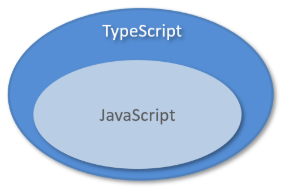
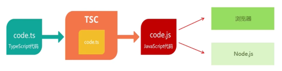

<h1 style="text-align: center;">TypeScript 笔记</h1>
 
- - -

## 基本介绍

> #### TypeScript（简称：TS） 是微软推出的开源语言
>
> #### TypeScript 是 JavaScript 的超集（JS 有的 TS 都有）

<br/>


> #### TypeScript = Type + JavaScript（在 JS 基础上增加了<span style="color:red">类型支持</span>）
>
> #### TypeScript 文件扩展名为 ts
>
> #### TypeScript 可编译成标准的 JavaScript，并且在编译时进行类型检查

<br/>


## 入门案例

### 安装 TS

```bash
# 全局安装
npm install -g typescript

# 查看版本
tsc -v
```

### 示例代码

> #### （1）使用 tsc 命令编译为 js 文件
>
> #### （2）使用 node 命令运行 js 文件

```ts
//定义一个函数 hello，并且指定参数类型为string
function hello(msg: string) {
  console.log(msg);
}

//调用上面的函数，传递非string类型的参数
hello("123");
```

## 数据类型

### 基本介绍

| **类型**   | **例**                                | **备注**                     |
| ---------- | ------------------------------------- | ---------------------------- |
| 字符串类型 | string                                |                              |
| 数字类型   | number                                |                              |
| 布尔类型   | boolean                               |                              |
| 数组类型   | number[],string[], boolean[] 依此类推 |                              |
| 任意类型   | any                                   | 相当于又回到了没有类型的时代 |
| 复杂类型   | type 与 interface                     |                              |
| 函数类型   | () => void                            | 对函数的参数和返回值进行说明 |
| 字面量类型 | "a"\|"b"\|"c"                         | 限制变量或参数的取值         |
| class 类   | class Animal                          |                              |

### 类型标注的位置

> #### 基于 TS 进行前端开发时，类型标注的位置有如下 3 个：（1）标注变量（2）标注参数（3）标注返回值

```ts
// 标注变量，指定变量 msg 的类型为 string
let msg: string = "hello ts!";

// 标注参数和返回值，指定 m2 函数的参数类型为 string，并且返回值也为 string
const m2 = (name: string): string => {
  return name.toLowerCase() + msg;
};
```

### 字符串、数字、布尔类型

```java
//定义字符串类型的变量
let username: string = 'itcast'

//定义布尔类型的变量
let isTrue: boolean = false

//定义数字类型的变量
let age: number = 20

console.log(username)
console.log(isTrue)
console.log(age)
```

### 字面量类型

> #### 字面量类型用于限定数据的取值范围，类似于 java 中的枚举

```ts
//定义字符串类型的变量
let username: string = "itcast";

//定义布尔类型的变量
let isTrue: boolean = false;

//定义数字类型的变量
let age: number = 20;

console.log(username);
console.log(isTrue);
console.log(age);
```

### interface 类型

> #### interface 类型是 TS 中的复杂类型，它让 TypeScript 具备了 JavaScript 所缺少的、描述较为复杂数据结构的能力

```ts
// 必选属性
interface Cat {
  name: string;
  age: number;
}

const c1: Cat = { name: "小白", age: 1 };
// const c2: Cat = { name: '小花' }; // 报错
// const c3: Cat = { name: '小黑', age: 1, sex: '公' }; // 报错

console.log(c1);
```

#### 可以通过在属性名后面加上 <span style="color:red">?</span>，表示当前属性为可选，代码如下

```ts
// 可选属性
interface Cat {
  name: string;
  age?: number;
}

const c1: Cat = { name: "小白", age: 1 };
const c2: Cat = { name: "小花" };
// const c3: Cat = { name: '小黑', age: 1, sex: '公' }; // 报错

console.log(c1);
```

### class 类型

> #### 使用 class 关键字来定义类，类中可以包含属性、构造方法、普通方法等

```ts
//定义一个类，名称为User
class User {
  name: string; //属性
  constructor(name: string) {
    //构造方法
    this.name = name;
  }
  //方法
  study() {
    console.log(`[${this.name}]正在学习`);
  }
}

const u = new User("张三");

console.log(u.name);
u.study();
```

#### 在定义类时，可以使用 implments 关键字实现接口，代码如下

```ts
interface Animal {
  name: string;
  eat(): void;
}
// 定义一个类 Bird，实现上面的 Animal 接口
class Bird implements Animal {
  name: string;
  constructor(name: string) {
    this.name = name;
  }
  eat(): void {
    console.log(this.name + " eat");
  }
}
// 创建类型为 Bird 的对象
const b1 = new Bird("杜鹃");
console.log(b1.name);
b1.eat();
```

#### 在定义类时，可以使用 implments 关键字实现接口，代码如下

```ts
// 定义 Parrot 类，并且继承 Bird 类
class Parrot extends Bird {
  say(): void {
    console.log(this.name + " say hello");
  }
}
const myParrot = new Parrot("Polly");
myParrot.say();
myParrot.eat();
```
