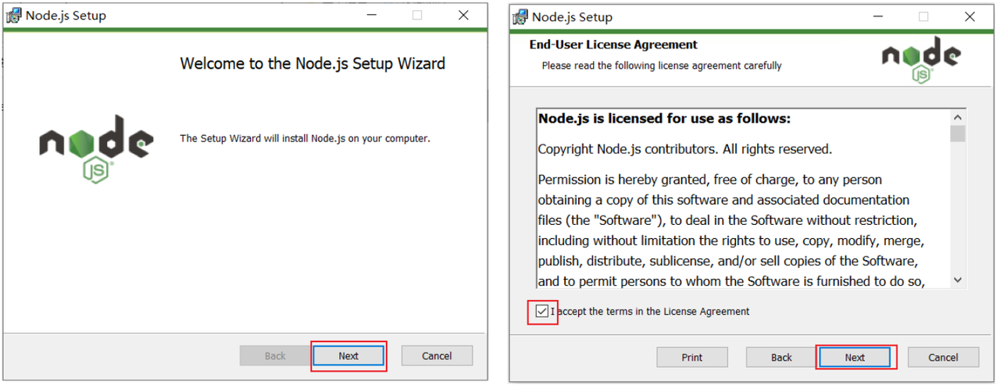
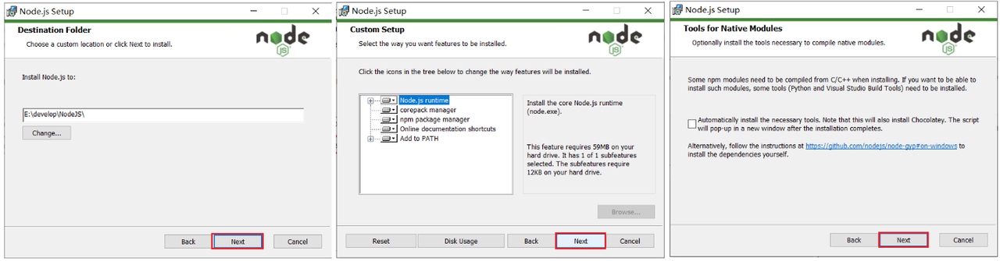

<h1 style="text-align: center;">Node.js 安装及配置</h1>

---

> <h3>官网：<a href="https://nodejs.org/en">https://nodejs.org/en</a></h3>

## 安装

#### （1）双击安装包

<br/>


#### （2）选择安装到一个，没有中文，没有空格的目录下（新建一个文件夹 NodeJS）

<br/>


#### （3）点击 Next 安装即可

<br/>


#### （4）验证 NodeJS 的环境变量

> #### NodeJS 安装完毕后，会自动配置好环境变量，我们验证一下是否安装成功，打开 cmd，执行命令 <span style="color:red;">node -v</span>

<br/>


#### （5） 配置 npm 的全局安装路径

> #### 使用<span style="color:red;">管理员身份</span>运行命令行，在命令行中，执行如下指令
>
> #### <span style="color:red;">路径需要指定为 Nodejs 的安装目录</span>

```bash
npm config set prefix "D:\develop\NodeJS"
```

#### （6）切换为淘宝镜像，加速下载

```bash
npm config set registry https://registry.npmmirror.com
```

## nvm 工具

> #### 一个用于管理多个 Node.js 版本的工具

### 安装链接

> #### https://github.com/coreybutler/nvm-windows/releases

### 安装教程

> #### 视频教程：https://www.bilibili.com/video/BV1qspxzrEWP
>
> #### CSDN：https://blog.csdn.net/weixin_45811256/article/details/130860444

### 设置镜像源

```bash
nvm node_mirror https://npmmirror.com/mirrors/node/
nvm npm_mirror https://npmmirror.com/mirrors/npm/

# 设置新镜像源
npm config set registry https://registry.npmmirror.com

# 验证是否设置成功
npm config get registry

# 清理缓存：建议清理 npm 缓存，以避免旧缓存可能引发的问题
npm cache clean --force

# 设置环境变量，在与 nvm 安装目录同级目录下的 nodejs 文件夹中新建新建 node_global 文件夹和 node_cache 文件夹
npm config set prefix "D:\node\nodejs\node_global"
npm config set cache "D:\node\nodejs\node_cache"
```

### 常用操作

```bash
nvm install 24.9.0
nvm install 18.20.4

nvm list available
nvm use 24.9.0
nvm list

nvm uninstall 18.20.4

nvm current
```

### 常见问题

> #### 安装 nvm 后 vscode 无法识别 node 等内容：https://blog.csdn.net/qq_25337221/article/details/110925181
>
> #### 设置管理员权限后启动一次 vscode 让其识别，后续可关闭该选项，若快捷方式图标发生变化，重新设置即可
