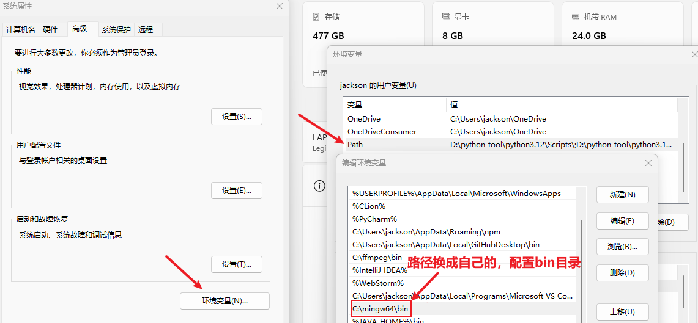
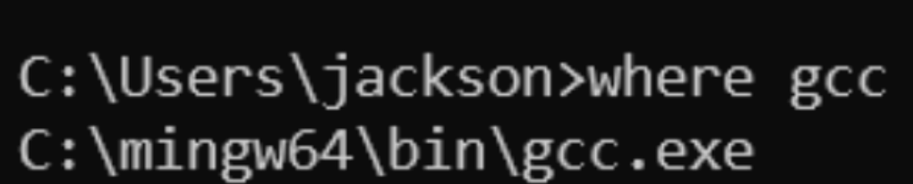
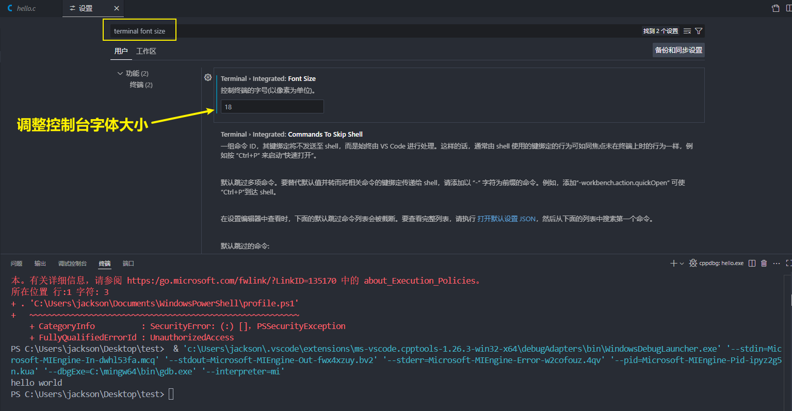
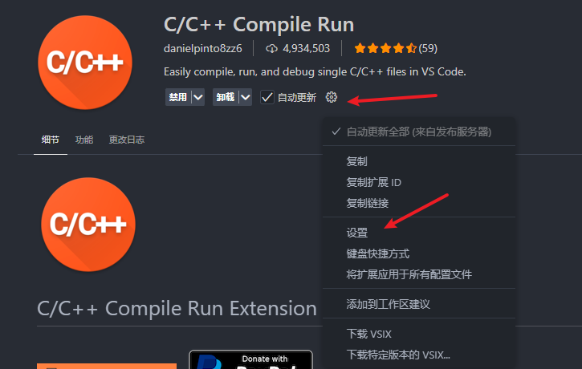
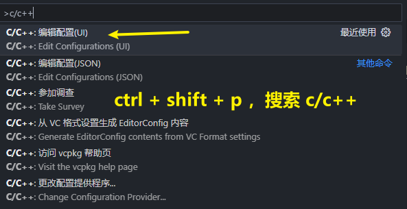
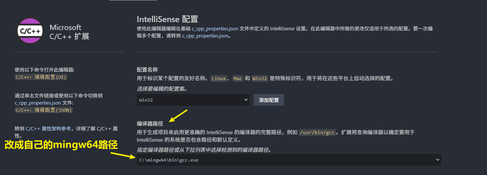
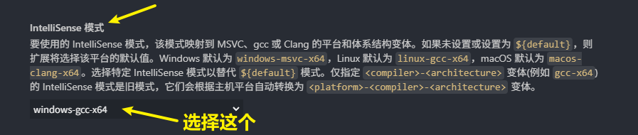
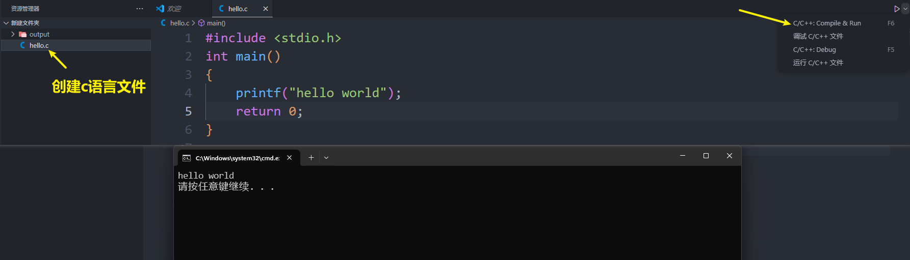
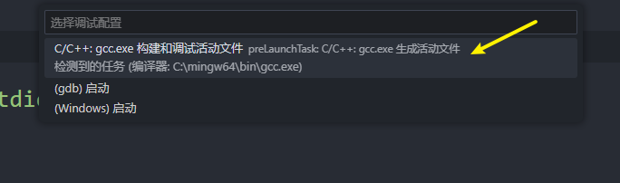
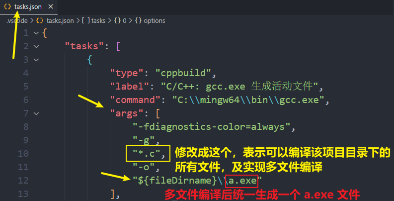

<h1 style="text-align: center; font-weight: bold;">vscode 安装及配置 </h1>

---

## ⭐ 安装包

> #### 软件安装包：<a href="https://pan.baidu.com/s/1Uq9xdDGIRQLgtodbfB1DUA?pwd=maw3" target="_blank">https://pan.baidu.com/s/1Uq9xdDGIRQLgtodbfB1DUA?pwd=maw3</a>
>
> #### VSCode 官网下载地址：<a href="https://code.visualstudio.com/" target="_blank">https://code.visualstudio.com/</a>
>
> #### mingw64 官网下载地址：<a href="https://sourceforge.net/projects/mingw-w64/" target="_blank">https://sourceforge.net/projects/mingw-w64/</a>

## 安装教程

### 配置环境变量

```bash
自己的路径/mingw64/bin
```

<br>
<div style="width: 1000px; margin: 0 auto;">
  
</div>

### 检测 gcc 配置

```bash
where gcc
```

<br>
<div style="width: 800px; margin: 0 auto;">
  
</div>

### 常见设置

> #### 设置字体：齿轮 > search > 搜索 "字体大小"
>
> #### 设置字体大小可以用滚轮控制：齿轮 > 设置 > 搜索 "Mouse Wheel Zoom"
>
> #### 设置左侧树缩进：齿轮 > 设置 > 搜索 "树缩进"
>
> #### 设置文件夹折叠：齿轮 > 设置 > 搜索 "compact" 取消第一个勾选
>
> #### 设置编码自动保存：齿轮 > 设置 > 搜索 "Auto Save"，选择为 "afterDelay"

#### 调整控制台字体大小

```bash
terminal font size
```

<br>
<div style="width: 1000px; margin: 0 auto;">
  
</div>

#### ctrl + 滚轮调整字体大小

<br>
<div style="width: 1000px; margin: 0 auto;">
  
</div>

## 配置 C/C++ 环境

### 参考视频

- 快速配置（使用插件运行）：https://www.bilibili.com/video/BV1kR4y1M7R8/?spm_id_from=333.1387.favlist.content.click&vd_source=822e86b53dab98632ef279a46d2536db
- 快速配置（传统方式运行）：https://www.bilibili.com/video/BV1tyAtetEd1/?spm_id_from=333.337.search-card.all.click
- 系统教程：https://www.bilibili.com/video/BV1356zYMEp5?spm_id_from=333.788.videopod.episodes&vd_source=822e86b53dab98632ef279a46d2536db&p=4

### 相关插件

<br>
<div style="width: 500px; margin: 0 auto;">
  
</div>

<hr/>

<h3> 设置 C/C++ Compile Run，运行结果在 <span style = "color:red;font-weight:bold"> 弹出的窗口 </span> 中显示 </h3>
<br>
<div style="width: 500px; margin: 0 auto;">
  
</div>
<br>
<div style="width: 500px; margin: 0 auto;">
  
</div>

### 配置 C/C++

<br>
<div style="width: 800px; margin: 0 auto;">
  
</div>

<br>
<div style="width: 800px; margin: 0 auto;">
  
</div>

<br>
<div style="width: 800px; margin: 0 auto;">
  
</div>

### 运行

#### 使用插件运行

<br>
<div style="width: 1000px; margin: 0 auto;">
  
</div>

#### 常规方法

<h3> 注意点：<span style = "color:red;font-weight:bold"> 项目路径不能有中文 </span>，否则运行会报错 </h3>

<br>
<div style="width: 500px; margin: 0 auto;">
  
</div>

<br>
<div style="width: 800px; margin: 0 auto;">
  
</div>

<br>
<div style="width: 1000px; margin: 0 auto;">
  
</div>

### task.json 配置文件

<br>
<div style="width: 800px; margin: 0 auto;">
  
</div>

## 多光标快捷键

### 选中多行同一位置

> #### ctrl + alt + ⬆
>
> #### ctrl + alt + ⬇

### 自定义多光标

> #### alt + 鼠标左键

## 常用插件整理

### 前端开发

> #### Chinese（Simplified） Language Pack：中文（简体）语言包
>
> #### HTML CSS Support：HTML CSS 支持
>
> #### JavaScript（ES6） code snippets：支持 ES6 语法提示
>
> #### Vue 3 Snippets 在 Vue 2 或者 Vue3：提供语法高亮和格式化
>
> #### Vue Official：一个专门为 Vue3 构建的语言支持插件
>
> #### Vetur：VScode 中的 Vue 工具插件
>
> #### Live Server：实时加载功能的小型服务器实时查看开发的网页或项目效果
>
> #### Prettier-Code formatter：代码美化格式化插件
>
> #### Mithril Emment：快速生成固定结构代码的插件
>
> #### Auto Rename Tag：自动修改标签对插件
>
> #### Auto Close Tag：自动闭合 HTML / XML 标签
>
> #### Path Intellisense：路径提示插件
>
> #### Image preview：链接图片时的图片预览插件

### 主题类

> #### One Dark Pro：主题
>
> #### One Monokai Theme：主题
>
> #### Material Icon Theme：文件图标主题

### markdown

> #### Markdown Preview Enhanced：支持文章预览
>
> #### Markdown Emoji：narkdown 支持 emoji，例如：:smille: 语法将渲染为 😄
>
> #### Markdown Auto Space：保存时自动在<span style="color:red;">数字</span>或者<span style="color:red;">英文字符</span>前后添加空格

```json
// 在 setting.json 文件中配置如下内容，表示 Markdown Auto Space 插件在保存时只对数字和英文字符在前后添加空格
"markdownAutoSpace.formatOnSave": true,
"markdownAutoSpace.formatOnDocument": false,
"markdownAutoSpace.diagnostics.enable": true,

"markdownAutoSpace.rules": {
  "MAS001": true,
  "MAS002": false,
  "MAS003": false,
  "MAS004": false,
  "MAS005": false,
  "MAS006": false,
  "MAS007": false,
  "MAS008": false,
  "MAS009": false
}
```

### 其他

> #### Chinese（Simplified）（简体中文）：中文汉化包
>
> #### Lingma-Alibaba Cloud AI Coding Assistant：通义灵码插件
>
> #### Error Lens：错误提示，警告
>
> #### CodeSnap：代码截图
>
> #### Material Icon Theme：文件图标美化
>
> #### backgroud：设置背景图片
>
> #### VSCode Animations：界面动画插件
>
> #### Custom CSS and JS Loader：动画光标配置辅助插件，配置方法见视频：https://www.bilibili.com/video/BV1XtviBkEMr
>
> #### Intellij IDEA Keybindings：IDEA 快捷键支持
>
> #### Competitive Programming Helper（cph）：提供算法测试用例
>
> #### Codex：GTP 编程助手插件（用 GPT 账号登录即可使用）

## 界面美化

### 光标跳转美化

> #### 链接一：https://www.bilibili.com/video/BV1XtviBkEMr/
>
> #### 链接二：https://www.bilibili.com/video/BV1bVeLzbE5D/

### 界面动画

> #### https://www.bilibili.com/video/BV161pneGE7o/

## setting.json 文件配置

```json
{
  "editor.fontSize": 20,
  "editor.mouseWheelZoom": true,
  "files.autoGuessEncoding": true,
  "c-cpp-compile-run.run-in-external-terminal": true,
  "editor.stickyScroll.enabled": false,
  "editor.smoothScrolling": true,
  "workbench.list.smoothScrolling": true,
  "terminal.integrated.smoothScrolling": true,
  "editor.cursorBlinking": "smooth",
  "editor.cursorSmoothCaretAnimation": "on",
  "editor.wordWrap": "on",
  "editor.acceptSuggestionOnEnter": "smart",
  "editor.suggestSelection": "recentlyUsed",
  "window.dialogStyle": "custom",
  "debug.showBreakpointsInOverviewRuler": true,
  "editor.formatOnSave": true,
  "editor.formatOnPaste": true,
  "editor.formatOnType": true,
  "editor.lineHeight": 1.8,
  "editor.tabSize": 4,
  "editor.codeActionsOnSave": {
    "source.fixAll": "explicit"
  },
  "git.confirmSync": false,
  "terminal.integrated.defaultProfile.windows": "Command Prompt",
  "chat.commandCenter.enabled": false,
  "markdown-preview-enhanced.codeBlockTheme": "auto.css",
  "markdown-preview-enhanced.previewTheme": "github-light.css",
  "markdown-preview-enhanced.revealjsTheme": "none.css",
  "explorer.compactFolders": false,
  "editor.minimap.showSlider": "always",
  "terminal.integrated.fontSize": 18,
  "liveServer.settings.donotShowInfoMsg": true,
  "[jsonc]": {
    "editor.defaultFormatter": "esbenp.prettier-vscode"
  },
  "[html]": {
    "editor.defaultFormatter": "esbenp.prettier-vscode"
  },
  "[vue]": {
    "editor.defaultFormatter": "esbenp.prettier-vscode"
  },
  "json.schemas": [],
  "[css]": {
    "editor.defaultFormatter": "vscode.css-language-features"
  },
  "vscode_custom_css.imports": [
    "file:///D:/vscode-neovide-cursor-main/neovide-cursor.js",
    "file:///c:/Users/jackson/.vscode/extensions/brandonkirbyson.vscode-animations-2.0.7/dist/updateHandler.js"
  ],
  "animations.CursorAnimation": true,
  "animations.CursorAnimationOptions": {
    "TrailLength": 8
  },
  "background.fullscreen": {
    "images": ["file:///D:/资料整理/文档整理/IDEA背景壁纸/背景图片.png"],
    "opacity": 0.65,
    "size": "cover",
    "position": "center",
    "interval": 0,
    "random": false
  },
  "workbench.colorTheme": "One Dark Pro Darker",
  "workbench.iconTheme": "material-icon-theme",
  "workbench.secondarySideBar.defaultVisibility": "visible",
  "http.systemCertificatesNode": true,
  "chatgpt.localeOverride": "zh-CN",
  "prettier.bracketSameLine": true
}
```
