<h1 style="text-align: center; font-weight: bold;"> Vue 笔记</h1>

---

<h3>官方网站：<a href="https://cn.vuejs.org" style="text-decoration:none" target="_blank">https://cn.vuejs.org</a></h3>

## 基本介绍

> #### Vue（读音 /vjuː /, 类似于 view），是一款用于<span style="color:red">构建用户界面</span>的<span style="color:red">渐进式</span>的 JavaScript <span style="color:red">框架</span>

### （1）构建用户界面

#### 构建用户界面是指，在 Vue 中，可以基于数据渲染出用户看到的界面。 那这句话什么意思呢？我们来举一个例子，比如将来服务器端返回给前端的原始数据呢，就是如下这个样子：

```json
userList: [
  { id: 1, name: "谢逊", image: "1.jpg", gender: 1, job: "班主任" },
  { id: 2, name: "韦一笑", image: "2.jpg", gender: 1, job: "班主任" },
];
```

#### 而上面的这些原始数据，用户是看不懂的。 而我们开发人员呢，可以使用 Vue 中提供的操作，将原始数据遍历、解析出来，从而渲染呈现出用户所能看懂的界面，如下所示：

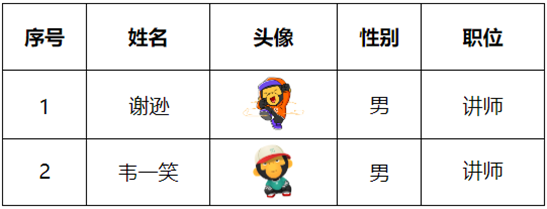

#### 那这个过程呢，就是基于数据渲染出用户看到的界面，也就是所谓的 构建用户界面。

### （2）渐进式

#### 渐进式中的渐进呢，字面意思就是 "循序渐进"。Vue 生态中的语法呢是非常多的，比如声明式渲染、组件系统、客户端路由（VueRouter）、状态管理（Vuex、Pinia）、构建工具（Webpack、Vite）等等。

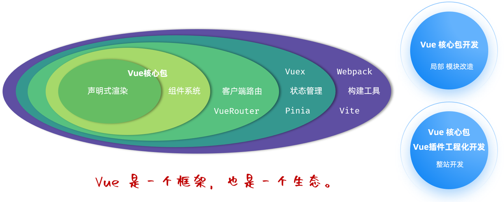

#### 所谓渐进，指的是我们使用 Vue 框架呢，我们不需要把所有的组件、语法全部学习完毕才可以使用 Vue。 而是，我们学习一点就可以使用一点了，比如：

> #### 我们学习了声明式渲染，我们就可以使用 Vue 来构建用户界面了。
>
> #### 我们再学习了组件系统，我们就可以使用 Vue 中的组件，从而来复用了。
>
> #### 我们再学习了路由 VueRouter，就可以使用 Vue 中的中的路由功能了。

#### 也就是说，并不需要全部学习完毕就可以直接使用 Vue 进行开发，简化操作、提高效率了。 Vue 是一个框架，但其实也是一个生态。

#### 那由此呢，也就引出了 Vue 中两种常见的开发模式：

> #### 基于 Vue 提供的核心包，完成项目局部模块的改造了。
>
> #### 基于 Vue 提供的核心包、插件进行工程化开发，也就是做整站开发。

### （3）框架

> #### 框架：就是一套完整的项目解决方案，用于快速构建项目 。这是我们接触的第一个框架，那在我们后面的学习中，我们还会学习很多的 java 语言中的框架，那通过这些框架呢，就可以来快速开发 java 项目，提高开发效率。
>
> #### 优点：大大提升前端项目的开发效率 。
>
> #### 缺点：需要理解记忆框架的使用规则 。（参照官网）

## 入门案例

### 实现步骤

#### （1）准备工作

> #### 准备一个 html 文件，并在其中引入 Vue 模块 （参考官方文档，复制过来即可）【注意：模块化的 js，引入时，需要设置 <span style="color:red">type="module"</span>】
>
> #### 创建 Vue 程序的应用实例，控制视图的元素
>
> #### 准备元素（div），交给 Vue 控制

#### （2）数据驱动视图

> #### 准备数据。 在创建 Vue 应用实例的时候，传入了一个 js 对象，在这个 js 对象中，我们要定义一个 data 方法，这个 data 方法的返回值就是 Vue 中的数据。
>
> #### 通过插值表达式渲染页面。 插值表达式的写法：<span style="color:red">&#123;&#123;...&#125;&#125;</span>

### 代码示例

```html
<!DOCTYPE html>
<html lang="en">
  <head>
    <meta charset="UTF-8" />
    <meta name="viewport" content="width=device-width, initial-scale=1.0" />
    <title>Document</title>
  </head>
  <body>
    <!-- 使用 id 选择器，供 vue 接管 -->
    <div id="app">
      <!-- 通过插值表达式渲染界面  -->
      <h1>{{message}}</h1>
    </div>
    <script type="module">
      // 引入vue模块
      import { createApp } from "https://unpkg.com/vue@3/dist/vue.esm-browser.js";
      // 创建Vue程序的应用实例，控制视图的元素
      createApp({
        // 创建 Vue 应用实例的时候，传入了一个js对象，在这个js对象中，我们要定义一个data方法，这个data方法的返回值就是Vue中的数据
        data() {
          return {
            message: "Hello Vue",
          };
        },
      }).mount("#app"); // mount 通过选择器来指定在 HTML 中接管的区域
    </script>
  </body>
</html>
```

### 注意事项

> #### （1）Vue 中定义数据，必须通过 data 方法来定义，<span style="color:red">data 方法返回值是一个对象</span>，在这个对象中定义数据
>
> #### （2）插值表达式中编写的变量，一定是 Vue 中定义的数据，如果插值表达式中编写了一个变量，但是在 <span style="color:red">Vue 中未定义，将会报错</span>
>
> #### （3）Vue 应用实例接管的区域是 '#app'，<span style="color:red">超出</span>这个<span style="color:red">范围</span>，就<span style="color:red">不受 Vue 控制</span>了，所以 vue 的插值表达式，一定写在 <span style="color:red">&lt;div id=&quot;app&quot;&gt;...&lt;/div&gt;</span> 的里面

## 常用指令

### v-for

#### （1）作用：<span style="color:red">列表渲染</span>，遍历容器的元素或者对象的属性

#### （2）语法

```html
<tr v-for="(item,index) in items" :key="item.id">
  {{item}}
</tr>
```

> #### items 为遍历的数组
>
> #### item 为遍历出来的元素
>
> #### index 为索引/下标，<span style="color:red">从 0 开始</span> ；可以省略，省略 index 语法： v-for = "item in items"
>
> #### key
>
> #### 作用：给元素添加的<span style="color:red">唯一标识</span>，便于 vue 进行列表项的正确排序复用，<span style="color:red">提升渲染性能</span>
>
> #### 推荐使用 id 作为 key（唯一），不推荐使用 index 作为 key（会变化，不对应）

#### （3）⚠️ 注意点

> #### 遍历的数组，<span style="color:red">必须</span>在 data 中<span style="color:red">定义</span>； 要想让哪个标签循环展示多次，就在哪个<span style="color:red">标签上</span>使用 v-for 指令
>
> #### 使用 v-for 遍历时，<span style="color:red">不可</span>在<span style="color:red">属性</span>中使用<span style="color:red">插值表达式</span>，需要使用 v-bind 指令绑定标签属性（例如对图片的遍历）

#### （4）代码示例

<details>

<summary style="font-size:18px;font-weight:bold;background-color:#D3D3D3;padding-left:20px;padding-top:10px;padding-bottom:10px;">点我查看代码</summary>

```html
<!DOCTYPE html>
<html lang="en">
  <head>
    <meta charset="UTF-8" />
    <meta name="viewport" content="width=device-width, initial-scale=1.0" />
    <title>Document</title>
    <!-- 定义表格样式 -->
    <style>
      .container {
        width: 80%;
        margin: 0 auto;
      }
      .table {
        margin-top: 200px;
        min-width: 100%;
        border-collapse: collapse;
      }
      .table td,
      .table th {
        border: 2px solid #ddd;
        padding: 8px;
        text-align: center;
      }
    </style>
  </head>
  <body>
    <!-- 挂载id，提供给vue接管 -->
    <div class="container" id="app">
      <!-- 表格：原始 HTML 标签渲染 -->
      <!-- <table class="table">
        <thead>
          <th>序号</th>
          <th>姓名</th>
          <th>性别</th>
          <th>年龄</th>
        </thead>
        <tbody>
          <tr>
            <td>李四</td>
            <td>男</td>
            <td>23</td>
          </tr>
          <tr>
            <td>李四</td>
            <td>女</td>
            <td>18</td>
          </tr>
          <tr>
            <td>王五</td>
            <td>男</td>
            <td>26</td>
          </tr>
        </tbody>
      </table> -->

      <!-- 表格：v-for 指令渲染 -->
      <table class="table">
        <thead>
          <th>序号</th>
          <th>姓名</th>
          <th>性别</th>
          <th>年龄</th>
        </thead>
        <tbody>
          <!-- 标签中使用 v-for 指令 -->
          <tr v-for="item in employeeList" :key="item.id">
            <!-- 使用插值表达式 -->
            <td>{{item.id}}</td>
            <td>{{item.name}}</td>
            <td>{{item.sex}}</td>
            <td>{{item.age}}</td>
          </tr>
        </tbody>
      </table>
    </div>

    <script type="module">
      import { createApp } from "https://unpkg.com/vue@3/dist/vue.esm-browser.js";
      createApp({
        data() {
          return {
            message: "Hello Vue",
            // 定义一个对象数组，存放员工信息（注意数组用[]，对象之间用逗号分隔）
            employeeList: [
              {
                id: 1,
                name: "张三",
                sex: "男",
                age: 23,
              },
              {
                id: 2,
                name: "李四",
                sex: "女",
                age: 18,
              },
              {
                id: 3,
                name: "王五",
                sex: "男",
                age: 26,
              },
            ],
          };
        },
      }).mount("#app");
    </script>
  </body>
</html>
```

</details>

### v-bind

#### （1）作用：动态为 HTML <span style="color:red">标签绑定</span>属性值，如设置 href，src，style 样式等。

#### （2） 语法

> #### v-bind：属性名="属性值"
>
> #### 简化写法：:属性名="属性值"（省略 v-bind）

```html
<!-- 传统写法 -->

<!-- 简化写法 -->

```

#### （3）⚠️ 注意点

> #### v-bind 所绑定的数据，必须在 data 中定义/或基于 data 中定义的数据而来

### v-if

> #### 应用场景：<span style="color:red">要么显示，要么不显示</span>，不频繁切换的场景

#### （1）语法：v-if="表达式"，表达式值为 true，显示；false，隐藏

#### （2）原理：基于条件判断，来控制创建或移除元素节点（条件渲染）

#### （3）其它：可以配合 v-else-if / v-else 进行链式调用条件判断

#### （4）⚠️ 注意点

> #### v-else-if 必须出现在 v-if 之后，可以出现多个； v-else 必须出现在 v-if/v-else-if 之后

#### 代码示例

```html
<!-- 基于v-if/v-else-if/v-else指令来展示职位这一列 -->
<td>
  <span v-if="emp.job === '1'">班主任</span>
  <span v-else-if="emp.job === '2'">讲师</span>
  <span v-else-if="emp.job === '3'">学工主管</span>
  <span v-else-if="emp.job === '4'">教研主管</span>
  <span v-else-if="emp.job === '5'">咨询师</span>
  <span v-else>其他</span>
</td>
```

### v-show

> #### 应用场景：<span style="color:red">频繁切换</span>显示隐藏的场景

#### （1）语法：v-show="表达式"，表达式值为 true，显示；false，<span style="color:red">隐藏</span>

#### （2）原理：基于 CSS 样式 <span style="color:red">display 来控制显示与隐藏</span>，对于所有使用 v-show 的元素，无论初始显示状态如何，Vue 都会在 DOM 中保留该元素，只是通过 CSS 样式来控制其显示与隐藏（通过 F12 查看界面元素可以知道）

#### 代码示例

```html
<!-- 基于v-show指令来展示职位这一列 -->
<td>
  <span v-show="emp.job === '1'">班主任</span>
  <span v-show="emp.job === '2'">讲师</span>
  <span v-show="emp.job === '3'">学工主管</span>
  <span v-show="emp.job === '4'">教研主管</span>
  <span v-show="emp.job === '5'">咨询师</span>
</td>
```

### v-model

#### （1）作用：在表单元素上使用，<span style="color:red">双向数据绑定</span>。可以方便的获取或设置表单项数据

> #### Vue 中的数据变化，会影响视图中的数据展示
>
> #### 视图中的输入的数据变化，也会影响 Vue 的数据模型

#### （2）语法：v-model="变量名"

#### （3）使用方法：在 data 返回的对象中创建数据模型（即创建一个对象，value 初始值为空，由 v-model 绑定实现动态变化

#### （4）⚠️ 注意点

> #### v-model 中绑定的变量，必须在 data 中定义

#### 代码示例

<details>

<summary style="font-size:18px;font-weight:bold;background-color:#D3D3D3;padding-left:20px;padding-top:10px;padding-bottom:10px;">点我查看代码</summary>

```html
<!DOCTYPE html>
<html lang="zh-CN">
  <head>
    <meta charset="UTF-8" />
    <meta name="viewport" content="width=device-width, initial-scale=1.0" />
    <title>Tlias智能学习辅助系统</title>
    <style>
      body {
        margin: 0;
      }

      /* 顶栏样式 */
      .header {
        display: flex;
        justify-content: space-between;
        align-items: center;
        background-color: #c2c0c0;
        padding: 20px 20px;
        box-shadow: 0 2px 5px rgba(0, 0, 0, 0.1);
      }

      /* 加大加粗标题 */
      .header h1 {
        margin: 0;
        font-size: 24px;
        font-weight: bold;
      }

      /* 文本链接样式 */
      .header a {
        text-decoration: none;
        color: #333;
        font-size: 16px;
      }

      /* 搜索表单区域 */
      .search-form {
        display: flex;
        align-items: center;
        padding: 20px;
        background-color: #f9f9f9;
      }

      /* 表单控件样式 */
      .search-form input[type="text"],
      .search-form select {
        margin-right: 10px;
        padding: 10px 10px;
        border: 1px solid #ccc;
        border-radius: 4px;
        width: 26%;
      }

      /* 按钮样式 */
      .search-form button {
        padding: 10px 15px;
        margin-left: 10px;
        background-color: #007bff;
        color: white;
        border: none;
        border-radius: 4px;
        cursor: pointer;
      }

      /* 清空按钮样式 */
      .search-form button.clear {
        background-color: #6c757d;
      }

      .table {
        min-width: 100%;
        border-collapse: collapse;
      }

      /* 设置表格单元格边框 */
      .table td,
      .table th {
        border: 1px solid #ddd;
        padding: 8px;
        text-align: center;
      }

      .avatar {
        width: 30px;
        height: 30px;
        object-fit: cover;
        border-radius: 50%;
      }

      #container {
        width: 80%;
        margin: 0 auto;
      }
    </style>
  </head>
  <body>
    <div id="container">
      <!-- 顶栏 -->
      <div class="header">
        <h1>Tlias智能学习辅助系统</h1>
        <a href="#">退出登录</a>
      </div>

      <!-- 搜索表单区域 -->
      <form class="search-form" action="#" method="post">
        <input
          type="text"
          name="name"
          placeholder="姓名"
          v-model="searchEmp.name"
        />
        <select name="gender" v-model="searchEmp.gender">
          <option value="">性别</option>
          <option value="1">男</option>
          <option value="2">女</option>
        </select>
        <select name="job" v-model="searchEmp.job">
          <option value="">职位</option>
          <option value="1">班主任</option>
          <option value="2">讲师</option>
          <option value="3">学工主管</option>
          <option value="4">教研主管</option>
          <option value="5">咨询师</option>
        </select>
        <button type="submit">查询</button>
        <button type="reset" class="clear">清空</button>
      </form>

      <table class="table table-striped table-bordered">
        <thead>
          <tr>
            <th>姓名</th>
            <th>性别</th>
            <th>头像</th>
            <th>职位</th>
            <th>入职日期</th>
            <th>最后操作时间</th>
            <th>操作</th>
          </tr>
        </thead>
        <tbody>
          <tr v-for="(emp, index) in empList" :key="index">
            <td>{{ emp.name }}</td>
            <td>{{ emp.gender === 1 ? '男' : '女' }}</td>
            <td></td>
            <td>
              <span v-if="emp.job === '1'">班主任</span>
              <span v-else-if="emp.job === '2'">讲师</span>
              <span v-else-if="emp.job === '3'">学工主管</span>
              <span v-else-if="emp.job === '4'">教研主管</span>
              <span v-else-if="emp.job === '5'">咨询师</span>
            </td>
            <td>{{ emp.entrydate }}</td>
            <td>{{ emp.updatetime }}</td>
            <td class="btn-group">
              <button class="edit">编辑</button>
              <button class="delete">删除</button>
            </td>
          </tr>
        </tbody>
      </table>

      <script type="module">
        import { createApp } from "https://unpkg.com/vue@3/dist/vue.esm-browser.js";
        createApp({
          data() {
            return {
              searchEmp: {
                name: "",
                gender: "",
                job: "",
              },
              empList: [
                {
                  id: 1,
                  name: "谢逊",
                  image:
                    "https://web-framework.oss-cn-hangzhou.aliyuncs.com/2023/4.jpg",
                  gender: 1,
                  job: "1",
                  entrydate: "2023-06-09",
                  updatetime: "2024-07-30T14:59:38",
                },
                {
                  id: 2,
                  name: "韦一笑",
                  image:
                    "https://web-framework.oss-cn-hangzhou.aliyuncs.com/2023/1.jpg",
                  gender: 1,
                  job: "1",
                  entrydate: "2020-05-09",
                  updatetime: "2023-07-01T00:00:00",
                },
                {
                  id: 3,
                  name: "黛绮丝",
                  image:
                    "https://web-framework.oss-cn-hangzhou.aliyuncs.com/2023/2.jpg",
                  gender: 2,
                  job: "2",
                  entrydate: "2021-06-01",
                  updatetime: "2023-07-01T00:00:00",
                },
              ],
            };
          },
        }).mount("#container");
      </script>
    </div>
  </body>
</html>
```

</details>

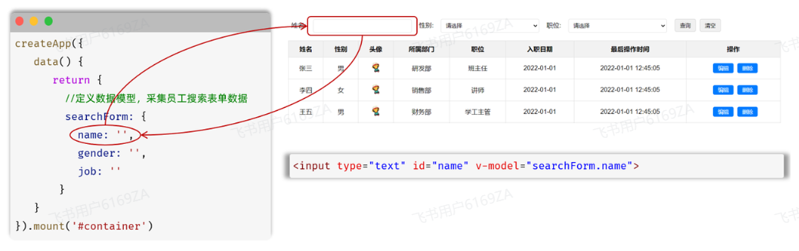

### v-on

#### （1）作用：为 html 标签绑定事件（添加时间监听）

#### （2）语法

> #### v-on:事件名="方法名"
>
> #### 简写： <span style="color:red">@</span>事件名="…"

```html
<!-- 原始写法 -->
<input type="button" value="点我一下试试" v-on:click="handle" />

<!-- 简写 -->
<input type="button" value="点我一下试试" @click="handle" />
```

#### （3）事件函数的编写

> #### 需要在 return 中定义一个 method 对象，对象中定义不同的函数用于 v-on 绑定

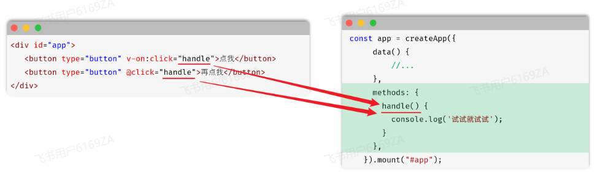

#### （4）⚠️ 注意点

> #### methods 函数中的 <span style="color:red">this</span> 指向 Vue 实例，可以通过 this 获取到 data 中定义的数据

#### 代码示例

<details>

<summary style="font-size:18px;font-weight:bold;background-color:#D3D3D3;padding-left:20px;padding-top:10px;padding-bottom:10px;">点我查看代码</summary>

```html
<!DOCTYPE html>
<html lang="zh-CN">
  <head>
    <meta charset="UTF-8" />
    <meta name="viewport" content="width=device-width, initial-scale=1.0" />
    <title>Tlias智能学习辅助系统</title>
    <style>
      body {
        margin: 0;
      }

      /* 顶栏样式 */
      .header {
        display: flex;
        justify-content: space-between;
        align-items: center;
        background-color: #c2c0c0;
        padding: 20px 20px;
        box-shadow: 0 2px 5px rgba(0, 0, 0, 0.1);
      }

      /* 加大加粗标题 */
      .header h1 {
        margin: 0;
        font-size: 24px;
        font-weight: bold;
      }

      /* 文本链接样式 */
      .header a {
        text-decoration: none;
        color: #333;
        font-size: 16px;
      }

      /* 搜索表单区域 */
      .search-form {
        display: flex;
        align-items: center;
        padding: 20px;
        background-color: #f9f9f9;
      }

      /* 表单控件样式 */
      .search-form input[type="text"],
      .search-form select {
        margin-right: 10px;
        padding: 10px 10px;
        border: 1px solid #ccc;
        border-radius: 4px;
        width: 26%;
      }

      /* 按钮样式 */
      .search-form button {
        padding: 10px 15px;
        margin-left: 10px;
        background-color: #007bff;
        color: white;
        border: none;
        border-radius: 4px;
        cursor: pointer;
      }

      /* 清空按钮样式 */
      .search-form button.clear {
        background-color: #6c757d;
      }

      .table {
        min-width: 100%;
        border-collapse: collapse;
      }

      /* 设置表格单元格边框 */
      .table td,
      .table th {
        border: 1px solid #ddd;
        padding: 8px;
        text-align: center;
      }

      .avatar {
        width: 30px;
        height: 30px;
        object-fit: cover;
        border-radius: 50%;
      }

      #container {
        width: 80%;
        margin: 0 auto;
      }
    </style>
  </head>
  <body>
    <div id="container">
      <!-- 顶栏 -->
      <div class="header">
        <h1>Tlias智能学习辅助系统</h1>
        <a href="#">退出登录</a>
      </div>

      <!-- 搜索表单区域 -->
      <form class="search-form">
        <input
          type="text"
          name="name"
          placeholder="姓名"
          v-model="searchEmp.name"
        />
        <select name="gender" v-model="searchEmp.gender">
          <option value="">性别</option>
          <option value="1">男</option>
          <option value="2">女</option>
        </select>
        <select name="job" v-model="searchEmp.job">
          <option value="">职位</option>
          <option value="1">班主任</option>
          <option value="2">讲师</option>
          <option value="3">学工主管</option>
          <option value="4">教研主管</option>
          <option value="5">咨询师</option>
        </select>
        <button type="button" @click="search">查询</button>
        <button type="button" @click="clear">清空</button>
      </form>

      <table class="table table-striped table-bordered">
        <thead>
          <tr>
            <th>姓名</th>
            <th>性别</th>
            <th>头像</th>
            <th>职位</th>
            <th>入职日期</th>
            <th>最后操作时间</th>
            <th>操作</th>
          </tr>
        </thead>
        <tbody>
          <tr v-for="(emp, index) in empList" :key="index">
            <td>{{ emp.name }}</td>
            <td>{{ emp.gender === 1 ? '男' : '女' }}</td>
            <td>
              
            </td>
            <td>
              <span v-if="emp.job === '1'">班主任</span>
              <span v-else-if="emp.job === '2'">讲师</span>
              <span v-else-if="emp.job === '3'">学工主管</span>
              <span v-else-if="emp.job === '4'">教研主管</span>
              <span v-else-if="emp.job === '5'">咨询师</span>
            </td>
            <td>{{ emp.entrydate }}</td>
            <td>{{ emp.updatetime }}</td>
            <td class="btn-group">
              <button class="edit">编辑</button>
              <button class="delete">删除</button>
            </td>
          </tr>
        </tbody>
      </table>

      <script type="module">
        import { createApp } from "https://unpkg.com/vue@3/dist/vue.esm-browser.js";
        createApp({
          data() {
            return {
              searchEmp: {
                name: "",
                gender: "",
                job: "",
              },
              empList: [
                {
                  id: 1,
                  name: "谢逊",
                  image:
                    "https://web-framework.oss-cn-hangzhou.aliyuncs.com/2023/4.jpg",
                  gender: 1,
                  job: "1",
                  entrydate: "2023-06-09",
                  updatetime: "2024-07-30T14:59:38",
                },
                {
                  id: 2,
                  name: "韦一笑",
                  image:
                    "https://web-framework.oss-cn-hangzhou.aliyuncs.com/2023/1.jpg",
                  gender: 1,
                  job: "1",
                  entrydate: "2020-05-09",
                  updatetime: "2023-07-01T00:00:00",
                },
                {
                  id: 3,
                  name: "黛绮丝",
                  image:
                    "https://web-framework.oss-cn-hangzhou.aliyuncs.com/2023/2.jpg",
                  gender: 2,
                  job: "2",
                  entrydate: "2021-06-01",
                  updatetime: "2023-07-01T00:00:00",
                },
              ],
            };
          },
          methods: {
            // 注意需要使用this
            search() {
              console.log(this.searchEmp);
            },
            clear() {
              this.searchEmp = {
                name: "",
                gender: "",
                job: "",
              };
            },
          },
        }).mount("#container");
      </script>
    </div>
  </body>
</html>
```

</details>

## Ajax

### 引入

> #### 我们前端页面中的数据，如下图所示的表格中的员工信息，应该来自于后台，那么我们的后台和前端是互不影响的 2 个程序，那么我们前端应该如何从后台获取数据呢？因为是 2 个程序，所以必须涉及到 2 个程序的交互，所以这就需要用到我们接下来学习的 Ajax 技术

### 基本介绍

> #### Ajax: 全称 Asynchronous JavaScript And XML，异步的 JavaScript 和 XML
>
> #### XML：（英语：Extensible Markup Language）可扩展标记语言，本质是一种数据格式，可以用来存储复杂的数据结构。

### 作用

#### （1）与服务器进行数据交换：通过 Ajax 可以给服务器发送请求，并获取服务器响应的数据。

> #### 前端资源被浏览器解析，但是前端页面上缺少数据，前端可以通过 Ajax 技术，向后台服务器发起请求，后台服务器接受到前端的请求，从数据库中获取前端需要的资源，然后响应给前端，前端在通过我们学习的 vue 技术，可以将数据展示到页面上，这样用户就能看到完整的页面了。此处可以对比 JavaSE 中的网络编程技术来理解

#### （2）异步交互：可以在不重新加载整个页面的情况下，与服务器交换数据并更新部分网页的技术，如：搜索联想、用户名是否可用的校验等等

> #### 当我们再百度搜索 java 时，下面的联想数据是通过 Ajax 请求从后台服务器得到的，在整个过程中，我们的 Ajax 请求不会导致整个百度页面的重新加载，并且只针对搜索栏这局部模块的数据进行了数据的更新，不会对整个页面的其他地方进行数据的更新，这样就大大提升了页面的加载速度，用户体验高

### 同步与异步

#### （1）同步：浏览器页面在发送请求给服务器，在服务器处理请求的过程中，浏览器页面不能做其他的操作。只能等到服务器响应结束后才能，浏览器页面才能继续做其他的操作

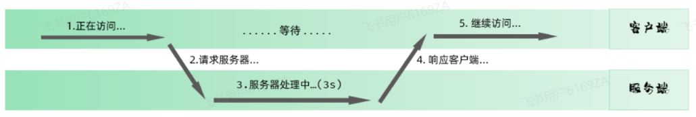

#### （2）异步： 浏览器页面发送请求给服务器，在服务器处理请求的过程中，浏览器页面还可以做其他的操作

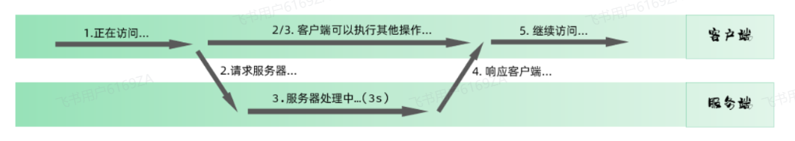

### Axios

> #### Axios 官网是：https://www.axios-http.cn
>
> #### 使用原生的 Ajax 请求的代码编写起来还是比较繁琐的，所以接下来我们学习一门更加简单的发送 Ajax 请求的技术 Axios，<span style="color: red">Axios 是对原生的 AJAX 进行封装，简化书写</span>

#### （1）axios 引入

> #### ⚠️ 注意点：需要<span style="color: red">单独定义</span>，不可定义在编写 axios 逻辑代码的 script 标签中）

```html
<script src="https://unpkg.com/axios/dist/axios.min.js"></script>
```

#### （2）入门代码示例

<details>
<summary
  style="font-size:18px;font-weight:bold;background-color:#D3D3D3;padding-left:20px;padding-top:10px;padding-bottom:10px;"
>
  点我查看代码
</summary>

```html
<!DOCTYPE html>
<html lang="en">
  <head>
    <meta charset="UTF-8" />
    <meta name="viewport" content="width=device-width, initial-scale=1.0" />
    <title>Document</title>
    <style>
      .container {
        width: 80%;
        margin-top: 250px;
        margin-left: 150px;
        height: 100px;
        border: 2px solid #000000;
      }
      .btn {
        width: 200px;
        height: 50px;
        margin-top: 25px;
        margin-left: 260px;
        background-color: rgb(191, 197, 199);
        font-size: 20px;
      }
    </style>
  </head>
  <body>
    <div class="container">
      <input
        type="button"
        value="发送请求（get请求）"
        class="btn"
        id="getData"
      />
      <input
        type="button"
        value="发送请求（post请求）"
        class="btn"
        id="postData"
      />
    </div>
    <!-- 引入 axios -->
    <script src="https://unpkg.com/axios/dist/axios.min.js"></script>
    <script>
      // 通过 id 选择器选择按钮
      // get 请求
      document.querySelector("#getData").onclick = function () {
        axios({
          url: "https://mock.apifox.cn/m1/3083103-0-default/emps/list",
          method: "get",
        })
          .then(function (res) {
            console.log(res.data);
          })
          .catch(function (err) {
            console.log(err);
          });
      };
      // post 请求
      document.querySelector("#postData").onclick = function () {
        axios({
          url: "https://mock.apifox.cn/m1/3083103-0-default/emps/list",
          method: "post",
        })
          .then((result) => {
            console.log(result.data);
          })
          .catch((err) => {
            console.log(err);
          });
      };
    </script>
  </body>
</html>
```

</details>

#### （3）请求方法别名（请求的简化写法）

<br/>
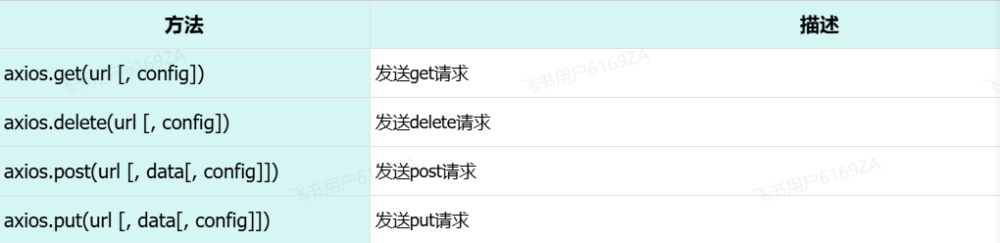

```js
// get 请求
axios
  .get("https://mock.apifox.cn/m1/3083103-0-default/emps/list")
  .then((result) => {
    console.log(result.data);
  });

// post 请求
axios
  .post("https://mock.apifox.cn/m1/3083103-0-default/emps/update", "id=1")
  .then((result) => {
    console.log(result.data);
  });
```

#### （4）案例：异步获取数据

<details>
<summary
  style="font-size:18px;font-weight:bold;background-color:#D3D3D3;padding-left:20px;padding-top:10px;padding-bottom:10px;"
>
  点我查看代码
</summary>

```html
<!DOCTYPE html>
<html lang="zh-CN">
  <head>
    <meta charset="UTF-8" />
    <meta name="viewport" content="width=device-width, initial-scale=1.0" />
    <title>Tlias智能学习辅助系统</title>
    <style>
      body {
        margin: 0;
      }

      /* 顶栏样式 */
      .header {
        display: flex;
        justify-content: space-between;
        align-items: center;
        background-color: #c2c0c0;
        padding: 20px 20px;
        box-shadow: 0 2px 5px rgba(0, 0, 0, 0.1);
      }

      /* 加大加粗标题 */
      .header h1 {
        margin: 0;
        font-size: 24px;
        font-weight: bold;
      }

      /* 文本链接样式 */
      .header a {
        text-decoration: none;
        color: #333;
        font-size: 16px;
      }

      /* 搜索表单区域 */
      .search-form {
        display: flex;
        align-items: center;
        padding: 20px;
        background-color: #f9f9f9;
      }

      /* 表单控件样式 */
      .search-form input[type="text"],
      .search-form select {
        margin-right: 10px;
        padding: 10px 10px;
        border: 1px solid #ccc;
        border-radius: 4px;
        width: 26%;
      }

      /* 按钮样式 */
      .search-form button {
        padding: 10px 15px;
        margin-left: 10px;
        background-color: #007bff;
        color: white;
        border: none;
        border-radius: 4px;
        cursor: pointer;
      }

      /* 清空按钮样式 */
      .search-form button.clear {
        background-color: #6c757d;
      }

      .table {
        min-width: 100%;
        border-collapse: collapse;
      }

      /* 设置表格单元格边框 */
      .table td,
      .table th {
        border: 1px solid #ddd;
        padding: 8px;
        text-align: center;
      }

      .avatar {
        width: 30px;
        height: 30px;
        object-fit: cover;
        border-radius: 50%;
      }

      /* 页脚版权区域 */
      .footer {
        background-color: #c2c0c0;
        color: white;
        text-align: center;
        padding: 10px 0;
        margin-top: 30px;
      }

      .footer .company-name {
        font-size: 1.1em;
        font-weight: bold;
      }

      .footer .copyright {
        font-size: 0.9em;
      }

      #container {
        width: 80%;
        margin: 0 auto;
      }
    </style>
  </head>
  <body>
    <div id="container">
      <!-- 顶栏 -->
      <div class="header">
        <h1>Tlias智能学习辅助系统</h1>
        <a href="#">退出登录</a>
      </div>

      <!-- 搜索表单区域 -->
      <form class="search-form">
        <input
          type="text"
          name="name"
          placeholder="姓名"
          v-model="searchForm.name"
        />
        <select name="gender" v-model="searchForm.gender">
          <option value="">性别</option>
          <option value="1">男</option>
          <option value="2">女</option>
        </select>
        <select name="job" v-model="searchForm.job">
          <option value="">职位</option>
          <option value="1">班主任</option>
          <option value="2">讲师</option>
          <option value="3">学工主管</option>
          <option value="4">教研主管</option>
          <option value="5">咨询师</option>
        </select>
        <button type="button" @click="search">查询</button>
        <button type="button" @click="clear">清空</button>
      </form>

      <table class="table table-striped table-bordered">
        <thead>
          <tr>
            <th>姓名</th>
            <th>性别</th>
            <th>头像</th>
            <th>职位</th>
            <th>入职日期</th>
            <th>最后操作时间</th>
            <th>操作</th>
          </tr>
        </thead>
        <tbody>
          <tr v-for="(emp, index) in empList" :key="index">
            <td>{{ emp.name }}</td>
            <td>{{ emp.gender === 1 ? '男' : '女' }}</td>
            <td>
              
            </td>

            <!-- 基于v-if/v-else-if/v-else指令来展示职位这一列 -->
            <td>
              <span v-if="emp.job == '1'">班主任</span>
              <span v-else-if="emp.job == '2'">讲师</span>
              <span v-else-if="emp.job == '3'">学工主管</span>
              <span v-else-if="emp.job == '4'">教研主管</span>
              <span v-else-if="emp.job == '5'">咨询师</span>
              <span v-else>其他</span>
            </td>

            <!-- 基于v-show指令来展示职位这一列 -->
            <!-- <td>
            <span v-show="emp.job === '1'">班主任</span>
            <span v-show="emp.job === '2'">讲师</span>
            <span v-show="emp.job === '3'">学工主管</span>
            <span v-show="emp.job === '4'">教研主管</span>
            <span v-show="emp.job === '5'">咨询师</span>
         </td> -->

            <td>{{ emp.entrydate }}</td>
            <td>{{ emp.updatetime }}</td>
            <td class="btn-group">
              <button class="edit">编辑</button>
              <button class="delete">删除</button>
            </td>
          </tr>
        </tbody>
      </table>

      <!-- 页脚版权区域 -->
      <footer class="footer">
        <p class="company-name">江苏传智播客教育科技股份有限公司</p>
        <p class="copyright">
          版权所有 Copyright 2006-2024 All Rights Reserved
        </p>
      </footer>

      <script src="https://unpkg.com/axios/dist/axios.min.js"></script>
      <script type="module">
        import { createApp } from "https://unpkg.com/vue@3/dist/vue.esm-browser.js";
        createApp({
          data() {
            return {
              searchForm: {
                name: "",
                gender: "",
                job: "",
              },
              empList: [],
            };
          },
          methods: {
            search() {
              //基于axios发送异步请求，请求https://web-server.itheima.net/emps/list，根据条件查询员工列表
              axios
                .get(
                  `https://web-server.itheima.net/emps/list?name=${this.searchForm.name}&gender=${this.searchForm.gender}&job=${this.searchForm.job}`
                )
                .then((res) => {
                  this.empList = res.data.data;
                });
            },
            clear() {
              this.searchForm = {
                name: "",
                gender: "",
                job: "",
              };
            },
          },
        }).mount("#container");
      </script>
    </div>
  </body>
</html>
```

</details>

#### （4）async、await 关键字优化

> #### 如果使用 axios 中提供的.then(function(){....}).catch(function(){....})，这种回调函数的写法，会使得代码的可读性和维护性变差。 而为了解决这个问题，我们可以使用两个关键字，分别是：<span style="color:red">async、await</span>

#### 可以通过 async、await 可以让<span style="color:red">异步变为同步操作</span>

> #### （1）async 就是来声明一个异步方法
>
> #### （2）await 是用来等待异步任务执行

#### 优化前

```js
search() {
    //基于axios发送异步请求，请求https://web-server.itheima.net/emps/list，根据条件查询员工列表
    axios.get(`https://web-server.itheima.net/emps/list?name=${this.searchForm.name}&gender=${this.searchForm.gender}&job=${this.searchForm.job}`).then(res => {
      this.empList = res.data.data
    })
  },
```

#### 优化后

> #### 修改后，<span style="color:red">代码就变成同步操作了</span>，一行一行的从前往后执行。 在前端项目开发中，经常使用这两个关键字配合，使得代码的可读性和可维护性变高

```js
async search() {
  //基于axios发送异步请求，请求https://web-server.itheima.net/emps/list，根据条件查询员工列表
  const result = await axios.get(`https://web-server.itheima.net/emps/list?name=${this.searchForm.name}&gender=${this.searchForm.gender}&job=${this.searchForm.job}`);
  this.empList = result.data.data;
},
```

## Vue 生命周期

### 基本介绍

> #### （1）vue 的生命周期：指的是 vue 对象<span style="color:red">从创建到销毁的过程</span>
>
> #### （2）vue 的生命周期包含 8 个阶段：每触发一个生命周期事件，会自动执行一个生命周期方法，这些生命周期方法也被称为<span style="color:red">钩子方法</span>

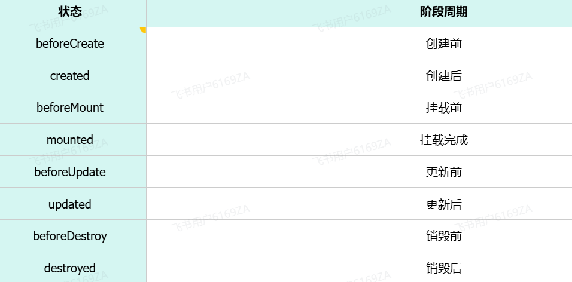

#### 下图是 Vue 官网提供的从创建 Vue 到效果 Vue 对象的整个过程及各个阶段对应的钩子函数

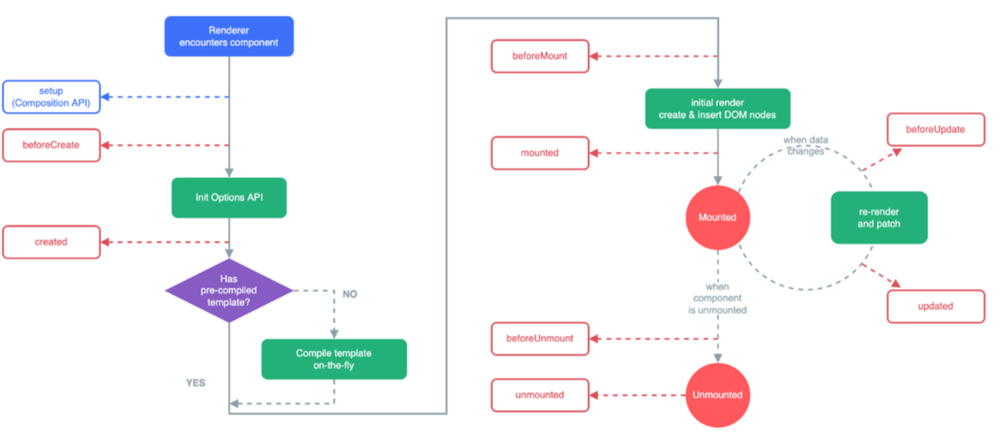

### mounted

> #### 挂载完成，Vue 初始化成功，HTML 页面渲染成功。以后我们一般用于<span style="color:red">页面初始化后实现 ajax 自动的请求后台数据</span>

#### 案例完善

```js
  methods: {
    async search() {
      //基于axios发送异步请求，请求https://web-server.itheima.net/emps/list，根据条件查询员工列表
      const result = await axios.get(`https://web-server.itheima.net/emps/list?name=${this.searchForm.name}&gender=${this.searchForm.gender}&job=${this.searchForm.job}`);
      this.empList = result.data.data;
    },
    clear() {
      this.searchForm= {
        name: '',
        gender: '',
        job: ''
      }
      this.search();
    }
  },
  mounted() {
    this.search();
  }
}).mount('#container')
```

## Vue 工程化

### 问题引入

> #### 在前面的课程中，我们学习了 HTML、CSS、JS、Axios、Vue 等技术，并基于完成了一些前端开发的案例 。我们目前的前端开发中，当我们需要使用一些资源时，例如：vue.js，和 axios.js 文件，都是直接再工程中导入的，如下图所示

<br/>
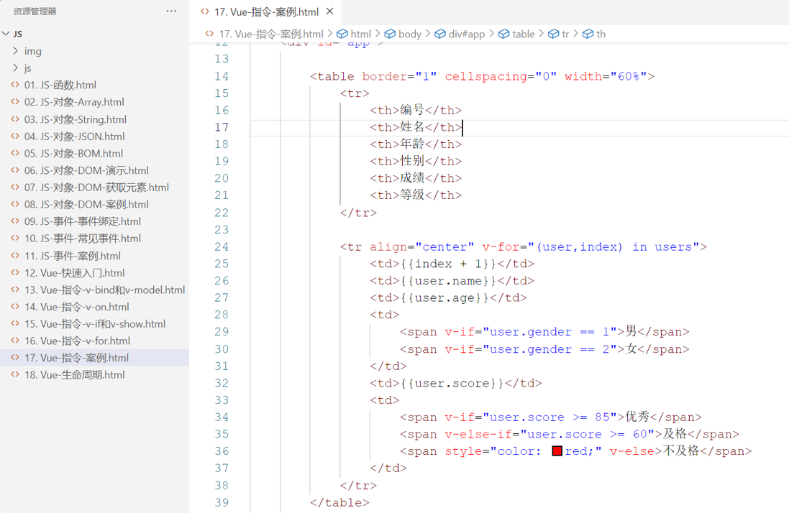

#### 但是上述开发模式存在如下问题

> #### 不规范：每次开发都是从零开始，比较麻烦
>
> #### 难复用：多个页面中的组件共用性不好
>
> #### 难维护：js、图片等资源没有规范化的存储目录，没有统一的标准，不方便维护

### 基本介绍

#### 现在企业开发中更加讲究前端工程化方式的开发，主要包括如下 4 个特点:

<br/>
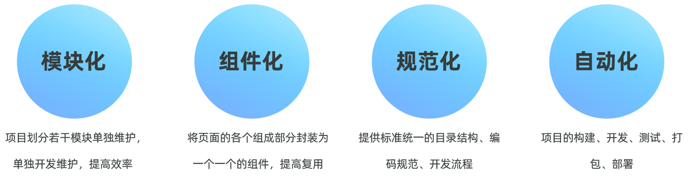

> #### 模块化：将 js 和 css 等，做成一个个可复用模块
>
> #### 组件化：我们将 UI 组件，css 样式，js 行为封装成一个个的组件，便于管理
>
> #### 规范化：我们提供一套标准的规范的目录接口和编码规范，所有开发人员遵循这套规范
>
> #### 自动化：项目的构建，测试，部署全部都是自动完成

#### 所以对于前端工程化，说白了，就是在企业级的前端项目开发中，把前端开发所需要的工具、技术、流程、经验进行规范化和标准化。从而统一开发规范、提升开发效率，降低开发难度、提高复用等等。接下来我们就需要学习 vue 的官方提供的脚手架帮我们完成前端的工程化

### 安装 Nodejs

<br/>
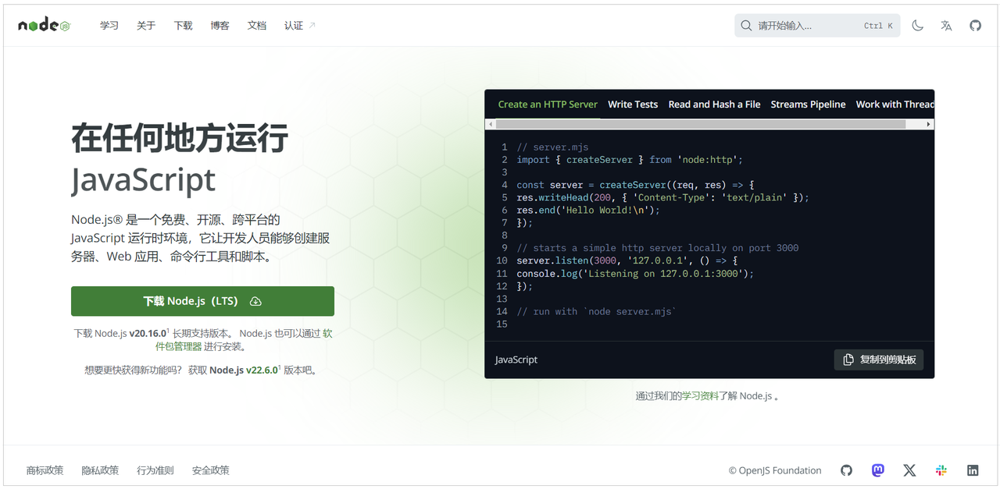

#### （1）<span style="color:red">create-vue 是 Vue 官方提供的最新的脚手架工具，用于快速生成一个工程化的 Vue 项目</span>

#### （2）create-vue 提供了如下功能

> #### 统一的目录结构
>
> #### 本地调试
>
> #### 热部署
>
> #### 单元测试
>
> #### 集成打包上线

#### 而要想使用 create-vue 来创建 vue 项目，则必须安装依赖环境：NodeJS

> #### ⭐ 具体安装过程详见前端 Nodejs 的笔记

### 什么是 npm

<br/>
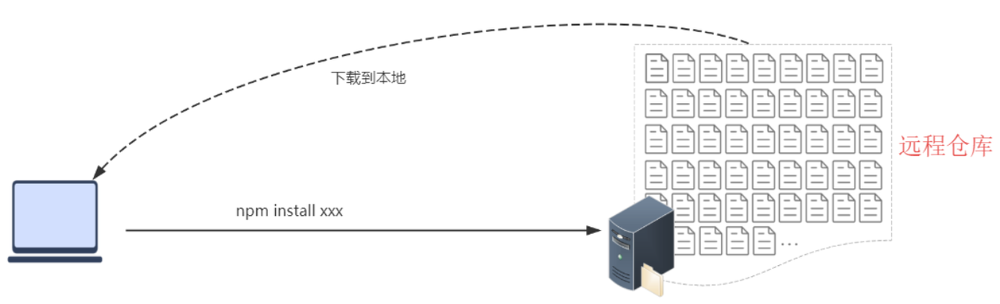

> #### npm：Node Package Manager，是 NodeJS 的<span style="color:red">软件包管理器</span>
>
> #### 在开发前端项目的过程中，我们需要<span style="color:red">相关的依赖</span>，就可以直接通过 <span style="color:red">npm install xxx</span> 命令，直接从远程仓库中将依赖直接下载到本地了

## ⭐ Vue 项目构建

### 创建项目

#### （1）执行如下指令，将会安装并执行 create-vue，它是 Vue 官方的项目脚手架工具

```bash
npm create vue@3.3.4
```

<br/>
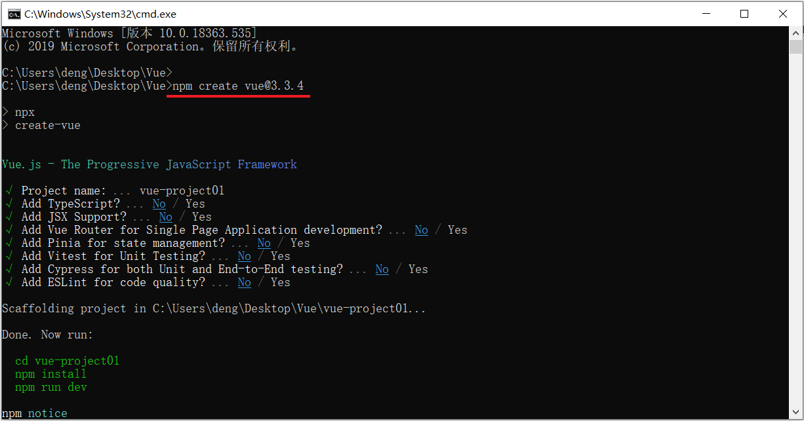

> #### Project name：-----------------> 项目名称，默认值：vue-project，可输入想要的项目名称
>
> #### Add TypeScript? ----------------> 是否加入 TypeScript 组件？默认值：No
>
> #### Add JSX Support? --------------> 是否加入 JSX 支持？默认值：No
>
> #### Add Vue Router...--------------> 是否为单页应用程序开发添加 Vue Router 路由管理组件？默认值：No
>
> #### Add Pinia ...------------------> 是否添加 Pinia 组件来进行状态管理？默认值：No
>
> #### Add Vitest ...------------------> 是否添加 Vitest 来进行单元测试？默认值：No
>
> #### Add an End-to-End ...----------> 是否添加端到端测试？默认值 No
>
> #### Add ESLint for code quality? ---> 是否添加 ESLint 来进行代码质量检查？默认值：No

#### （2）项目创建完成以后，进入项目目录，执行如下命令安装当前项目的依赖

```bash
npm install
```

<br/>
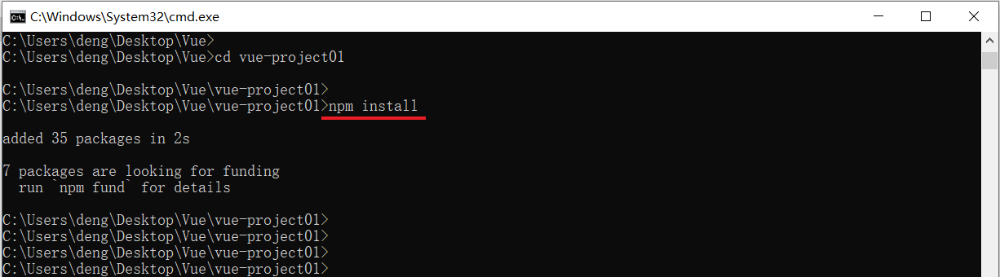

### 项目结构

> #### 在下述的目录中，我们以后操作的最多的目录，就是 src 目录，因为我们需要在这个目录下来编写前端代码

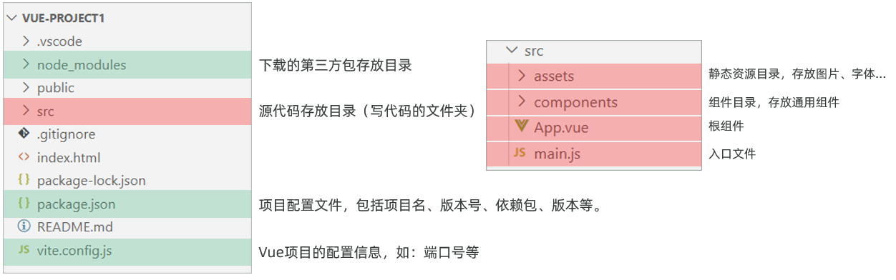
<br/>
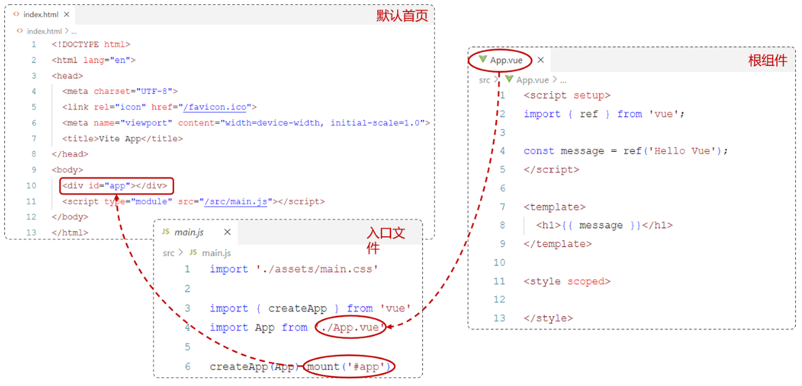

> #### 其中 \* . vue 是 Vue 项目中的组件文件，在 Vue 项目中也称为<span style="color:red">单文件组件</span>（SFC，Single-File Components）
>
> #### Vue 的单文件组件会将一个组件的逻辑 (JS)，模板 (HTML) 和样式 (CSS) 封装在同一个文件里（\* . vue）

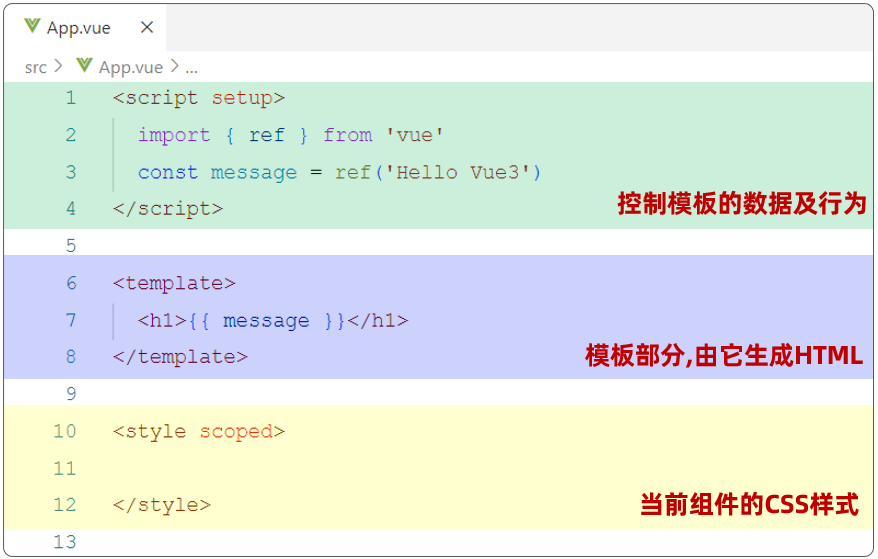

### 启动项目

#### （1）方法一：进入项目目录，执行如下命令

```bash
npm run dev
```

#### （2）方法二：用 VSCode 打开项目，使用操作面板启动项目

<br/>
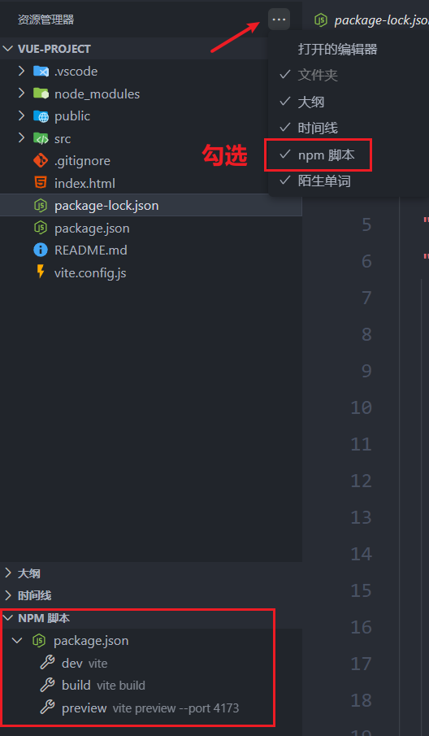

#### （3）启动效果如下

<br/>
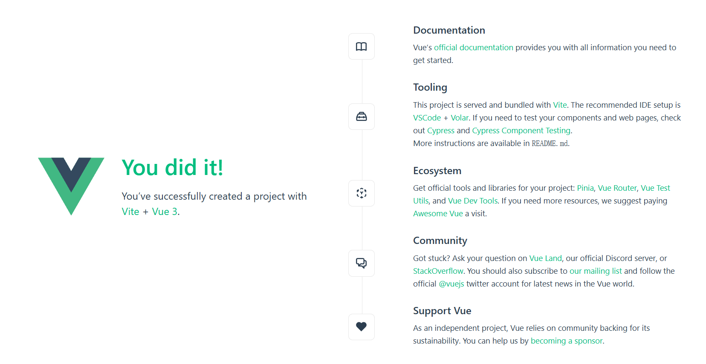

## API 风格

### ⭐ 组合式 API

> #### 是 Vue3 提供的一种基于函数的组件编写方式，通过使用函数来组织和复用组件的逻辑
>
> #### 它提供了一种更灵活、更可组合的方式来编写组件

```vue
<script setup>
import { ref, onMounted } from "vue";
const count = ref(0); //声明响应式变量

function increment() {
  //声明函数
  count.value++;
}

onMounted(() => {
  //声明钩子函数
  console.log("Vue Mounted....");
});
</script>

<template>
  <input type="button" @click="increment" /> Api Demo1 Count : {{ count }}
</template>

<style scoped></style>
```

> #### setup：是一个标识，告诉 Vue 需要进行一些处理，让我们可以更简洁的使用组合式 API
>
> #### ref()：接收一个内部值，<span style="color:red">返回一个响应式的 ref 对象</span>，此对象只有一个指向<span style="color:red">内部值的属性 value</span>
>
> #### onMounted()：在组合式 API 中的钩子方法，注册一个回调函数，在组件挂载完成后执行
>
> #### scoped：表示该样式只对当前组件有效
>
> #### ⚠️ 注意点：在 Vue 中的<span style="color:red">组合式 API</span> 使用时，是<span style="color:red">没有 this 对象</span>的，this 对象是 <span style="color:red">undefined</span>

### 选项式 API

> #### 可以用包含多个选项的对象来描述组件的逻辑，如：data，methods，mounted 等。选项定义的属性都会暴露在函数内部的 this 上，它会指向当前的组件实例

```vue
<script>
export default {
  data() {
    return {
      count: 0,
    };
  },
  methods: {
    increment: function () {
      this.count++;
    },
  },
  mounted() {
    console.log("vue mounted.....");
  },
};
</script>

<template>
  <input type="button" @click="increment" />Api Demo1 Count : {{ count }}
</template>

<style scoped></style>
```

### 案例实现

<br/>
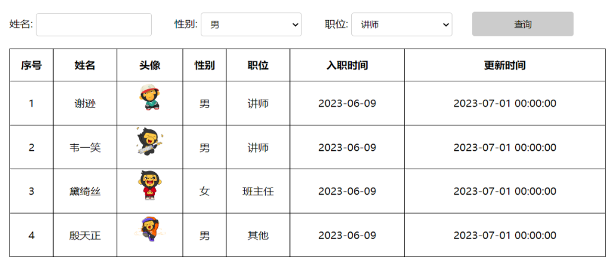

#### 在 src 下定义 views 目录，在 views 目录中定义文件 UserList.vue， 然后，我们就可以将之前实现的 Vue 案例中的代码

> #### （1） 把原来定义的 CSS 样式代码，拷贝到 &lt;style&gt;&lt;/style&gt; 标签中
>
> #### （2） 把页面的 &lt;div id="app"&gt;&lt;/div&gt; 中的页面展示的 html 标签代码，拷贝到 &lt;template&gt;&lt;/template&gt; 标签中
>
> #### （3） 将页面的 JS 代码，按照组合式 API 的形式，在 &lt;script&gt;&lt;/script&gt; 中定义出来
>
> #### （4） 而由于在这个案例中，需要用到 axios 来发送异步请求，所以还需要安装 axios

<details>
<summary style="font-size:18px;font-weight:bold;background-color:#D3D3D3;padding-left:20px;padding-top:10px;padding-bottom:10px;">
点我查看代码
</summary>

```vue
<script setup>
//引入ref
import { ref, onMounted } from "vue";
import axios from "axios";

//声明数据变量 userList, name, gender, job
const userList = ref([]);
const name = ref("");
const gender = ref("");
const job = ref("");

//声明函数,基于axios查询数据
const search = () => {
  //发送请求
  axios
    .get(
      `https://web-server.itheima.net/emps/list?name=${name.value}&gender=${gender.value}&job=${job.value}`
    )
    .then((res) => {
      //将查询到的数据赋值给userList
      userList.value = res.data.data;
    });
};

//定义钩子函数 onMounted
onMounted(() => {
  //调用search函数
  search();
});
</script>

<template>
  <div id="center">
    姓名: <input type="text" name="name" v-model="name" />

    性别:
    <select name="gender" v-model="gender">
      <option value="1">男</option>
      <option value="2">女</option>
    </select>

    职位:
    <select name="job" v-model="job">
      <option value="1">班主任</option>
      <option value="2">讲师</option>
      <option value="3">其他</option>
    </select>

    <input class="btn" type="button" value="查询" @click="search" />
  </div>

  <table>
    <tr>
      <th>序号</th>
      <th>姓名</th>
      <th>头像</th>
      <th>性别</th>
      <th>职位</th>
      <th>入职时间</th>
      <th>更新时间</th>
    </tr>

    <!-- v-for 用于列表循环渲染元素 -->
    <tr v-for="(user, index) in userList" :key="user.id">
      <td>{{ index + 1 }}</td>
      <td>{{ user.name }}</td>
      <td></td>
      <td>
        <span v-if="user.gender == 1">男</span>
        <span v-else-if="user.gender == 2">女</span>
        <span v-else>其他</span>
      </td>
      <td>
        <span v-show="user.job == 1">班主任</span>
        <span v-show="user.job == 2">讲师</span>
        <span v-show="user.job != 1 && user.job != 2">其他</span>
      </td>
      <td>{{ user.entrydate }}</td>
      <td>{{ user.updatetime }}</td>
    </tr>
  </table>
</template>

<style scoped>
table,
th,
td {
  border: 1px solid #000;
  border-collapse: collapse;
  line-height: 50px;
  text-align: center;
}

#center,
table {
  width: 60%;
  margin: auto;
}

#center {
  margin-bottom: 20px;
}

img {
  width: 50px;
}

input,
select {
  width: 17%;
  padding: 10px;
  margin-right: 30px;
  border: 1px solid #ccc;
  border-radius: 4px;
}

.btn {
  background-color: #ccc;
}
</style>
```

</details>

#### 然后在 App.vue 中，将 UserList.vue 引入进来

> #### 在 script 标签中，import 后面是引入<span style="color:red">文件的别名</span>，在 <span style="color:red">temmplate</span> 中，使用<span style="color:red">别名标签</span>就可以实现界面的渲染了

```vue
<script setup>
import UserList from "./views/user/UserList.vue";
</script>

<template>
  <UserList></UserList>
</template>

<style scoped></style>
```

## vuex 状态管理

### 基本介绍

> #### vuex 是一个专为 Vue.js 应用程序开发的状态管理库
>
> #### vuex 可以在多个组件之间<span style="color:red">共享数据</span>，并且共享的数据是响应式的，即数据的变更能及时渲染到模板
>
> #### vuex 采用集中式存储管理所有组件的状态

#### 每一个 Vuex 应用的核心就是 store（仓库），“ store ” 基本上就是一个容器，它包含着你的应用中大部分的<span style="color:red">状态 （state）</span>，Vuex 和单纯的全局对象有以下两点不同

> #### （1）Vuex 的状态存储是响应式的。当 Vue 组件从 store 中读取状态的时候，若 store 中的状态发生变化，那么相应的组件也会相应地得到高效更新
>
> #### （2）你不能直接改变 store 中的状态。改变 store 中的状态的唯一途径就是显式地<span style="color:red">提交 （commit） mutation</span>。这样使得我们可以方便地跟踪每一个状态的变化，从而让我们能够实现一些工具帮助我们更好地了解我们的应用

### 安装 vuex

```bash
npm install vuex@next --save
```

### 几个核心概念

> #### state：状态对象，集中定义各个组件共享的数据
>
> #### mutations：类似于一个事件，用于修改共享数据，要求必须是同步函数
>
> #### actions：类似于 mutation，可以包含异步操作，通过调用 mutation 来改变共享数据

### 入门案例

#### 第一步：创建带有 vuex 功能的前端项目

> #### 注：在创建的前端工程中，可以发现自动创建了 vuex 相关的文件(src/store/index.js)，并且在 main.js 中创建 Vue 实例时，需要将 store 对象传入，代码如下

```js
import Vue from "vue";
import App from "./App.vue";
import store from "./store";

Vue.config.productionTip = false;

new Vue({
  store, //使用vuex功能
  render: (h) => h(App),
}).$mount("#app");
```

#### 第二步：在 src / store / index.js 文件中集中定义和管理共享数据

```js
import Vue from "vue";
import Vuex from "vuex";
import axios from "axios";

Vue.use(Vuex);

//集中管理多个组件共享的数据
export default new Vuex.Store({
  //集中定义共享数据
  state: {
    name: "未登录游客",
  },
  getters: {},
  //通过当前属性中定义的函数修改共享数据，必须都是同步操作
  mutations: {},
  //通过actions调用mutation，在actions中可以进行异步操作
  actions: {},
  modules: {},
});
```

#### 第三步：在视图组件中展示共享数据

> #### 注意点：<span style="color:red">$store.state</span> 为固定写法，用于访问<span style="color:red">共享数据</span>

```html
<template>
  <div class="hello">
    <h1>欢迎你，{{$store.state.name}}</h1>
  </div>
</template>
```

#### 第四步：在 mutations 中定义函数，用于修改共享数据

```js
//通过当前属性中定义的函数修改共享数据，必须都是同步操作
mutations: {
  setName(state,newName) {
    state.name = newName
  }
},
```

#### 第五步：在视图组件中调用 mutations 中定义的函数

> #### 注意点：<span style="color:red">mutations 中定义的函数</span>不能直接调用，必须通过状态对象的 <span style="color:red">commit 方法来调用</span>

```vue
<template>
  <div id="app">
    欢迎你，{{ $store.state.name }}
    <input
      type="button"
      value="通过mutations修改共享数据"
      @click="handleUpdate"
    />
    <input
      type="button"
      value="调用actions中定义的函数"
      @click="handleCallAction"
    />
    
    <HelloWorld msg="Welcome to Your Vue.js App" />
  </div>
</template>

<script>
import HelloWorld from "./components/HelloWorld.vue";

export default {
  name: "App",
  components: {
    HelloWorld,
  },
  methods: {
    handleUpdate() {
      // mutations中定义的函数不能直接调用，必须通过这种方式来调用
      // setName为mutations中定义的函数名称，lisi为传递的参数
      this.$store.commit("setName", "lisi");
    },
    handleCallAction() {
      // 调用actions中定义的函数，setNameByAxios为函数名称
      this.$store.dispatch("setNameByAxios");
    },
  },
};
</script>
```

#### 第六步：如果在修改共享数据的过程中有异步操作，则需要将异步操作的代码编写在 actions 的函数中

> #### 注意点：在 actions 中定义的函数可以声明 <span style="color:red">context 参数</span>，通过此参数可以<span style="color:red">调用 mutations 中定义的函数</span>

```js
//通过actions调用mutation，在actions中可以进行异步操作
actions: {
  setNameByAxios(context){
    axios({ //异步请求
      url: '/api/admin/employee/login',
      method: 'post',
      data: {
        username: 'admin',
        password: '123456'
      }
    }).then(res => {
      if(res.data.code == 1){
        //异步请求后，需要修改共享数据
        //在actions中调用mutation中定义的setName函数
        context.commit('setName',res.data.data.name)
      }
    })
  }
},
```
