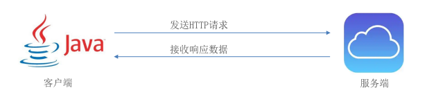
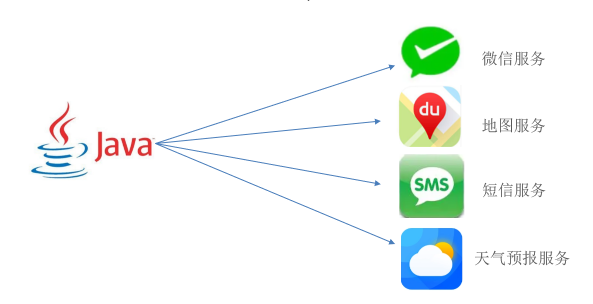
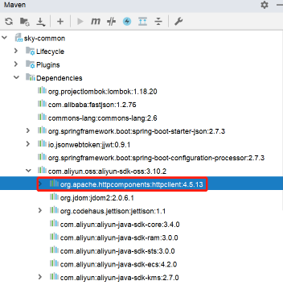

<h1 style="text-align: center;">HttpClient</h1>
 
- - -
## 基本介绍

### HttpClient 介绍

> #### HttpClient 是 Apache Jakarta Common 下的子项目，可以用来提供高效的、最新的、功能丰富的支持 HTTP 协议的客户端编程工具包，并且它支持 HTTP 协议最新的版本和建议



### HttpClient 作用

> #### 发送 HTTP 请求
>
> #### 接收响应数据

### 应用场景

> #### 当我们在使用扫描支付、查看地图、获取验证码、查看天气等功能时



> #### 其实，应用程序本身并未实现这些功能，都是在应用程序里访问提供这些功能的服务，访问这些服务需要发送 HTTP 请求，并且接收响应数据，可通过 HttpClient 来实现

### 引入依赖

```xml
<dependency>
	<groupId>org.apache.httpcomponents</groupId>
	<artifactId>httpclient</artifactId>
	<version>4.5.13</version>
</dependency>
```

#### 正常来说，首先，应该导入 HttpClient 相关的坐标，但在项目中，就算不导入，也可以使用相关的 API

#### 因为在项目中已经引入了 aliyun-sdk-oss 坐标，通过依赖传递，已经包含了 HttpClient 相关依赖

```xml
<dependency>
    <groupId>com.aliyun.oss</groupId>
    <artifactId>aliyun-sdk-oss</artifactId>
</dependency>
```



### 核心 API

> #### HttpClient：Http 客户端对象类型，使用该类型对象可发起 Http 请求
>
> #### HttpClients：可认为是构建器，可创建 HttpClient 对象
>
> #### CloseableHttpClient：实现类，实现了 HttpClient 接口
>
> #### HttpGet：Get 方式请求类型
>
> #### HttpPost：Post 方式请求类型

### 发送请求步骤

> #### （1）创建 HttpClient 对象
>
> #### （2）创建 Http 请求对象
>
> #### （3）调用 HttpClient 的 <span style="color:red">execute</span> 方法发送请求

## 入门案例

### Get 方式请求

```java
@SpringBootTest
public class HttpClient {
    @Test
    public void testGet() throws IOException {
        // 创建 com.sky.test.HttpClient 对象
        CloseableHttpClient httpClient = HttpClients.createDefault();

        // 创建请求对象
        HttpGet httpGet = new HttpGet("http://localhost:8080/user/shop/status");

        // 发送请求，接收响应结果
        CloseableHttpResponse response = httpClient.execute(httpGet);

        // 获取服务端返回的状态码
        int statusCode = response.getStatusLine().getStatusCode();
        System.out.println("服务端返回的状态码为：" + statusCode);

        HttpEntity entity = response.getEntity();
        String body = EntityUtils.toString(entity);
        System.out.println("服务端返回的数据为：" + body);

        // 关闭资源
        response.close();
        httpClient.close();
    }
}
```

### Post 方式请求

```java
@SpringBootTest
public class HttpClient {
    @Test
    public void testPost() throws IOException {
        // 创建 com.sky.test.HttpClient 对象
        CloseableHttpClient httpClient = HttpClients.createDefault();

        // 创建请求对象
        HttpPost httpPost = new HttpPost("http://localhost:8080/admin/employee/login");

        // 请求体参数
        JSONObject jsonObject = new JSONObject();
        jsonObject.put("username","admin");
        jsonObject.put("password","123456");

        // 封装请求体参数
        StringEntity entity = new StringEntity(jsonObject.toString());

        // 指定请求编码方式
        entity.setContentEncoding("utf-8");

        // 数据格式
        entity.setContentType("application/json");
        httpPost.setEntity(entity);

        // 发送请求
        CloseableHttpResponse response = httpClient.execute(httpPost);

        // 解析返回的结果
        int statusCode = response.getStatusLine().getStatusCode();
        System.out.println("响应码为：" + statusCode);

        HttpEntity entity1 = response.getEntity();
        String body = EntityUtils.toString(entity1);
        System.out.println("响应数据为：" + body);

        // 关闭资源
        response.close();
        httpClient.close();

    }
}
```
