<h1 style="text-align: center;">微信小程序入门</h1>
 
- - -

## 基本介绍

> #### 官方网址：https://mp.weixin.qq.com/cgi-bin/wx?token=&lang=zh_CN

#### 小程序主要运行微信内部，可通过上述网站来整体了解微信小程序的开发

#### 首先，在进行小程序开发时，需要先去注册一个小程序，在注册的时候，它实际上又分成了不同的注册的主体。我们可以以个人的身份来注册一个小程序，当然，也可以以企业政府、媒体或者其他组织的方式来注册小程序。那么，不同的主体注册小程序，最终开放的权限也是不一样的。比如以个人身份来注册小程序，是无法开通支付权限的。若要提供支付功能，必须是企业、政府或者其它组织等。所以，不同的主体注册小程序后，可开发的功能是不一样的

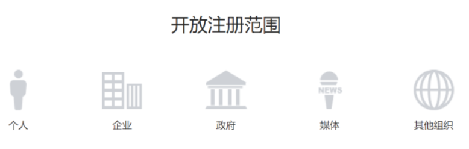

#### 然后，微信小程序我们提供的一些开发的支持，实际上微信的官方是提供了一系列的工具来帮助开发者快速的接入，并且完成小程序的开发，提供了完善的开发文档，并且专门提供了一个开发者工具，还提供了相应的设计指南，同时也提供了一些小程序体验 DEMO，可以快速的体验小程序实现的功能

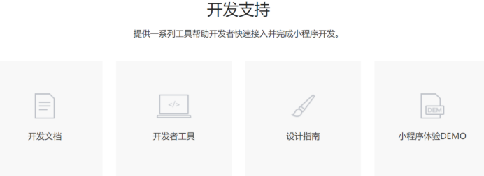

#### 最后，开发完一个小程序要上线，也给我们提供了详细地接入流程

<br/>
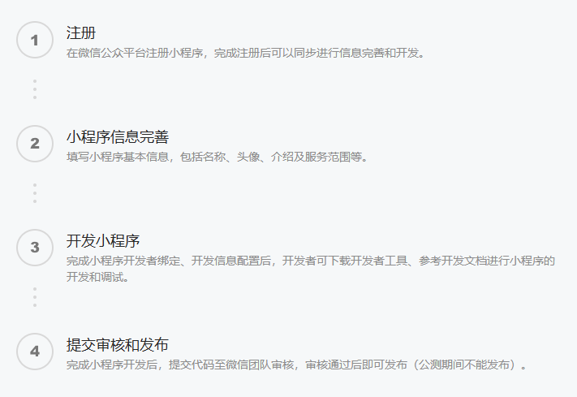

## 准备工作

### 注册小程序

> #### 注册地址：https://mp.weixin.qq.com/wxopen/waregister?action=step1

### 完善小程序信息

> #### 登录小程序后台：https://mp.weixin.qq.com/

<br/>
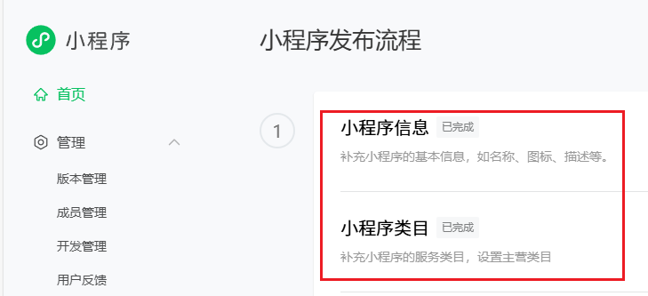

> #### 在左侧栏找到开发与服务-->开发管理，打开该界面，<span style="color:red">记录下 AppID 和 AppSecret</span>

<br/>
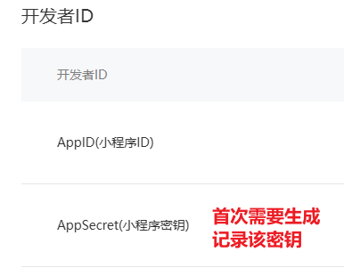

### 下载开发者工具

> #### 下载地址： https://developers.weixin.qq.com/miniprogram/dev/devtools/stable.html

<br/>
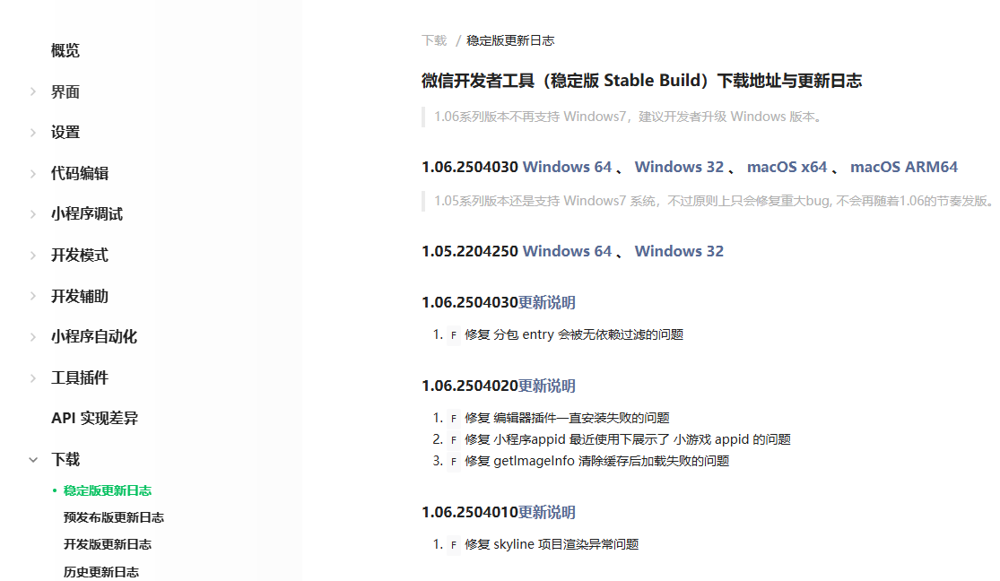

> #### 使用微信扫码登录微信开发者工具

### 创建项目

> #### 填写注册小程序的 AppID，并选择不使用云服务 --> 不使用模板

<br/>
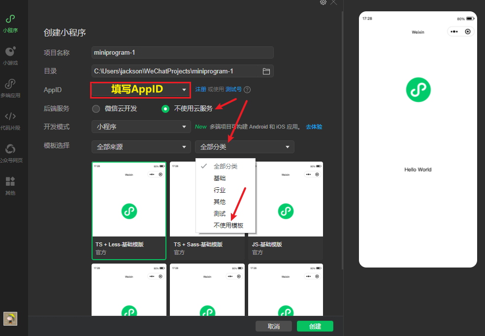
<br/>
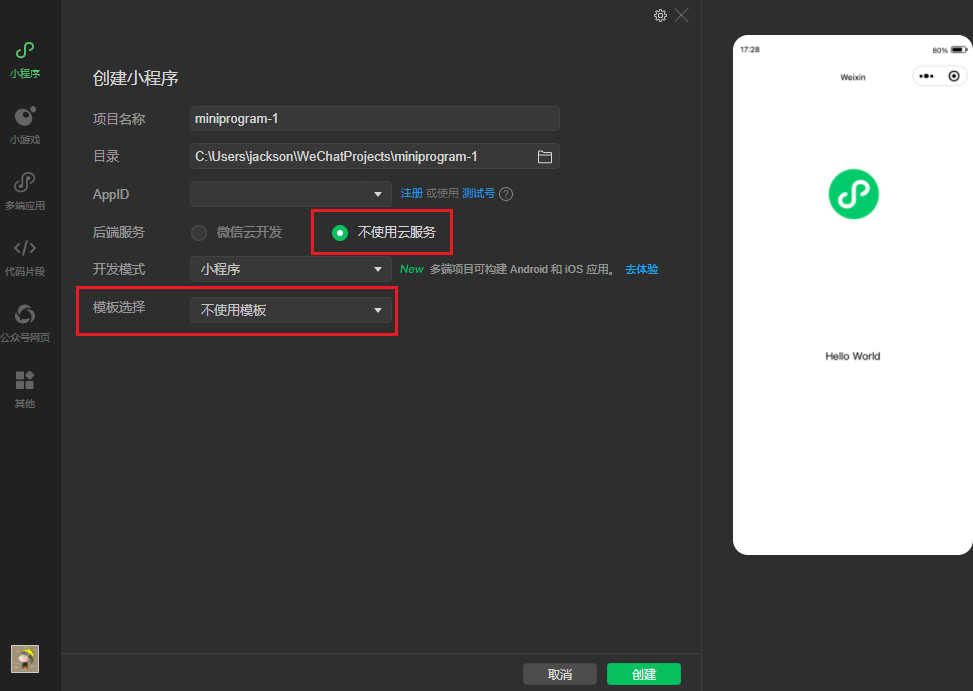

### 设置不校验合法域名

> #### 开发阶段，小程序发出请求到后端的 Tomcat 服务器，若不勾选，请求发送失败
>
> #### 在开发面板的右上角，找到如下内容并设置

<br/>
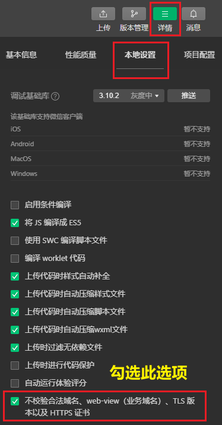

## 小程序目录结构

#### 实际上，小程序的开发本质上属于前端开发，主要使用 JavaScript 开发，咱们现在的定位主要还是在后端，所以，对于小程序开发简单了解即可

#### 小程序包含一个描述整体程序的 app 和多个描述各自页面的 page，一个小程序主体部分由三个文件组成，必须放在项目的根目录

<br/>
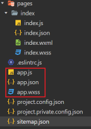

> #### app.js：必须存在，主要存放小程序的逻辑代码
>
> #### app.json：必须存在，小程序配置文件，主要存放小程序的公共配置
>
> #### app.wxss：非必须存在，主要存放小程序公共样式表，类似于前端的 CSS 样式

#### 对小程序主体三个文件了解后，其实一个小程序又有多个页面。比如说，有商品浏览页面、购物车的页面、订单支付的页面、商品的详情页面等等。那这些页面会放在哪呢？

> #### 会存放在 <span style="color:red">pages 目录</span>，每个小程序页面主要由四个文件组成

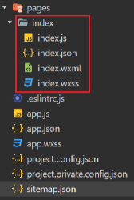

> #### js 文件：必须存在，存放页面业务逻辑代码，编写的 js 代码
>
> #### wxml 文件：必须存在，存放页面结构，主要是做页面布局，页面效果展示的，类似于 HTML 页面
>
> #### json 文件：非必须，存放页面相关的配置
>
> #### wxss 文件：非必须，存放页面样式表，相当于 CSS 文件

## 入门案例

#### （1）进入到 index.wxml，编写页面布局

```xml
<view class="container">
  <view>{{msg}}</view>
   <view>
    <button type="default" bindtap="getUserInfo">获取用户信息</button>
    <image style="width: 100px;height: 100px;" src="{{avatarUrl}}"></image>
    {{nickName}}
  </view>
   <view>
    <button type="primary" bindtap="wxlogin">微信登录</button>
    授权码：{{code}}
  </view>
   <view>
    <button type="warn" bindtap="sendRequest">发送请求</button>
    响应结果：{{result}}
  </view>
</view>
```

#### （2）进入到 index.js，编写业务逻辑代码

```js
Page({
  data: {
    msg: "hello world",
    avatarUrl: "",
    nickName: "",
    code: "",
    result: "",
  },
  getUserInfo: function () {
    wx.getUserProfile({
      desc: "获取用户信息",
      success: (res) => {
        console.log(res);
        this.setData({
          avatarUrl: res.userInfo.avatarUrl,
          nickName: res.userInfo.nickName,
        });
      },
    });
  },
  wxlogin: function () {
    wx.login({
      success: (res) => {
        console.log("授权码：" + res.code);
        this.setData({
          code: res.code,
        });
      },
    });
  },
  sendRequest: function () {
    wx.request({
      url: "http://localhost:8080/user/shop/status",
      method: "GET",
      success: (res) => {
        console.log("响应结果：" + res.data.data);
        this.setData({
          result: res.data.data,
        });
      },
    });
  },
});
```

#### （3） 编译

<br/>
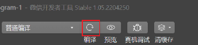

#### （4） 运行效果

<br/>
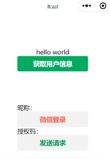

#### （5）发布小程序

> #### 在面板的右上方有上传按钮，点击后即可上传到微信服务器
>
> #### 进到微信公众平台，打开版本管理页面，此时为开发版本

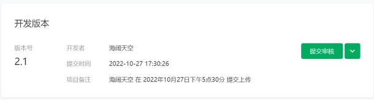

> #### 需提交审核，变成审核版本，审核通过后，进行发布，变成线上版本
>
> #### 一旦成为线上版本，这就说明小程序就已经发布上线了，微信用户就可以在微信里面去搜索和使用这个小程序了
