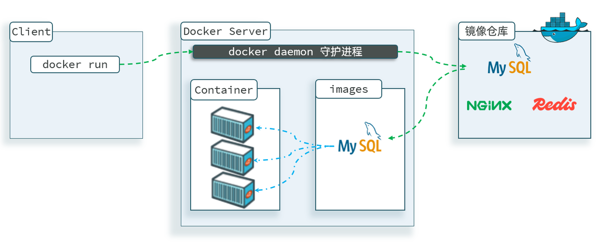

<h1 style="text-align: center;">部署 MySQL</h1>

---

## 基本概念介绍

### 镜像与容器

#### 这里下载的不是安装包，而是镜像。镜像中不仅包含了 MySQL 本身，还包含了其运行所需要的环境、配置、系统级函数库。因此它在运行时就有自己独立的环境，就可以跨系统运行，也不需要手动再次配置环境了。这套独立运行的隔离环境我们称为容器

#### 因此，Docker 安装软件的过程，就是自动搜索下载镜像，然后创建并运行容器的过程

> #### 镜像：英文是 image
>
> #### 容器：英文是 container

### 镜像仓库

#### Docker 会根据命令中的镜像名称自动搜索并下载镜像，那么问题来了，它是去哪里搜索和下载镜像的呢？这些镜像又是谁制作的呢？

#### Docker 官方提供了一个专门管理、存储镜像的网站，并对外开放了镜像上传、下载的权利。Docker 官方提供了一些基础镜像，然后各大软件公司又在基础镜像基础上，制作了自家软件的镜像，全部都存放在这个网站。这个网站就成了 Docker 镜像交流的社区：https://hub.docker.com

#### 基本上我们常用的各种软件都能在这个网站上找到，我们甚至可以自己制作镜像上传上去【但是该网站，目前国内上不去了】

#### 像这种提供存储、管理 Docker 镜像的服务器，被称为 DockerRegistry，可以翻译为镜像仓库。DockerHub 网站是官方仓库，阿里云、华为云会提供一些第三方仓库，我们也可以自己搭建私有的镜像仓库

#### 官方仓库在国外，下载速度较慢，一般我们都会使用第三方仓库提供的镜像加速功能，提高下载速度。而企业内部的机密项目，往往会采用私有镜像仓库

### 镜像来源

> #### （1）基于官方基础镜像自己制作
>
> #### （2）直接去 DockerRegistry 下载

### 总结：什么是 Docker

> #### Docker 本身包含一个后台服务，我们可以利用 Docker 命令告诉 Docker 服务，帮助我们快速部署指定的应用。Docker 服务部署应用时，首先要去搜索并下载应用对应的镜像，然后根据镜像创建并允许容器，应用就部署完成了

## MySQL 部署

### 部署命令

```bash
docker run -d \
  --name mysql \
  -p 3307:3306 \
  -e TZ=Asia/Shanghai \
  -e MYSQL_ROOT_PASSWORD=123 \
  mysql:8
```

### 实现过程分析

#### 其实，当我们执行命令后，Docker 做的第一件事情，是去自动搜索并下载了 MySQL，然后会自动运行 MySQL，我们完全不用插手，是非常方便的

#### 而且，这种安装方式你完全不用考虑运行的操作系统环境，它不仅仅在 CentOS 系统是这样，在 Ubuntu 系统、macOS 系统、甚至是装了 WSL 的 Windows 下，都可以使用这条命令来安装 MySQL

#### 要知道，不同操作系统下其安装包、运行环境是都不相同的！如果是手动安装，必须手动解决安装包不同、环境不同的、配置不同的问题！

#### 而使用 Docker，这些完全不用考虑。就是因为 Docker 会自动搜索并下载 MySQL



### 命令解读

#### （1）docker run -d ：创建并运行一个容器，-d 则是让容器以后台进程运行

#### （2）--name mysql : 给容器起个名字叫 mysql，你可以叫别的

#### （3） -p 3307:3306 : 设置端口映射。

> #### 容器是隔离环境，外界不可访问。但是可以将宿主机端口映射容器内到端口，当访问宿主机指定端口时，就是在访问容器内的端口了
>
> #### 容器内端口往往是由容器内的进程决定，例如 MySQL 进程默认端口是 3306，因此容器内端口一定是 3306；而宿主机端口则可以任意指定，一般与容器内保持一致
>
> #### 格式： -p 宿主机端口:容器内端口，示例中就是将宿主机的 3307 映射到容器内的 3306 端口

#### （4） -e TZ=Asia/Shanghai : 配置容器内进程运行时的一些参数

> #### 格式：-e KEY=VALUE，KEY 和 VALUE 都由容器内进程决定
>
> #### 案例中，TZ=Asia/Shanghai 是设置时区；MYSQL_ROOT_PASSWORD=<span style="color:red">123</span> 是设置 MySQL 默认密码

#### （5） mysql:8 : 设置镜像名称，Docker 会根据这个名字搜索并下载镜像

> #### 格式：REPOSITORY:TAG，例如 mysql:8.0，其中 REPOSITORY 可以理解为镜像名，TAG 是版本号
>
> #### 在未指定 TAG 的情况下，默认是最新版本，也就是 mysql:latest

### 注意事项

> #### （1）镜像的名称不是随意的，而是要到 DockerRegistry 中寻找，镜像运行时的配置也不是随意的，要参考镜像的帮助文档，这些在 DockerHub 网站或者软件的官方网站中都能找到
>
> #### （2）如果我们要安装其它软件，也可以到 DockerRegistry 中寻找对应的镜像名称和版本，阅读相关配置即可
