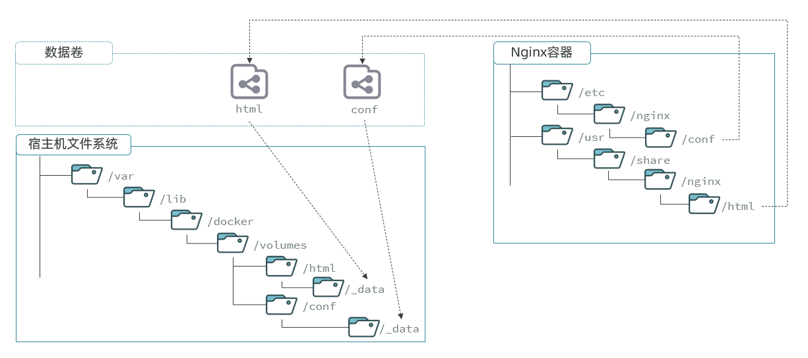
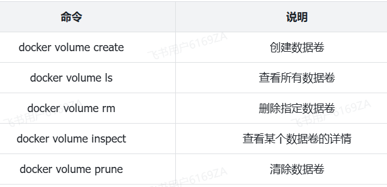

<h1 style="text-align: center;">数据卷</h1>

---

## 问题引入

#### 容器是隔离环境，容器内程序的文件、配置、运行时产生的容器都在容器内部，我们要读写容器内的文件非常不方便。大家思考几个问题

> #### 如果要升级 MySQL 版本，需要销毁旧容器，那么数据岂不是跟着被销毁了？
>
> #### MySQL、Nginx 容器运行后，如果我要修改其中的某些配置该怎么办？
>
> #### 我想要让 Nginx 代理我的静态资源怎么办？

#### 因此，容器提供程序的运行环境，但是 程序运行产生的数据、程序运行依赖的配置都应该与容器解耦

## 基本介绍

> #### 数据卷（volume）是一个<span style="color: red;">虚拟目录</span>虚拟目录，是容器内目录与宿主机目录之间映射的桥梁

#### 以 Nginx 为例，我们知道 Nginx 中有两个关键的目录

#### （1）html：放置一些静态资源

#### （2）conf：放置配置文件

> #### 如果我们要让 Nginx 代理我们的静态资源，最好是放到 html 目录；如果我们要修改 Nginx 的配置，最好是找到 conf 下的 nginx.conf 文件
>
> #### 但遗憾的是，容器运行的 Nginx 所有的文件都在容器内部。所以我们必须利用数据卷将两个目录与宿主机目录关联，方便我们操作

## 映射与挂载

### 基本介绍



#### 在上图中

> #### 我们创建了两个数据卷：conf、html
>
> #### Nginx 容器内部的 conf 目录和 html 目录分别与两个数据卷关联。
>
> #### 而数据卷 conf 和 html 分别指向了宿主机的/var/lib/docker/volumes/conf/\_data 目录和/var/lib/docker/volumes/html/\_data 目录

#### 这样一来，容器内的 conf 和 html 目录就 与宿主机的 conf 和 html 目录关联起来，我们称为<span style="color: red;">挂载</span>

#### 此时，我们操作宿主机的/var/lib/docker/volumes/html/\_data 就是在操作容器内的/usr/share/nginx/html/\_data 目录。只要我们将静态资源放入宿主机对应目录，就可以被 Nginx 代理了

### 注意事项

> #### /var/lib/docker/volumes 这个目录就是默认的存放所有容器数据卷的目录，其下再根据数据卷名称创建新目录，格式为/数据卷名/\_data

#### 为什么不让容器目录直接指向宿主机目录呢？

> #### 因为直接指向宿主机目录就与宿主机强耦合了，如果切换了环境，宿主机目录就可能发生改变了。由于容器一旦创建，目录挂载就无法修改，这样容器就无法正常工作了
>
> #### 但是容器指向数据卷，一个逻辑名称，而数据卷再指向宿主机目录，就不存在强耦合。如果宿主机目录发生改变，只要改变数据卷与宿主机目录之间的映射关系即可

#### 不过，我们通过由于数据卷目录比较深，不好寻找，通常我们也允许让容器直接与宿主机目录挂载而不使用数据卷，具体参考本节挂载部分的笔记

## 常用命令

### 基本介绍

<br/>


### Nginx 案例演示

> #### 演示一下 nginx 的 html 目录挂载

```bash
# 1.首先创建容器并指定数据卷，注意通过 -v 参数来指定数据卷
docker run -d --name nginx -p 80:80 -v html:/usr/share/nginx/html nginx:1.20.2

# 2.然后查看数据卷
docker volume ls


# 3.查看数据卷详情
docker volume inspect html


# 4.查看/var/lib/docker/volumes/html/_data目录
ll /var/lib/docker/volumes/html/_data


# 5.进入该目录，并随意修改index.html内容
cd /var/lib/docker/volumes/html/_data
vi index.html

# 6.打开页面，查看效果

# 7.进入容器内部，查看/usr/share/nginx/html目录内的文件是否变化
docker exec -it nginx bash
```

### MysSQL 案例演示

> #### 演示一下 MySQL 的匿名数据卷

```bash
# 1.查看MySQL容器详细信息
docker inspect mysql

# 关注其中.Config.Volumes部分和.Mounts部分
```

#### 我们关注两部分内容，第一是.Config.Volumes 部分

```bash
{
  "Config": {
    // ... 略
    "Volumes": {
      "/var/lib/mysql": {}
    }
    // ... 略
  }
}
```

#### 可以发现这个容器声明了一个本地目录，需要挂载数据卷，但是数据卷未定义。这就是<span style="color:red">匿名卷</span>

#### 然后，我们再看结果中的 . Mounts 部分

```json
{
  "Mounts": [
    {
      "Type": "volume",
      "Name": "29524ff09715d3688eae3f99803a2796558dbd00ca584a25a4bbc193ca82459f",
      "Source": "/var/lib/docker/volumes/29524ff09715d3688eae3f99803a2796558dbd00ca584a25a4bbc193ca82459f/_data",
      "Destination": "/var/lib/mysql",
      "Driver": "local"
    }
  ]
}
```

#### 可以发现，其中有几个关键属性

> #### Name：数据卷名称。由于定义容器未设置容器名，这里的就是匿名卷自动生成的名字，一串 hash 值。
>
> #### Source：宿主机目录
>
> #### Destination : 容器内的目录

#### 上述配置是将容器内的/var/lib/mysql 这个目录，与数据卷 29524ff09715d3688eae3f99803a2796558dbd00ca584a25a4bbc193ca82459f 挂载

#### 于是在宿主机中就有了 /var/lib/docker/volumes/29524ff09715d3688eae3f99803a2796558dbd00ca584a25a4bbc193ca82459f/\_data 这个目录。这就是匿名数据卷对应的目录，其使用方式与普通数据卷没有差别

#### 接下来，可以查看该目录下的 MySQL 的 data 文件

```shell
ls -l /var/lib/docker/volumes/29524ff09715d3688eae3f99803a2796558dbd00ca584a25a4bbc193ca82459f/_data
```

#### 注意：每一个不同的镜像，将来创建容器后内部有哪些目录可以挂载，可以参考 DockerHub 对应的页面

## 挂载本地目录或文件

### 基本介绍

> #### 可以发现，数据卷的目录结构较深，如果我们去操作数据卷目录会不太方便。在很多情况下，我们会直接将容器目录与宿主机指定目录挂载。挂载语法与数据卷类似

```bash
# 挂载本地目录
-v 本地目录:容器内目录

# 挂载本地文件
-v 本地文件:容器内文件
```

### ⚠️ 注意事项

> #### <span style="color:red">本地目录或文件必须以 / 或 ./开头，如果直接以名字开头，会被识别为数据卷名而非本地目录名</span>

```bash
-v mysql:/var/lib/mysql # 会被识别为一个数据卷叫mysql，运行时会自动创建这个数据卷

-v ./mysql:/var/lib/mysql # 会被识别为当前目录下的mysql目录，运行时如果不存在会创建目录
```

### 案例演示

#### 删除并重新创建 mysql 容器，并完成本地目录挂载

> #### 挂载/root/mysql/data 到容器内的/var/lib/mysql 目录
>
> #### 挂载/root/mysql/init 到容器内的/docker-entrypoint-initdb.d 目录（初始化的 SQL 脚本目录）
>
> #### 挂载/root/mysql/conf 到容器内的/etc/mysql/conf.d 目录（这个是 MySQL 配置文件目录）

#### 在课前资料中已经准备好了 mysql 的 init 目录、conf 目录、data 目录，可以直接将其上传到 Linux 服务器中的 /root/mysql 目录下

#### 最终执行的指令如下

```bash
docker run -d \
--name mysql \
-p 3307:3306 \
-e MYSQL_ROOT_PASSWORD=123 \
-e TZ=Asia/Shanghai \
-v /root/mysql/data:/var/lib/mysql \
-v /root/mysql/init:/docker-entrypoint-initdb.d \
-v /root/mysql/conf:/etc/mysql/conf.d \
mysql:8
```
