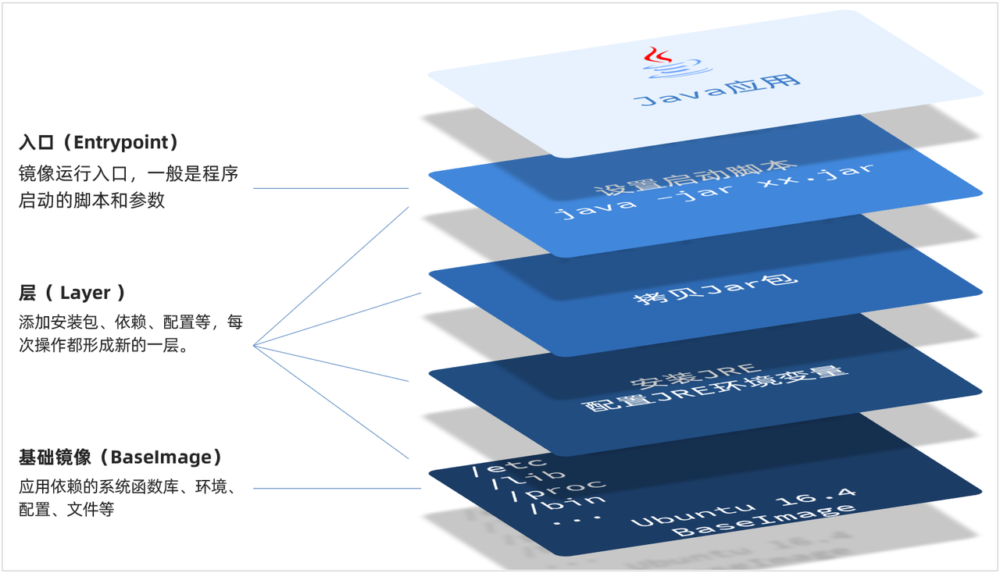
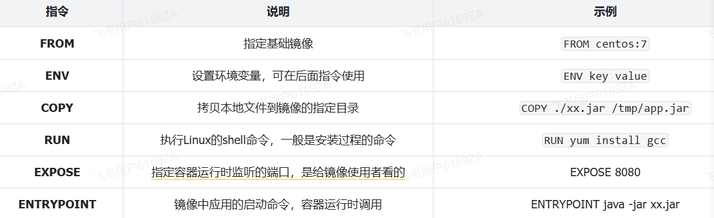

<h1 style="text-align: center;">自定义镜像</h1>

---

## 基本介绍

> #### 之前我们说过，镜像之所以能让我们快速跨操作系统部署应用而忽略其运行环境、配置，就是因为镜像中包含了程序运行需要的系统函数库、环境、配置、依赖
>
> #### <span style="color:red">自定义镜像本质就是依次准备好程序运行的基础环境、依赖、应用本身、运行配置等文件，并且打包而成</span>

## 镜像结构

#### 举个例子，我们要从 0 部署一个 Java 应用，大概流程是这样

> #### 准备一个 linux 服务（CentOS 或者 Ubuntu 均可）
>
> #### 安装并配置 JDK
>
> #### 上传 Jar 包
>
> #### 运行 jar 包

#### 那因此，我们打包镜像也是分成这么几步

> #### 准备 Linux 运行环境（java 项目并不需要完整的操作系统，仅仅是基础运行环境即可）
>
> #### 安装并配置 JDK
>
> #### 拷贝 jar 包
>
> #### 配置启动脚本

#### 上述步骤中的每一次操作其实都是在生产一些文件（系统运行环境、函数库、配置最终都是磁盘文件），所以镜像就是一堆文件的集合

#### 但需要注意的是，镜像文件不是随意堆放的，而是按照操作的步骤分层叠加而成，每一层形成的文件都会单独打包并标记一个唯一 id，称为 Layer（层）。这样，如果我们构建时用到的某些层其他人已经制作过，就可以直接拷贝使用这些层，而不用重复制作

#### 例如，第一步中需要的 Linux 运行环境，通用性就很强，所以 Docker 官方就制作了这样的只包含 Linux 运行环境的镜像。我们在制作 java 镜像时，就无需重复制作，直接使用 Docker 官方提供的 CentOS 或 Ubuntu 镜像作为基础镜像。然后再搭建其它层即可，这样逐层搭建，最终整个 Java 项目的镜像结构如图所示

<br/>


## Dockerfile

### 基本介绍

> #### 由于制作镜像的过程中，需要逐层处理和打包，比较复杂，所以 Docker 就提供了自动打包镜像的功能。我们只需要将打包的过程，每一层要做的事情用固定的语法写下来，交给 Docker 去执行即可。而这种记录镜像结构的文件就称为 Dockerfile

### 常用命令

<br/>


### 文件案例

> #### 例如，要基于 centos:7 镜像来构建一个 Java 应用，其 Dockerfile 内容如下

```bash
# 使用 CentOS 7 作为基础镜像
FROM centos:7

# 添加 JDK 到镜像中
COPY jdk17.tar.gz /usr/local/
RUN tar -xzf /usr/local/jdk17.tar.gz -C /usr/local/ &&  rm /usr/local/jdk17.tar.gz

# 设置环境变量
ENV JAVA_HOME=/usr/local/jdk-17.0.10
ENV PATH=$JAVA_HOME/bin:$PATH

# 创建应用目录
RUN mkdir -p /app
WORKDIR /app

# 复制应用 JAR 文件到容器
COPY app.jar app.jar

# 暴露端口
EXPOSE 8080

# 运行命令
ENTRYPOINT ["java","-Djava.security.egd=file:/dev/./urandom","-jar","/app/app.jar"]
```

#### Dockerfile 文件编写好了之后，就可以使用如下命令来构建镜像了

```bash
docker build -t 镜像名 .
```
