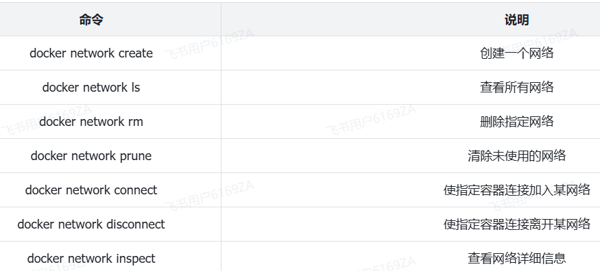

<h1 style="text-align: center;">网络</h1>

---

## 基本介绍

#### 容器之间能否互相访问呢？我们来测试一下

#### 首先，我们查看下 MySQL 容器的详细信息，重点关注其中的网络 IP 地址

```bash
# 1.用基本命令，寻找Networks.bridge.IPAddress属性
docker inspect mysql

# 也可以使用format过滤结果
docker inspect --format='{{range .NetworkSettings.Networks}}{{println .IPAddress}}{{end}}' mysql

# 得到IP地址如下：
172.17.0.2

# 2.然后通过命令进入dd容器
docker exec -it dd bash

# 3.在容器内，通过ping命令测试网络
ping 172.17.0.2

# 结果
PING 172.17.0.2 (172.17.0.2) 56(84) bytes of data.
64 bytes from 172.17.0.2: icmp_seq=1 ttl=64 time=0.053 ms
64 bytes from 172.17.0.2: icmp_seq=2 ttl=64 time=0.059 ms
64 bytes from 172.17.0.2: icmp_seq=3 ttl=64 time=0.058 ms
```

#### 发现可以互联，没有问题

#### 但是，容器的网络 IP 其实是一个虚拟的 IP，其值并不固定与某一个容器绑定，如果我们在开发时写死某个 IP，而在部署时很可能 MySQL 容器的 IP 会发生变化，连接会失败

## 常用命令



## 自定义网络案例

```bash
# 1.首先通过命令创建一个网络
docker network create itheima

# 2.然后查看网络
docker network ls

# 结果：
NETWORK ID     NAME      DRIVER    SCOPE
639bc44d0a87   bridge    bridge    local
403f16ec62a2   itheima     bridge    local
0dc0f72a0fbb   host      host      local
cd8d3e8df47b   none      null      local
# 其中，除了itheima以外，其它都是默认的网络


# 3.让 myapp 和 mysql 都加入该网络
# 3.1.mysql容器，加入 itheima 网络
docker network connect itheima mysql

# 3.2.myapp容器，也就是我们的java项目, 加入 itheima 网络
docker network connect itheima myapp


# 4.进入dd容器，尝试利用别名访问db
# 4.1.进入容器
docker exec -it myapp bash

# 4.2.用容器名访问
ping mysql

# 结果：
PING mysql (172.18.0.2) 56(84) bytes of data.
64 bytes from mysql.itheima (172.18.0.2): icmp_seq=1 ttl=64 time=0.044 ms
64 bytes from mysql.itheima (172.18.0.2): icmp_seq=2 ttl=64 time=0.054 ms
```
