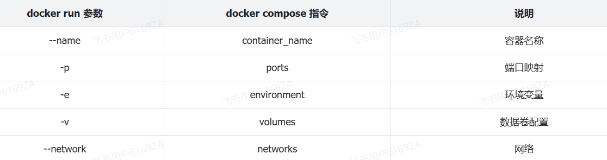
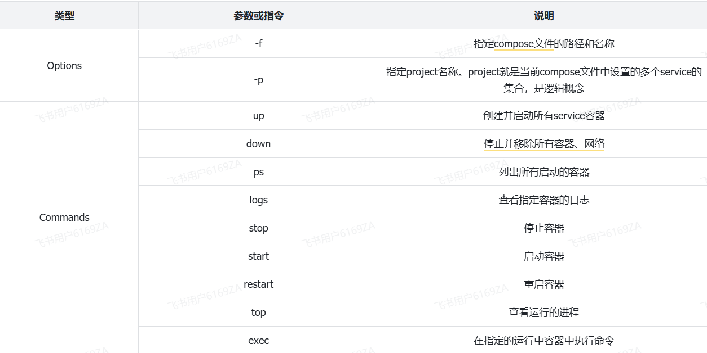

<h1 style="text-align: center;">DockerCompose</h1>

---

## 问题引入

#### 大家可以看到，我们部署一个简单的 java 项目，其中包含 3 个容器

> #### MySQL
>
> #### Nginx
>
> #### Java 项目

#### 而稍微复杂的项目，其中还会有各种各样的其它中间件，需要部署的东西远不止 3 个。如果还像之前那样手动的逐一部署，就太麻烦了

#### 而 Docker Compose 就可以帮助我们实现多个相互关联的 Docker 容器的快速部署。它允许用户通过一个单独的 docker-compose.yml 模板文件（YAML 格式）来定义一组相关联的应用容器

## 基本语法

#### docker-compose 文件中可以定义多个相互关联的应用容器，每一个应用容器被称为一个服务（service）。由于 service 就是在定义某个应用的运行时参数，因此与 docker run 参数非常相似

#### 举例来说，用 docker run 部署 MySQL 的命令如下

```bash
docker run -d \
--name nginx-tlias \
-p 80:80 \
-v /usr/local/app/html:/usr/share/nginx/html \
-v /usr/local/app/conf/nginx.conf:/etc/nginx/nginx.conf \
--network itheima \
nginx:1.20.2
```

#### 如果用 docker-compose.yml 文件来定义，就是这样

```yml
services:
  mysql:
    image: "nginx:1.20.2"
    container_name: nginx-tlias
    ports:
      - "80:80"
    volumes:
      - "/usr/local/app/html:/usr/share/nginx/html"
      - "/usr/local/app/conf/nginx.conf:/etc/nginx/nginx.conf"
    networks:
      - itheima
networks:
  itheima:
    name: itheima
```

## 命令对比



## docker-compose 文件模板

```yml
services:
  mysql:
    image: mysql:8
    container_name: mysql
    ports:
      - "3307:3306"
    environment:
      TZ: Asia/Shanghai
      MYSQL_ROOT_PASSWORD: 123
    volumes:
      - "/usr/local/app/mysql/conf:/etc/mysql/conf.d"
      - "/usr/local/app/mysql/data:/var/lib/mysql"
      - "/usr/local/app/mysql/init:/docker-entrypoint-initdb.d"
    networks:
      - tlias-net
  tlias:
    build:
      context: .
      dockerfile: Dockerfile
    container_name: tlias-server
    ports:
      - "8080:8080"
    networks:
      - tlias-net
    depends_on:
      - mysql
  nginx:
    image: nginx:1.20.2
    container_name: nginx
    ports:
      - "80:80"
    volumes:
      - "/usr/local/app/nginx/conf/nginx.conf:/etc/nginx/nginx.conf"
      - "/usr/local/app/nginx/html:/usr/share/nginx/html"
    depends_on:
      - tlias
    networks:
      - tlias-net
networks:
  tlias-net:
    name: itheima
```

## 常用命令

#### 编写好 docker-compose.yml 文件，就可以部署项目了。语法如下

```bash
docker compose [OPTIONS] [COMMAND]
```

#### 其中，OPTIONS 和 COMMAND 都是可选参数，比较常见的有

<br/>

