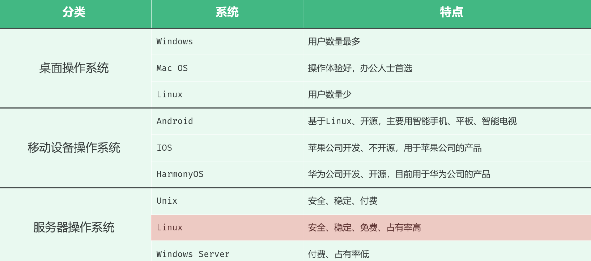
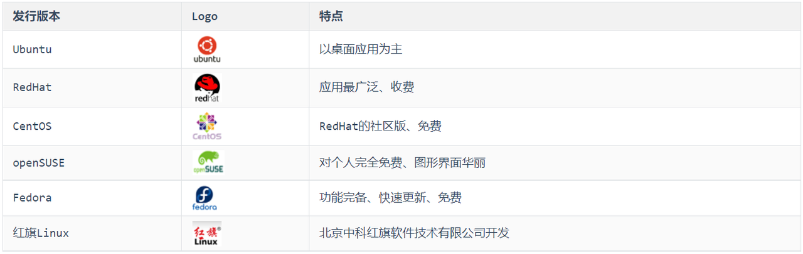
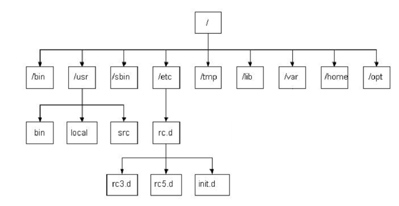
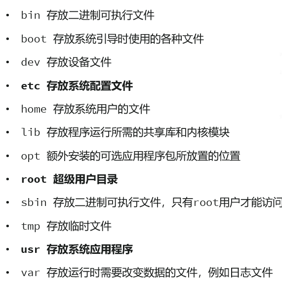

<h1 style="text-align: center;">基本介绍</h1>

---

## 相关资料

> <h3><a href="https://pan.baidu.com/s/19dQ52S_ncXCujQ7tGRXVbg?pwd=xvxf" target="_blank">https://pan.baidu.com/s/19dQ52S_ncXCujQ7tGRXVbg?pwd=xvxf</a> 提取码: xvxf</h3>

## 基本介绍

#### Linux 是一套免费使用和自由传播的操作系统。说到操作系统，大家比较熟知的应该就是 Windows 和 MacOS 操作系统，我们今天所学习的 Linux 也是一款操作系统

#### 我们作为 javaEE 开发工程师，将来在企业中开发时会涉及到很多的数据库、中间件等技术，比如 MySQL、Redis、MQ 等技术，而这些应用软件大多都是需要安装在 Linux 系统中使用的。我们做为开发人员，是需要通过远程工具连接 Linux 操作系统，然后来操作这些软件的。而且一些小公司，可能还需要我们自己在服务器上安装这些软件

#### 所以，不管从企业的用人需求层面，还是个人发展需要层面来讲，我们作为服务端开发工程师，Linux 的基本使用是我们必不可少的技能

#### 对于 Linux 的常用指令的学习，最好的学习方法就是：多敲

## 主流操作系统

#### 不同领域的主流操作系统，主要分为以下这么几类： 桌面操作系统、服务器操作系统、移动设备操作系统、嵌入式操作系统

 

## Linux 系统版本

### 内核版

> #### （1）由 Linus Torvalds 及其团队开发、维护
>
> #### （2）免费、开源
>
> #### （3）负责控制硬件

### 发行版

> #### （1）基于 Linux 内核版进行扩展
>
> #### （2）由各个 Linux 厂商开发、维护
>
> #### （3）有收费版本和免费版本

#### 以下列举示 Linux 的一些主流发行版

 

## Linux 目录结构

 

 

