<h1 style="text-align: center;">Linux 安装</h1>

---

## 安装方式介绍

#### Linux 系统的安装方式，主要包含以下两种

<br/>

<br/>
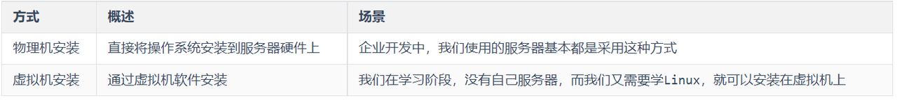

## 虚拟机介绍

> #### 虚拟机（Virtual Machine）指通过软件模拟的具有完整硬件系统功能、运行在完全隔离环境中的完整计算机系统

#### 常用的虚拟机软件如下

> #### VMWare
>
> #### VirtualBox
>
> #### VMLite WorkStation
>
> #### Qemu
>
> #### HopeddotVOS

## 安装 VMvare 虚拟机

### 安装步骤

<br/>
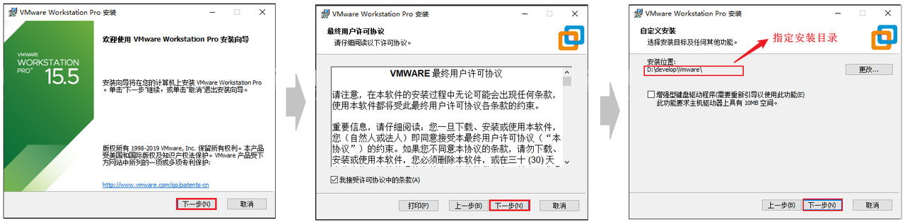
<br/>
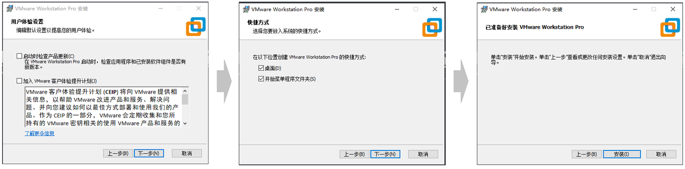

### 许可证（激活）

> #### 以下三个许可证三选一，在首次安装 VMWare 时会弹出

```
ZF3R0-FHED2-M80TY-8QYGC-NPKYF

YF390-0HF8P-M81RQ-2DXQE-M2UT6

ZF71R-DMX85-08DQY-8YMNC-PPHV8
```

### 挂载 Linux 系统

#### （1） 打开 Vmware 虚拟机，打开 编辑 -> 虚拟网络编辑器(N)...

<br/>
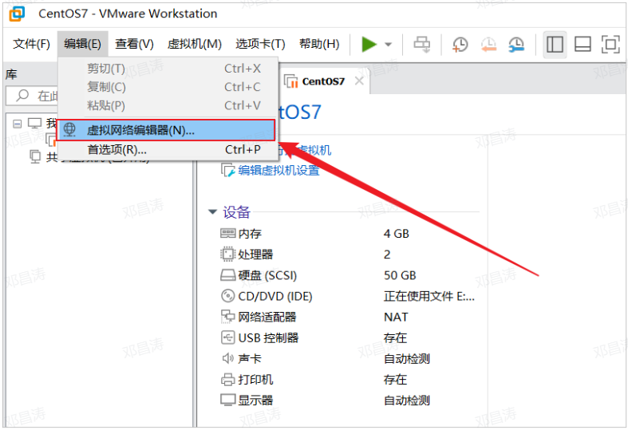

#### （2）选择 NAT 模式，然后选择右下角的 更改设置

<br/>
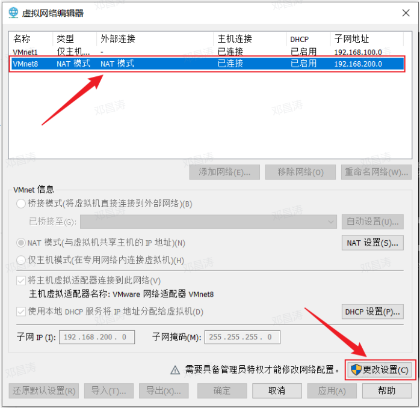

#### （3）设置子网 IP 为 192.168.100.0，然后选择 应用 -> 确定

<br/>
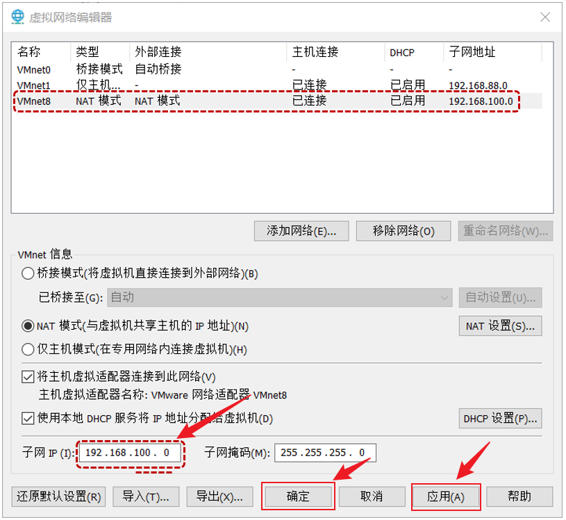

#### （4）解压 资料/Linux 镜像/CentOS7-1.zip 到一个比较大的磁盘中 (没有中文的目录)

<br/>
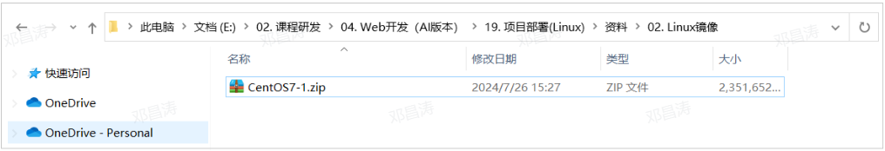

#### （5）打开解压目录，双击 .vmx 文件，选择以 Vmware Workstation 打开这个文件

<br/>
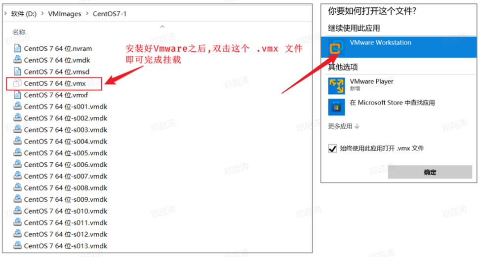

#### （6）挂载完毕之后，启动 Linux 服务器

<br/>
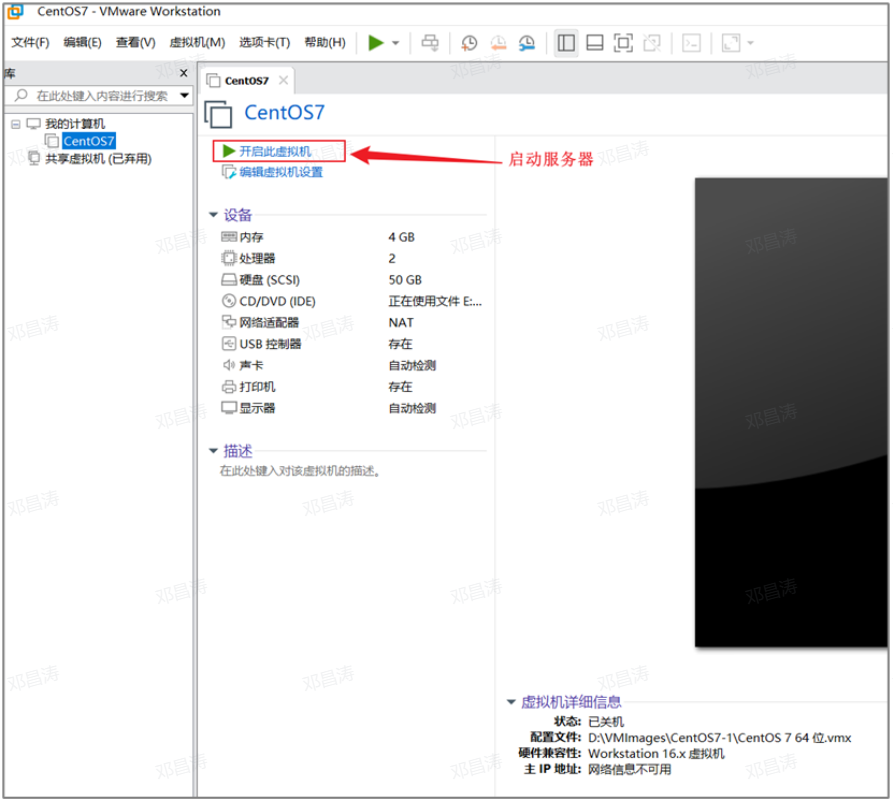

#### （7）启动过程中，如果出现如下界面，选择 我已移动该虚拟机

<br/>
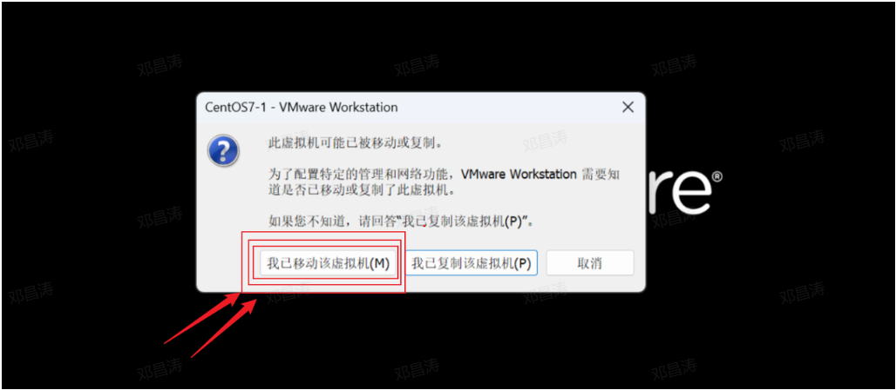

#### （8）启动完毕之后，登录服务器。 <span style="color:red">输入用户名：root，密码：1234</span> （注意：linux 系统输入密码是不显示的，输入完毕，回车即可登录）

#### （9）通过指令：<span style="color:red">ip addr</span>，查看虚拟机 ip 地址

<br/>
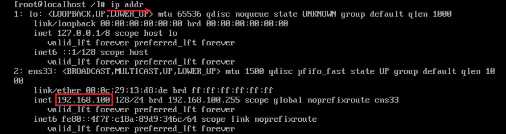

## SSH 连接

### 基本介绍

#### Linux 已经安装并且配置好了，接下来我们要来学习 Linux 的基本操作指令。而在学习之前，我们还需要做一件事情，由于我们企业开发时，Linux 服务器一般都是在远程的机房部署的，我们要操作服务器，不会每次都跑到远程的机房里面操作，而是会直接通过 SSH 连接工具进行连接操作

#### SSH（Secure Shell），建立在应用层基础上的安全协议。常用的 SSH 连接工具

<br/>
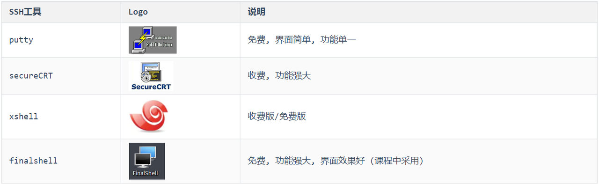

### 安装 Finalshell

> #### 双击.exe 文件，然后进行正常的安装即可

<br/>
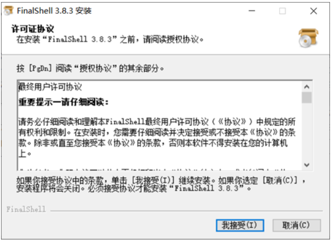

### 连接 Linux

#### （1）打开 FinalShell，选择 SSH 连接

<br/>
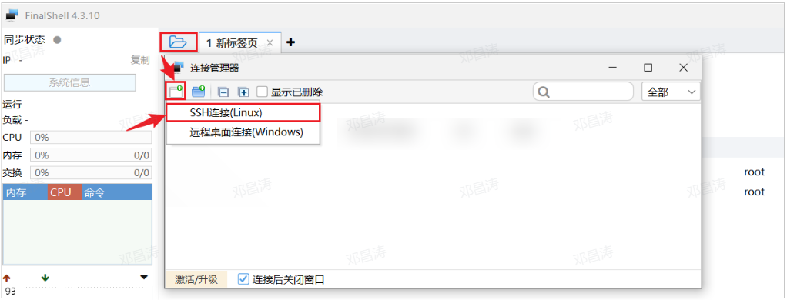

#### （2）连接服务器，输入服务器的信息，<span style="color:red;">IP 固定的：192.168.100.128，用户名：root，密码：1234</span>

<br/>
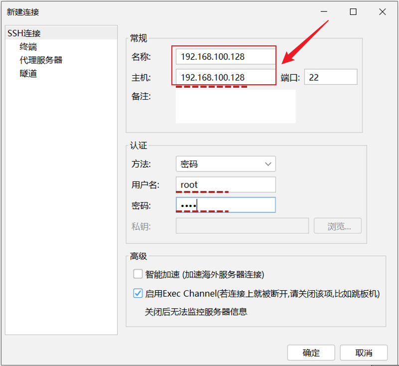

#### （3）配置完毕后，双击即可连接服务器

<br/>
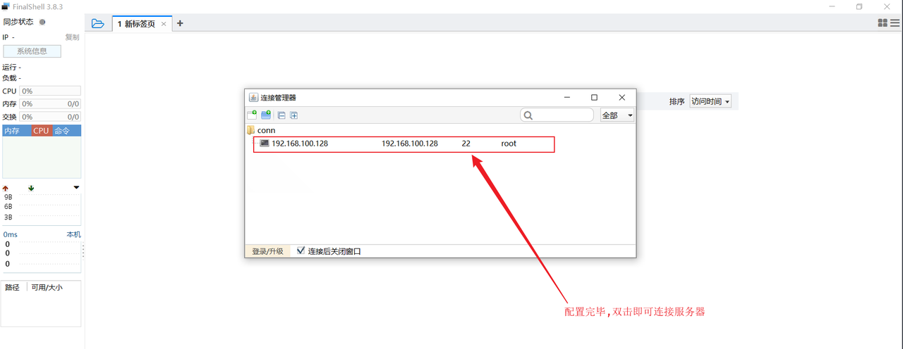
<br/>
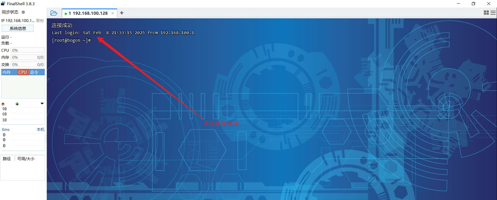

## Linux 中软件安装方式

<br/>
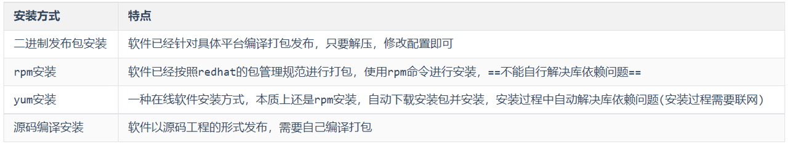
