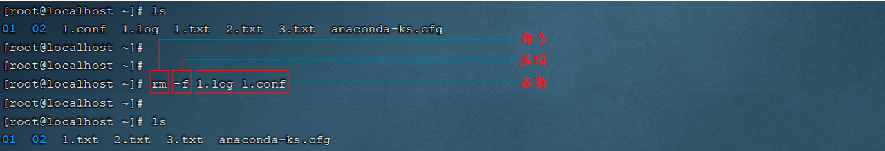
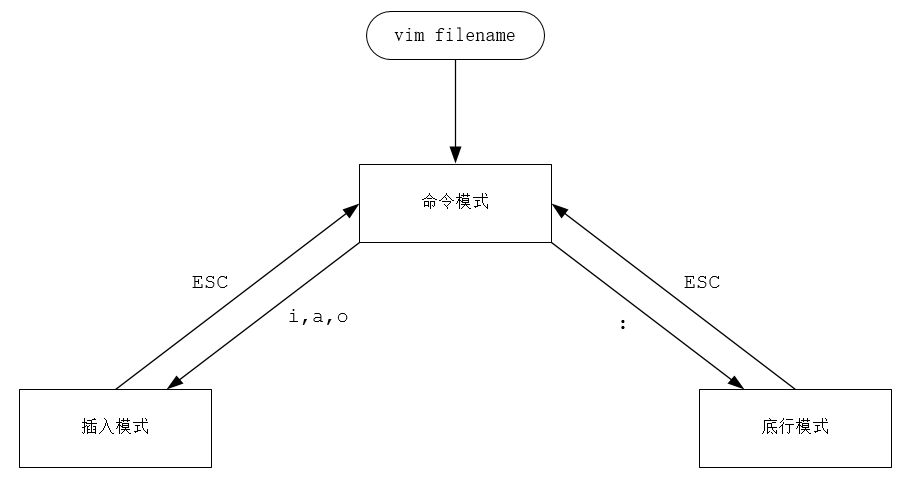
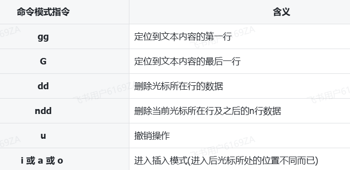

<h1 style="text-align: center;">常用命令</h1>

---

## 基本介绍

> #### Linux 命令格式：command [-options] [parameter]

#### 说明

> #### command：命令名
>
> #### [-options]：选项，可用来对命令进行控制，也可以省略 （可选）
>
> #### [parameter]：参数，可以是零个、一个或多个（可选）

## 使用技巧

> #### Tab 键自动补全
>
> #### 连续两次 Tab 键，给出操作提示
>
> #### 使用上下箭头快速调出曾经使用过的命令
>
> #### 使用 clear 命令或 Ctrl+l 快捷键实现清屏

## 目录操作命令

### ls

#### （1）作用: 显示指定目录下的内容

#### （2）语法: ls [-al] [dir]

#### （3）说明

> #### a：显示所有文件及目录（ .  开头的隐藏文件也会列出）
>
> #### l：除文件名称外，同时将文件型态（d 表示目录，表示文件）、权限、拥有者、文件大小等信息详细列出

#### （4）注意点

> #### 由于我们使用 ls 命令时经常需要加入-l 选项，所以 Linux 为 ls -l 命令提供了一种简写方式，即 ll

#### （4） 常见用法

> #### ls -al：查看当前目录的所有文件及目录详细信息
>
> #### ls -al /etc：查看/etc 目录下所有文件及目录详细信息
>
> #### ll：查看当前目录文件及目录的详细信息

### cd

#### （1）作用: 用于切换当前工作目录，即进入指定目录

#### （2）语法: cd [dirName]

#### （3）特殊说明

> #### ~ ：表示用户的 home 目录
>
> #### . ：表示目前所在的目录
>
> #### .. ：表示目前目录位置的上级目录

#### （4）举例

> #### cd .. ：切换到当前目录的上级目录
>
> #### cd ~ ：切换到用户的 home 目录
>
> #### cd /usr/local ：切换到 / usr / local 目录

#### （5）备注

> #### 用户的 home 目录
>
> #### root 用户 / root
>
> #### 其他用户 / home / xxx

### mkdir

#### （1）作用: 创建目录

#### （2）语法: mkdir [-p] dirName

#### （3）说明

> #### -p: 确保目录名称存在，不存在的就创建一个。通过此选项，可以实现多层目录同时创建

#### （4）举例

> #### mkdir itcast 在当前目录下，建立一个名为 itcast 的子目录
>
> #### mkdir -p itcast / test 在工作目录下的 itcast 目录中建立一个名为 test 的子目录，若 itcast 目录不存在，则建立一个

### rm

#### （1）作用: 删除文件或者目录

#### （2）语法: rm [-rf] name

#### （3）说明:

> #### -r: 将目录及目录中所有文件（目录）逐一删除，即递归删除
>
> #### -f: 无需确认，直接删除

#### （4）举例

> #### rm -r itcast/ ：删除名为 itcast 的目录和目录中所有文件，删除前需确认
>
> #### rm -rf itcast/ ：无需确认，直接删除名为 itcast 的目录和目录中所有文件
>
> #### rm -f hello.txt ：无需确认，直接删除 hello.txt 文件

## 文件操作指令

### cat

#### （1）作用: 用于显示文件内容

#### （2）语法: cat [-n] fileName

#### （3）说明

> #### -n : 由 1 开始对所有输出的行数编号

#### （3）举例

> #### cat /etc/profile ：查看/etc 目录下的 profile 文件内容

### more

> #### cat 指令会一次性查看文件的所有内容，如果文件内容比较多，这个时候查看起来就不是很方便了，这个时候我们可以通过一个新的指令 more

#### （1）作用: 以分页的形式显示文件内容

#### （2）语法: more fileName

#### （3）操作说明

> #### 回车键 向下滚动一行
>
> #### 空格键 向下滚动一屏
>
> #### b 返回上一屏
>
> #### q 或者 Ctrl+C 退出 more

#### （4）举例

> #### more /etc/profile ：以分页方式显示/etc 目录下的 profile 文件内容

### head

#### （1）作用：查看文件开头的内容

#### （2）语法：head [-n] fileName

#### （3）说明

> #### -n ：输出文件开头的 n 行内容

#### （4）举例

> #### head 1.log ：默认显示 1.log 文件开头的前 10 行内容
>
> #### head -20 1.log ：显示 1.log 文件开头的 20 行内容

### tail

#### （1）作用: 查看文件末尾的内容

#### （2）语法: tail [-f] fileName

#### （3）说明

> #### -f : 动态读取文件末尾内容并显示，通常用于日志文件的内容输出

#### （4） 举例

> #### tail /etc/profile ：显示 / etc 目录下的 profile 文件末尾 10 行的内容
>
> #### tail -20 /etc/profile ：显示 / etc 目录下的 profile 文件末尾 20 行的内容
>
> #### tail -f /itcast/my.log ：动态读取 itcast 目录下的 my.log 文件末尾内容并显示

## 拷贝移动命令

### cp

#### （1）作用: 用于复制文件或目录

#### （2）语法: cp [-r] source dest

#### （3）说明

> #### -r : 如果复制的是目录需要使用此选项，此时将复制该目录下所有的子目录和文件

#### （4）举例

> #### cp hello.txt itcast/ ：将 hello.txt 复制到 itcast 目录中
>
> #### cp hello.txt ./hi.txt ：将 hello.txt 复制到当前目录，并改名为 hi.txt
>
> #### cp -r itcast/ ./itheima/ ：将 itcast 目录和目录下所有文件复制到 itheima 目录下
>
> #### cp -r itcast/\* ./itheima/ ：将 itcast 目录下所有文件复制到 itheima 目录下

### mv

#### （1）作用: 为文件或目录改名、或将文件或目录移动到其它位置

#### （2）语法: mv source dest

#### （3）举例

> #### mv hello.txt hi.txt ：将 hello.txt 改名为 hi.txt
>
> #### mv hi.txt itheima/ ：将文件 hi.txt 移动到 itheima 目录中
>
> #### mv hi.txt itheima/hello.txt ：将 hi.txt 移动到 itheima 目录中，并改名为 hello.txt
>
> #### mv itcast/ itheima/ ：如果 itheima 目录不存在，将 itcast 目录改名为 itheima
>
> #### mv itcast/ itheima/ ：如果 itheima 目录存在，将 itcast 目录移动到 itheima 目录中

## 打包压缩命令

#### （1）作用: 对文件进行打包、解包、压缩、解压

#### （2）语法: tar [-zcxvf] fileName [files]

> #### 包文件后缀为 .tar 表示只是完成了打包，并没有压缩
>
> #### 包文件后缀为 .tar.gz 表示打包的同时还进行了压缩

#### （3） 说明

> #### -z : z 代表的是 gzip，通过 gzip 命令处理文件，gzip 可以对文件压缩或者解压
>
> #### -c : c 代表的是 create，即创建新的包文件
>
> #### -x : x 代表的是 extract，实现从包文件中还原文件
>
> #### -v : v 代表的是 verbose，显示命令的执行过程
>
> #### -f : f 代表的是 file，用于指定包文件的名称

#### （4）举例

#### 打包

> #### tar -cvf hello.tar ./\* ：将当前目录下所有文件打包，打包后的文件名为 hello.tar
>
> #### tar -zcvf hello.tar.gz ./\* ：将当前目录下所有文件打包并压缩，打包后的文件名为 hello.tar.gz

#### 解包

> #### tar -xvf hello.tar ：将 hello.tar 文件进行解包，并将解包后的文件放在当前目录
>
> #### tar -zxvf hello.tar.gz ：将 hello.tar.gz 文件进行解压，并将解压后的文件放在当前目录
>
> #### tar -zxvf hello.tar.gz -C /usr/local ：将 hello.tar.gz 文件进行解压，并将解压后的文件放在/usr/local 目录

## 文本编辑指令

### vi & vim 介绍

#### （1）作用: vi 命令是 Linux 系统提供的一个文本编辑工具，可以对文件内容进行编辑，类似于 Windows 中的记事本

#### （2）语法: vi fileName

#### （3）说明

> #### vim 是从 vi 发展来的一个功能更加强大的文本编辑工具，编辑文件时可以对文本内容进行着色，方便我们对文件进行编辑处理，所以实际工作中 vim 更加常用
>
> #### 要使用 vim 命令，需要我们自己完成安装。可以使用下面的命令来完成安装：yum install vim

### vim 使用

#### （1）作用: 对文件内容进行编辑，vim 其实就是一个文本编辑器

#### （2）语法: vim fileName

#### （3）说明

> #### 在使用 vim 命令编辑文件时，如果指定的文件存在则直接打开此文件，如果指定的文件不存在则新建文件
>
> #### vim 在进行文本编辑时共分为三种模式，分别是 命令模式（Command mode），插入模式（Insert mode）和底行模式（Last line mode）
>
> #### 这三种模式之间可以相互切换。我们在使用 vim 时一定要注意我们当前所处的是哪种模式

### 命令模式

> #### （1）命令模式下可以查看文件内容、移动光标（上下左右箭头、gg、G）
>
> #### （2）通过 vim 命令打开文件后，默认进入命令模式
>
> #### （3）另外两种模式需要首先进入命令模式，才能进入彼此

### 插入模式

> #### （1）插入模式下可以对文件内容进行编辑
>
> #### （2）在命令模式下按下 [i , a , o] 任意一个，可以进入插入模式，进入插入模式后，下方会出现【insert】字样
>
> #### （3）在插入模式下按下 ESC 键，回到命令模式

### 底行模式

> #### （1）底行模式下可以通过命令对文件内容进行查找、显示行号、退出等操作
>
> #### （2）在命令模式下按下 [ : , / ] 任意一个，可以进入底行模式
>
> #### （3）通过/方式进入底行模式后，可以对文件内容进行查找
>
> #### （4）通过：方式进入底行模式后，可以输入 wq（保存并退出）、q!（不保存退出）、set nu（显示行号）

## 查找命令

### find

#### （1）作用: 在指定目录下查找文件

#### （2）语法: find dirName -option fileName

#### （3）举例

> #### find . –name "\* . java" ：在当前目录及其子目录下查找 . java 结尾文件
>
> #### find /itcast -name "\* . java" ：在 / itcast 目录及其子目录下查找 . java 结尾的文件

### grep

#### （1）作用: 从指定文件中查找指定的文本内容

#### （2）语法: grep word fileName

#### （3）选项

> #### -i: 检索的关键字忽略（ignore）大小写
>
> #### -n: 显示关键字所在的这一行的行号
>
> #### -A: 输出关键字所在行及之后(After)的几行记录（如:-A5 表示输出关键字所在行之后的 5 行记录）
>
> #### -B: 输出关键字所在行及之前(Before)的几行记录（如:-B5 表示输出关键字所在行之前的 5 行记录）

#### （4）举例

> #### grep Hello HelloWorld.java ：查找 HelloWorld.java 文件中出现的 Hello 字符串的位置
>
> #### grep hello \*.java ：查找当前目录中所有.java 结尾的文件中包含 hello 字符串的位置
