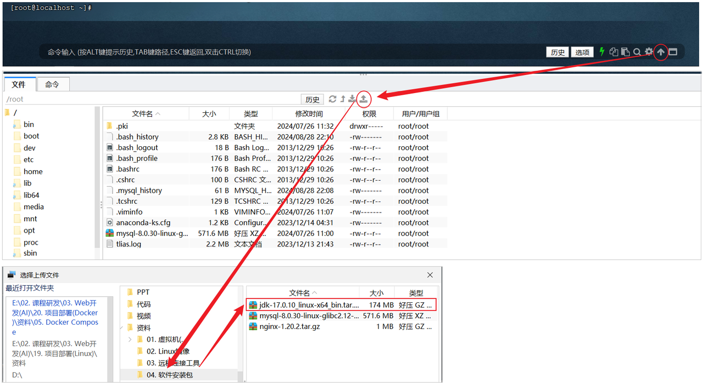

<h1 style="text-align: center;">安装 JDK</h1>

---

## 上传安装包

#### <span style="color:red">切换到 root 目录</span>，使用 FinalShell 自带的上传工具将 jdk 的二进制发布包上传到 Linux

<br/>


## 解压安装包

#### 执行如下指令，将上传上来的压缩包进行解压，并通过-C 参数指定解压文件存放目录为 /usr/local

```bash
tar -zxvf jdk-17.0.10_linux-x64_bin.tar.gz -C /usr/local/
```

## 配置环境变量

#### （1）使用 vim 命令修改 / etc / profile 文件，在文件末尾加入如下配置

```bash
export JAVA_HOME=/usr/local/jdk-17.0.10
export PATH=$JAVA_HOME/bin:$PATH
```

#### （2）具体操作指令如下

```
1. 编辑/etc/profile文件，进入命令模式
    vim /etc/profile

2. 在命令模式中，输入指令 G ， 切换到文件最后
    G

3. 在命令模式中输入 i/a/o 进入插入模式，然后切换到文件最后一行
    i

4. 将上述的配置拷贝到文件中
    export JAVA_HOME=/usr/local/jdk-17.0.10
    export PATH=$JAVA_HOME/bin:$PATH

5. 从插入模式，切换到指令模式
    ESC

6. 按:进入底行模式，然后输入wq，回车保存
    :wq
```

## 重新加载 profile 文件

#### 为了使更改的配置立即生效，需要重新加载 profile 文件，执行命令

```bash
source /etc/profile
```

## 检查安装是否成功

```bash
java -version
```
